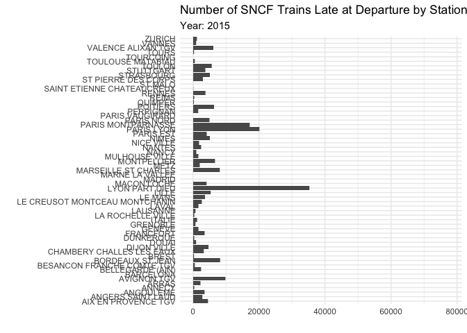
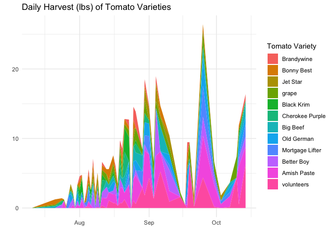
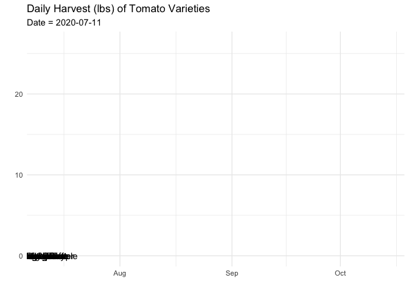
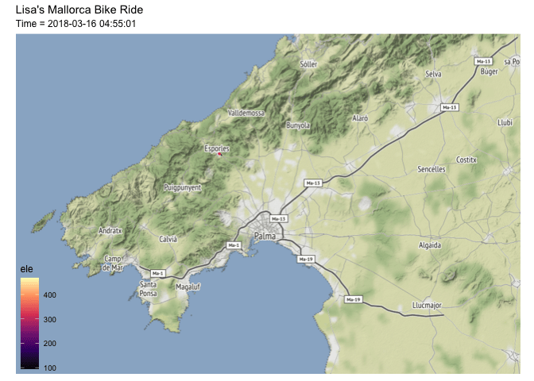
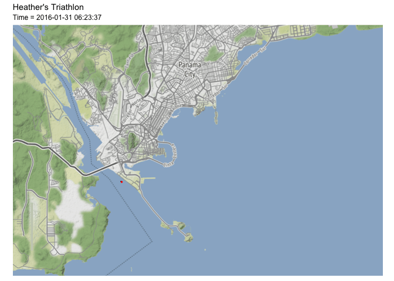

```r
library(tidyverse)     # for data cleaning and plotting
library(gardenR)       # for Lisa's garden data
library(lubridate)     # for date manipulation
library(openintro)     # for the abbr2state() function
library(palmerpenguins)# for Palmer penguin data
library(maps)          # for map data
library(ggmap)         # for mapping points on maps
library(gplots)        # for col2hex() function
library(RColorBrewer)  # for color palettes
library(sf)            # for working with spatial data
library(leaflet)       # for highly customizable mapping
library(ggthemes)      # for more themes (including theme_map())
library(plotly)        # for the ggplotly() - basic interactivity
library(gganimate)     # for adding animation layers to ggplots
library(transformr)    # for "tweening" (gganimate)
library(gifski)        # need the library for creating gifs but don't need to load each time
library(shiny)         # for creating interactive apps
theme_set(theme_minimal())
```


```r
# SNCF Train data
small_trains <- read_csv("https://raw.githubusercontent.com/rfordatascience/tidytuesday/master/data/2019/2019-02-26/small_trains.csv") 

# Lisa's garden data
data("garden_harvest")

# Lisa's Mallorca cycling data
mallorca_bike_day7 <- read_csv("https://www.dropbox.com/s/zc6jan4ltmjtvy0/mallorca_bike_day7.csv?dl=1") %>% 
  select(1:4, speed)

# Heather Lendway's Ironman 70.3 Pan Am championships Panama data
panama_swim <- read_csv("https://raw.githubusercontent.com/llendway/gps-data/master/data/panama_swim_20160131.csv")

panama_bike <- read_csv("https://raw.githubusercontent.com/llendway/gps-data/master/data/panama_bike_20160131.csv")

panama_run <- read_csv("https://raw.githubusercontent.com/llendway/gps-data/master/data/panama_run_20160131.csv")

#COVID-19 data from the New York Times
covid19 <- read_csv("https://raw.githubusercontent.com/nytimes/covid-19-data/master/us-states.csv")

cancer <- readr::read_csv('total-cancer-deaths-by-type copy.csv')
```

```r
cancer <- cancer%>% 
  pivot_longer(cols = starts_with("Death"),
               names_to = "Type_of_cancer",
               values_to = "Death_count") %>% 
  mutate(Cancer_type = str_sub(Type_of_cancer, 10, -37)) %>% 
  select(-Type_of_cancer)
```


```r
data_site <- 
  "https://www.macalester.edu/~dshuman1/data/112/2014-Q4-Trips-History-Data.rds" 
Trips <- readRDS(gzcon(url(data_site)))
Stations<-read_csv("http://www.macalester.edu/~dshuman1/data/112/DC-Stations.csv")
```

## Put your homework on GitHub!

Go [here](https://github.com/llendway/github_for_collaboration/blob/master/github_for_collaboration.md) or to previous homework to remind yourself how to get set up. 

Once your repository is created, you should always open your **project** rather than just opening an .Rmd file. You can do that by either clicking on the .Rproj file in your repository folder on your computer. Or, by going to the upper right hand corner in R Studio and clicking the arrow next to where it says Project: (None). You should see your project come up in that list if you've used it recently. You could also go to File --> Open Project and navigate to your .Rproj file. 

## Instructions

* Put your name at the top of the document. 

* **For ALL graphs, you should include appropriate labels and alt text.** 

* Feel free to change the default theme, which I currently have set to `theme_minimal()`. 

* Use good coding practice. Read the short sections on good code with [pipes](https://style.tidyverse.org/pipes.html) and [ggplot2](https://style.tidyverse.org/ggplot2.html). **This is part of your grade!**

* **NEW!!** With animated graphs, add `eval=FALSE` to the code chunk that creates the animation and saves it using `anim_save()`. Add another code chunk to reread the gif back into the file. See the [tutorial](https://animation-and-interactivity-in-r.netlify.app/) for help. 

* When you are finished with ALL the exercises, uncomment the options at the top so your document looks nicer. Don't do it before then, or else you might miss some important warnings and messages.

## Warm-up exercises from tutorial

  1. Choose 2 graphs you have created for ANY assignment in this class and add interactivity using the `ggplotly()` function.
  

```r
cancer_death_count_graph <- cancer %>% 
  filter(Code == "USA") %>% 
  filter(Year == "1990") %>% 
  ggplot(aes(x = Death_count,
             y = reorder(Cancer_type, Death_count),
             text = Cancer_type)) +
  geom_bar(stat = "identity") +
  labs(x = "",
       y = "",
       title = "Number of Cancer Deaths in the US in 1990 by Type of Cancer")


ggplotly(cancer_death_count_graph,
         tooltip = c("text","x"))
```

```{=html}
<div id="htmlwidget-c919d0a9491531a4b99c" style="width:960px;height:480px;" class="plotly html-widget"></div>
<script type="application/json" data-for="htmlwidget-c919d0a9491531a4b99c">{"x":{"data":[{"orientation":"v","width":[6454,11418,5968,156256,4181,4438,6974,21448,1803,10252,5552,48212,36236,1252,18949,12125,5614,14428,6202,12669,21702,28596,11388,467,986,2000,65582,2363,2197],"base":[13.55,17.55,11.55,28.55,7.55,8.55,14.55,22.55,3.55,15.55,9.55,26.55,25.55,2.55,21.55,18.55,10.55,20.55,12.55,19.55,23.55,24.55,16.55,0.55,1.55,4.55,27.55,6.55,5.55],"x":[3227,5709,2984,78128,2090.5,2219,3487,10724,901.5,5126,2776,24106,18118,626,9474.5,6062.5,2807,7214,3101,6334.5,10851,14298,5694,233.5,493,1000,32791,1181.5,1098.5],"y":[0.899999999999999,0.899999999999999,0.899999999999999,0.899999999999999,0.899999999999999,0.899999999999999,0.899999999999999,0.899999999999999,0.9,0.899999999999999,0.899999999999999,0.899999999999999,0.899999999999999,0.9,0.899999999999999,0.899999999999999,0.899999999999999,0.899999999999999,0.899999999999999,0.899999999999999,0.899999999999999,0.899999999999999,0.899999999999999,0.9,0.9,0.9,0.899999999999999,0.9,0.9],"text":["Death_count:   6454<br />Liver cancer ","Death_count:  11418<br />Kidney cancer ","Death_count:   5968<br />Lip and oral cavity cancer ","Death_count: 156256<br />Tracheal, bronchus, and lung cancer ","Death_count:   4181<br />Larynx cancer ","Death_count:   4438<br />Gallbladder and biliary tract cancer ","Death_count:   6974<br />Malignant skin melanoma ","Death_count:  21448<br />Leukemia ","Death_count:   1803<br />Hodgkin lymphoma ","Death_count:  10252<br />Multiple myeloma ","Death_count:   5552<br />Other neoplasms ","Death_count:  48212<br />Breast cancer ","Death_count:  36236<br />Prostate cancer ","Death_count:   1252<br />Thyroid cancer ","Death_count:  18949<br />Stomach cancer ","Death_count:  12125<br />Bladder cancer ","Death_count:   5614<br />Uterine cancer ","Death_count:  14428<br />Ovarian cancer ","Death_count:   6202<br />Cervical cancer ","Death_count:  12669<br />Brain and central nervous system cancer ","Death_count:  21702<br />Non-Hodgkin lymphoma ","Death_count:  28596<br />Pancreatic cancer ","Death_count:  11388<br />Esophageal cancer ","Death_count:    467<br />Testicular cancer ","Death_count:    986<br />Nasopharynx cancer ","Death_count:   2000<br />Other pharynx cancer ","Death_count:  65582<br />Colon and rectum cancer ","Death_count:   2363<br />Non-melanoma skin cancer ","Death_count:   2197<br />Mesothelioma "],"type":"bar","textposition":"none","marker":{"autocolorscale":false,"color":"rgba(89,89,89,1)","line":{"width":1.88976377952756,"color":"transparent"}},"showlegend":false,"xaxis":"x","yaxis":"y","hoverinfo":"text","frame":null}],"layout":{"margin":{"t":48.1461187214612,"r":7.30593607305936,"b":29.9543378995434,"l":244.748858447489},"font":{"color":"rgba(0,0,0,1)","family":"","size":14.6118721461187},"title":{"text":"Number of Cancer Deaths in the US in 1990 by Type of Cancer","font":{"color":"rgba(0,0,0,1)","family":"","size":17.5342465753425},"x":0,"xref":"paper"},"xaxis":{"domain":[0,1],"automargin":true,"type":"linear","autorange":false,"range":[-7812.8,164068.8],"tickmode":"array","ticktext":["0","50000","100000","150000"],"tickvals":[0,50000,100000,150000],"categoryorder":"array","categoryarray":["0","50000","100000","150000"],"nticks":null,"ticks":"","tickcolor":null,"ticklen":3.65296803652968,"tickwidth":0,"showticklabels":true,"tickfont":{"color":"rgba(77,77,77,1)","family":"","size":11.689497716895},"tickangle":-0,"showline":false,"linecolor":null,"linewidth":0,"showgrid":true,"gridcolor":"rgba(235,235,235,1)","gridwidth":0.66417600664176,"zeroline":false,"anchor":"y","title":{"text":"","font":{"color":"rgba(0,0,0,1)","family":"","size":14.6118721461187}},"hoverformat":".2f"},"yaxis":{"domain":[0,1],"automargin":true,"type":"linear","autorange":false,"range":[0.4,29.6],"tickmode":"array","ticktext":["Testicular cancer ","Nasopharynx cancer ","Thyroid cancer ","Hodgkin lymphoma ","Other pharynx cancer ","Mesothelioma ","Non-melanoma skin cancer ","Larynx cancer ","Gallbladder and biliary tract cancer ","Other neoplasms ","Uterine cancer ","Lip and oral cavity cancer ","Cervical cancer ","Liver cancer ","Malignant skin melanoma ","Multiple myeloma ","Esophageal cancer ","Kidney cancer ","Bladder cancer ","Brain and central nervous system cancer ","Ovarian cancer ","Stomach cancer ","Leukemia ","Non-Hodgkin lymphoma ","Pancreatic cancer ","Prostate cancer ","Breast cancer ","Colon and rectum cancer ","Tracheal, bronchus, and lung cancer "],"tickvals":[1,2,3,4,5,6,7,8,9,10,11,12,13,14,15,16,17,18,19,20,21,22,23,24,25,26,27,28,29],"categoryorder":"array","categoryarray":["Testicular cancer ","Nasopharynx cancer ","Thyroid cancer ","Hodgkin lymphoma ","Other pharynx cancer ","Mesothelioma ","Non-melanoma skin cancer ","Larynx cancer ","Gallbladder and biliary tract cancer ","Other neoplasms ","Uterine cancer ","Lip and oral cavity cancer ","Cervical cancer ","Liver cancer ","Malignant skin melanoma ","Multiple myeloma ","Esophageal cancer ","Kidney cancer ","Bladder cancer ","Brain and central nervous system cancer ","Ovarian cancer ","Stomach cancer ","Leukemia ","Non-Hodgkin lymphoma ","Pancreatic cancer ","Prostate cancer ","Breast cancer ","Colon and rectum cancer ","Tracheal, bronchus, and lung cancer "],"nticks":null,"ticks":"","tickcolor":null,"ticklen":3.65296803652968,"tickwidth":0,"showticklabels":true,"tickfont":{"color":"rgba(77,77,77,1)","family":"","size":11.689497716895},"tickangle":-0,"showline":false,"linecolor":null,"linewidth":0,"showgrid":true,"gridcolor":"rgba(235,235,235,1)","gridwidth":0.66417600664176,"zeroline":false,"anchor":"x","title":{"text":"","font":{"color":"rgba(0,0,0,1)","family":"","size":14.6118721461187}},"hoverformat":".2f"},"shapes":[{"type":"rect","fillcolor":null,"line":{"color":null,"width":0,"linetype":[]},"yref":"paper","xref":"paper","x0":0,"x1":1,"y0":0,"y1":1}],"showlegend":false,"legend":{"bgcolor":null,"bordercolor":null,"borderwidth":0,"font":{"color":"rgba(0,0,0,1)","family":"","size":11.689497716895}},"hovermode":"closest","barmode":"relative"},"config":{"doubleClick":"reset","modeBarButtonsToAdd":["hoverclosest","hovercompare"],"showSendToCloud":false},"source":"A","attrs":{"217772c11f30":{"x":{},"y":{},"text":{},"type":"bar"}},"cur_data":"217772c11f30","visdat":{"217772c11f30":["function (y) ","x"]},"highlight":{"on":"plotly_click","persistent":false,"dynamic":false,"selectize":false,"opacityDim":0.2,"selected":{"opacity":1},"debounce":0},"shinyEvents":["plotly_hover","plotly_click","plotly_selected","plotly_relayout","plotly_brushed","plotly_brushing","plotly_clickannotation","plotly_doubleclick","plotly_deselect","plotly_afterplot","plotly_sunburstclick"],"base_url":"https://plot.ly"},"evals":[],"jsHooks":[]}</script>
```
 

```r
weekend_bike_rental_graph <- Trips %>% 
  mutate(day_of_week = wday(sdate)) %>%
  mutate(weekend = ifelse(day_of_week == 1|day_of_week == 7, #if day_of_week is 1 or 7 then weekend is True
                          "weekend",
                          "weekday")) %>% 
  mutate(shour = hour(sdate)) %>% 
  mutate(sminute = minute(sdate)/60) %>% 
  mutate(time_of_day = shour + sminute) %>% 
  ggplot(aes(x = time_of_day,
             fill = client, 
             alpha = .5)) + 
  geom_density() +
  facet_wrap(vars(weekend)) +
  labs(title = "Aggregate Frequency of Bike Rentals Over 24 Hours",
       alpha = "",
       fill = "Client",
       x = "",
       y = "")

ggplotly(weekend_bike_rental_graph)
```

```{=html}
<div id="htmlwidget-fc87f353a26edec8d005" style="width:672px;height:480px;" class="plotly html-widget"></div>
<script type="application/json" data-for="htmlwidget-fc87f353a26edec8d005">{"x":{"data":[{"x":[0,0.0469341161121983,0.0938682322243966,0.140802348336595,0.187736464448793,0.234670580560992,0.28160469667319,0.328538812785388,0.375472928897586,0.422407045009785,0.469341161121983,0.516275277234181,0.56320939334638,0.610143509458578,0.657077625570776,0.704011741682975,0.750945857795173,0.797879973907371,0.84481409001957,0.891748206131768,0.938682322243966,0.985616438356164,1.03255055446836,1.07948467058056,1.12641878669276,1.17335290280496,1.22028701891716,1.26722113502935,1.31415525114155,1.36108936725375,1.40802348336595,1.45495759947815,1.50189171559035,1.54882583170254,1.59575994781474,1.64269406392694,1.68962818003914,1.73656229615134,1.78349641226354,1.83043052837573,1.87736464448793,1.92429876060013,1.97123287671233,2.01816699282453,2.06510110893673,2.11203522504892,2.15896934116112,2.20590345727332,2.25283757338552,2.29977168949772,2.34670580560992,2.39363992172211,2.44057403783431,2.48750815394651,2.53444227005871,2.58137638617091,2.6283105022831,2.6752446183953,2.7221787345075,2.7691128506197,2.8160469667319,2.8629810828441,2.90991519895629,2.95684931506849,3.00378343118069,3.05071754729289,3.09765166340509,3.14458577951729,3.19151989562948,3.23845401174168,3.28538812785388,3.33232224396608,3.37925636007828,3.42619047619048,3.47312459230267,3.52005870841487,3.56699282452707,3.61392694063927,3.66086105675147,3.70779517286367,3.75472928897586,3.80166340508806,3.84859752120026,3.89553163731246,3.94246575342466,3.98939986953686,4.03633398564905,4.08326810176125,4.13020221787345,4.17713633398565,4.22407045009785,4.27100456621005,4.31793868232224,4.36487279843444,4.41180691454664,4.45874103065884,4.50567514677104,4.55260926288324,4.59954337899543,4.64647749510763,4.69341161121983,4.74034572733203,4.78727984344423,4.83421395955643,4.88114807566862,4.92808219178082,4.97501630789302,5.02195042400522,5.06888454011742,5.11581865622962,5.16275277234181,5.20968688845401,5.25662100456621,5.30355512067841,5.35048923679061,5.3974233529028,5.444357469015,5.4912915851272,5.5382257012394,5.5851598173516,5.6320939334638,5.67902804957599,5.72596216568819,5.77289628180039,5.81983039791259,5.86676451402479,5.91369863013699,5.96063274624918,6.00756686236138,6.05450097847358,6.10143509458578,6.14836921069798,6.19530332681018,6.24223744292237,6.28917155903457,6.33610567514677,6.38303979125897,6.42997390737117,6.47690802348337,6.52384213959556,6.57077625570776,6.61771037181996,6.66464448793216,6.71157860404436,6.75851272015656,6.80544683626875,6.85238095238095,6.89931506849315,6.94624918460535,6.99318330071755,7.04011741682975,7.08705153294194,7.13398564905414,7.18091976516634,7.22785388127854,7.27478799739074,7.32172211350294,7.36865622961513,7.41559034572733,7.46252446183953,7.50945857795173,7.55639269406393,7.60332681017613,7.65026092628832,7.69719504240052,7.74412915851272,7.79106327462492,7.83799739073712,7.88493150684932,7.93186562296151,7.97879973907371,8.02573385518591,8.07266797129811,8.11960208741031,8.1665362035225,8.2134703196347,8.2604044357469,8.3073385518591,8.3542726679713,8.4012067840835,8.44814090019569,8.49507501630789,8.54200913242009,8.58894324853229,8.63587736464449,8.68281148075669,8.72974559686888,8.77667971298108,8.82361382909328,8.87054794520548,8.91748206131768,8.96441617742988,9.01135029354207,9.05828440965427,9.10521852576647,9.15215264187867,9.19908675799087,9.24602087410307,9.29295499021526,9.33988910632746,9.38682322243966,9.43375733855186,9.48069145466406,9.52762557077626,9.57455968688845,9.62149380300065,9.66842791911285,9.71536203522505,9.76229615133725,9.80923026744945,9.85616438356164,9.90309849967384,9.95003261578604,9.99696673189824,10.0439008480104,10.0908349641226,10.1377690802348,10.184703196347,10.2316373124592,10.2785714285714,10.3255055446836,10.3724396607958,10.419373776908,10.4663078930202,10.5132420091324,10.5601761252446,10.6071102413568,10.654044357469,10.7009784735812,10.7479125896934,10.7948467058056,10.8417808219178,10.88871493803,10.9356490541422,10.9825831702544,11.0295172863666,11.0764514024788,11.123385518591,11.1703196347032,11.2172537508154,11.2641878669276,11.3111219830398,11.358056099152,11.4049902152642,11.4519243313764,11.4988584474886,11.5457925636008,11.592726679713,11.6396607958252,11.6865949119374,11.7335290280496,11.7804631441618,11.827397260274,11.8743313763862,11.9212654924984,11.9681996086106,12.0151337247228,12.062067840835,12.1090019569472,12.1559360730594,12.2028701891716,12.2498043052838,12.296738421396,12.3436725375082,12.3906066536204,12.4375407697325,12.4844748858447,12.5314090019569,12.5783431180691,12.6252772341813,12.6722113502935,12.7191454664057,12.7660795825179,12.8130136986301,12.8599478147423,12.9068819308545,12.9538160469667,13.0007501630789,13.0476842791911,13.0946183953033,13.1415525114155,13.1884866275277,13.2354207436399,13.2823548597521,13.3292889758643,13.3762230919765,13.4231572080887,13.4700913242009,13.5170254403131,13.5639595564253,13.6108936725375,13.6578277886497,13.7047619047619,13.7516960208741,13.7986301369863,13.8455642530985,13.8924983692107,13.9394324853229,13.9863666014351,14.0333007175473,14.0802348336595,14.1271689497717,14.1741030658839,14.2210371819961,14.2679712981083,14.3149054142205,14.3618395303327,14.4087736464449,14.4557077625571,14.5026418786693,14.5495759947815,14.5965101108937,14.6434442270059,14.6903783431181,14.7373124592303,14.7842465753425,14.8311806914547,14.8781148075669,14.9250489236791,14.9719830397913,15.0189171559035,15.0658512720157,15.1127853881279,15.1597195042401,15.2066536203523,15.2535877364644,15.3005218525766,15.3474559686888,15.394390084801,15.4413242009132,15.4882583170254,15.5351924331376,15.5821265492498,15.629060665362,15.6759947814742,15.7229288975864,15.7698630136986,15.8167971298108,15.863731245923,15.9106653620352,15.9575994781474,16.0045335942596,16.0514677103718,16.098401826484,16.1453359425962,16.1922700587084,16.2392041748206,16.2861382909328,16.333072407045,16.3800065231572,16.4269406392694,16.4738747553816,16.5208088714938,16.567742987606,16.6146771037182,16.6616112198304,16.7085453359426,16.7554794520548,16.802413568167,16.8493476842792,16.8962818003914,16.9432159165036,16.9901500326158,17.037084148728,17.0840182648402,17.1309523809524,17.1778864970646,17.2248206131768,17.271754729289,17.3186888454012,17.3656229615134,17.4125570776256,17.4594911937378,17.50642530985,17.5533594259622,17.6002935420744,17.6472276581866,17.6941617742988,17.741095890411,17.7880300065232,17.8349641226354,17.8818982387476,17.9288323548598,17.975766470972,18.0227005870841,18.0696347031963,18.1165688193085,18.1635029354207,18.2104370515329,18.2573711676451,18.3043052837573,18.3512393998695,18.3981735159817,18.4451076320939,18.4920417482061,18.5389758643183,18.5859099804305,18.6328440965427,18.6797782126549,18.7267123287671,18.7736464448793,18.8205805609915,18.8675146771037,18.9144487932159,18.9613829093281,19.0083170254403,19.0552511415525,19.1021852576647,19.1491193737769,19.1960534898891,19.2429876060013,19.2899217221135,19.3368558382257,19.3837899543379,19.4307240704501,19.4776581865623,19.5245923026745,19.5715264187867,19.6184605348989,19.6653946510111,19.7123287671233,19.7592628832355,19.8061969993477,19.8531311154599,19.9000652315721,19.9469993476843,19.9939334637965,20.0408675799087,20.0878016960209,20.1347358121331,20.1816699282453,20.2286040443575,20.2755381604697,20.3224722765819,20.3694063926941,20.4163405088063,20.4632746249185,20.5102087410307,20.5571428571429,20.6040769732551,20.6510110893673,20.6979452054795,20.7448793215917,20.7918134377038,20.838747553816,20.8856816699282,20.9326157860404,20.9795499021526,21.0264840182648,21.073418134377,21.1203522504892,21.1672863666014,21.2142204827136,21.2611545988258,21.308088714938,21.3550228310502,21.4019569471624,21.4488910632746,21.4958251793868,21.542759295499,21.5896934116112,21.6366275277234,21.6835616438356,21.7304957599478,21.77742987606,21.8243639921722,21.8712981082844,21.9182322243966,21.9651663405088,22.012100456621,22.0590345727332,22.1059686888454,22.1529028049576,22.1998369210698,22.246771037182,22.2937051532942,22.3406392694064,22.3875733855186,22.4345075016308,22.481441617743,22.5283757338552,22.5753098499674,22.6222439660796,22.6691780821918,22.716112198304,22.7630463144162,22.8099804305284,22.8569145466406,22.9038486627528,22.950782778865,22.9977168949772,23.0446510110894,23.0915851272016,23.1385192433138,23.185453359426,23.2323874755382,23.2793215916504,23.3262557077626,23.3731898238748,23.420123939987,23.4670580560992,23.5139921722113,23.5609262883236,23.6078604044357,23.6547945205479,23.7017286366601,23.7486627527723,23.7955968688845,23.8425309849967,23.8894651011089,23.9363992172211,23.9833333333333,23.9833333333333,23.9363992172211,23.8894651011089,23.8425309849967,23.7955968688845,23.7486627527723,23.7017286366601,23.6547945205479,23.6078604044357,23.5609262883236,23.5139921722113,23.4670580560992,23.420123939987,23.3731898238748,23.3262557077626,23.2793215916504,23.2323874755382,23.185453359426,23.1385192433138,23.0915851272016,23.0446510110894,22.9977168949772,22.950782778865,22.9038486627528,22.8569145466406,22.8099804305284,22.7630463144162,22.716112198304,22.6691780821918,22.6222439660796,22.5753098499674,22.5283757338552,22.481441617743,22.4345075016308,22.3875733855186,22.3406392694064,22.2937051532942,22.246771037182,22.1998369210698,22.1529028049576,22.1059686888454,22.0590345727332,22.012100456621,21.9651663405088,21.9182322243966,21.8712981082844,21.8243639921722,21.77742987606,21.7304957599478,21.6835616438356,21.6366275277234,21.5896934116112,21.542759295499,21.4958251793868,21.4488910632746,21.4019569471624,21.3550228310502,21.308088714938,21.2611545988258,21.2142204827136,21.1672863666014,21.1203522504892,21.073418134377,21.0264840182648,20.9795499021526,20.9326157860404,20.8856816699282,20.838747553816,20.7918134377038,20.7448793215917,20.6979452054795,20.6510110893673,20.6040769732551,20.5571428571429,20.5102087410307,20.4632746249185,20.4163405088063,20.3694063926941,20.3224722765819,20.2755381604697,20.2286040443575,20.1816699282453,20.1347358121331,20.0878016960209,20.0408675799087,19.9939334637965,19.9469993476843,19.9000652315721,19.8531311154599,19.8061969993477,19.7592628832355,19.7123287671233,19.6653946510111,19.6184605348989,19.5715264187867,19.5245923026745,19.4776581865623,19.4307240704501,19.3837899543379,19.3368558382257,19.2899217221135,19.2429876060013,19.1960534898891,19.1491193737769,19.1021852576647,19.0552511415525,19.0083170254403,18.9613829093281,18.9144487932159,18.8675146771037,18.8205805609915,18.7736464448793,18.7267123287671,18.6797782126549,18.6328440965427,18.5859099804305,18.5389758643183,18.4920417482061,18.4451076320939,18.3981735159817,18.3512393998695,18.3043052837573,18.2573711676451,18.2104370515329,18.1635029354207,18.1165688193085,18.0696347031963,18.0227005870841,17.975766470972,17.9288323548598,17.8818982387476,17.8349641226354,17.7880300065232,17.741095890411,17.6941617742988,17.6472276581866,17.6002935420744,17.5533594259622,17.50642530985,17.4594911937378,17.4125570776256,17.3656229615134,17.3186888454012,17.271754729289,17.2248206131768,17.1778864970646,17.1309523809524,17.0840182648402,17.037084148728,16.9901500326158,16.9432159165036,16.8962818003914,16.8493476842792,16.802413568167,16.7554794520548,16.7085453359426,16.6616112198304,16.6146771037182,16.567742987606,16.5208088714938,16.4738747553816,16.4269406392694,16.3800065231572,16.333072407045,16.2861382909328,16.2392041748206,16.1922700587084,16.1453359425962,16.098401826484,16.0514677103718,16.0045335942596,15.9575994781474,15.9106653620352,15.863731245923,15.8167971298108,15.7698630136986,15.7229288975864,15.6759947814742,15.629060665362,15.5821265492498,15.5351924331376,15.4882583170254,15.4413242009132,15.394390084801,15.3474559686888,15.3005218525766,15.2535877364644,15.2066536203523,15.1597195042401,15.1127853881279,15.0658512720157,15.0189171559035,14.9719830397913,14.9250489236791,14.8781148075669,14.8311806914547,14.7842465753425,14.7373124592303,14.6903783431181,14.6434442270059,14.5965101108937,14.5495759947815,14.5026418786693,14.4557077625571,14.4087736464449,14.3618395303327,14.3149054142205,14.2679712981083,14.2210371819961,14.1741030658839,14.1271689497717,14.0802348336595,14.0333007175473,13.9863666014351,13.9394324853229,13.8924983692107,13.8455642530985,13.7986301369863,13.7516960208741,13.7047619047619,13.6578277886497,13.6108936725375,13.5639595564253,13.5170254403131,13.4700913242009,13.4231572080887,13.3762230919765,13.3292889758643,13.2823548597521,13.2354207436399,13.1884866275277,13.1415525114155,13.0946183953033,13.0476842791911,13.0007501630789,12.9538160469667,12.9068819308545,12.8599478147423,12.8130136986301,12.7660795825179,12.7191454664057,12.6722113502935,12.6252772341813,12.5783431180691,12.5314090019569,12.4844748858447,12.4375407697325,12.3906066536204,12.3436725375082,12.296738421396,12.2498043052838,12.2028701891716,12.1559360730594,12.1090019569472,12.062067840835,12.0151337247228,11.9681996086106,11.9212654924984,11.8743313763862,11.827397260274,11.7804631441618,11.7335290280496,11.6865949119374,11.6396607958252,11.592726679713,11.5457925636008,11.4988584474886,11.4519243313764,11.4049902152642,11.358056099152,11.3111219830398,11.2641878669276,11.2172537508154,11.1703196347032,11.123385518591,11.0764514024788,11.0295172863666,10.9825831702544,10.9356490541422,10.88871493803,10.8417808219178,10.7948467058056,10.7479125896934,10.7009784735812,10.654044357469,10.6071102413568,10.5601761252446,10.5132420091324,10.4663078930202,10.419373776908,10.3724396607958,10.3255055446836,10.2785714285714,10.2316373124592,10.184703196347,10.1377690802348,10.0908349641226,10.0439008480104,9.99696673189824,9.95003261578604,9.90309849967384,9.85616438356164,9.80923026744945,9.76229615133725,9.71536203522505,9.66842791911285,9.62149380300065,9.57455968688845,9.52762557077626,9.48069145466406,9.43375733855186,9.38682322243966,9.33988910632746,9.29295499021526,9.24602087410307,9.19908675799087,9.15215264187867,9.10521852576647,9.05828440965427,9.01135029354207,8.96441617742988,8.91748206131768,8.87054794520548,8.82361382909328,8.77667971298108,8.72974559686888,8.68281148075669,8.63587736464449,8.58894324853229,8.54200913242009,8.49507501630789,8.44814090019569,8.4012067840835,8.3542726679713,8.3073385518591,8.2604044357469,8.2134703196347,8.1665362035225,8.11960208741031,8.07266797129811,8.02573385518591,7.97879973907371,7.93186562296151,7.88493150684932,7.83799739073712,7.79106327462492,7.74412915851272,7.69719504240052,7.65026092628832,7.60332681017613,7.55639269406393,7.50945857795173,7.46252446183953,7.41559034572733,7.36865622961513,7.32172211350294,7.27478799739074,7.22785388127854,7.18091976516634,7.13398564905414,7.08705153294194,7.04011741682975,6.99318330071755,6.94624918460535,6.89931506849315,6.85238095238095,6.80544683626875,6.75851272015656,6.71157860404436,6.66464448793216,6.61771037181996,6.57077625570776,6.52384213959556,6.47690802348337,6.42997390737117,6.38303979125897,6.33610567514677,6.28917155903457,6.24223744292237,6.19530332681018,6.14836921069798,6.10143509458578,6.05450097847358,6.00756686236138,5.96063274624918,5.91369863013699,5.86676451402479,5.81983039791259,5.77289628180039,5.72596216568819,5.67902804957599,5.6320939334638,5.5851598173516,5.5382257012394,5.4912915851272,5.444357469015,5.3974233529028,5.35048923679061,5.30355512067841,5.25662100456621,5.20968688845401,5.16275277234181,5.11581865622962,5.06888454011742,5.02195042400522,4.97501630789302,4.92808219178082,4.88114807566862,4.83421395955643,4.78727984344423,4.74034572733203,4.69341161121983,4.64647749510763,4.59954337899543,4.55260926288324,4.50567514677104,4.45874103065884,4.41180691454664,4.36487279843444,4.31793868232224,4.27100456621005,4.22407045009785,4.17713633398565,4.13020221787345,4.08326810176125,4.03633398564905,3.98939986953686,3.94246575342466,3.89553163731246,3.84859752120026,3.80166340508806,3.75472928897586,3.70779517286367,3.66086105675147,3.61392694063927,3.56699282452707,3.52005870841487,3.47312459230267,3.42619047619048,3.37925636007828,3.33232224396608,3.28538812785388,3.23845401174168,3.19151989562948,3.14458577951729,3.09765166340509,3.05071754729289,3.00378343118069,2.95684931506849,2.90991519895629,2.8629810828441,2.8160469667319,2.7691128506197,2.7221787345075,2.6752446183953,2.6283105022831,2.58137638617091,2.53444227005871,2.48750815394651,2.44057403783431,2.39363992172211,2.34670580560992,2.29977168949772,2.25283757338552,2.20590345727332,2.15896934116112,2.11203522504892,2.06510110893673,2.01816699282453,1.97123287671233,1.92429876060013,1.87736464448793,1.83043052837573,1.78349641226354,1.73656229615134,1.68962818003914,1.64269406392694,1.59575994781474,1.54882583170254,1.50189171559035,1.45495759947815,1.40802348336595,1.36108936725375,1.31415525114155,1.26722113502935,1.22028701891716,1.17335290280496,1.12641878669276,1.07948467058056,1.03255055446836,0.985616438356164,0.938682322243966,0.891748206131768,0.84481409001957,0.797879973907371,0.750945857795173,0.704011741682975,0.657077625570776,0.610143509458578,0.56320939334638,0.516275277234181,0.469341161121983,0.422407045009785,0.375472928897586,0.328538812785388,0.28160469667319,0.234670580560992,0.187736464448793,0.140802348336595,0.0938682322243966,0.0469341161121983,0,0],"y":[0,0,0,0,0,0,0,0,0,0,0,0,0,0,0,0,0,0,0,0,0,0,0,0,0,0,0,0,0,0,0,0,0,0,0,0,0,0,0,0,0,0,0,0,0,0,0,0,0,0,0,0,0,0,0,0,0,0,0,0,0,0,0,0,0,0,0,0,0,0,0,0,0,0,0,0,0,0,0,0,0,0,0,0,0,0,0,0,0,0,0,0,0,0,0,0,0,0,0,0,0,0,0,0,0,0,0,0,0,0,0,0,0,0,0,0,0,0,0,0,0,0,0,0,0,0,0,0,0,0,0,0,0,0,0,0,0,0,0,0,0,0,0,0,0,0,0,0,0,0,0,0,0,0,0,0,0,0,0,0,0,0,0,0,0,0,0,0,0,0,0,0,0,0,0,0,0,0,0,0,0,0,0,0,0,0,0,0,0,0,0,0,0,0,0,0,0,0,0,0,0,0,0,0,0,0,0,0,0,0,0,0,0,0,0,0,0,0,0,0,0,0,0,0,0,0,0,0,0,0,0,0,0,0,0,0,0,0,0,0,0,0,0,0,0,0,0,0,0,0,0,0,0,0,0,0,0,0,0,0,0,0,0,0,0,0,0,0,0,0,0,0,0,0,0,0,0,0,0,0,0,0,0,0,0,0,0,0,0,0,0,0,0,0,0,0,0,0,0,0,0,0,0,0,0,0,0,0,0,0,0,0,0,0,0,0,0,0,0,0,0,0,0,0,0,0,0,0,0,0,0,0,0,0,0,0,0,0,0,0,0,0,0,0,0,0,0,0,0,0,0,0,0,0,0,0,0,0,0,0,0,0,0,0,0,0,0,0,0,0,0,0,0,0,0,0,0,0,0,0,0,0,0,0,0,0,0,0,0,0,0,0,0,0,0,0,0,0,0,0,0,0,0,0,0,0,0,0,0,0,0,0,0,0,0,0,0,0,0,0,0,0,0,0,0,0,0,0,0,0,0,0,0,0,0,0,0,0,0,0,0,0,0,0,0,0,0,0,0,0,0,0,0,0,0,0,0,0,0,0,0,0,0,0,0,0,0,0,0,0,0,0,0,0,0,0,0,0,0,0,0,0,0,0,0,0,0,0,0,0,0,0,0,0,0,0,0,0,0,0,0,0,0,0,0,0,0,0,0,0,0,0,0.00557428979781243,0.00616006162519646,0.0067587495222797,0.00736561804145303,0.0079759999608653,0.00858487424742517,0.0091872567867573,0.00977990075616928,0.0103600255937751,0.0109254302861039,0.0114744953115222,0.0120061661468399,0.0125199202822426,0.0130151445460653,0.0134908431611582,0.0139501516612703,0.0143941881287918,0.0148242095182028,0.0152415517641943,0.0156475761478399,0.016043622292288,0.0164309680221864,0.0168099797118589,0.0171826590602313,0.0175499937387124,0.0179126207017521,0.0182710014735351,0.0186254163513141,0.0189759606125888,0.0193225428099155,0.0196645222883026,0.0200011996551875,0.0203321950273373,0.0206566384668017,0.0209735535353592,0.0212818917781647,0.0215805727604696,0.021868529106348,0.0221445500184298,0.0224060355598401,0.0226540887948936,0.0228884341242293,0.0231091082306701,0.0233164862356228,0.0235112960911685,0.0236946201729541,0.0238678832001515,0.0240321837452203,0.0241906771316784,0.024345975485123,0.0245004039730048,0.0246562558292561,0.0248157145136766,0.0249807825023967,0.025153219850237,0.0253350762910378,0.0255280993608629,0.025732018067171,0.0259471860726435,0.0261737507588123,0.0264117200226531,0.0266610328639488,0.026921629306984,0.0271935150906304,0.0274786737932814,0.027775734998462,0.0280852089892495,0.0284077012468712,0.0287438367172341,0.0290941820921467,0.029459162025243,0.029838974567957,0.0302348768482723,0.0306454971208209,0.0310688104742549,0.0315032820602648,0.0319470745030928,0.0323981412961235,0.0328543401999887,0.0333135617373476,0.0337738374210149,0.0342332825607276,0.0346910036320867,0.0351468558250864,0.0356013564402641,0.0360556828632459,0.0365116381719066,0.0369715862583133,0.0374383588648201,0.0379171647701964,0.0384107874106627,0.0389223344197071,0.0394548617421349,0.0400110714140879,0.0405932182849503,0.0412030401277566,0.0418417127888333,0.0425122089944681,0.043214182041645,0.0439446103315074,0.0447023237650165,0.0454858626440426,0.046293568320399,0.0471236731955202,0.047974387547672,0.0488443766211934,0.0497336535634909,0.0506384866296779,0.0515579656735447,0.0524915207049968,0.0534389558372418,0.0544004792355298,0.0553767283417129,0.0563687893466012,0.0573806851518213,0.0584135303173823,0.0594693751467434,0.0605511615980071,0.0616619823381971,0.0628049214721334,0.0639828658469617,0.0651982904206513,0.0664555905712676,0.0677565470622055,0.0690962651007306,0.0704719420069707,0.071879122203598,0.0733116689295996,0.0747618083647058,0.0762202481013229,0.0776762674378775,0.0791134305926608,0.0805196337242106,0.0818825917716196,0.0831906258474335,0.0844330604678334,0.0856005809350171,0.0866855404264862,0.0876822073053864,0.0885771744517897,0.0893745838447185,0.090081302107282,0.0907013469533392,0.091240417435993,0.0917056319636092,0.0921052384011164,0.0924483047655532,0.0927427434450637,0.0929983647916293,0.0932294753325588,0.0934445864636666,0.0936513026743794,0.093856155881741,0.0940644793101438,0.0942803218851613,0.0945064037923621,0.0947457385186006,0.0949962953660267,0.0952562126185231,0.0955228556647727,0.0957928623784492,0.0960623182589344,0.0963269328349125,0.0965822122563514,0.0968219052241356,0.0970408223726298,0.0972360294810362,0.0974040218254084,0.0975417560112865,0.0976466848558384,0.0977167817315123,0.0977505575455778,0.097745934239905,0.0976990400121908,0.0976152250659874,0.0974957592820897,0.0973425840588315,0.097158341740776,0.0969463975423145,0.0967108497069811,0.0964565235594358,0.0961883301245059,0.0959152555595459,0.0956445146330913,0.0953831672118543,0.095138241226267,0.09491649607338,0.0947241729020756,0.0945667395067527,0.0944516883422287,0.0943830146688124,0.0943579158842133,0.0943753186911915,0.0944325166377078,0.0945252629116744,0.0946479286274576,0.0947937221038885,0.0949550377375117,0.0951226865229369,0.095286236687676,0.095438003979972,0.0955711428947394,0.0956798803128674,0.0957596865147036,0.095807379756615,0.0958211618539466,0.095796891227442,0.0957383121939138,0.0956492596347707,0.0955326309782297,0.0953916839195875,0.0952298279394744,0.0950504421835078,0.0948567262115239,0.0946511339315596,0.0944363183501183,0.0942153931573101,0.0939900275861014,0.0937616680080369,0.0935316024401081,0.0933010170999057,0.0930710398966841,0.0928427662643924,0.0926178877178896,0.0923970927567674,0.0921811305906042,0.0919705205046468,0.0917654764354584,0.091565852128595,0.0913711005493597,0.0911802512646934,0.090991912991492,0.0908036167161703,0.0906129558424546,0.0904175226859322,0.090214884792984,0.0900027084758525,0.0897788845795154,0.089541652580224,0.0892891441215001,0.0890194589621904,0.0887348073967103,0.0884363802678864,0.0881260831737543,0.0878064714346354,0.0874806453542931,0.0871521062705984,0.0868245745286467,0.0865029969457109,0.086190585150227,0.0858894609116223,0.0856007991763658,0.0853245369000705,0.0850592476643308,0.0848020831457518,0.0845487886517115,0.0842929741472225,0.0840258248682989,0.083739865152072,0.0834274188587408,0.083081207300478,0.0826947450543401,0.0822627000606133,0.081781202570227,0.0812470337626793,0.0806544534780427,0.0800133317367543,0.0793281368254504,0.078604712836383,0.077849965898447,0.0770715191594083,0.0762773509776312,0.0754754306095436,0.0746743782649823,0.073882111373605,0.0731036947275595,0.0723429470215265,0.071602356971792,0.0708830797162486,0.0701849798178019,0.0695067161168326,0.0688466592347145,0.0682007723703295,0.0675630191384107,0.0669286691900989,0.0662928534961537,0.0656507475625216,0.0649977420680395,0.0643295978668623,0.0636425029637117,0.0629296046123766,0.0621919237068907,0.0614283660976095,0.0606386071472503,0.0598230581693487,0.058982815697638,0.0581195967779106,0.0572356635185177,0.0563323231319209,0.0554144127117695,0.0544863880767582,0.0535518831414179,0.0526146069954377,0.0516782878284933,0.0507466204834169,0.049823216312822,0.0489122548732283,0.0480187858729364,0.047144299282366,0.0462912574259465,0.0454616935640566,0.0446571515553073,0.0438786297222625,0.0431265311001746,0.0424006222895039,0.0417032715936384,0.0410289867014333,0.0403747671833095,0.039737369225786,0.0391130447149708,0.0384976309241423,0.0378866541683544,0.0372754454656186,0.0366583363988533,0.0360295927345496,0.0353854187650637,0.0347220957741554,0.034036472535557,0.033326050957164,0.0325890530265736,0.0318244674109134,0.0310313320790012,0.0302078492058389,0.0293594098742737,0.0284884284756377,0.0275978386487494,0.0266909851165228,0.0257715097566479,0.0248432355549361,0.0239100521018665,0.0229762808737984,0.0220463696484596,0.0211236023347285,0.0202109370430115,0.0193110120527487,0.0184261522090328,0.0175583893225912,0.0167094941650681,0.0158825358772845,0.0150796533004803,0.0143002368150229,0.0135454341877783,0.0128163520980732,0.0121140600407312,0.0114395834750558,0.0107938870189427,0.0101781739634832,0.00959744088236719,0.00904780014595361,0.00852946912354861,0.0080424012685043,0.00758626705519561,0.00716044377811817,0.00676401464506489,0.00639577744849281,0.00605693784863495,0.00574364272124316,0.00545265416552328,0.00518189210234404,0.00492923250798389,0.00469255908165474,0.00446981320348354,0.00425904094378668,0.00405886124794274,0.00386777771322594,0.00368348610051631,0.00350498484626894,0.00333151279941732,0.0031625405365938,0.00299775527965217,0.00283704021522335,0.00268044907536013,0.0025288952059236,0.00238213751175223,0.00224053930769612,0.00210450517836644,0.00197442866879351,0.00185067093469741,0.00173354292533158,0.00162329121722766,0.00152074823784459,0.00142578958003607,0.00133791354400876,0.0012569952140262,0.00118284025622088,0.00111519396526001,0.00105375168612975,0.000998170271231699,0.000948254621606356,0.000903975419437316,0.000864287398138347,0.000828833598820202,0.000797282072672458,0.000769330028329053,0.000744705939640398,0.000723169713659339,0.000704511054224157,0.000688878338450499,0.000675786761436698,0.00066503349869149,0.000656483895597416,0.000650005603761205,0.000645465688477954,0.00064272861065738,0.000641655052155769,0.00064220231581329,0.00064418838189694,0.000647338784056405,0.000651499872076202,0.000656517180718077,0.000662236348897076,0.000668504325278111,0.000675171009893731,0.000682093159965257,0.000689122129839611,0.000696113584381164,0.000702983933073644,0.000709682590582742,0.00071619903023393,0.000722569213414925,0.000728880955142291,0.000735277789406539,0.000742036996327135,0.000749474326944101,0.000757910256407127,0.000767708210070007,0.000779247253160323,0.000792906448573942,0.000809048469493042,0.000828003110661452,0.000850247517709379,0.000876155690286555,0.000905508221528579,0.000938307273158339,0.000974474377126715,0.00101385711376719,0.00105623908319144,0.00110135270149088,0.00114889594264139,0.00119880536673047,0.00125039103628661,0.00130337324225547,0.00135751428506002,0.00141262644743243,0.00146857698441477,0.0015252902100822,0.00158274680909306,0.0016410704123047,0.00170034548384303,0.00176066583623313,0.00182219335668069,0.00188510566637182,0.00194958980330048,0.00201583697533047,0.00208403847852803,0.00215448193596045,0.0022275671525084,0.00230322325883691,0.00238162414568121,0.00246294151595535,0.00254734526081982,0.00263500308919919,0.00272607921453264,0.00282073191916009,0.00291965760682194,0.00302253539310985,0.00312938976805108,0.00324026544867729,0.00335515799500213,0.00347400526750372,0.00359667944966622,0.00372297984139661,0.00385286175445723,0.00398579197171307,0.00412100789063662,0.00425789607941353,0.00439574267205622,0.00453372785231215,0.00467091906019058,0.00480626288602857,0.00493845899208526,0.00506534350562602,0.00518573422645697,0.00529787785164309,0.00539985836448736,0.00548960764224938,0.00556492536574674,0.0056235092597198,0.0056629965677906,0.00567799148110912,0.00566775014920455,0.00563105098133427,0.00556629556344608,0.00547232405063881,0.00534850185982731,0.0051947954858255,0.00501183368679045,0.00479929983969079,0.00455943956374401,0.0042979629195397,0.00401861169006383,0.00372557398977206,0],"text":["density: 0.0037255740<br />time_of_day:  0.00000000<br />client: Casual<br />alpha: 0.5","density: 0.0040186117<br />time_of_day:  0.04693412<br />client: Casual<br />alpha: 0.5","density: 0.0042979629<br />time_of_day:  0.09386823<br />client: Casual<br />alpha: 0.5","density: 0.0045594396<br />time_of_day:  0.14080235<br />client: Casual<br />alpha: 0.5","density: 0.0047992998<br />time_of_day:  0.18773646<br />client: Casual<br />alpha: 0.5","density: 0.0050118337<br />time_of_day:  0.23467058<br />client: Casual<br />alpha: 0.5","density: 0.0051947955<br />time_of_day:  0.28160470<br />client: Casual<br />alpha: 0.5","density: 0.0053485019<br />time_of_day:  0.32853881<br />client: Casual<br />alpha: 0.5","density: 0.0054723241<br />time_of_day:  0.37547293<br />client: Casual<br />alpha: 0.5","density: 0.0055662956<br />time_of_day:  0.42240705<br />client: Casual<br />alpha: 0.5","density: 0.0056310510<br />time_of_day:  0.46934116<br />client: Casual<br />alpha: 0.5","density: 0.0056677501<br />time_of_day:  0.51627528<br />client: Casual<br />alpha: 0.5","density: 0.0056779915<br />time_of_day:  0.56320939<br />client: Casual<br />alpha: 0.5","density: 0.0056629966<br />time_of_day:  0.61014351<br />client: Casual<br />alpha: 0.5","density: 0.0056235093<br />time_of_day:  0.65707763<br />client: Casual<br />alpha: 0.5","density: 0.0055649254<br />time_of_day:  0.70401174<br />client: Casual<br />alpha: 0.5","density: 0.0054896076<br />time_of_day:  0.75094586<br />client: Casual<br />alpha: 0.5","density: 0.0053998584<br />time_of_day:  0.79787997<br />client: Casual<br />alpha: 0.5","density: 0.0052978779<br />time_of_day:  0.84481409<br />client: Casual<br />alpha: 0.5","density: 0.0051857342<br />time_of_day:  0.89174821<br />client: Casual<br />alpha: 0.5","density: 0.0050653435<br />time_of_day:  0.93868232<br />client: Casual<br />alpha: 0.5","density: 0.0049384590<br />time_of_day:  0.98561644<br />client: Casual<br />alpha: 0.5","density: 0.0048062629<br />time_of_day:  1.03255055<br />client: Casual<br />alpha: 0.5","density: 0.0046709191<br />time_of_day:  1.07948467<br />client: Casual<br />alpha: 0.5","density: 0.0045337279<br />time_of_day:  1.12641879<br />client: Casual<br />alpha: 0.5","density: 0.0043957427<br />time_of_day:  1.17335290<br />client: Casual<br />alpha: 0.5","density: 0.0042578961<br />time_of_day:  1.22028702<br />client: Casual<br />alpha: 0.5","density: 0.0041210079<br />time_of_day:  1.26722114<br />client: Casual<br />alpha: 0.5","density: 0.0039857920<br />time_of_day:  1.31415525<br />client: Casual<br />alpha: 0.5","density: 0.0038528618<br />time_of_day:  1.36108937<br />client: Casual<br />alpha: 0.5","density: 0.0037229798<br />time_of_day:  1.40802348<br />client: Casual<br />alpha: 0.5","density: 0.0035966794<br />time_of_day:  1.45495760<br />client: Casual<br />alpha: 0.5","density: 0.0034740053<br />time_of_day:  1.50189172<br />client: Casual<br />alpha: 0.5","density: 0.0033551580<br />time_of_day:  1.54882583<br />client: Casual<br />alpha: 0.5","density: 0.0032402654<br />time_of_day:  1.59575995<br />client: Casual<br />alpha: 0.5","density: 0.0031293898<br />time_of_day:  1.64269406<br />client: Casual<br />alpha: 0.5","density: 0.0030225354<br />time_of_day:  1.68962818<br />client: Casual<br />alpha: 0.5","density: 0.0029196576<br />time_of_day:  1.73656230<br />client: Casual<br />alpha: 0.5","density: 0.0028207319<br />time_of_day:  1.78349641<br />client: Casual<br />alpha: 0.5","density: 0.0027260792<br />time_of_day:  1.83043053<br />client: Casual<br />alpha: 0.5","density: 0.0026350031<br />time_of_day:  1.87736464<br />client: Casual<br />alpha: 0.5","density: 0.0025473453<br />time_of_day:  1.92429876<br />client: Casual<br />alpha: 0.5","density: 0.0024629415<br />time_of_day:  1.97123288<br />client: Casual<br />alpha: 0.5","density: 0.0023816241<br />time_of_day:  2.01816699<br />client: Casual<br />alpha: 0.5","density: 0.0023032233<br />time_of_day:  2.06510111<br />client: Casual<br />alpha: 0.5","density: 0.0022275672<br />time_of_day:  2.11203523<br />client: Casual<br />alpha: 0.5","density: 0.0021544819<br />time_of_day:  2.15896934<br />client: Casual<br />alpha: 0.5","density: 0.0020840385<br />time_of_day:  2.20590346<br />client: Casual<br />alpha: 0.5","density: 0.0020158370<br />time_of_day:  2.25283757<br />client: Casual<br />alpha: 0.5","density: 0.0019495898<br />time_of_day:  2.29977169<br />client: Casual<br />alpha: 0.5","density: 0.0018851057<br />time_of_day:  2.34670581<br />client: Casual<br />alpha: 0.5","density: 0.0018221934<br />time_of_day:  2.39363992<br />client: Casual<br />alpha: 0.5","density: 0.0017606658<br />time_of_day:  2.44057404<br />client: Casual<br />alpha: 0.5","density: 0.0017003455<br />time_of_day:  2.48750815<br />client: Casual<br />alpha: 0.5","density: 0.0016410704<br />time_of_day:  2.53444227<br />client: Casual<br />alpha: 0.5","density: 0.0015827468<br />time_of_day:  2.58137639<br />client: Casual<br />alpha: 0.5","density: 0.0015252902<br />time_of_day:  2.62831050<br />client: Casual<br />alpha: 0.5","density: 0.0014685770<br />time_of_day:  2.67524462<br />client: Casual<br />alpha: 0.5","density: 0.0014126264<br />time_of_day:  2.72217873<br />client: Casual<br />alpha: 0.5","density: 0.0013575143<br />time_of_day:  2.76911285<br />client: Casual<br />alpha: 0.5","density: 0.0013033732<br />time_of_day:  2.81604697<br />client: Casual<br />alpha: 0.5","density: 0.0012503910<br />time_of_day:  2.86298108<br />client: Casual<br />alpha: 0.5","density: 0.0011988054<br />time_of_day:  2.90991520<br />client: Casual<br />alpha: 0.5","density: 0.0011488959<br />time_of_day:  2.95684932<br />client: Casual<br />alpha: 0.5","density: 0.0011013527<br />time_of_day:  3.00378343<br />client: Casual<br />alpha: 0.5","density: 0.0010562391<br />time_of_day:  3.05071755<br />client: Casual<br />alpha: 0.5","density: 0.0010138571<br />time_of_day:  3.09765166<br />client: Casual<br />alpha: 0.5","density: 0.0009744744<br />time_of_day:  3.14458578<br />client: Casual<br />alpha: 0.5","density: 0.0009383073<br />time_of_day:  3.19151990<br />client: Casual<br />alpha: 0.5","density: 0.0009055082<br />time_of_day:  3.23845401<br />client: Casual<br />alpha: 0.5","density: 0.0008761557<br />time_of_day:  3.28538813<br />client: Casual<br />alpha: 0.5","density: 0.0008502475<br />time_of_day:  3.33232224<br />client: Casual<br />alpha: 0.5","density: 0.0008280031<br />time_of_day:  3.37925636<br />client: Casual<br />alpha: 0.5","density: 0.0008090485<br />time_of_day:  3.42619048<br />client: Casual<br />alpha: 0.5","density: 0.0007929064<br />time_of_day:  3.47312459<br />client: Casual<br />alpha: 0.5","density: 0.0007792473<br />time_of_day:  3.52005871<br />client: Casual<br />alpha: 0.5","density: 0.0007677082<br />time_of_day:  3.56699282<br />client: Casual<br />alpha: 0.5","density: 0.0007579103<br />time_of_day:  3.61392694<br />client: Casual<br />alpha: 0.5","density: 0.0007494743<br />time_of_day:  3.66086106<br />client: Casual<br />alpha: 0.5","density: 0.0007420370<br />time_of_day:  3.70779517<br />client: Casual<br />alpha: 0.5","density: 0.0007352778<br />time_of_day:  3.75472929<br />client: Casual<br />alpha: 0.5","density: 0.0007288810<br />time_of_day:  3.80166341<br />client: Casual<br />alpha: 0.5","density: 0.0007225692<br />time_of_day:  3.84859752<br />client: Casual<br />alpha: 0.5","density: 0.0007161990<br />time_of_day:  3.89553164<br />client: Casual<br />alpha: 0.5","density: 0.0007096826<br />time_of_day:  3.94246575<br />client: Casual<br />alpha: 0.5","density: 0.0007029839<br />time_of_day:  3.98939987<br />client: Casual<br />alpha: 0.5","density: 0.0006961136<br />time_of_day:  4.03633399<br />client: Casual<br />alpha: 0.5","density: 0.0006891221<br />time_of_day:  4.08326810<br />client: Casual<br />alpha: 0.5","density: 0.0006820932<br />time_of_day:  4.13020222<br />client: Casual<br />alpha: 0.5","density: 0.0006751710<br />time_of_day:  4.17713633<br />client: Casual<br />alpha: 0.5","density: 0.0006685043<br />time_of_day:  4.22407045<br />client: Casual<br />alpha: 0.5","density: 0.0006622363<br />time_of_day:  4.27100457<br />client: Casual<br />alpha: 0.5","density: 0.0006565172<br />time_of_day:  4.31793868<br />client: Casual<br />alpha: 0.5","density: 0.0006514999<br />time_of_day:  4.36487280<br />client: Casual<br />alpha: 0.5","density: 0.0006473388<br />time_of_day:  4.41180691<br />client: Casual<br />alpha: 0.5","density: 0.0006441884<br />time_of_day:  4.45874103<br />client: Casual<br />alpha: 0.5","density: 0.0006422023<br />time_of_day:  4.50567515<br />client: Casual<br />alpha: 0.5","density: 0.0006416551<br />time_of_day:  4.55260926<br />client: Casual<br />alpha: 0.5","density: 0.0006427286<br />time_of_day:  4.59954338<br />client: Casual<br />alpha: 0.5","density: 0.0006454657<br />time_of_day:  4.64647750<br />client: Casual<br />alpha: 0.5","density: 0.0006500056<br />time_of_day:  4.69341161<br />client: Casual<br />alpha: 0.5","density: 0.0006564839<br />time_of_day:  4.74034573<br />client: Casual<br />alpha: 0.5","density: 0.0006650335<br />time_of_day:  4.78727984<br />client: Casual<br />alpha: 0.5","density: 0.0006757868<br />time_of_day:  4.83421396<br />client: Casual<br />alpha: 0.5","density: 0.0006888783<br />time_of_day:  4.88114808<br />client: Casual<br />alpha: 0.5","density: 0.0007045111<br />time_of_day:  4.92808219<br />client: Casual<br />alpha: 0.5","density: 0.0007231697<br />time_of_day:  4.97501631<br />client: Casual<br />alpha: 0.5","density: 0.0007447059<br />time_of_day:  5.02195042<br />client: Casual<br />alpha: 0.5","density: 0.0007693300<br />time_of_day:  5.06888454<br />client: Casual<br />alpha: 0.5","density: 0.0007972821<br />time_of_day:  5.11581866<br />client: Casual<br />alpha: 0.5","density: 0.0008288336<br />time_of_day:  5.16275277<br />client: Casual<br />alpha: 0.5","density: 0.0008642874<br />time_of_day:  5.20968689<br />client: Casual<br />alpha: 0.5","density: 0.0009039754<br />time_of_day:  5.25662100<br />client: Casual<br />alpha: 0.5","density: 0.0009482546<br />time_of_day:  5.30355512<br />client: Casual<br />alpha: 0.5","density: 0.0009981703<br />time_of_day:  5.35048924<br />client: Casual<br />alpha: 0.5","density: 0.0010537517<br />time_of_day:  5.39742335<br />client: Casual<br />alpha: 0.5","density: 0.0011151940<br />time_of_day:  5.44435747<br />client: Casual<br />alpha: 0.5","density: 0.0011828403<br />time_of_day:  5.49129159<br />client: Casual<br />alpha: 0.5","density: 0.0012569952<br />time_of_day:  5.53822570<br />client: Casual<br />alpha: 0.5","density: 0.0013379135<br />time_of_day:  5.58515982<br />client: Casual<br />alpha: 0.5","density: 0.0014257896<br />time_of_day:  5.63209393<br />client: Casual<br />alpha: 0.5","density: 0.0015207482<br />time_of_day:  5.67902805<br />client: Casual<br />alpha: 0.5","density: 0.0016232912<br />time_of_day:  5.72596217<br />client: Casual<br />alpha: 0.5","density: 0.0017335429<br />time_of_day:  5.77289628<br />client: Casual<br />alpha: 0.5","density: 0.0018506709<br />time_of_day:  5.81983040<br />client: Casual<br />alpha: 0.5","density: 0.0019744287<br />time_of_day:  5.86676451<br />client: Casual<br />alpha: 0.5","density: 0.0021045052<br />time_of_day:  5.91369863<br />client: Casual<br />alpha: 0.5","density: 0.0022405393<br />time_of_day:  5.96063275<br />client: Casual<br />alpha: 0.5","density: 0.0023821375<br />time_of_day:  6.00756686<br />client: Casual<br />alpha: 0.5","density: 0.0025288952<br />time_of_day:  6.05450098<br />client: Casual<br />alpha: 0.5","density: 0.0026804491<br />time_of_day:  6.10143509<br />client: Casual<br />alpha: 0.5","density: 0.0028370402<br />time_of_day:  6.14836921<br />client: Casual<br />alpha: 0.5","density: 0.0029977553<br />time_of_day:  6.19530333<br />client: Casual<br />alpha: 0.5","density: 0.0031625405<br />time_of_day:  6.24223744<br />client: Casual<br />alpha: 0.5","density: 0.0033315128<br />time_of_day:  6.28917156<br />client: Casual<br />alpha: 0.5","density: 0.0035049848<br />time_of_day:  6.33610568<br />client: Casual<br />alpha: 0.5","density: 0.0036834861<br />time_of_day:  6.38303979<br />client: Casual<br />alpha: 0.5","density: 0.0038677777<br />time_of_day:  6.42997391<br />client: Casual<br />alpha: 0.5","density: 0.0040588612<br />time_of_day:  6.47690802<br />client: Casual<br />alpha: 0.5","density: 0.0042590409<br />time_of_day:  6.52384214<br />client: Casual<br />alpha: 0.5","density: 0.0044698132<br />time_of_day:  6.57077626<br />client: Casual<br />alpha: 0.5","density: 0.0046925591<br />time_of_day:  6.61771037<br />client: Casual<br />alpha: 0.5","density: 0.0049292325<br />time_of_day:  6.66464449<br />client: Casual<br />alpha: 0.5","density: 0.0051818921<br />time_of_day:  6.71157860<br />client: Casual<br />alpha: 0.5","density: 0.0054526542<br />time_of_day:  6.75851272<br />client: Casual<br />alpha: 0.5","density: 0.0057436427<br />time_of_day:  6.80544684<br />client: Casual<br />alpha: 0.5","density: 0.0060569378<br />time_of_day:  6.85238095<br />client: Casual<br />alpha: 0.5","density: 0.0063957774<br />time_of_day:  6.89931507<br />client: Casual<br />alpha: 0.5","density: 0.0067640146<br />time_of_day:  6.94624918<br />client: Casual<br />alpha: 0.5","density: 0.0071604438<br />time_of_day:  6.99318330<br />client: Casual<br />alpha: 0.5","density: 0.0075862671<br />time_of_day:  7.04011742<br />client: Casual<br />alpha: 0.5","density: 0.0080424013<br />time_of_day:  7.08705153<br />client: Casual<br />alpha: 0.5","density: 0.0085294691<br />time_of_day:  7.13398565<br />client: Casual<br />alpha: 0.5","density: 0.0090478001<br />time_of_day:  7.18091977<br />client: Casual<br />alpha: 0.5","density: 0.0095974409<br />time_of_day:  7.22785388<br />client: Casual<br />alpha: 0.5","density: 0.0101781740<br />time_of_day:  7.27478800<br />client: Casual<br />alpha: 0.5","density: 0.0107938870<br />time_of_day:  7.32172211<br />client: Casual<br />alpha: 0.5","density: 0.0114395835<br />time_of_day:  7.36865623<br />client: Casual<br />alpha: 0.5","density: 0.0121140600<br />time_of_day:  7.41559035<br />client: Casual<br />alpha: 0.5","density: 0.0128163521<br />time_of_day:  7.46252446<br />client: Casual<br />alpha: 0.5","density: 0.0135454342<br />time_of_day:  7.50945858<br />client: Casual<br />alpha: 0.5","density: 0.0143002368<br />time_of_day:  7.55639269<br />client: Casual<br />alpha: 0.5","density: 0.0150796533<br />time_of_day:  7.60332681<br />client: Casual<br />alpha: 0.5","density: 0.0158825359<br />time_of_day:  7.65026093<br />client: Casual<br />alpha: 0.5","density: 0.0167094942<br />time_of_day:  7.69719504<br />client: Casual<br />alpha: 0.5","density: 0.0175583893<br />time_of_day:  7.74412916<br />client: Casual<br />alpha: 0.5","density: 0.0184261522<br />time_of_day:  7.79106327<br />client: Casual<br />alpha: 0.5","density: 0.0193110121<br />time_of_day:  7.83799739<br />client: Casual<br />alpha: 0.5","density: 0.0202109370<br />time_of_day:  7.88493151<br />client: Casual<br />alpha: 0.5","density: 0.0211236023<br />time_of_day:  7.93186562<br />client: Casual<br />alpha: 0.5","density: 0.0220463696<br />time_of_day:  7.97879974<br />client: Casual<br />alpha: 0.5","density: 0.0229762809<br />time_of_day:  8.02573386<br />client: Casual<br />alpha: 0.5","density: 0.0239100521<br />time_of_day:  8.07266797<br />client: Casual<br />alpha: 0.5","density: 0.0248432356<br />time_of_day:  8.11960209<br />client: Casual<br />alpha: 0.5","density: 0.0257715098<br />time_of_day:  8.16653620<br />client: Casual<br />alpha: 0.5","density: 0.0266909851<br />time_of_day:  8.21347032<br />client: Casual<br />alpha: 0.5","density: 0.0275978386<br />time_of_day:  8.26040444<br />client: Casual<br />alpha: 0.5","density: 0.0284884285<br />time_of_day:  8.30733855<br />client: Casual<br />alpha: 0.5","density: 0.0293594099<br />time_of_day:  8.35427267<br />client: Casual<br />alpha: 0.5","density: 0.0302078492<br />time_of_day:  8.40120678<br />client: Casual<br />alpha: 0.5","density: 0.0310313321<br />time_of_day:  8.44814090<br />client: Casual<br />alpha: 0.5","density: 0.0318244674<br />time_of_day:  8.49507502<br />client: Casual<br />alpha: 0.5","density: 0.0325890530<br />time_of_day:  8.54200913<br />client: Casual<br />alpha: 0.5","density: 0.0333260510<br />time_of_day:  8.58894325<br />client: Casual<br />alpha: 0.5","density: 0.0340364725<br />time_of_day:  8.63587736<br />client: Casual<br />alpha: 0.5","density: 0.0347220958<br />time_of_day:  8.68281148<br />client: Casual<br />alpha: 0.5","density: 0.0353854188<br />time_of_day:  8.72974560<br />client: Casual<br />alpha: 0.5","density: 0.0360295927<br />time_of_day:  8.77667971<br />client: Casual<br />alpha: 0.5","density: 0.0366583364<br />time_of_day:  8.82361383<br />client: Casual<br />alpha: 0.5","density: 0.0372754455<br />time_of_day:  8.87054795<br />client: Casual<br />alpha: 0.5","density: 0.0378866542<br />time_of_day:  8.91748206<br />client: Casual<br />alpha: 0.5","density: 0.0384976309<br />time_of_day:  8.96441618<br />client: Casual<br />alpha: 0.5","density: 0.0391130447<br />time_of_day:  9.01135029<br />client: Casual<br />alpha: 0.5","density: 0.0397373692<br />time_of_day:  9.05828441<br />client: Casual<br />alpha: 0.5","density: 0.0403747672<br />time_of_day:  9.10521853<br />client: Casual<br />alpha: 0.5","density: 0.0410289867<br />time_of_day:  9.15215264<br />client: Casual<br />alpha: 0.5","density: 0.0417032716<br />time_of_day:  9.19908676<br />client: Casual<br />alpha: 0.5","density: 0.0424006223<br />time_of_day:  9.24602087<br />client: Casual<br />alpha: 0.5","density: 0.0431265311<br />time_of_day:  9.29295499<br />client: Casual<br />alpha: 0.5","density: 0.0438786297<br />time_of_day:  9.33988911<br />client: Casual<br />alpha: 0.5","density: 0.0446571516<br />time_of_day:  9.38682322<br />client: Casual<br />alpha: 0.5","density: 0.0454616936<br />time_of_day:  9.43375734<br />client: Casual<br />alpha: 0.5","density: 0.0462912574<br />time_of_day:  9.48069145<br />client: Casual<br />alpha: 0.5","density: 0.0471442993<br />time_of_day:  9.52762557<br />client: Casual<br />alpha: 0.5","density: 0.0480187859<br />time_of_day:  9.57455969<br />client: Casual<br />alpha: 0.5","density: 0.0489122549<br />time_of_day:  9.62149380<br />client: Casual<br />alpha: 0.5","density: 0.0498232163<br />time_of_day:  9.66842792<br />client: Casual<br />alpha: 0.5","density: 0.0507466205<br />time_of_day:  9.71536204<br />client: Casual<br />alpha: 0.5","density: 0.0516782878<br />time_of_day:  9.76229615<br />client: Casual<br />alpha: 0.5","density: 0.0526146070<br />time_of_day:  9.80923027<br />client: Casual<br />alpha: 0.5","density: 0.0535518831<br />time_of_day:  9.85616438<br />client: Casual<br />alpha: 0.5","density: 0.0544863881<br />time_of_day:  9.90309850<br />client: Casual<br />alpha: 0.5","density: 0.0554144127<br />time_of_day:  9.95003262<br />client: Casual<br />alpha: 0.5","density: 0.0563323231<br />time_of_day:  9.99696673<br />client: Casual<br />alpha: 0.5","density: 0.0572356635<br />time_of_day: 10.04390085<br />client: Casual<br />alpha: 0.5","density: 0.0581195968<br />time_of_day: 10.09083496<br />client: Casual<br />alpha: 0.5","density: 0.0589828157<br />time_of_day: 10.13776908<br />client: Casual<br />alpha: 0.5","density: 0.0598230582<br />time_of_day: 10.18470320<br />client: Casual<br />alpha: 0.5","density: 0.0606386071<br />time_of_day: 10.23163731<br />client: Casual<br />alpha: 0.5","density: 0.0614283661<br />time_of_day: 10.27857143<br />client: Casual<br />alpha: 0.5","density: 0.0621919237<br />time_of_day: 10.32550554<br />client: Casual<br />alpha: 0.5","density: 0.0629296046<br />time_of_day: 10.37243966<br />client: Casual<br />alpha: 0.5","density: 0.0636425030<br />time_of_day: 10.41937378<br />client: Casual<br />alpha: 0.5","density: 0.0643295979<br />time_of_day: 10.46630789<br />client: Casual<br />alpha: 0.5","density: 0.0649977421<br />time_of_day: 10.51324201<br />client: Casual<br />alpha: 0.5","density: 0.0656507476<br />time_of_day: 10.56017613<br />client: Casual<br />alpha: 0.5","density: 0.0662928535<br />time_of_day: 10.60711024<br />client: Casual<br />alpha: 0.5","density: 0.0669286692<br />time_of_day: 10.65404436<br />client: Casual<br />alpha: 0.5","density: 0.0675630191<br />time_of_day: 10.70097847<br />client: Casual<br />alpha: 0.5","density: 0.0682007724<br />time_of_day: 10.74791259<br />client: Casual<br />alpha: 0.5","density: 0.0688466592<br />time_of_day: 10.79484671<br />client: Casual<br />alpha: 0.5","density: 0.0695067161<br />time_of_day: 10.84178082<br />client: Casual<br />alpha: 0.5","density: 0.0701849798<br />time_of_day: 10.88871494<br />client: Casual<br />alpha: 0.5","density: 0.0708830797<br />time_of_day: 10.93564905<br />client: Casual<br />alpha: 0.5","density: 0.0716023570<br />time_of_day: 10.98258317<br />client: Casual<br />alpha: 0.5","density: 0.0723429470<br />time_of_day: 11.02951729<br />client: Casual<br />alpha: 0.5","density: 0.0731036947<br />time_of_day: 11.07645140<br />client: Casual<br />alpha: 0.5","density: 0.0738821114<br />time_of_day: 11.12338552<br />client: Casual<br />alpha: 0.5","density: 0.0746743783<br />time_of_day: 11.17031963<br />client: Casual<br />alpha: 0.5","density: 0.0754754306<br />time_of_day: 11.21725375<br />client: Casual<br />alpha: 0.5","density: 0.0762773510<br />time_of_day: 11.26418787<br />client: Casual<br />alpha: 0.5","density: 0.0770715192<br />time_of_day: 11.31112198<br />client: Casual<br />alpha: 0.5","density: 0.0778499659<br />time_of_day: 11.35805610<br />client: Casual<br />alpha: 0.5","density: 0.0786047128<br />time_of_day: 11.40499022<br />client: Casual<br />alpha: 0.5","density: 0.0793281368<br />time_of_day: 11.45192433<br />client: Casual<br />alpha: 0.5","density: 0.0800133317<br />time_of_day: 11.49885845<br />client: Casual<br />alpha: 0.5","density: 0.0806544535<br />time_of_day: 11.54579256<br />client: Casual<br />alpha: 0.5","density: 0.0812470338<br />time_of_day: 11.59272668<br />client: Casual<br />alpha: 0.5","density: 0.0817812026<br />time_of_day: 11.63966080<br />client: Casual<br />alpha: 0.5","density: 0.0822627001<br />time_of_day: 11.68659491<br />client: Casual<br />alpha: 0.5","density: 0.0826947451<br />time_of_day: 11.73352903<br />client: Casual<br />alpha: 0.5","density: 0.0830812073<br />time_of_day: 11.78046314<br />client: Casual<br />alpha: 0.5","density: 0.0834274189<br />time_of_day: 11.82739726<br />client: Casual<br />alpha: 0.5","density: 0.0837398652<br />time_of_day: 11.87433138<br />client: Casual<br />alpha: 0.5","density: 0.0840258249<br />time_of_day: 11.92126549<br />client: Casual<br />alpha: 0.5","density: 0.0842929741<br />time_of_day: 11.96819961<br />client: Casual<br />alpha: 0.5","density: 0.0845487887<br />time_of_day: 12.01513372<br />client: Casual<br />alpha: 0.5","density: 0.0848020831<br />time_of_day: 12.06206784<br />client: Casual<br />alpha: 0.5","density: 0.0850592477<br />time_of_day: 12.10900196<br />client: Casual<br />alpha: 0.5","density: 0.0853245369<br />time_of_day: 12.15593607<br />client: Casual<br />alpha: 0.5","density: 0.0856007992<br />time_of_day: 12.20287019<br />client: Casual<br />alpha: 0.5","density: 0.0858894609<br />time_of_day: 12.24980431<br />client: Casual<br />alpha: 0.5","density: 0.0861905852<br />time_of_day: 12.29673842<br />client: Casual<br />alpha: 0.5","density: 0.0865029969<br />time_of_day: 12.34367254<br />client: Casual<br />alpha: 0.5","density: 0.0868245745<br />time_of_day: 12.39060665<br />client: Casual<br />alpha: 0.5","density: 0.0871521063<br />time_of_day: 12.43754077<br />client: Casual<br />alpha: 0.5","density: 0.0874806454<br />time_of_day: 12.48447489<br />client: Casual<br />alpha: 0.5","density: 0.0878064714<br />time_of_day: 12.53140900<br />client: Casual<br />alpha: 0.5","density: 0.0881260832<br />time_of_day: 12.57834312<br />client: Casual<br />alpha: 0.5","density: 0.0884363803<br />time_of_day: 12.62527723<br />client: Casual<br />alpha: 0.5","density: 0.0887348074<br />time_of_day: 12.67221135<br />client: Casual<br />alpha: 0.5","density: 0.0890194590<br />time_of_day: 12.71914547<br />client: Casual<br />alpha: 0.5","density: 0.0892891441<br />time_of_day: 12.76607958<br />client: Casual<br />alpha: 0.5","density: 0.0895416526<br />time_of_day: 12.81301370<br />client: Casual<br />alpha: 0.5","density: 0.0897788846<br />time_of_day: 12.85994781<br />client: Casual<br />alpha: 0.5","density: 0.0900027085<br />time_of_day: 12.90688193<br />client: Casual<br />alpha: 0.5","density: 0.0902148848<br />time_of_day: 12.95381605<br />client: Casual<br />alpha: 0.5","density: 0.0904175227<br />time_of_day: 13.00075016<br />client: Casual<br />alpha: 0.5","density: 0.0906129558<br />time_of_day: 13.04768428<br />client: Casual<br />alpha: 0.5","density: 0.0908036167<br />time_of_day: 13.09461840<br />client: Casual<br />alpha: 0.5","density: 0.0909919130<br />time_of_day: 13.14155251<br />client: Casual<br />alpha: 0.5","density: 0.0911802513<br />time_of_day: 13.18848663<br />client: Casual<br />alpha: 0.5","density: 0.0913711005<br />time_of_day: 13.23542074<br />client: Casual<br />alpha: 0.5","density: 0.0915658521<br />time_of_day: 13.28235486<br />client: Casual<br />alpha: 0.5","density: 0.0917654764<br />time_of_day: 13.32928898<br />client: Casual<br />alpha: 0.5","density: 0.0919705205<br />time_of_day: 13.37622309<br />client: Casual<br />alpha: 0.5","density: 0.0921811306<br />time_of_day: 13.42315721<br />client: Casual<br />alpha: 0.5","density: 0.0923970928<br />time_of_day: 13.47009132<br />client: Casual<br />alpha: 0.5","density: 0.0926178877<br />time_of_day: 13.51702544<br />client: Casual<br />alpha: 0.5","density: 0.0928427663<br />time_of_day: 13.56395956<br />client: Casual<br />alpha: 0.5","density: 0.0930710399<br />time_of_day: 13.61089367<br />client: Casual<br />alpha: 0.5","density: 0.0933010171<br />time_of_day: 13.65782779<br />client: Casual<br />alpha: 0.5","density: 0.0935316024<br />time_of_day: 13.70476190<br />client: Casual<br />alpha: 0.5","density: 0.0937616680<br />time_of_day: 13.75169602<br />client: Casual<br />alpha: 0.5","density: 0.0939900276<br />time_of_day: 13.79863014<br />client: Casual<br />alpha: 0.5","density: 0.0942153932<br />time_of_day: 13.84556425<br />client: Casual<br />alpha: 0.5","density: 0.0944363184<br />time_of_day: 13.89249837<br />client: Casual<br />alpha: 0.5","density: 0.0946511339<br />time_of_day: 13.93943249<br />client: Casual<br />alpha: 0.5","density: 0.0948567262<br />time_of_day: 13.98636660<br />client: Casual<br />alpha: 0.5","density: 0.0950504422<br />time_of_day: 14.03330072<br />client: Casual<br />alpha: 0.5","density: 0.0952298279<br />time_of_day: 14.08023483<br />client: Casual<br />alpha: 0.5","density: 0.0953916839<br />time_of_day: 14.12716895<br />client: Casual<br />alpha: 0.5","density: 0.0955326310<br />time_of_day: 14.17410307<br />client: Casual<br />alpha: 0.5","density: 0.0956492596<br />time_of_day: 14.22103718<br />client: Casual<br />alpha: 0.5","density: 0.0957383122<br />time_of_day: 14.26797130<br />client: Casual<br />alpha: 0.5","density: 0.0957968912<br />time_of_day: 14.31490541<br />client: Casual<br />alpha: 0.5","density: 0.0958211619<br />time_of_day: 14.36183953<br />client: Casual<br />alpha: 0.5","density: 0.0958073798<br />time_of_day: 14.40877365<br />client: Casual<br />alpha: 0.5","density: 0.0957596865<br />time_of_day: 14.45570776<br />client: Casual<br />alpha: 0.5","density: 0.0956798803<br />time_of_day: 14.50264188<br />client: Casual<br />alpha: 0.5","density: 0.0955711429<br />time_of_day: 14.54957599<br />client: Casual<br />alpha: 0.5","density: 0.0954380040<br />time_of_day: 14.59651011<br />client: Casual<br />alpha: 0.5","density: 0.0952862367<br />time_of_day: 14.64344423<br />client: Casual<br />alpha: 0.5","density: 0.0951226865<br />time_of_day: 14.69037834<br />client: Casual<br />alpha: 0.5","density: 0.0949550377<br />time_of_day: 14.73731246<br />client: Casual<br />alpha: 0.5","density: 0.0947937221<br />time_of_day: 14.78424658<br />client: Casual<br />alpha: 0.5","density: 0.0946479286<br />time_of_day: 14.83118069<br />client: Casual<br />alpha: 0.5","density: 0.0945252629<br />time_of_day: 14.87811481<br />client: Casual<br />alpha: 0.5","density: 0.0944325166<br />time_of_day: 14.92504892<br />client: Casual<br />alpha: 0.5","density: 0.0943753187<br />time_of_day: 14.97198304<br />client: Casual<br />alpha: 0.5","density: 0.0943579159<br />time_of_day: 15.01891716<br />client: Casual<br />alpha: 0.5","density: 0.0943830147<br />time_of_day: 15.06585127<br />client: Casual<br />alpha: 0.5","density: 0.0944516883<br />time_of_day: 15.11278539<br />client: Casual<br />alpha: 0.5","density: 0.0945667395<br />time_of_day: 15.15971950<br />client: Casual<br />alpha: 0.5","density: 0.0947241729<br />time_of_day: 15.20665362<br />client: Casual<br />alpha: 0.5","density: 0.0949164961<br />time_of_day: 15.25358774<br />client: Casual<br />alpha: 0.5","density: 0.0951382412<br />time_of_day: 15.30052185<br />client: Casual<br />alpha: 0.5","density: 0.0953831672<br />time_of_day: 15.34745597<br />client: Casual<br />alpha: 0.5","density: 0.0956445146<br />time_of_day: 15.39439008<br />client: Casual<br />alpha: 0.5","density: 0.0959152556<br />time_of_day: 15.44132420<br />client: Casual<br />alpha: 0.5","density: 0.0961883301<br />time_of_day: 15.48825832<br />client: Casual<br />alpha: 0.5","density: 0.0964565236<br />time_of_day: 15.53519243<br />client: Casual<br />alpha: 0.5","density: 0.0967108497<br />time_of_day: 15.58212655<br />client: Casual<br />alpha: 0.5","density: 0.0969463975<br />time_of_day: 15.62906067<br />client: Casual<br />alpha: 0.5","density: 0.0971583417<br />time_of_day: 15.67599478<br />client: Casual<br />alpha: 0.5","density: 0.0973425841<br />time_of_day: 15.72292890<br />client: Casual<br />alpha: 0.5","density: 0.0974957593<br />time_of_day: 15.76986301<br />client: Casual<br />alpha: 0.5","density: 0.0976152251<br />time_of_day: 15.81679713<br />client: Casual<br />alpha: 0.5","density: 0.0976990400<br />time_of_day: 15.86373125<br />client: Casual<br />alpha: 0.5","density: 0.0977459342<br />time_of_day: 15.91066536<br />client: Casual<br />alpha: 0.5","density: 0.0977505575<br />time_of_day: 15.95759948<br />client: Casual<br />alpha: 0.5","density: 0.0977167817<br />time_of_day: 16.00453359<br />client: Casual<br />alpha: 0.5","density: 0.0976466849<br />time_of_day: 16.05146771<br />client: Casual<br />alpha: 0.5","density: 0.0975417560<br />time_of_day: 16.09840183<br />client: Casual<br />alpha: 0.5","density: 0.0974040218<br />time_of_day: 16.14533594<br />client: Casual<br />alpha: 0.5","density: 0.0972360295<br />time_of_day: 16.19227006<br />client: Casual<br />alpha: 0.5","density: 0.0970408224<br />time_of_day: 16.23920417<br />client: Casual<br />alpha: 0.5","density: 0.0968219052<br />time_of_day: 16.28613829<br />client: Casual<br />alpha: 0.5","density: 0.0965822123<br />time_of_day: 16.33307241<br />client: Casual<br />alpha: 0.5","density: 0.0963269328<br />time_of_day: 16.38000652<br />client: Casual<br />alpha: 0.5","density: 0.0960623183<br />time_of_day: 16.42694064<br />client: Casual<br />alpha: 0.5","density: 0.0957928624<br />time_of_day: 16.47387476<br />client: Casual<br />alpha: 0.5","density: 0.0955228557<br />time_of_day: 16.52080887<br />client: Casual<br />alpha: 0.5","density: 0.0952562126<br />time_of_day: 16.56774299<br />client: Casual<br />alpha: 0.5","density: 0.0949962954<br />time_of_day: 16.61467710<br />client: Casual<br />alpha: 0.5","density: 0.0947457385<br />time_of_day: 16.66161122<br />client: Casual<br />alpha: 0.5","density: 0.0945064038<br />time_of_day: 16.70854534<br />client: Casual<br />alpha: 0.5","density: 0.0942803219<br />time_of_day: 16.75547945<br />client: Casual<br />alpha: 0.5","density: 0.0940644793<br />time_of_day: 16.80241357<br />client: Casual<br />alpha: 0.5","density: 0.0938561559<br />time_of_day: 16.84934768<br />client: Casual<br />alpha: 0.5","density: 0.0936513027<br />time_of_day: 16.89628180<br />client: Casual<br />alpha: 0.5","density: 0.0934445865<br />time_of_day: 16.94321592<br />client: Casual<br />alpha: 0.5","density: 0.0932294753<br />time_of_day: 16.99015003<br />client: Casual<br />alpha: 0.5","density: 0.0929983648<br />time_of_day: 17.03708415<br />client: Casual<br />alpha: 0.5","density: 0.0927427434<br />time_of_day: 17.08401826<br />client: Casual<br />alpha: 0.5","density: 0.0924483048<br />time_of_day: 17.13095238<br />client: Casual<br />alpha: 0.5","density: 0.0921052384<br />time_of_day: 17.17788650<br />client: Casual<br />alpha: 0.5","density: 0.0917056320<br />time_of_day: 17.22482061<br />client: Casual<br />alpha: 0.5","density: 0.0912404174<br />time_of_day: 17.27175473<br />client: Casual<br />alpha: 0.5","density: 0.0907013470<br />time_of_day: 17.31868885<br />client: Casual<br />alpha: 0.5","density: 0.0900813021<br />time_of_day: 17.36562296<br />client: Casual<br />alpha: 0.5","density: 0.0893745838<br />time_of_day: 17.41255708<br />client: Casual<br />alpha: 0.5","density: 0.0885771745<br />time_of_day: 17.45949119<br />client: Casual<br />alpha: 0.5","density: 0.0876822073<br />time_of_day: 17.50642531<br />client: Casual<br />alpha: 0.5","density: 0.0866855404<br />time_of_day: 17.55335943<br />client: Casual<br />alpha: 0.5","density: 0.0856005809<br />time_of_day: 17.60029354<br />client: Casual<br />alpha: 0.5","density: 0.0844330605<br />time_of_day: 17.64722766<br />client: Casual<br />alpha: 0.5","density: 0.0831906258<br />time_of_day: 17.69416177<br />client: Casual<br />alpha: 0.5","density: 0.0818825918<br />time_of_day: 17.74109589<br />client: Casual<br />alpha: 0.5","density: 0.0805196337<br />time_of_day: 17.78803001<br />client: Casual<br />alpha: 0.5","density: 0.0791134306<br />time_of_day: 17.83496412<br />client: Casual<br />alpha: 0.5","density: 0.0776762674<br />time_of_day: 17.88189824<br />client: Casual<br />alpha: 0.5","density: 0.0762202481<br />time_of_day: 17.92883235<br />client: Casual<br />alpha: 0.5","density: 0.0747618084<br />time_of_day: 17.97576647<br />client: Casual<br />alpha: 0.5","density: 0.0733116689<br />time_of_day: 18.02270059<br />client: Casual<br />alpha: 0.5","density: 0.0718791222<br />time_of_day: 18.06963470<br />client: Casual<br />alpha: 0.5","density: 0.0704719420<br />time_of_day: 18.11656882<br />client: Casual<br />alpha: 0.5","density: 0.0690962651<br />time_of_day: 18.16350294<br />client: Casual<br />alpha: 0.5","density: 0.0677565471<br />time_of_day: 18.21043705<br />client: Casual<br />alpha: 0.5","density: 0.0664555906<br />time_of_day: 18.25737117<br />client: Casual<br />alpha: 0.5","density: 0.0651982904<br />time_of_day: 18.30430528<br />client: Casual<br />alpha: 0.5","density: 0.0639828658<br />time_of_day: 18.35123940<br />client: Casual<br />alpha: 0.5","density: 0.0628049215<br />time_of_day: 18.39817352<br />client: Casual<br />alpha: 0.5","density: 0.0616619823<br />time_of_day: 18.44510763<br />client: Casual<br />alpha: 0.5","density: 0.0605511616<br />time_of_day: 18.49204175<br />client: Casual<br />alpha: 0.5","density: 0.0594693751<br />time_of_day: 18.53897586<br />client: Casual<br />alpha: 0.5","density: 0.0584135303<br />time_of_day: 18.58590998<br />client: Casual<br />alpha: 0.5","density: 0.0573806852<br />time_of_day: 18.63284410<br />client: Casual<br />alpha: 0.5","density: 0.0563687893<br />time_of_day: 18.67977821<br />client: Casual<br />alpha: 0.5","density: 0.0553767283<br />time_of_day: 18.72671233<br />client: Casual<br />alpha: 0.5","density: 0.0544004792<br />time_of_day: 18.77364644<br />client: Casual<br />alpha: 0.5","density: 0.0534389558<br />time_of_day: 18.82058056<br />client: Casual<br />alpha: 0.5","density: 0.0524915207<br />time_of_day: 18.86751468<br />client: Casual<br />alpha: 0.5","density: 0.0515579657<br />time_of_day: 18.91444879<br />client: Casual<br />alpha: 0.5","density: 0.0506384866<br />time_of_day: 18.96138291<br />client: Casual<br />alpha: 0.5","density: 0.0497336536<br />time_of_day: 19.00831703<br />client: Casual<br />alpha: 0.5","density: 0.0488443766<br />time_of_day: 19.05525114<br />client: Casual<br />alpha: 0.5","density: 0.0479743875<br />time_of_day: 19.10218526<br />client: Casual<br />alpha: 0.5","density: 0.0471236732<br />time_of_day: 19.14911937<br />client: Casual<br />alpha: 0.5","density: 0.0462935683<br />time_of_day: 19.19605349<br />client: Casual<br />alpha: 0.5","density: 0.0454858626<br />time_of_day: 19.24298761<br />client: Casual<br />alpha: 0.5","density: 0.0447023238<br />time_of_day: 19.28992172<br />client: Casual<br />alpha: 0.5","density: 0.0439446103<br />time_of_day: 19.33685584<br />client: Casual<br />alpha: 0.5","density: 0.0432141820<br />time_of_day: 19.38378995<br />client: Casual<br />alpha: 0.5","density: 0.0425122090<br />time_of_day: 19.43072407<br />client: Casual<br />alpha: 0.5","density: 0.0418417128<br />time_of_day: 19.47765819<br />client: Casual<br />alpha: 0.5","density: 0.0412030401<br />time_of_day: 19.52459230<br />client: Casual<br />alpha: 0.5","density: 0.0405932183<br />time_of_day: 19.57152642<br />client: Casual<br />alpha: 0.5","density: 0.0400110714<br />time_of_day: 19.61846053<br />client: Casual<br />alpha: 0.5","density: 0.0394548617<br />time_of_day: 19.66539465<br />client: Casual<br />alpha: 0.5","density: 0.0389223344<br />time_of_day: 19.71232877<br />client: Casual<br />alpha: 0.5","density: 0.0384107874<br />time_of_day: 19.75926288<br />client: Casual<br />alpha: 0.5","density: 0.0379171648<br />time_of_day: 19.80619700<br />client: Casual<br />alpha: 0.5","density: 0.0374383589<br />time_of_day: 19.85313112<br />client: Casual<br />alpha: 0.5","density: 0.0369715863<br />time_of_day: 19.90006523<br />client: Casual<br />alpha: 0.5","density: 0.0365116382<br />time_of_day: 19.94699935<br />client: Casual<br />alpha: 0.5","density: 0.0360556829<br />time_of_day: 19.99393346<br />client: Casual<br />alpha: 0.5","density: 0.0356013564<br />time_of_day: 20.04086758<br />client: Casual<br />alpha: 0.5","density: 0.0351468558<br />time_of_day: 20.08780170<br />client: Casual<br />alpha: 0.5","density: 0.0346910036<br />time_of_day: 20.13473581<br />client: Casual<br />alpha: 0.5","density: 0.0342332826<br />time_of_day: 20.18166993<br />client: Casual<br />alpha: 0.5","density: 0.0337738374<br />time_of_day: 20.22860404<br />client: Casual<br />alpha: 0.5","density: 0.0333135617<br />time_of_day: 20.27553816<br />client: Casual<br />alpha: 0.5","density: 0.0328543402<br />time_of_day: 20.32247228<br />client: Casual<br />alpha: 0.5","density: 0.0323981413<br />time_of_day: 20.36940639<br />client: Casual<br />alpha: 0.5","density: 0.0319470745<br />time_of_day: 20.41634051<br />client: Casual<br />alpha: 0.5","density: 0.0315032821<br />time_of_day: 20.46327462<br />client: Casual<br />alpha: 0.5","density: 0.0310688105<br />time_of_day: 20.51020874<br />client: Casual<br />alpha: 0.5","density: 0.0306454971<br />time_of_day: 20.55714286<br />client: Casual<br />alpha: 0.5","density: 0.0302348768<br />time_of_day: 20.60407697<br />client: Casual<br />alpha: 0.5","density: 0.0298389746<br />time_of_day: 20.65101109<br />client: Casual<br />alpha: 0.5","density: 0.0294591620<br />time_of_day: 20.69794521<br />client: Casual<br />alpha: 0.5","density: 0.0290941821<br />time_of_day: 20.74487932<br />client: Casual<br />alpha: 0.5","density: 0.0287438367<br />time_of_day: 20.79181344<br />client: Casual<br />alpha: 0.5","density: 0.0284077012<br />time_of_day: 20.83874755<br />client: Casual<br />alpha: 0.5","density: 0.0280852090<br />time_of_day: 20.88568167<br />client: Casual<br />alpha: 0.5","density: 0.0277757350<br />time_of_day: 20.93261579<br />client: Casual<br />alpha: 0.5","density: 0.0274786738<br />time_of_day: 20.97954990<br />client: Casual<br />alpha: 0.5","density: 0.0271935151<br />time_of_day: 21.02648402<br />client: Casual<br />alpha: 0.5","density: 0.0269216293<br />time_of_day: 21.07341813<br />client: Casual<br />alpha: 0.5","density: 0.0266610329<br />time_of_day: 21.12035225<br />client: Casual<br />alpha: 0.5","density: 0.0264117200<br />time_of_day: 21.16728637<br />client: Casual<br />alpha: 0.5","density: 0.0261737508<br />time_of_day: 21.21422048<br />client: Casual<br />alpha: 0.5","density: 0.0259471861<br />time_of_day: 21.26115460<br />client: Casual<br />alpha: 0.5","density: 0.0257320181<br />time_of_day: 21.30808871<br />client: Casual<br />alpha: 0.5","density: 0.0255280994<br />time_of_day: 21.35502283<br />client: Casual<br />alpha: 0.5","density: 0.0253350763<br />time_of_day: 21.40195695<br />client: Casual<br />alpha: 0.5","density: 0.0251532199<br />time_of_day: 21.44889106<br />client: Casual<br />alpha: 0.5","density: 0.0249807825<br />time_of_day: 21.49582518<br />client: Casual<br />alpha: 0.5","density: 0.0248157145<br />time_of_day: 21.54275930<br />client: Casual<br />alpha: 0.5","density: 0.0246562558<br />time_of_day: 21.58969341<br />client: Casual<br />alpha: 0.5","density: 0.0245004040<br />time_of_day: 21.63662753<br />client: Casual<br />alpha: 0.5","density: 0.0243459755<br />time_of_day: 21.68356164<br />client: Casual<br />alpha: 0.5","density: 0.0241906771<br />time_of_day: 21.73049576<br />client: Casual<br />alpha: 0.5","density: 0.0240321837<br />time_of_day: 21.77742988<br />client: Casual<br />alpha: 0.5","density: 0.0238678832<br />time_of_day: 21.82436399<br />client: Casual<br />alpha: 0.5","density: 0.0236946202<br />time_of_day: 21.87129811<br />client: Casual<br />alpha: 0.5","density: 0.0235112961<br />time_of_day: 21.91823222<br />client: Casual<br />alpha: 0.5","density: 0.0233164862<br />time_of_day: 21.96516634<br />client: Casual<br />alpha: 0.5","density: 0.0231091082<br />time_of_day: 22.01210046<br />client: Casual<br />alpha: 0.5","density: 0.0228884341<br />time_of_day: 22.05903457<br />client: Casual<br />alpha: 0.5","density: 0.0226540888<br />time_of_day: 22.10596869<br />client: Casual<br />alpha: 0.5","density: 0.0224060356<br />time_of_day: 22.15290280<br />client: Casual<br />alpha: 0.5","density: 0.0221445500<br />time_of_day: 22.19983692<br />client: Casual<br />alpha: 0.5","density: 0.0218685291<br />time_of_day: 22.24677104<br />client: Casual<br />alpha: 0.5","density: 0.0215805728<br />time_of_day: 22.29370515<br />client: Casual<br />alpha: 0.5","density: 0.0212818918<br />time_of_day: 22.34063927<br />client: Casual<br />alpha: 0.5","density: 0.0209735535<br />time_of_day: 22.38757339<br />client: Casual<br />alpha: 0.5","density: 0.0206566385<br />time_of_day: 22.43450750<br />client: Casual<br />alpha: 0.5","density: 0.0203321950<br />time_of_day: 22.48144162<br />client: Casual<br />alpha: 0.5","density: 0.0200011997<br />time_of_day: 22.52837573<br />client: Casual<br />alpha: 0.5","density: 0.0196645223<br />time_of_day: 22.57530985<br />client: Casual<br />alpha: 0.5","density: 0.0193225428<br />time_of_day: 22.62224397<br />client: Casual<br />alpha: 0.5","density: 0.0189759606<br />time_of_day: 22.66917808<br />client: Casual<br />alpha: 0.5","density: 0.0186254164<br />time_of_day: 22.71611220<br />client: Casual<br />alpha: 0.5","density: 0.0182710015<br />time_of_day: 22.76304631<br />client: Casual<br />alpha: 0.5","density: 0.0179126207<br />time_of_day: 22.80998043<br />client: Casual<br />alpha: 0.5","density: 0.0175499937<br />time_of_day: 22.85691455<br />client: Casual<br />alpha: 0.5","density: 0.0171826591<br />time_of_day: 22.90384866<br />client: Casual<br />alpha: 0.5","density: 0.0168099797<br />time_of_day: 22.95078278<br />client: Casual<br />alpha: 0.5","density: 0.0164309680<br />time_of_day: 22.99771689<br />client: Casual<br />alpha: 0.5","density: 0.0160436223<br />time_of_day: 23.04465101<br />client: Casual<br />alpha: 0.5","density: 0.0156475761<br />time_of_day: 23.09158513<br />client: Casual<br />alpha: 0.5","density: 0.0152415518<br />time_of_day: 23.13851924<br />client: Casual<br />alpha: 0.5","density: 0.0148242095<br />time_of_day: 23.18545336<br />client: Casual<br />alpha: 0.5","density: 0.0143941881<br />time_of_day: 23.23238748<br />client: Casual<br />alpha: 0.5","density: 0.0139501517<br />time_of_day: 23.27932159<br />client: Casual<br />alpha: 0.5","density: 0.0134908432<br />time_of_day: 23.32625571<br />client: Casual<br />alpha: 0.5","density: 0.0130151445<br />time_of_day: 23.37318982<br />client: Casual<br />alpha: 0.5","density: 0.0125199203<br />time_of_day: 23.42012394<br />client: Casual<br />alpha: 0.5","density: 0.0120061661<br />time_of_day: 23.46705806<br />client: Casual<br />alpha: 0.5","density: 0.0114744953<br />time_of_day: 23.51399217<br />client: Casual<br />alpha: 0.5","density: 0.0109254303<br />time_of_day: 23.56092629<br />client: Casual<br />alpha: 0.5","density: 0.0103600256<br />time_of_day: 23.60786040<br />client: Casual<br />alpha: 0.5","density: 0.0097799008<br />time_of_day: 23.65479452<br />client: Casual<br />alpha: 0.5","density: 0.0091872568<br />time_of_day: 23.70172864<br />client: Casual<br />alpha: 0.5","density: 0.0085848742<br />time_of_day: 23.74866275<br />client: Casual<br />alpha: 0.5","density: 0.0079760000<br />time_of_day: 23.79559687<br />client: Casual<br />alpha: 0.5","density: 0.0073656180<br />time_of_day: 23.84253098<br />client: Casual<br />alpha: 0.5","density: 0.0067587495<br />time_of_day: 23.88946510<br />client: Casual<br />alpha: 0.5","density: 0.0061600616<br />time_of_day: 23.93639922<br />client: Casual<br />alpha: 0.5","density: 0.0055742898<br />time_of_day: 23.98333333<br />client: Casual<br />alpha: 0.5","density: 0.0055742898<br />time_of_day: 23.98333333<br />client: Casual<br />alpha: 0.5","density: 0.0061600616<br />time_of_day: 23.93639922<br />client: Casual<br />alpha: 0.5","density: 0.0067587495<br />time_of_day: 23.88946510<br />client: Casual<br />alpha: 0.5","density: 0.0073656180<br />time_of_day: 23.84253098<br />client: Casual<br />alpha: 0.5","density: 0.0079760000<br />time_of_day: 23.79559687<br />client: Casual<br />alpha: 0.5","density: 0.0085848742<br />time_of_day: 23.74866275<br />client: Casual<br />alpha: 0.5","density: 0.0091872568<br />time_of_day: 23.70172864<br />client: Casual<br />alpha: 0.5","density: 0.0097799008<br />time_of_day: 23.65479452<br />client: Casual<br />alpha: 0.5","density: 0.0103600256<br />time_of_day: 23.60786040<br />client: Casual<br />alpha: 0.5","density: 0.0109254303<br />time_of_day: 23.56092629<br />client: Casual<br />alpha: 0.5","density: 0.0114744953<br />time_of_day: 23.51399217<br />client: Casual<br />alpha: 0.5","density: 0.0120061661<br />time_of_day: 23.46705806<br />client: Casual<br />alpha: 0.5","density: 0.0125199203<br />time_of_day: 23.42012394<br />client: Casual<br />alpha: 0.5","density: 0.0130151445<br />time_of_day: 23.37318982<br />client: Casual<br />alpha: 0.5","density: 0.0134908432<br />time_of_day: 23.32625571<br />client: Casual<br />alpha: 0.5","density: 0.0139501517<br />time_of_day: 23.27932159<br />client: Casual<br />alpha: 0.5","density: 0.0143941881<br />time_of_day: 23.23238748<br />client: Casual<br />alpha: 0.5","density: 0.0148242095<br />time_of_day: 23.18545336<br />client: Casual<br />alpha: 0.5","density: 0.0152415518<br />time_of_day: 23.13851924<br />client: Casual<br />alpha: 0.5","density: 0.0156475761<br />time_of_day: 23.09158513<br />client: Casual<br />alpha: 0.5","density: 0.0160436223<br />time_of_day: 23.04465101<br />client: Casual<br />alpha: 0.5","density: 0.0164309680<br />time_of_day: 22.99771689<br />client: Casual<br />alpha: 0.5","density: 0.0168099797<br />time_of_day: 22.95078278<br />client: Casual<br />alpha: 0.5","density: 0.0171826591<br />time_of_day: 22.90384866<br />client: Casual<br />alpha: 0.5","density: 0.0175499937<br />time_of_day: 22.85691455<br />client: Casual<br />alpha: 0.5","density: 0.0179126207<br />time_of_day: 22.80998043<br />client: Casual<br />alpha: 0.5","density: 0.0182710015<br />time_of_day: 22.76304631<br />client: Casual<br />alpha: 0.5","density: 0.0186254164<br />time_of_day: 22.71611220<br />client: Casual<br />alpha: 0.5","density: 0.0189759606<br />time_of_day: 22.66917808<br />client: Casual<br />alpha: 0.5","density: 0.0193225428<br />time_of_day: 22.62224397<br />client: Casual<br />alpha: 0.5","density: 0.0196645223<br />time_of_day: 22.57530985<br />client: Casual<br />alpha: 0.5","density: 0.0200011997<br />time_of_day: 22.52837573<br />client: Casual<br />alpha: 0.5","density: 0.0203321950<br />time_of_day: 22.48144162<br />client: Casual<br />alpha: 0.5","density: 0.0206566385<br />time_of_day: 22.43450750<br />client: Casual<br />alpha: 0.5","density: 0.0209735535<br />time_of_day: 22.38757339<br />client: Casual<br />alpha: 0.5","density: 0.0212818918<br />time_of_day: 22.34063927<br />client: Casual<br />alpha: 0.5","density: 0.0215805728<br />time_of_day: 22.29370515<br />client: Casual<br />alpha: 0.5","density: 0.0218685291<br />time_of_day: 22.24677104<br />client: Casual<br />alpha: 0.5","density: 0.0221445500<br />time_of_day: 22.19983692<br />client: Casual<br />alpha: 0.5","density: 0.0224060356<br />time_of_day: 22.15290280<br />client: Casual<br />alpha: 0.5","density: 0.0226540888<br />time_of_day: 22.10596869<br />client: Casual<br />alpha: 0.5","density: 0.0228884341<br />time_of_day: 22.05903457<br />client: Casual<br />alpha: 0.5","density: 0.0231091082<br />time_of_day: 22.01210046<br />client: Casual<br />alpha: 0.5","density: 0.0233164862<br />time_of_day: 21.96516634<br />client: Casual<br />alpha: 0.5","density: 0.0235112961<br />time_of_day: 21.91823222<br />client: Casual<br />alpha: 0.5","density: 0.0236946202<br />time_of_day: 21.87129811<br />client: Casual<br />alpha: 0.5","density: 0.0238678832<br />time_of_day: 21.82436399<br />client: Casual<br />alpha: 0.5","density: 0.0240321837<br />time_of_day: 21.77742988<br />client: Casual<br />alpha: 0.5","density: 0.0241906771<br />time_of_day: 21.73049576<br />client: Casual<br />alpha: 0.5","density: 0.0243459755<br />time_of_day: 21.68356164<br />client: Casual<br />alpha: 0.5","density: 0.0245004040<br />time_of_day: 21.63662753<br />client: Casual<br />alpha: 0.5","density: 0.0246562558<br />time_of_day: 21.58969341<br />client: Casual<br />alpha: 0.5","density: 0.0248157145<br />time_of_day: 21.54275930<br />client: Casual<br />alpha: 0.5","density: 0.0249807825<br />time_of_day: 21.49582518<br />client: Casual<br />alpha: 0.5","density: 0.0251532199<br />time_of_day: 21.44889106<br />client: Casual<br />alpha: 0.5","density: 0.0253350763<br />time_of_day: 21.40195695<br />client: Casual<br />alpha: 0.5","density: 0.0255280994<br />time_of_day: 21.35502283<br />client: Casual<br />alpha: 0.5","density: 0.0257320181<br />time_of_day: 21.30808871<br />client: Casual<br />alpha: 0.5","density: 0.0259471861<br />time_of_day: 21.26115460<br />client: Casual<br />alpha: 0.5","density: 0.0261737508<br />time_of_day: 21.21422048<br />client: Casual<br />alpha: 0.5","density: 0.0264117200<br />time_of_day: 21.16728637<br />client: Casual<br />alpha: 0.5","density: 0.0266610329<br />time_of_day: 21.12035225<br />client: Casual<br />alpha: 0.5","density: 0.0269216293<br />time_of_day: 21.07341813<br />client: Casual<br />alpha: 0.5","density: 0.0271935151<br />time_of_day: 21.02648402<br />client: Casual<br />alpha: 0.5","density: 0.0274786738<br />time_of_day: 20.97954990<br />client: Casual<br />alpha: 0.5","density: 0.0277757350<br />time_of_day: 20.93261579<br />client: Casual<br />alpha: 0.5","density: 0.0280852090<br />time_of_day: 20.88568167<br />client: Casual<br />alpha: 0.5","density: 0.0284077012<br />time_of_day: 20.83874755<br />client: Casual<br />alpha: 0.5","density: 0.0287438367<br />time_of_day: 20.79181344<br />client: Casual<br />alpha: 0.5","density: 0.0290941821<br />time_of_day: 20.74487932<br />client: Casual<br />alpha: 0.5","density: 0.0294591620<br />time_of_day: 20.69794521<br />client: Casual<br />alpha: 0.5","density: 0.0298389746<br />time_of_day: 20.65101109<br />client: Casual<br />alpha: 0.5","density: 0.0302348768<br />time_of_day: 20.60407697<br />client: Casual<br />alpha: 0.5","density: 0.0306454971<br />time_of_day: 20.55714286<br />client: Casual<br />alpha: 0.5","density: 0.0310688105<br />time_of_day: 20.51020874<br />client: Casual<br />alpha: 0.5","density: 0.0315032821<br />time_of_day: 20.46327462<br />client: Casual<br />alpha: 0.5","density: 0.0319470745<br />time_of_day: 20.41634051<br />client: Casual<br />alpha: 0.5","density: 0.0323981413<br />time_of_day: 20.36940639<br />client: Casual<br />alpha: 0.5","density: 0.0328543402<br />time_of_day: 20.32247228<br />client: Casual<br />alpha: 0.5","density: 0.0333135617<br />time_of_day: 20.27553816<br />client: Casual<br />alpha: 0.5","density: 0.0337738374<br />time_of_day: 20.22860404<br />client: Casual<br />alpha: 0.5","density: 0.0342332826<br />time_of_day: 20.18166993<br />client: Casual<br />alpha: 0.5","density: 0.0346910036<br />time_of_day: 20.13473581<br />client: Casual<br />alpha: 0.5","density: 0.0351468558<br />time_of_day: 20.08780170<br />client: Casual<br />alpha: 0.5","density: 0.0356013564<br />time_of_day: 20.04086758<br />client: Casual<br />alpha: 0.5","density: 0.0360556829<br />time_of_day: 19.99393346<br />client: Casual<br />alpha: 0.5","density: 0.0365116382<br />time_of_day: 19.94699935<br />client: Casual<br />alpha: 0.5","density: 0.0369715863<br />time_of_day: 19.90006523<br />client: Casual<br />alpha: 0.5","density: 0.0374383589<br />time_of_day: 19.85313112<br />client: Casual<br />alpha: 0.5","density: 0.0379171648<br />time_of_day: 19.80619700<br />client: Casual<br />alpha: 0.5","density: 0.0384107874<br />time_of_day: 19.75926288<br />client: Casual<br />alpha: 0.5","density: 0.0389223344<br />time_of_day: 19.71232877<br />client: Casual<br />alpha: 0.5","density: 0.0394548617<br />time_of_day: 19.66539465<br />client: Casual<br />alpha: 0.5","density: 0.0400110714<br />time_of_day: 19.61846053<br />client: Casual<br />alpha: 0.5","density: 0.0405932183<br />time_of_day: 19.57152642<br />client: Casual<br />alpha: 0.5","density: 0.0412030401<br />time_of_day: 19.52459230<br />client: Casual<br />alpha: 0.5","density: 0.0418417128<br />time_of_day: 19.47765819<br />client: Casual<br />alpha: 0.5","density: 0.0425122090<br />time_of_day: 19.43072407<br />client: Casual<br />alpha: 0.5","density: 0.0432141820<br />time_of_day: 19.38378995<br />client: Casual<br />alpha: 0.5","density: 0.0439446103<br />time_of_day: 19.33685584<br />client: Casual<br />alpha: 0.5","density: 0.0447023238<br />time_of_day: 19.28992172<br />client: Casual<br />alpha: 0.5","density: 0.0454858626<br />time_of_day: 19.24298761<br />client: Casual<br />alpha: 0.5","density: 0.0462935683<br />time_of_day: 19.19605349<br />client: Casual<br />alpha: 0.5","density: 0.0471236732<br />time_of_day: 19.14911937<br />client: Casual<br />alpha: 0.5","density: 0.0479743875<br />time_of_day: 19.10218526<br />client: Casual<br />alpha: 0.5","density: 0.0488443766<br />time_of_day: 19.05525114<br />client: Casual<br />alpha: 0.5","density: 0.0497336536<br />time_of_day: 19.00831703<br />client: Casual<br />alpha: 0.5","density: 0.0506384866<br />time_of_day: 18.96138291<br />client: Casual<br />alpha: 0.5","density: 0.0515579657<br />time_of_day: 18.91444879<br />client: Casual<br />alpha: 0.5","density: 0.0524915207<br />time_of_day: 18.86751468<br />client: Casual<br />alpha: 0.5","density: 0.0534389558<br />time_of_day: 18.82058056<br />client: Casual<br />alpha: 0.5","density: 0.0544004792<br />time_of_day: 18.77364644<br />client: Casual<br />alpha: 0.5","density: 0.0553767283<br />time_of_day: 18.72671233<br />client: Casual<br />alpha: 0.5","density: 0.0563687893<br />time_of_day: 18.67977821<br />client: Casual<br />alpha: 0.5","density: 0.0573806852<br />time_of_day: 18.63284410<br />client: Casual<br />alpha: 0.5","density: 0.0584135303<br />time_of_day: 18.58590998<br />client: Casual<br />alpha: 0.5","density: 0.0594693751<br />time_of_day: 18.53897586<br />client: Casual<br />alpha: 0.5","density: 0.0605511616<br />time_of_day: 18.49204175<br />client: Casual<br />alpha: 0.5","density: 0.0616619823<br />time_of_day: 18.44510763<br />client: Casual<br />alpha: 0.5","density: 0.0628049215<br />time_of_day: 18.39817352<br />client: Casual<br />alpha: 0.5","density: 0.0639828658<br />time_of_day: 18.35123940<br />client: Casual<br />alpha: 0.5","density: 0.0651982904<br />time_of_day: 18.30430528<br />client: Casual<br />alpha: 0.5","density: 0.0664555906<br />time_of_day: 18.25737117<br />client: Casual<br />alpha: 0.5","density: 0.0677565471<br />time_of_day: 18.21043705<br />client: Casual<br />alpha: 0.5","density: 0.0690962651<br />time_of_day: 18.16350294<br />client: Casual<br />alpha: 0.5","density: 0.0704719420<br />time_of_day: 18.11656882<br />client: Casual<br />alpha: 0.5","density: 0.0718791222<br />time_of_day: 18.06963470<br />client: Casual<br />alpha: 0.5","density: 0.0733116689<br />time_of_day: 18.02270059<br />client: Casual<br />alpha: 0.5","density: 0.0747618084<br />time_of_day: 17.97576647<br />client: Casual<br />alpha: 0.5","density: 0.0762202481<br />time_of_day: 17.92883235<br />client: Casual<br />alpha: 0.5","density: 0.0776762674<br />time_of_day: 17.88189824<br />client: Casual<br />alpha: 0.5","density: 0.0791134306<br />time_of_day: 17.83496412<br />client: Casual<br />alpha: 0.5","density: 0.0805196337<br />time_of_day: 17.78803001<br />client: Casual<br />alpha: 0.5","density: 0.0818825918<br />time_of_day: 17.74109589<br />client: Casual<br />alpha: 0.5","density: 0.0831906258<br />time_of_day: 17.69416177<br />client: Casual<br />alpha: 0.5","density: 0.0844330605<br />time_of_day: 17.64722766<br />client: Casual<br />alpha: 0.5","density: 0.0856005809<br />time_of_day: 17.60029354<br />client: Casual<br />alpha: 0.5","density: 0.0866855404<br />time_of_day: 17.55335943<br />client: Casual<br />alpha: 0.5","density: 0.0876822073<br />time_of_day: 17.50642531<br />client: Casual<br />alpha: 0.5","density: 0.0885771745<br />time_of_day: 17.45949119<br />client: Casual<br />alpha: 0.5","density: 0.0893745838<br />time_of_day: 17.41255708<br />client: Casual<br />alpha: 0.5","density: 0.0900813021<br />time_of_day: 17.36562296<br />client: Casual<br />alpha: 0.5","density: 0.0907013470<br />time_of_day: 17.31868885<br />client: Casual<br />alpha: 0.5","density: 0.0912404174<br />time_of_day: 17.27175473<br />client: Casual<br />alpha: 0.5","density: 0.0917056320<br />time_of_day: 17.22482061<br />client: Casual<br />alpha: 0.5","density: 0.0921052384<br />time_of_day: 17.17788650<br />client: Casual<br />alpha: 0.5","density: 0.0924483048<br />time_of_day: 17.13095238<br />client: Casual<br />alpha: 0.5","density: 0.0927427434<br />time_of_day: 17.08401826<br />client: Casual<br />alpha: 0.5","density: 0.0929983648<br />time_of_day: 17.03708415<br />client: Casual<br />alpha: 0.5","density: 0.0932294753<br />time_of_day: 16.99015003<br />client: Casual<br />alpha: 0.5","density: 0.0934445865<br />time_of_day: 16.94321592<br />client: Casual<br />alpha: 0.5","density: 0.0936513027<br />time_of_day: 16.89628180<br />client: Casual<br />alpha: 0.5","density: 0.0938561559<br />time_of_day: 16.84934768<br />client: Casual<br />alpha: 0.5","density: 0.0940644793<br />time_of_day: 16.80241357<br />client: Casual<br />alpha: 0.5","density: 0.0942803219<br />time_of_day: 16.75547945<br />client: Casual<br />alpha: 0.5","density: 0.0945064038<br />time_of_day: 16.70854534<br />client: Casual<br />alpha: 0.5","density: 0.0947457385<br />time_of_day: 16.66161122<br />client: Casual<br />alpha: 0.5","density: 0.0949962954<br />time_of_day: 16.61467710<br />client: Casual<br />alpha: 0.5","density: 0.0952562126<br />time_of_day: 16.56774299<br />client: Casual<br />alpha: 0.5","density: 0.0955228557<br />time_of_day: 16.52080887<br />client: Casual<br />alpha: 0.5","density: 0.0957928624<br />time_of_day: 16.47387476<br />client: Casual<br />alpha: 0.5","density: 0.0960623183<br />time_of_day: 16.42694064<br />client: Casual<br />alpha: 0.5","density: 0.0963269328<br />time_of_day: 16.38000652<br />client: Casual<br />alpha: 0.5","density: 0.0965822123<br />time_of_day: 16.33307241<br />client: Casual<br />alpha: 0.5","density: 0.0968219052<br />time_of_day: 16.28613829<br />client: Casual<br />alpha: 0.5","density: 0.0970408224<br />time_of_day: 16.23920417<br />client: Casual<br />alpha: 0.5","density: 0.0972360295<br />time_of_day: 16.19227006<br />client: Casual<br />alpha: 0.5","density: 0.0974040218<br />time_of_day: 16.14533594<br />client: Casual<br />alpha: 0.5","density: 0.0975417560<br />time_of_day: 16.09840183<br />client: Casual<br />alpha: 0.5","density: 0.0976466849<br />time_of_day: 16.05146771<br />client: Casual<br />alpha: 0.5","density: 0.0977167817<br />time_of_day: 16.00453359<br />client: Casual<br />alpha: 0.5","density: 0.0977505575<br />time_of_day: 15.95759948<br />client: Casual<br />alpha: 0.5","density: 0.0977459342<br />time_of_day: 15.91066536<br />client: Casual<br />alpha: 0.5","density: 0.0976990400<br />time_of_day: 15.86373125<br />client: Casual<br />alpha: 0.5","density: 0.0976152251<br />time_of_day: 15.81679713<br />client: Casual<br />alpha: 0.5","density: 0.0974957593<br />time_of_day: 15.76986301<br />client: Casual<br />alpha: 0.5","density: 0.0973425841<br />time_of_day: 15.72292890<br />client: Casual<br />alpha: 0.5","density: 0.0971583417<br />time_of_day: 15.67599478<br />client: Casual<br />alpha: 0.5","density: 0.0969463975<br />time_of_day: 15.62906067<br />client: Casual<br />alpha: 0.5","density: 0.0967108497<br />time_of_day: 15.58212655<br />client: Casual<br />alpha: 0.5","density: 0.0964565236<br />time_of_day: 15.53519243<br />client: Casual<br />alpha: 0.5","density: 0.0961883301<br />time_of_day: 15.48825832<br />client: Casual<br />alpha: 0.5","density: 0.0959152556<br />time_of_day: 15.44132420<br />client: Casual<br />alpha: 0.5","density: 0.0956445146<br />time_of_day: 15.39439008<br />client: Casual<br />alpha: 0.5","density: 0.0953831672<br />time_of_day: 15.34745597<br />client: Casual<br />alpha: 0.5","density: 0.0951382412<br />time_of_day: 15.30052185<br />client: Casual<br />alpha: 0.5","density: 0.0949164961<br />time_of_day: 15.25358774<br />client: Casual<br />alpha: 0.5","density: 0.0947241729<br />time_of_day: 15.20665362<br />client: Casual<br />alpha: 0.5","density: 0.0945667395<br />time_of_day: 15.15971950<br />client: Casual<br />alpha: 0.5","density: 0.0944516883<br />time_of_day: 15.11278539<br />client: Casual<br />alpha: 0.5","density: 0.0943830147<br />time_of_day: 15.06585127<br />client: Casual<br />alpha: 0.5","density: 0.0943579159<br />time_of_day: 15.01891716<br />client: Casual<br />alpha: 0.5","density: 0.0943753187<br />time_of_day: 14.97198304<br />client: Casual<br />alpha: 0.5","density: 0.0944325166<br />time_of_day: 14.92504892<br />client: Casual<br />alpha: 0.5","density: 0.0945252629<br />time_of_day: 14.87811481<br />client: Casual<br />alpha: 0.5","density: 0.0946479286<br />time_of_day: 14.83118069<br />client: Casual<br />alpha: 0.5","density: 0.0947937221<br />time_of_day: 14.78424658<br />client: Casual<br />alpha: 0.5","density: 0.0949550377<br />time_of_day: 14.73731246<br />client: Casual<br />alpha: 0.5","density: 0.0951226865<br />time_of_day: 14.69037834<br />client: Casual<br />alpha: 0.5","density: 0.0952862367<br />time_of_day: 14.64344423<br />client: Casual<br />alpha: 0.5","density: 0.0954380040<br />time_of_day: 14.59651011<br />client: Casual<br />alpha: 0.5","density: 0.0955711429<br />time_of_day: 14.54957599<br />client: Casual<br />alpha: 0.5","density: 0.0956798803<br />time_of_day: 14.50264188<br />client: Casual<br />alpha: 0.5","density: 0.0957596865<br />time_of_day: 14.45570776<br />client: Casual<br />alpha: 0.5","density: 0.0958073798<br />time_of_day: 14.40877365<br />client: Casual<br />alpha: 0.5","density: 0.0958211619<br />time_of_day: 14.36183953<br />client: Casual<br />alpha: 0.5","density: 0.0957968912<br />time_of_day: 14.31490541<br />client: Casual<br />alpha: 0.5","density: 0.0957383122<br />time_of_day: 14.26797130<br />client: Casual<br />alpha: 0.5","density: 0.0956492596<br />time_of_day: 14.22103718<br />client: Casual<br />alpha: 0.5","density: 0.0955326310<br />time_of_day: 14.17410307<br />client: Casual<br />alpha: 0.5","density: 0.0953916839<br />time_of_day: 14.12716895<br />client: Casual<br />alpha: 0.5","density: 0.0952298279<br />time_of_day: 14.08023483<br />client: Casual<br />alpha: 0.5","density: 0.0950504422<br />time_of_day: 14.03330072<br />client: Casual<br />alpha: 0.5","density: 0.0948567262<br />time_of_day: 13.98636660<br />client: Casual<br />alpha: 0.5","density: 0.0946511339<br />time_of_day: 13.93943249<br />client: Casual<br />alpha: 0.5","density: 0.0944363184<br />time_of_day: 13.89249837<br />client: Casual<br />alpha: 0.5","density: 0.0942153932<br />time_of_day: 13.84556425<br />client: Casual<br />alpha: 0.5","density: 0.0939900276<br />time_of_day: 13.79863014<br />client: Casual<br />alpha: 0.5","density: 0.0937616680<br />time_of_day: 13.75169602<br />client: Casual<br />alpha: 0.5","density: 0.0935316024<br />time_of_day: 13.70476190<br />client: Casual<br />alpha: 0.5","density: 0.0933010171<br />time_of_day: 13.65782779<br />client: Casual<br />alpha: 0.5","density: 0.0930710399<br />time_of_day: 13.61089367<br />client: Casual<br />alpha: 0.5","density: 0.0928427663<br />time_of_day: 13.56395956<br />client: Casual<br />alpha: 0.5","density: 0.0926178877<br />time_of_day: 13.51702544<br />client: Casual<br />alpha: 0.5","density: 0.0923970928<br />time_of_day: 13.47009132<br />client: Casual<br />alpha: 0.5","density: 0.0921811306<br />time_of_day: 13.42315721<br />client: Casual<br />alpha: 0.5","density: 0.0919705205<br />time_of_day: 13.37622309<br />client: Casual<br />alpha: 0.5","density: 0.0917654764<br />time_of_day: 13.32928898<br />client: Casual<br />alpha: 0.5","density: 0.0915658521<br />time_of_day: 13.28235486<br />client: Casual<br />alpha: 0.5","density: 0.0913711005<br />time_of_day: 13.23542074<br />client: Casual<br />alpha: 0.5","density: 0.0911802513<br />time_of_day: 13.18848663<br />client: Casual<br />alpha: 0.5","density: 0.0909919130<br />time_of_day: 13.14155251<br />client: Casual<br />alpha: 0.5","density: 0.0908036167<br />time_of_day: 13.09461840<br />client: Casual<br />alpha: 0.5","density: 0.0906129558<br />time_of_day: 13.04768428<br />client: Casual<br />alpha: 0.5","density: 0.0904175227<br />time_of_day: 13.00075016<br />client: Casual<br />alpha: 0.5","density: 0.0902148848<br />time_of_day: 12.95381605<br />client: Casual<br />alpha: 0.5","density: 0.0900027085<br />time_of_day: 12.90688193<br />client: Casual<br />alpha: 0.5","density: 0.0897788846<br />time_of_day: 12.85994781<br />client: Casual<br />alpha: 0.5","density: 0.0895416526<br />time_of_day: 12.81301370<br />client: Casual<br />alpha: 0.5","density: 0.0892891441<br />time_of_day: 12.76607958<br />client: Casual<br />alpha: 0.5","density: 0.0890194590<br />time_of_day: 12.71914547<br />client: Casual<br />alpha: 0.5","density: 0.0887348074<br />time_of_day: 12.67221135<br />client: Casual<br />alpha: 0.5","density: 0.0884363803<br />time_of_day: 12.62527723<br />client: Casual<br />alpha: 0.5","density: 0.0881260832<br />time_of_day: 12.57834312<br />client: Casual<br />alpha: 0.5","density: 0.0878064714<br />time_of_day: 12.53140900<br />client: Casual<br />alpha: 0.5","density: 0.0874806454<br />time_of_day: 12.48447489<br />client: Casual<br />alpha: 0.5","density: 0.0871521063<br />time_of_day: 12.43754077<br />client: Casual<br />alpha: 0.5","density: 0.0868245745<br />time_of_day: 12.39060665<br />client: Casual<br />alpha: 0.5","density: 0.0865029969<br />time_of_day: 12.34367254<br />client: Casual<br />alpha: 0.5","density: 0.0861905852<br />time_of_day: 12.29673842<br />client: Casual<br />alpha: 0.5","density: 0.0858894609<br />time_of_day: 12.24980431<br />client: Casual<br />alpha: 0.5","density: 0.0856007992<br />time_of_day: 12.20287019<br />client: Casual<br />alpha: 0.5","density: 0.0853245369<br />time_of_day: 12.15593607<br />client: Casual<br />alpha: 0.5","density: 0.0850592477<br />time_of_day: 12.10900196<br />client: Casual<br />alpha: 0.5","density: 0.0848020831<br />time_of_day: 12.06206784<br />client: Casual<br />alpha: 0.5","density: 0.0845487887<br />time_of_day: 12.01513372<br />client: Casual<br />alpha: 0.5","density: 0.0842929741<br />time_of_day: 11.96819961<br />client: Casual<br />alpha: 0.5","density: 0.0840258249<br />time_of_day: 11.92126549<br />client: Casual<br />alpha: 0.5","density: 0.0837398652<br />time_of_day: 11.87433138<br />client: Casual<br />alpha: 0.5","density: 0.0834274189<br />time_of_day: 11.82739726<br />client: Casual<br />alpha: 0.5","density: 0.0830812073<br />time_of_day: 11.78046314<br />client: Casual<br />alpha: 0.5","density: 0.0826947451<br />time_of_day: 11.73352903<br />client: Casual<br />alpha: 0.5","density: 0.0822627001<br />time_of_day: 11.68659491<br />client: Casual<br />alpha: 0.5","density: 0.0817812026<br />time_of_day: 11.63966080<br />client: Casual<br />alpha: 0.5","density: 0.0812470338<br />time_of_day: 11.59272668<br />client: Casual<br />alpha: 0.5","density: 0.0806544535<br />time_of_day: 11.54579256<br />client: Casual<br />alpha: 0.5","density: 0.0800133317<br />time_of_day: 11.49885845<br />client: Casual<br />alpha: 0.5","density: 0.0793281368<br />time_of_day: 11.45192433<br />client: Casual<br />alpha: 0.5","density: 0.0786047128<br />time_of_day: 11.40499022<br />client: Casual<br />alpha: 0.5","density: 0.0778499659<br />time_of_day: 11.35805610<br />client: Casual<br />alpha: 0.5","density: 0.0770715192<br />time_of_day: 11.31112198<br />client: Casual<br />alpha: 0.5","density: 0.0762773510<br />time_of_day: 11.26418787<br />client: Casual<br />alpha: 0.5","density: 0.0754754306<br />time_of_day: 11.21725375<br />client: Casual<br />alpha: 0.5","density: 0.0746743783<br />time_of_day: 11.17031963<br />client: Casual<br />alpha: 0.5","density: 0.0738821114<br />time_of_day: 11.12338552<br />client: Casual<br />alpha: 0.5","density: 0.0731036947<br />time_of_day: 11.07645140<br />client: Casual<br />alpha: 0.5","density: 0.0723429470<br />time_of_day: 11.02951729<br />client: Casual<br />alpha: 0.5","density: 0.0716023570<br />time_of_day: 10.98258317<br />client: Casual<br />alpha: 0.5","density: 0.0708830797<br />time_of_day: 10.93564905<br />client: Casual<br />alpha: 0.5","density: 0.0701849798<br />time_of_day: 10.88871494<br />client: Casual<br />alpha: 0.5","density: 0.0695067161<br />time_of_day: 10.84178082<br />client: Casual<br />alpha: 0.5","density: 0.0688466592<br />time_of_day: 10.79484671<br />client: Casual<br />alpha: 0.5","density: 0.0682007724<br />time_of_day: 10.74791259<br />client: Casual<br />alpha: 0.5","density: 0.0675630191<br />time_of_day: 10.70097847<br />client: Casual<br />alpha: 0.5","density: 0.0669286692<br />time_of_day: 10.65404436<br />client: Casual<br />alpha: 0.5","density: 0.0662928535<br />time_of_day: 10.60711024<br />client: Casual<br />alpha: 0.5","density: 0.0656507476<br />time_of_day: 10.56017613<br />client: Casual<br />alpha: 0.5","density: 0.0649977421<br />time_of_day: 10.51324201<br />client: Casual<br />alpha: 0.5","density: 0.0643295979<br />time_of_day: 10.46630789<br />client: Casual<br />alpha: 0.5","density: 0.0636425030<br />time_of_day: 10.41937378<br />client: Casual<br />alpha: 0.5","density: 0.0629296046<br />time_of_day: 10.37243966<br />client: Casual<br />alpha: 0.5","density: 0.0621919237<br />time_of_day: 10.32550554<br />client: Casual<br />alpha: 0.5","density: 0.0614283661<br />time_of_day: 10.27857143<br />client: Casual<br />alpha: 0.5","density: 0.0606386071<br />time_of_day: 10.23163731<br />client: Casual<br />alpha: 0.5","density: 0.0598230582<br />time_of_day: 10.18470320<br />client: Casual<br />alpha: 0.5","density: 0.0589828157<br />time_of_day: 10.13776908<br />client: Casual<br />alpha: 0.5","density: 0.0581195968<br />time_of_day: 10.09083496<br />client: Casual<br />alpha: 0.5","density: 0.0572356635<br />time_of_day: 10.04390085<br />client: Casual<br />alpha: 0.5","density: 0.0563323231<br />time_of_day:  9.99696673<br />client: Casual<br />alpha: 0.5","density: 0.0554144127<br />time_of_day:  9.95003262<br />client: Casual<br />alpha: 0.5","density: 0.0544863881<br />time_of_day:  9.90309850<br />client: Casual<br />alpha: 0.5","density: 0.0535518831<br />time_of_day:  9.85616438<br />client: Casual<br />alpha: 0.5","density: 0.0526146070<br />time_of_day:  9.80923027<br />client: Casual<br />alpha: 0.5","density: 0.0516782878<br />time_of_day:  9.76229615<br />client: Casual<br />alpha: 0.5","density: 0.0507466205<br />time_of_day:  9.71536204<br />client: Casual<br />alpha: 0.5","density: 0.0498232163<br />time_of_day:  9.66842792<br />client: Casual<br />alpha: 0.5","density: 0.0489122549<br />time_of_day:  9.62149380<br />client: Casual<br />alpha: 0.5","density: 0.0480187859<br />time_of_day:  9.57455969<br />client: Casual<br />alpha: 0.5","density: 0.0471442993<br />time_of_day:  9.52762557<br />client: Casual<br />alpha: 0.5","density: 0.0462912574<br />time_of_day:  9.48069145<br />client: Casual<br />alpha: 0.5","density: 0.0454616936<br />time_of_day:  9.43375734<br />client: Casual<br />alpha: 0.5","density: 0.0446571516<br />time_of_day:  9.38682322<br />client: Casual<br />alpha: 0.5","density: 0.0438786297<br />time_of_day:  9.33988911<br />client: Casual<br />alpha: 0.5","density: 0.0431265311<br />time_of_day:  9.29295499<br />client: Casual<br />alpha: 0.5","density: 0.0424006223<br />time_of_day:  9.24602087<br />client: Casual<br />alpha: 0.5","density: 0.0417032716<br />time_of_day:  9.19908676<br />client: Casual<br />alpha: 0.5","density: 0.0410289867<br />time_of_day:  9.15215264<br />client: Casual<br />alpha: 0.5","density: 0.0403747672<br />time_of_day:  9.10521853<br />client: Casual<br />alpha: 0.5","density: 0.0397373692<br />time_of_day:  9.05828441<br />client: Casual<br />alpha: 0.5","density: 0.0391130447<br />time_of_day:  9.01135029<br />client: Casual<br />alpha: 0.5","density: 0.0384976309<br />time_of_day:  8.96441618<br />client: Casual<br />alpha: 0.5","density: 0.0378866542<br />time_of_day:  8.91748206<br />client: Casual<br />alpha: 0.5","density: 0.0372754455<br />time_of_day:  8.87054795<br />client: Casual<br />alpha: 0.5","density: 0.0366583364<br />time_of_day:  8.82361383<br />client: Casual<br />alpha: 0.5","density: 0.0360295927<br />time_of_day:  8.77667971<br />client: Casual<br />alpha: 0.5","density: 0.0353854188<br />time_of_day:  8.72974560<br />client: Casual<br />alpha: 0.5","density: 0.0347220958<br />time_of_day:  8.68281148<br />client: Casual<br />alpha: 0.5","density: 0.0340364725<br />time_of_day:  8.63587736<br />client: Casual<br />alpha: 0.5","density: 0.0333260510<br />time_of_day:  8.58894325<br />client: Casual<br />alpha: 0.5","density: 0.0325890530<br />time_of_day:  8.54200913<br />client: Casual<br />alpha: 0.5","density: 0.0318244674<br />time_of_day:  8.49507502<br />client: Casual<br />alpha: 0.5","density: 0.0310313321<br />time_of_day:  8.44814090<br />client: Casual<br />alpha: 0.5","density: 0.0302078492<br />time_of_day:  8.40120678<br />client: Casual<br />alpha: 0.5","density: 0.0293594099<br />time_of_day:  8.35427267<br />client: Casual<br />alpha: 0.5","density: 0.0284884285<br />time_of_day:  8.30733855<br />client: Casual<br />alpha: 0.5","density: 0.0275978386<br />time_of_day:  8.26040444<br />client: Casual<br />alpha: 0.5","density: 0.0266909851<br />time_of_day:  8.21347032<br />client: Casual<br />alpha: 0.5","density: 0.0257715098<br />time_of_day:  8.16653620<br />client: Casual<br />alpha: 0.5","density: 0.0248432356<br />time_of_day:  8.11960209<br />client: Casual<br />alpha: 0.5","density: 0.0239100521<br />time_of_day:  8.07266797<br />client: Casual<br />alpha: 0.5","density: 0.0229762809<br />time_of_day:  8.02573386<br />client: Casual<br />alpha: 0.5","density: 0.0220463696<br />time_of_day:  7.97879974<br />client: Casual<br />alpha: 0.5","density: 0.0211236023<br />time_of_day:  7.93186562<br />client: Casual<br />alpha: 0.5","density: 0.0202109370<br />time_of_day:  7.88493151<br />client: Casual<br />alpha: 0.5","density: 0.0193110121<br />time_of_day:  7.83799739<br />client: Casual<br />alpha: 0.5","density: 0.0184261522<br />time_of_day:  7.79106327<br />client: Casual<br />alpha: 0.5","density: 0.0175583893<br />time_of_day:  7.74412916<br />client: Casual<br />alpha: 0.5","density: 0.0167094942<br />time_of_day:  7.69719504<br />client: Casual<br />alpha: 0.5","density: 0.0158825359<br />time_of_day:  7.65026093<br />client: Casual<br />alpha: 0.5","density: 0.0150796533<br />time_of_day:  7.60332681<br />client: Casual<br />alpha: 0.5","density: 0.0143002368<br />time_of_day:  7.55639269<br />client: Casual<br />alpha: 0.5","density: 0.0135454342<br />time_of_day:  7.50945858<br />client: Casual<br />alpha: 0.5","density: 0.0128163521<br />time_of_day:  7.46252446<br />client: Casual<br />alpha: 0.5","density: 0.0121140600<br />time_of_day:  7.41559035<br />client: Casual<br />alpha: 0.5","density: 0.0114395835<br />time_of_day:  7.36865623<br />client: Casual<br />alpha: 0.5","density: 0.0107938870<br />time_of_day:  7.32172211<br />client: Casual<br />alpha: 0.5","density: 0.0101781740<br />time_of_day:  7.27478800<br />client: Casual<br />alpha: 0.5","density: 0.0095974409<br />time_of_day:  7.22785388<br />client: Casual<br />alpha: 0.5","density: 0.0090478001<br />time_of_day:  7.18091977<br />client: Casual<br />alpha: 0.5","density: 0.0085294691<br />time_of_day:  7.13398565<br />client: Casual<br />alpha: 0.5","density: 0.0080424013<br />time_of_day:  7.08705153<br />client: Casual<br />alpha: 0.5","density: 0.0075862671<br />time_of_day:  7.04011742<br />client: Casual<br />alpha: 0.5","density: 0.0071604438<br />time_of_day:  6.99318330<br />client: Casual<br />alpha: 0.5","density: 0.0067640146<br />time_of_day:  6.94624918<br />client: Casual<br />alpha: 0.5","density: 0.0063957774<br />time_of_day:  6.89931507<br />client: Casual<br />alpha: 0.5","density: 0.0060569378<br />time_of_day:  6.85238095<br />client: Casual<br />alpha: 0.5","density: 0.0057436427<br />time_of_day:  6.80544684<br />client: Casual<br />alpha: 0.5","density: 0.0054526542<br />time_of_day:  6.75851272<br />client: Casual<br />alpha: 0.5","density: 0.0051818921<br />time_of_day:  6.71157860<br />client: Casual<br />alpha: 0.5","density: 0.0049292325<br />time_of_day:  6.66464449<br />client: Casual<br />alpha: 0.5","density: 0.0046925591<br />time_of_day:  6.61771037<br />client: Casual<br />alpha: 0.5","density: 0.0044698132<br />time_of_day:  6.57077626<br />client: Casual<br />alpha: 0.5","density: 0.0042590409<br />time_of_day:  6.52384214<br />client: Casual<br />alpha: 0.5","density: 0.0040588612<br />time_of_day:  6.47690802<br />client: Casual<br />alpha: 0.5","density: 0.0038677777<br />time_of_day:  6.42997391<br />client: Casual<br />alpha: 0.5","density: 0.0036834861<br />time_of_day:  6.38303979<br />client: Casual<br />alpha: 0.5","density: 0.0035049848<br />time_of_day:  6.33610568<br />client: Casual<br />alpha: 0.5","density: 0.0033315128<br />time_of_day:  6.28917156<br />client: Casual<br />alpha: 0.5","density: 0.0031625405<br />time_of_day:  6.24223744<br />client: Casual<br />alpha: 0.5","density: 0.0029977553<br />time_of_day:  6.19530333<br />client: Casual<br />alpha: 0.5","density: 0.0028370402<br />time_of_day:  6.14836921<br />client: Casual<br />alpha: 0.5","density: 0.0026804491<br />time_of_day:  6.10143509<br />client: Casual<br />alpha: 0.5","density: 0.0025288952<br />time_of_day:  6.05450098<br />client: Casual<br />alpha: 0.5","density: 0.0023821375<br />time_of_day:  6.00756686<br />client: Casual<br />alpha: 0.5","density: 0.0022405393<br />time_of_day:  5.96063275<br />client: Casual<br />alpha: 0.5","density: 0.0021045052<br />time_of_day:  5.91369863<br />client: Casual<br />alpha: 0.5","density: 0.0019744287<br />time_of_day:  5.86676451<br />client: Casual<br />alpha: 0.5","density: 0.0018506709<br />time_of_day:  5.81983040<br />client: Casual<br />alpha: 0.5","density: 0.0017335429<br />time_of_day:  5.77289628<br />client: Casual<br />alpha: 0.5","density: 0.0016232912<br />time_of_day:  5.72596217<br />client: Casual<br />alpha: 0.5","density: 0.0015207482<br />time_of_day:  5.67902805<br />client: Casual<br />alpha: 0.5","density: 0.0014257896<br />time_of_day:  5.63209393<br />client: Casual<br />alpha: 0.5","density: 0.0013379135<br />time_of_day:  5.58515982<br />client: Casual<br />alpha: 0.5","density: 0.0012569952<br />time_of_day:  5.53822570<br />client: Casual<br />alpha: 0.5","density: 0.0011828403<br />time_of_day:  5.49129159<br />client: Casual<br />alpha: 0.5","density: 0.0011151940<br />time_of_day:  5.44435747<br />client: Casual<br />alpha: 0.5","density: 0.0010537517<br />time_of_day:  5.39742335<br />client: Casual<br />alpha: 0.5","density: 0.0009981703<br />time_of_day:  5.35048924<br />client: Casual<br />alpha: 0.5","density: 0.0009482546<br />time_of_day:  5.30355512<br />client: Casual<br />alpha: 0.5","density: 0.0009039754<br />time_of_day:  5.25662100<br />client: Casual<br />alpha: 0.5","density: 0.0008642874<br />time_of_day:  5.20968689<br />client: Casual<br />alpha: 0.5","density: 0.0008288336<br />time_of_day:  5.16275277<br />client: Casual<br />alpha: 0.5","density: 0.0007972821<br />time_of_day:  5.11581866<br />client: Casual<br />alpha: 0.5","density: 0.0007693300<br />time_of_day:  5.06888454<br />client: Casual<br />alpha: 0.5","density: 0.0007447059<br />time_of_day:  5.02195042<br />client: Casual<br />alpha: 0.5","density: 0.0007231697<br />time_of_day:  4.97501631<br />client: Casual<br />alpha: 0.5","density: 0.0007045111<br />time_of_day:  4.92808219<br />client: Casual<br />alpha: 0.5","density: 0.0006888783<br />time_of_day:  4.88114808<br />client: Casual<br />alpha: 0.5","density: 0.0006757868<br />time_of_day:  4.83421396<br />client: Casual<br />alpha: 0.5","density: 0.0006650335<br />time_of_day:  4.78727984<br />client: Casual<br />alpha: 0.5","density: 0.0006564839<br />time_of_day:  4.74034573<br />client: Casual<br />alpha: 0.5","density: 0.0006500056<br />time_of_day:  4.69341161<br />client: Casual<br />alpha: 0.5","density: 0.0006454657<br />time_of_day:  4.64647750<br />client: Casual<br />alpha: 0.5","density: 0.0006427286<br />time_of_day:  4.59954338<br />client: Casual<br />alpha: 0.5","density: 0.0006416551<br />time_of_day:  4.55260926<br />client: Casual<br />alpha: 0.5","density: 0.0006422023<br />time_of_day:  4.50567515<br />client: Casual<br />alpha: 0.5","density: 0.0006441884<br />time_of_day:  4.45874103<br />client: Casual<br />alpha: 0.5","density: 0.0006473388<br />time_of_day:  4.41180691<br />client: Casual<br />alpha: 0.5","density: 0.0006514999<br />time_of_day:  4.36487280<br />client: Casual<br />alpha: 0.5","density: 0.0006565172<br />time_of_day:  4.31793868<br />client: Casual<br />alpha: 0.5","density: 0.0006622363<br />time_of_day:  4.27100457<br />client: Casual<br />alpha: 0.5","density: 0.0006685043<br />time_of_day:  4.22407045<br />client: Casual<br />alpha: 0.5","density: 0.0006751710<br />time_of_day:  4.17713633<br />client: Casual<br />alpha: 0.5","density: 0.0006820932<br />time_of_day:  4.13020222<br />client: Casual<br />alpha: 0.5","density: 0.0006891221<br />time_of_day:  4.08326810<br />client: Casual<br />alpha: 0.5","density: 0.0006961136<br />time_of_day:  4.03633399<br />client: Casual<br />alpha: 0.5","density: 0.0007029839<br />time_of_day:  3.98939987<br />client: Casual<br />alpha: 0.5","density: 0.0007096826<br />time_of_day:  3.94246575<br />client: Casual<br />alpha: 0.5","density: 0.0007161990<br />time_of_day:  3.89553164<br />client: Casual<br />alpha: 0.5","density: 0.0007225692<br />time_of_day:  3.84859752<br />client: Casual<br />alpha: 0.5","density: 0.0007288810<br />time_of_day:  3.80166341<br />client: Casual<br />alpha: 0.5","density: 0.0007352778<br />time_of_day:  3.75472929<br />client: Casual<br />alpha: 0.5","density: 0.0007420370<br />time_of_day:  3.70779517<br />client: Casual<br />alpha: 0.5","density: 0.0007494743<br />time_of_day:  3.66086106<br />client: Casual<br />alpha: 0.5","density: 0.0007579103<br />time_of_day:  3.61392694<br />client: Casual<br />alpha: 0.5","density: 0.0007677082<br />time_of_day:  3.56699282<br />client: Casual<br />alpha: 0.5","density: 0.0007792473<br />time_of_day:  3.52005871<br />client: Casual<br />alpha: 0.5","density: 0.0007929064<br />time_of_day:  3.47312459<br />client: Casual<br />alpha: 0.5","density: 0.0008090485<br />time_of_day:  3.42619048<br />client: Casual<br />alpha: 0.5","density: 0.0008280031<br />time_of_day:  3.37925636<br />client: Casual<br />alpha: 0.5","density: 0.0008502475<br />time_of_day:  3.33232224<br />client: Casual<br />alpha: 0.5","density: 0.0008761557<br />time_of_day:  3.28538813<br />client: Casual<br />alpha: 0.5","density: 0.0009055082<br />time_of_day:  3.23845401<br />client: Casual<br />alpha: 0.5","density: 0.0009383073<br />time_of_day:  3.19151990<br />client: Casual<br />alpha: 0.5","density: 0.0009744744<br />time_of_day:  3.14458578<br />client: Casual<br />alpha: 0.5","density: 0.0010138571<br />time_of_day:  3.09765166<br />client: Casual<br />alpha: 0.5","density: 0.0010562391<br />time_of_day:  3.05071755<br />client: Casual<br />alpha: 0.5","density: 0.0011013527<br />time_of_day:  3.00378343<br />client: Casual<br />alpha: 0.5","density: 0.0011488959<br />time_of_day:  2.95684932<br />client: Casual<br />alpha: 0.5","density: 0.0011988054<br />time_of_day:  2.90991520<br />client: Casual<br />alpha: 0.5","density: 0.0012503910<br />time_of_day:  2.86298108<br />client: Casual<br />alpha: 0.5","density: 0.0013033732<br />time_of_day:  2.81604697<br />client: Casual<br />alpha: 0.5","density: 0.0013575143<br />time_of_day:  2.76911285<br />client: Casual<br />alpha: 0.5","density: 0.0014126264<br />time_of_day:  2.72217873<br />client: Casual<br />alpha: 0.5","density: 0.0014685770<br />time_of_day:  2.67524462<br />client: Casual<br />alpha: 0.5","density: 0.0015252902<br />time_of_day:  2.62831050<br />client: Casual<br />alpha: 0.5","density: 0.0015827468<br />time_of_day:  2.58137639<br />client: Casual<br />alpha: 0.5","density: 0.0016410704<br />time_of_day:  2.53444227<br />client: Casual<br />alpha: 0.5","density: 0.0017003455<br />time_of_day:  2.48750815<br />client: Casual<br />alpha: 0.5","density: 0.0017606658<br />time_of_day:  2.44057404<br />client: Casual<br />alpha: 0.5","density: 0.0018221934<br />time_of_day:  2.39363992<br />client: Casual<br />alpha: 0.5","density: 0.0018851057<br />time_of_day:  2.34670581<br />client: Casual<br />alpha: 0.5","density: 0.0019495898<br />time_of_day:  2.29977169<br />client: Casual<br />alpha: 0.5","density: 0.0020158370<br />time_of_day:  2.25283757<br />client: Casual<br />alpha: 0.5","density: 0.0020840385<br />time_of_day:  2.20590346<br />client: Casual<br />alpha: 0.5","density: 0.0021544819<br />time_of_day:  2.15896934<br />client: Casual<br />alpha: 0.5","density: 0.0022275672<br />time_of_day:  2.11203523<br />client: Casual<br />alpha: 0.5","density: 0.0023032233<br />time_of_day:  2.06510111<br />client: Casual<br />alpha: 0.5","density: 0.0023816241<br />time_of_day:  2.01816699<br />client: Casual<br />alpha: 0.5","density: 0.0024629415<br />time_of_day:  1.97123288<br />client: Casual<br />alpha: 0.5","density: 0.0025473453<br />time_of_day:  1.92429876<br />client: Casual<br />alpha: 0.5","density: 0.0026350031<br />time_of_day:  1.87736464<br />client: Casual<br />alpha: 0.5","density: 0.0027260792<br />time_of_day:  1.83043053<br />client: Casual<br />alpha: 0.5","density: 0.0028207319<br />time_of_day:  1.78349641<br />client: Casual<br />alpha: 0.5","density: 0.0029196576<br />time_of_day:  1.73656230<br />client: Casual<br />alpha: 0.5","density: 0.0030225354<br />time_of_day:  1.68962818<br />client: Casual<br />alpha: 0.5","density: 0.0031293898<br />time_of_day:  1.64269406<br />client: Casual<br />alpha: 0.5","density: 0.0032402654<br />time_of_day:  1.59575995<br />client: Casual<br />alpha: 0.5","density: 0.0033551580<br />time_of_day:  1.54882583<br />client: Casual<br />alpha: 0.5","density: 0.0034740053<br />time_of_day:  1.50189172<br />client: Casual<br />alpha: 0.5","density: 0.0035966794<br />time_of_day:  1.45495760<br />client: Casual<br />alpha: 0.5","density: 0.0037229798<br />time_of_day:  1.40802348<br />client: Casual<br />alpha: 0.5","density: 0.0038528618<br />time_of_day:  1.36108937<br />client: Casual<br />alpha: 0.5","density: 0.0039857920<br />time_of_day:  1.31415525<br />client: Casual<br />alpha: 0.5","density: 0.0041210079<br />time_of_day:  1.26722114<br />client: Casual<br />alpha: 0.5","density: 0.0042578961<br />time_of_day:  1.22028702<br />client: Casual<br />alpha: 0.5","density: 0.0043957427<br />time_of_day:  1.17335290<br />client: Casual<br />alpha: 0.5","density: 0.0045337279<br />time_of_day:  1.12641879<br />client: Casual<br />alpha: 0.5","density: 0.0046709191<br />time_of_day:  1.07948467<br />client: Casual<br />alpha: 0.5","density: 0.0048062629<br />time_of_day:  1.03255055<br />client: Casual<br />alpha: 0.5","density: 0.0049384590<br />time_of_day:  0.98561644<br />client: Casual<br />alpha: 0.5","density: 0.0050653435<br />time_of_day:  0.93868232<br />client: Casual<br />alpha: 0.5","density: 0.0051857342<br />time_of_day:  0.89174821<br />client: Casual<br />alpha: 0.5","density: 0.0052978779<br />time_of_day:  0.84481409<br />client: Casual<br />alpha: 0.5","density: 0.0053998584<br />time_of_day:  0.79787997<br />client: Casual<br />alpha: 0.5","density: 0.0054896076<br />time_of_day:  0.75094586<br />client: Casual<br />alpha: 0.5","density: 0.0055649254<br />time_of_day:  0.70401174<br />client: Casual<br />alpha: 0.5","density: 0.0056235093<br />time_of_day:  0.65707763<br />client: Casual<br />alpha: 0.5","density: 0.0056629966<br />time_of_day:  0.61014351<br />client: Casual<br />alpha: 0.5","density: 0.0056779915<br />time_of_day:  0.56320939<br />client: Casual<br />alpha: 0.5","density: 0.0056677501<br />time_of_day:  0.51627528<br />client: Casual<br />alpha: 0.5","density: 0.0056310510<br />time_of_day:  0.46934116<br />client: Casual<br />alpha: 0.5","density: 0.0055662956<br />time_of_day:  0.42240705<br />client: Casual<br />alpha: 0.5","density: 0.0054723241<br />time_of_day:  0.37547293<br />client: Casual<br />alpha: 0.5","density: 0.0053485019<br />time_of_day:  0.32853881<br />client: Casual<br />alpha: 0.5","density: 0.0051947955<br />time_of_day:  0.28160470<br />client: Casual<br />alpha: 0.5","density: 0.0050118337<br />time_of_day:  0.23467058<br />client: Casual<br />alpha: 0.5","density: 0.0047992998<br />time_of_day:  0.18773646<br />client: Casual<br />alpha: 0.5","density: 0.0045594396<br />time_of_day:  0.14080235<br />client: Casual<br />alpha: 0.5","density: 0.0042979629<br />time_of_day:  0.09386823<br />client: Casual<br />alpha: 0.5","density: 0.0040186117<br />time_of_day:  0.04693412<br />client: Casual<br />alpha: 0.5","density: 0.0037255740<br />time_of_day:  0.00000000<br />client: Casual<br />alpha: 0.5","density: 0.0037255740<br />time_of_day:  0.00000000<br />client: Casual<br />alpha: 0.5"],"type":"scatter","mode":"lines","line":{"width":1.88976377952756,"color":"rgba(0,0,0,0.55)","dash":"solid"},"fill":"toself","fillcolor":"rgba(248,118,109,0.55)","hoveron":"points","name":"Casual","legendgroup":"Casual","showlegend":true,"xaxis":"x","yaxis":"y","hoverinfo":"text","frame":null},{"x":[0,0.0469341161121983,0.0938682322243966,0.140802348336595,0.187736464448793,0.234670580560992,0.28160469667319,0.328538812785388,0.375472928897586,0.422407045009785,0.469341161121983,0.516275277234181,0.56320939334638,0.610143509458578,0.657077625570776,0.704011741682975,0.750945857795173,0.797879973907371,0.84481409001957,0.891748206131768,0.938682322243966,0.985616438356164,1.03255055446836,1.07948467058056,1.12641878669276,1.17335290280496,1.22028701891716,1.26722113502935,1.31415525114155,1.36108936725375,1.40802348336595,1.45495759947815,1.50189171559035,1.54882583170254,1.59575994781474,1.64269406392694,1.68962818003914,1.73656229615134,1.78349641226354,1.83043052837573,1.87736464448793,1.92429876060013,1.97123287671233,2.01816699282453,2.06510110893673,2.11203522504892,2.15896934116112,2.20590345727332,2.25283757338552,2.29977168949772,2.34670580560992,2.39363992172211,2.44057403783431,2.48750815394651,2.53444227005871,2.58137638617091,2.6283105022831,2.6752446183953,2.7221787345075,2.7691128506197,2.8160469667319,2.8629810828441,2.90991519895629,2.95684931506849,3.00378343118069,3.05071754729289,3.09765166340509,3.14458577951729,3.19151989562948,3.23845401174168,3.28538812785388,3.33232224396608,3.37925636007828,3.42619047619048,3.47312459230267,3.52005870841487,3.56699282452707,3.61392694063927,3.66086105675147,3.70779517286367,3.75472928897586,3.80166340508806,3.84859752120026,3.89553163731246,3.94246575342466,3.98939986953686,4.03633398564905,4.08326810176125,4.13020221787345,4.17713633398565,4.22407045009785,4.27100456621005,4.31793868232224,4.36487279843444,4.41180691454664,4.45874103065884,4.50567514677104,4.55260926288324,4.59954337899543,4.64647749510763,4.69341161121983,4.74034572733203,4.78727984344423,4.83421395955643,4.88114807566862,4.92808219178082,4.97501630789302,5.02195042400522,5.06888454011742,5.11581865622962,5.16275277234181,5.20968688845401,5.25662100456621,5.30355512067841,5.35048923679061,5.3974233529028,5.444357469015,5.4912915851272,5.5382257012394,5.5851598173516,5.6320939334638,5.67902804957599,5.72596216568819,5.77289628180039,5.81983039791259,5.86676451402479,5.91369863013699,5.96063274624918,6.00756686236138,6.05450097847358,6.10143509458578,6.14836921069798,6.19530332681018,6.24223744292237,6.28917155903457,6.33610567514677,6.38303979125897,6.42997390737117,6.47690802348337,6.52384213959556,6.57077625570776,6.61771037181996,6.66464448793216,6.71157860404436,6.75851272015656,6.80544683626875,6.85238095238095,6.89931506849315,6.94624918460535,6.99318330071755,7.04011741682975,7.08705153294194,7.13398564905414,7.18091976516634,7.22785388127854,7.27478799739074,7.32172211350294,7.36865622961513,7.41559034572733,7.46252446183953,7.50945857795173,7.55639269406393,7.60332681017613,7.65026092628832,7.69719504240052,7.74412915851272,7.79106327462492,7.83799739073712,7.88493150684932,7.93186562296151,7.97879973907371,8.02573385518591,8.07266797129811,8.11960208741031,8.1665362035225,8.2134703196347,8.2604044357469,8.3073385518591,8.3542726679713,8.4012067840835,8.44814090019569,8.49507501630789,8.54200913242009,8.58894324853229,8.63587736464449,8.68281148075669,8.72974559686888,8.77667971298108,8.82361382909328,8.87054794520548,8.91748206131768,8.96441617742988,9.01135029354207,9.05828440965427,9.10521852576647,9.15215264187867,9.19908675799087,9.24602087410307,9.29295499021526,9.33988910632746,9.38682322243966,9.43375733855186,9.48069145466406,9.52762557077626,9.57455968688845,9.62149380300065,9.66842791911285,9.71536203522505,9.76229615133725,9.80923026744945,9.85616438356164,9.90309849967384,9.95003261578604,9.99696673189824,10.0439008480104,10.0908349641226,10.1377690802348,10.184703196347,10.2316373124592,10.2785714285714,10.3255055446836,10.3724396607958,10.419373776908,10.4663078930202,10.5132420091324,10.5601761252446,10.6071102413568,10.654044357469,10.7009784735812,10.7479125896934,10.7948467058056,10.8417808219178,10.88871493803,10.9356490541422,10.9825831702544,11.0295172863666,11.0764514024788,11.123385518591,11.1703196347032,11.2172537508154,11.2641878669276,11.3111219830398,11.358056099152,11.4049902152642,11.4519243313764,11.4988584474886,11.5457925636008,11.592726679713,11.6396607958252,11.6865949119374,11.7335290280496,11.7804631441618,11.827397260274,11.8743313763862,11.9212654924984,11.9681996086106,12.0151337247228,12.062067840835,12.1090019569472,12.1559360730594,12.2028701891716,12.2498043052838,12.296738421396,12.3436725375082,12.3906066536204,12.4375407697325,12.4844748858447,12.5314090019569,12.5783431180691,12.6252772341813,12.6722113502935,12.7191454664057,12.7660795825179,12.8130136986301,12.8599478147423,12.9068819308545,12.9538160469667,13.0007501630789,13.0476842791911,13.0946183953033,13.1415525114155,13.1884866275277,13.2354207436399,13.2823548597521,13.3292889758643,13.3762230919765,13.4231572080887,13.4700913242009,13.5170254403131,13.5639595564253,13.6108936725375,13.6578277886497,13.7047619047619,13.7516960208741,13.7986301369863,13.8455642530985,13.8924983692107,13.9394324853229,13.9863666014351,14.0333007175473,14.0802348336595,14.1271689497717,14.1741030658839,14.2210371819961,14.2679712981083,14.3149054142205,14.3618395303327,14.4087736464449,14.4557077625571,14.5026418786693,14.5495759947815,14.5965101108937,14.6434442270059,14.6903783431181,14.7373124592303,14.7842465753425,14.8311806914547,14.8781148075669,14.9250489236791,14.9719830397913,15.0189171559035,15.0658512720157,15.1127853881279,15.1597195042401,15.2066536203523,15.2535877364644,15.3005218525766,15.3474559686888,15.394390084801,15.4413242009132,15.4882583170254,15.5351924331376,15.5821265492498,15.629060665362,15.6759947814742,15.7229288975864,15.7698630136986,15.8167971298108,15.863731245923,15.9106653620352,15.9575994781474,16.0045335942596,16.0514677103718,16.098401826484,16.1453359425962,16.1922700587084,16.2392041748206,16.2861382909328,16.333072407045,16.3800065231572,16.4269406392694,16.4738747553816,16.5208088714938,16.567742987606,16.6146771037182,16.6616112198304,16.7085453359426,16.7554794520548,16.802413568167,16.8493476842792,16.8962818003914,16.9432159165036,16.9901500326158,17.037084148728,17.0840182648402,17.1309523809524,17.1778864970646,17.2248206131768,17.271754729289,17.3186888454012,17.3656229615134,17.4125570776256,17.4594911937378,17.50642530985,17.5533594259622,17.6002935420744,17.6472276581866,17.6941617742988,17.741095890411,17.7880300065232,17.8349641226354,17.8818982387476,17.9288323548598,17.975766470972,18.0227005870841,18.0696347031963,18.1165688193085,18.1635029354207,18.2104370515329,18.2573711676451,18.3043052837573,18.3512393998695,18.3981735159817,18.4451076320939,18.4920417482061,18.5389758643183,18.5859099804305,18.6328440965427,18.6797782126549,18.7267123287671,18.7736464448793,18.8205805609915,18.8675146771037,18.9144487932159,18.9613829093281,19.0083170254403,19.0552511415525,19.1021852576647,19.1491193737769,19.1960534898891,19.2429876060013,19.2899217221135,19.3368558382257,19.3837899543379,19.4307240704501,19.4776581865623,19.5245923026745,19.5715264187867,19.6184605348989,19.6653946510111,19.7123287671233,19.7592628832355,19.8061969993477,19.8531311154599,19.9000652315721,19.9469993476843,19.9939334637965,20.0408675799087,20.0878016960209,20.1347358121331,20.1816699282453,20.2286040443575,20.2755381604697,20.3224722765819,20.3694063926941,20.4163405088063,20.4632746249185,20.5102087410307,20.5571428571429,20.6040769732551,20.6510110893673,20.6979452054795,20.7448793215917,20.7918134377038,20.838747553816,20.8856816699282,20.9326157860404,20.9795499021526,21.0264840182648,21.073418134377,21.1203522504892,21.1672863666014,21.2142204827136,21.2611545988258,21.308088714938,21.3550228310502,21.4019569471624,21.4488910632746,21.4958251793868,21.542759295499,21.5896934116112,21.6366275277234,21.6835616438356,21.7304957599478,21.77742987606,21.8243639921722,21.8712981082844,21.9182322243966,21.9651663405088,22.012100456621,22.0590345727332,22.1059686888454,22.1529028049576,22.1998369210698,22.246771037182,22.2937051532942,22.3406392694064,22.3875733855186,22.4345075016308,22.481441617743,22.5283757338552,22.5753098499674,22.6222439660796,22.6691780821918,22.716112198304,22.7630463144162,22.8099804305284,22.8569145466406,22.9038486627528,22.950782778865,22.9977168949772,23.0446510110894,23.0915851272016,23.1385192433138,23.185453359426,23.2323874755382,23.2793215916504,23.3262557077626,23.3731898238748,23.420123939987,23.4670580560992,23.5139921722113,23.5609262883236,23.6078604044357,23.6547945205479,23.7017286366601,23.7486627527723,23.7955968688845,23.8425309849967,23.8894651011089,23.9363992172211,23.9833333333333,23.9833333333333,23.9363992172211,23.8894651011089,23.8425309849967,23.7955968688845,23.7486627527723,23.7017286366601,23.6547945205479,23.6078604044357,23.5609262883236,23.5139921722113,23.4670580560992,23.420123939987,23.3731898238748,23.3262557077626,23.2793215916504,23.2323874755382,23.185453359426,23.1385192433138,23.0915851272016,23.0446510110894,22.9977168949772,22.950782778865,22.9038486627528,22.8569145466406,22.8099804305284,22.7630463144162,22.716112198304,22.6691780821918,22.6222439660796,22.5753098499674,22.5283757338552,22.481441617743,22.4345075016308,22.3875733855186,22.3406392694064,22.2937051532942,22.246771037182,22.1998369210698,22.1529028049576,22.1059686888454,22.0590345727332,22.012100456621,21.9651663405088,21.9182322243966,21.8712981082844,21.8243639921722,21.77742987606,21.7304957599478,21.6835616438356,21.6366275277234,21.5896934116112,21.542759295499,21.4958251793868,21.4488910632746,21.4019569471624,21.3550228310502,21.308088714938,21.2611545988258,21.2142204827136,21.1672863666014,21.1203522504892,21.073418134377,21.0264840182648,20.9795499021526,20.9326157860404,20.8856816699282,20.838747553816,20.7918134377038,20.7448793215917,20.6979452054795,20.6510110893673,20.6040769732551,20.5571428571429,20.5102087410307,20.4632746249185,20.4163405088063,20.3694063926941,20.3224722765819,20.2755381604697,20.2286040443575,20.1816699282453,20.1347358121331,20.0878016960209,20.0408675799087,19.9939334637965,19.9469993476843,19.9000652315721,19.8531311154599,19.8061969993477,19.7592628832355,19.7123287671233,19.6653946510111,19.6184605348989,19.5715264187867,19.5245923026745,19.4776581865623,19.4307240704501,19.3837899543379,19.3368558382257,19.2899217221135,19.2429876060013,19.1960534898891,19.1491193737769,19.1021852576647,19.0552511415525,19.0083170254403,18.9613829093281,18.9144487932159,18.8675146771037,18.8205805609915,18.7736464448793,18.7267123287671,18.6797782126549,18.6328440965427,18.5859099804305,18.5389758643183,18.4920417482061,18.4451076320939,18.3981735159817,18.3512393998695,18.3043052837573,18.2573711676451,18.2104370515329,18.1635029354207,18.1165688193085,18.0696347031963,18.0227005870841,17.975766470972,17.9288323548598,17.8818982387476,17.8349641226354,17.7880300065232,17.741095890411,17.6941617742988,17.6472276581866,17.6002935420744,17.5533594259622,17.50642530985,17.4594911937378,17.4125570776256,17.3656229615134,17.3186888454012,17.271754729289,17.2248206131768,17.1778864970646,17.1309523809524,17.0840182648402,17.037084148728,16.9901500326158,16.9432159165036,16.8962818003914,16.8493476842792,16.802413568167,16.7554794520548,16.7085453359426,16.6616112198304,16.6146771037182,16.567742987606,16.5208088714938,16.4738747553816,16.4269406392694,16.3800065231572,16.333072407045,16.2861382909328,16.2392041748206,16.1922700587084,16.1453359425962,16.098401826484,16.0514677103718,16.0045335942596,15.9575994781474,15.9106653620352,15.863731245923,15.8167971298108,15.7698630136986,15.7229288975864,15.6759947814742,15.629060665362,15.5821265492498,15.5351924331376,15.4882583170254,15.4413242009132,15.394390084801,15.3474559686888,15.3005218525766,15.2535877364644,15.2066536203523,15.1597195042401,15.1127853881279,15.0658512720157,15.0189171559035,14.9719830397913,14.9250489236791,14.8781148075669,14.8311806914547,14.7842465753425,14.7373124592303,14.6903783431181,14.6434442270059,14.5965101108937,14.5495759947815,14.5026418786693,14.4557077625571,14.4087736464449,14.3618395303327,14.3149054142205,14.2679712981083,14.2210371819961,14.1741030658839,14.1271689497717,14.0802348336595,14.0333007175473,13.9863666014351,13.9394324853229,13.8924983692107,13.8455642530985,13.7986301369863,13.7516960208741,13.7047619047619,13.6578277886497,13.6108936725375,13.5639595564253,13.5170254403131,13.4700913242009,13.4231572080887,13.3762230919765,13.3292889758643,13.2823548597521,13.2354207436399,13.1884866275277,13.1415525114155,13.0946183953033,13.0476842791911,13.0007501630789,12.9538160469667,12.9068819308545,12.8599478147423,12.8130136986301,12.7660795825179,12.7191454664057,12.6722113502935,12.6252772341813,12.5783431180691,12.5314090019569,12.4844748858447,12.4375407697325,12.3906066536204,12.3436725375082,12.296738421396,12.2498043052838,12.2028701891716,12.1559360730594,12.1090019569472,12.062067840835,12.0151337247228,11.9681996086106,11.9212654924984,11.8743313763862,11.827397260274,11.7804631441618,11.7335290280496,11.6865949119374,11.6396607958252,11.592726679713,11.5457925636008,11.4988584474886,11.4519243313764,11.4049902152642,11.358056099152,11.3111219830398,11.2641878669276,11.2172537508154,11.1703196347032,11.123385518591,11.0764514024788,11.0295172863666,10.9825831702544,10.9356490541422,10.88871493803,10.8417808219178,10.7948467058056,10.7479125896934,10.7009784735812,10.654044357469,10.6071102413568,10.5601761252446,10.5132420091324,10.4663078930202,10.419373776908,10.3724396607958,10.3255055446836,10.2785714285714,10.2316373124592,10.184703196347,10.1377690802348,10.0908349641226,10.0439008480104,9.99696673189824,9.95003261578604,9.90309849967384,9.85616438356164,9.80923026744945,9.76229615133725,9.71536203522505,9.66842791911285,9.62149380300065,9.57455968688845,9.52762557077626,9.48069145466406,9.43375733855186,9.38682322243966,9.33988910632746,9.29295499021526,9.24602087410307,9.19908675799087,9.15215264187867,9.10521852576647,9.05828440965427,9.01135029354207,8.96441617742988,8.91748206131768,8.87054794520548,8.82361382909328,8.77667971298108,8.72974559686888,8.68281148075669,8.63587736464449,8.58894324853229,8.54200913242009,8.49507501630789,8.44814090019569,8.4012067840835,8.3542726679713,8.3073385518591,8.2604044357469,8.2134703196347,8.1665362035225,8.11960208741031,8.07266797129811,8.02573385518591,7.97879973907371,7.93186562296151,7.88493150684932,7.83799739073712,7.79106327462492,7.74412915851272,7.69719504240052,7.65026092628832,7.60332681017613,7.55639269406393,7.50945857795173,7.46252446183953,7.41559034572733,7.36865622961513,7.32172211350294,7.27478799739074,7.22785388127854,7.18091976516634,7.13398564905414,7.08705153294194,7.04011741682975,6.99318330071755,6.94624918460535,6.89931506849315,6.85238095238095,6.80544683626875,6.75851272015656,6.71157860404436,6.66464448793216,6.61771037181996,6.57077625570776,6.52384213959556,6.47690802348337,6.42997390737117,6.38303979125897,6.33610567514677,6.28917155903457,6.24223744292237,6.19530332681018,6.14836921069798,6.10143509458578,6.05450097847358,6.00756686236138,5.96063274624918,5.91369863013699,5.86676451402479,5.81983039791259,5.77289628180039,5.72596216568819,5.67902804957599,5.6320939334638,5.5851598173516,5.5382257012394,5.4912915851272,5.444357469015,5.3974233529028,5.35048923679061,5.30355512067841,5.25662100456621,5.20968688845401,5.16275277234181,5.11581865622962,5.06888454011742,5.02195042400522,4.97501630789302,4.92808219178082,4.88114807566862,4.83421395955643,4.78727984344423,4.74034572733203,4.69341161121983,4.64647749510763,4.59954337899543,4.55260926288324,4.50567514677104,4.45874103065884,4.41180691454664,4.36487279843444,4.31793868232224,4.27100456621005,4.22407045009785,4.17713633398565,4.13020221787345,4.08326810176125,4.03633398564905,3.98939986953686,3.94246575342466,3.89553163731246,3.84859752120026,3.80166340508806,3.75472928897586,3.70779517286367,3.66086105675147,3.61392694063927,3.56699282452707,3.52005870841487,3.47312459230267,3.42619047619048,3.37925636007828,3.33232224396608,3.28538812785388,3.23845401174168,3.19151989562948,3.14458577951729,3.09765166340509,3.05071754729289,3.00378343118069,2.95684931506849,2.90991519895629,2.8629810828441,2.8160469667319,2.7691128506197,2.7221787345075,2.6752446183953,2.6283105022831,2.58137638617091,2.53444227005871,2.48750815394651,2.44057403783431,2.39363992172211,2.34670580560992,2.29977168949772,2.25283757338552,2.20590345727332,2.15896934116112,2.11203522504892,2.06510110893673,2.01816699282453,1.97123287671233,1.92429876060013,1.87736464448793,1.83043052837573,1.78349641226354,1.73656229615134,1.68962818003914,1.64269406392694,1.59575994781474,1.54882583170254,1.50189171559035,1.45495759947815,1.40802348336595,1.36108936725375,1.31415525114155,1.26722113502935,1.22028701891716,1.17335290280496,1.12641878669276,1.07948467058056,1.03255055446836,0.985616438356164,0.938682322243966,0.891748206131768,0.84481409001957,0.797879973907371,0.750945857795173,0.704011741682975,0.657077625570776,0.610143509458578,0.56320939334638,0.516275277234181,0.469341161121983,0.422407045009785,0.375472928897586,0.328538812785388,0.28160469667319,0.234670580560992,0.187736464448793,0.140802348336595,0.0938682322243966,0.0469341161121983,0,0],"y":[0,0,0,0,0,0,0,0,0,0,0,0,0,0,0,0,0,0,0,0,0,0,0,0,0,0,0,0,0,0,0,0,0,0,0,0,0,0,0,0,0,0,0,0,0,0,0,0,0,0,0,0,0,0,0,0,0,0,0,0,0,0,0,0,0,0,0,0,0,0,0,0,0,0,0,0,0,0,0,0,0,0,0,0,0,0,0,0,0,0,0,0,0,0,0,0,0,0,0,0,0,0,0,0,0,0,0,0,0,0,0,0,0,0,0,0,0,0,0,0,0,0,0,0,0,0,0,0,0,0,0,0,0,0,0,0,0,0,0,0,0,0,0,0,0,0,0,0,0,0,0,0,0,0,0,0,0,0,0,0,0,0,0,0,0,0,0,0,0,0,0,0,0,0,0,0,0,0,0,0,0,0,0,0,0,0,0,0,0,0,0,0,0,0,0,0,0,0,0,0,0,0,0,0,0,0,0,0,0,0,0,0,0,0,0,0,0,0,0,0,0,0,0,0,0,0,0,0,0,0,0,0,0,0,0,0,0,0,0,0,0,0,0,0,0,0,0,0,0,0,0,0,0,0,0,0,0,0,0,0,0,0,0,0,0,0,0,0,0,0,0,0,0,0,0,0,0,0,0,0,0,0,0,0,0,0,0,0,0,0,0,0,0,0,0,0,0,0,0,0,0,0,0,0,0,0,0,0,0,0,0,0,0,0,0,0,0,0,0,0,0,0,0,0,0,0,0,0,0,0,0,0,0,0,0,0,0,0,0,0,0,0,0,0,0,0,0,0,0,0,0,0,0,0,0,0,0,0,0,0,0,0,0,0,0,0,0,0,0,0,0,0,0,0,0,0,0,0,0,0,0,0,0,0,0,0,0,0,0,0,0,0,0,0,0,0,0,0,0,0,0,0,0,0,0,0,0,0,0,0,0,0,0,0,0,0,0,0,0,0,0,0,0,0,0,0,0,0,0,0,0,0,0,0,0,0,0,0,0,0,0,0,0,0,0,0,0,0,0,0,0,0,0,0,0,0,0,0,0,0,0,0,0,0,0,0,0,0,0,0,0,0,0,0,0,0,0,0,0,0,0,0,0,0,0,0,0,0,0,0,0,0,0,0,0,0,0,0,0,0,0,0,0,0,0,0,0,0,0,0,0,0,0.00378018617416395,0.00418779271304891,0.00459882945725221,0.00500918173522525,0.00541511033797613,0.00581338292175702,0.00620137416917005,0.00657543167079226,0.00693575137412988,0.00728226128714977,0.00761530335954174,0.00793571171078123,0.00824472287873883,0.00854388205296236,0.00883494884644339,0.0091198055447277,0.00940018702521541,0.00967849853289732,0.00995656037497756,0.0102357820117594,0.0105173086737842,0.0108019910360386,0.0110903650939326,0.0113826419739636,0.0116787071787296,0.0119782696704728,0.0122803824498271,0.0125836387793248,0.0128866705872726,0.0131879271320582,0.013485718063414,0.0137782627884194,0.0140637467629264,0.0143403849620147,0.0146061626952344,0.0148583286447753,0.0150970098961792,0.015321543529524,0.01553169697957,0.015727688421307,0.0159101813171821,0.0160802523315249,0.0162393334413861,0.0163891307316213,0.0165308751161015,0.0166676839560041,0.0168013678121682,0.0169334861713867,0.017065340430989,0.0171979516307497,0.017332063699787,0.0174681697827545,0.0176065578912749,0.0177476215194072,0.0178913016119066,0.0180376089985212,0.0181867397952764,0.0183390161323303,0.0184949088063855,0.018655048747095,0.0188202285294204,0.0189913953737224,0.0191702109850981,0.0193582400680272,0.0195563027843056,0.0197657656953723,0.0199879900560602,0.0202242873307633,0.0204758698186952,0.0207437970041384,0.0210289186911693,0.021332426369813,0.0216557765779961,0.0219967492291999,0.0223545440535493,0.0227279310890839,0.0231152816363311,0.0235146280242549,0.0239237524725034,0.0243403037831438,0.0247619420410573,0.0251865967909419,0.0256120554329746,0.0260374444477062,0.0264626443839768,0.0268883582991239,0.027316133056723,0.0277483317389538,0.0281880577762882,0.0286390336880448,0.0291076877293448,0.0295981084221869,0.0301140992391095,0.0306596164967387,0.0312380810089542,0.0318522231938814,0.0325039618326164,0.0331943212699357,0.0339233910978873,0.0346929497545396,0.0355002910159904,0.0363402428592801,0.037209667674015,0.0381052703673392,0.0390238471821459,0.0399625310159555,0.0409190176348283,0.0418917571984826,0.0428807616279168,0.0438875982661421,0.0449124783560724,0.0459578338782108,0.0470265782347893,0.04812186158578,0.0492468218746245,0.0504043493847522,0.0515968804187216,0.0528265432723814,0.0540990407572952,0.0554094370397535,0.0567568117881294,0.058139510140477,0.0595551774703238,0.0610007861442912,0.062472653272048,0.06396645188113,0.0654772212306494,0.0669997574091445,0.068525648001909,0.0700478736545535,0.071559500446117,0.073053630576929,0.0745236261537183,0.075963329098598,0.0773672605113054,0.0787307836137553,0.080046411207218,0.0813122394675717,0.0825295947711459,0.0836980604405845,0.0848179012782328,0.0858899553568017,0.0869155472838432,0.0878964295807357,0.0888347546995573,0.0897313357416991,0.090588399910667,0.091413208533275,0.0922098484794524,0.0929827561530116,0.0937366155483313,0.0944762311720654,0.0952063871355629,0.0959317051888186,0.0966565766689685,0.097385957715393,0.0981231221155011,0.0988708347276007,0.0996314331361972,0.100406844131858,0.101198573588046,0.102007658729314,0.102834576353544,0.103679105443195,0.104541723208876,0.105417625825288,0.106302239215063,0.107189844152089,0.108073352470645,0.108944478795799,0.109794020827576,0.110612237059522,0.111389303415111,0.112110504128952,0.112768092194735,0.113358774529606,0.113878675494353,0.114326020579802,0.114701097905616,0.11500609727254,0.115244846573601,0.115422470746022,0.115542412458506,0.115611353666821,0.115640371236663,0.115635654567468,0.115602915930991,0.11554731545098,0.115473429767019,0.115385247165771,0.115286172229087,0.115178898662778,0.115065339698191,0.114947548066079,0.114825861067762,0.114699788426797,0.114568016958089,0.114428475189614,0.114278465462749,0.114114865518872,0.113934395833278,0.113731022527419,0.113504532522433,0.11325417878779,0.112980301029817,0.112684614886406,0.112370166842811,0.112041170544178,0.111702733530554,0.111360490635238,0.111020953915861,0.110690063541846,0.110371435116471,0.110067392800871,0.109778754140257,0.109504862007232,0.109243750604788,0.108992431660142,0.108747279619743,0.108504386111011,0.108259739184927,0.108011169120829,0.107757996371803,0.107500951315034,0.107242105332216,0.106984660597022,0.106732615875079,0.106490332745142,0.106262556051847,0.10605457217383,0.105866256999133,0.10569719176546,0.10554499553688,0.105405335945334,0.105272074488211,0.105137532008402,0.104992855440059,0.104828462762221,0.104628946358348,0.104387747824883,0.104097152586533,0.103750919852698,0.103344705947052,0.102876301868297,0.102345788900901,0.101755607886086,0.101110538334271,0.100413939295693,0.0996802671132887,0.0989224022709808,0.098152266265127,0.0973819399520689,0.0966230553069453,0.0958861859378206,0.0951802654618956,0.0945120636902152,0.0938886790642657,0.0933106036849814,0.0927714872449388,0.0922650961697365,0.0917827897889292,0.091314007306748,0.0908468397990904,0.09036865574391,0.089866747233414,0.0893271992084481,0.0887341091845277,0.0880829926304754,0.0873678430947156,0.0865849102566652,0.0857326570162296,0.0848116092834362,0.0838241148801366,0.0827740304999485,0.0816661793175109,0.080500645483153,0.0792912737092627,0.0780439221119975,0.0767640144645773,0.0754564234842893,0.0741254341752378,0.0727747802667987,0.0714077429705929,0.0700272976735166,0.0686355591059492,0.0672369080368924,0.0658349476905455,0.0644333055066595,0.0630358955574296,0.0616468224316242,0.0602702346423907,0.0589101402896373,0.0575702000865103,0.0562554805550248,0.0549681872598034,0.053707694815591,0.0524737912336024,0.0512652441267583,0.0500798721019371,0.0489146601833458,0.0477659117777408,0.0466294290243383,0.0455008116629654,0.0443746896782908,0.0432461116882702,0.0421113231915682,0.0409672008786504,0.039811370731782,0.0386422923529553,0.0374593082465243,0.0362626580435124,0.0350533524637332,0.0338326576009956,0.0326052184144032,0.0313746357486802,0.030144956571296,0.0289205683877525,0.027706097015001,0.0265063074473925,0.0253260067852711,0.0241699475359358,0.0230467015971595,0.0219584845221186,0.0209083012220909,0.0198992429790057,0.0189337423928958,0.0180135010338104,0.0171394413696623,0.0163116875543377,0.0155295785636645,0.0147951656447309,0.0141045276843192,0.0134524783866943,0.0128359968046493,0.0122519533644478,0.0116972490922708,0.0111689386361773,0.0106643321702988,0.010181072549643,0.00971807083283665,0.0092741939321983,0.00884677632044382,0.0084351714320365,0.00803900193942488,0.00765809941334532,0.0072924429731004,0.00694209965419964,0.00660716874824392,0.00628800412528343,0.00598619995663218,0.0056997427817001,0.00542835413094256,0.00517161478449779,0.00492896506583026,0.00469971228764384,0.00448304497988435,0.00427805343158917,0.00408375597168829,0.00390015819614015,0.00372504728243754,0.00355734013434178,0.00339619885804751,0.00324091413564822,0.00309092639615377,0.0029458384967627,0.00280541894897823,0.00266959510743591,0.00253887979961741,0.00241332026306176,0.00229296101218339,0.00217807194481502,0.00206888446886878,0.00196555774722831,0.00186815203911429,0.00177661058607924,0.00169075104075917,0.00161054449932838,0.00153556512354479,0.00146484432531652,0.00139781208725695,0.00133389761846983,0.00127256009087768,0.00121331597916052,0.00115576176186059,0.0010995910648397,0.00104463303612379,0.000990913694496763,0.000938381178167812,0.000887211749652421,0.000837662389802461,0.000790057020783308,0.000744772560934827,0.000702225244193623,0.000662857478808341,0.000627125364796439,0.000596093530831416,0.000569767248811647,0.000548515460242458,0.000532698297025228,0.000522622206887623,0.00051852994840429,0.00052059189176457,0.000528899116562693,0.000543458797987522,0.000564769378558246,0.000592259395361542,0.000625399251111452,0.000663852392546271,0.00070723631695832,0.000755136269210272,0.000807118721417994,0.000862743880347086,0.000921576551914928,0.000983342714600179,0.00104757445623344,0.00111370192452247,0.00118138226095507,0.00125029674119973,0.00132015253804971,0.00139068653620004,0.0014616716668835,0.00153292599744653,0.0016043279100244,0.00167584720521642,0.00174756182375413,0.00181967564303244,0.00189250899633005,0.00196649765479979,0.0020421840145006,0.00212019983925159,0.00220124026929184,0.00228602917897343,0.00237599323536703,0.00247119514819794,0.00257202947383714,0.00267867525387416,0.00279104629809671,0.00290875661967276,0.00303109831365461,0.00315703408878388,0.00328520629298209,0.0034137657339929,0.00354035989757222,0.0036628826928393,0.00377923230960303,0.00388739797599689,0.00398555746035418,0.00407216834857099,0.00414604823205953,0.0042064392094183,0.00425209757295012,0.00428349909777547,0.00430247275640396,0.00431030745105676,0.0043085865081928,0.00429909289600954,0.00428370836260271,0.00426431222090301,0.00424268547110545,0.00422046066682398,0.00419922641896532,0.00417991544068531,0.00416310564888564,0.0041491141129316,0.004138052424745,0.00412989609097169,0.00412456271456613,0.00412199330902493,0.00412224898688461,0.00412602527836509,0.00413352204442292,0.00414554686909605,0.00416310674238006,0.00418734642443206,0.00421946646860239,0.00426062653452328,0.00431184047133146,0.00437387040090445,0.00444834950298707,0.00453410521649343,0.00463004589901338,0.00473490508074697,0.00484699136187782,0.00496426545748679,0.00508443663064313,0.00520507141913174,0.0053237068891661,0.0054374073266108,0.00554364343359454,0.00564089764648279,0.00572766694444476,0.00580271420968341,0.00586502397045579,0.00591374136846994,0.00594810061692513,0.00596734969566843,0.00596989727353385,0.0059537670460369,0.00591926008593198,0.00586505906030531,0.00578975997886686,0.0056919536339931,0.00557032955387884,0.00542379693114132,0.00525161588761315,0.00505320490962242,0.00482632391020105,0.00457574582016035,0.00430380589308547,0.00401361897757207,0.00370900520658658,0.003394371571893,0],"text":["density: 0.0033943716<br />time_of_day:  0.00000000<br />client: Casual<br />alpha: 0.5","density: 0.0037090052<br />time_of_day:  0.04693412<br />client: Casual<br />alpha: 0.5","density: 0.0040136190<br />time_of_day:  0.09386823<br />client: Casual<br />alpha: 0.5","density: 0.0043038059<br />time_of_day:  0.14080235<br />client: Casual<br />alpha: 0.5","density: 0.0045757458<br />time_of_day:  0.18773646<br />client: Casual<br />alpha: 0.5","density: 0.0048263239<br />time_of_day:  0.23467058<br />client: Casual<br />alpha: 0.5","density: 0.0050532049<br />time_of_day:  0.28160470<br />client: Casual<br />alpha: 0.5","density: 0.0052516159<br />time_of_day:  0.32853881<br />client: Casual<br />alpha: 0.5","density: 0.0054237969<br />time_of_day:  0.37547293<br />client: Casual<br />alpha: 0.5","density: 0.0055703296<br />time_of_day:  0.42240705<br />client: Casual<br />alpha: 0.5","density: 0.0056919536<br />time_of_day:  0.46934116<br />client: Casual<br />alpha: 0.5","density: 0.0057897600<br />time_of_day:  0.51627528<br />client: Casual<br />alpha: 0.5","density: 0.0058650591<br />time_of_day:  0.56320939<br />client: Casual<br />alpha: 0.5","density: 0.0059192601<br />time_of_day:  0.61014351<br />client: Casual<br />alpha: 0.5","density: 0.0059537670<br />time_of_day:  0.65707763<br />client: Casual<br />alpha: 0.5","density: 0.0059698973<br />time_of_day:  0.70401174<br />client: Casual<br />alpha: 0.5","density: 0.0059673497<br />time_of_day:  0.75094586<br />client: Casual<br />alpha: 0.5","density: 0.0059481006<br />time_of_day:  0.79787997<br />client: Casual<br />alpha: 0.5","density: 0.0059137414<br />time_of_day:  0.84481409<br />client: Casual<br />alpha: 0.5","density: 0.0058650240<br />time_of_day:  0.89174821<br />client: Casual<br />alpha: 0.5","density: 0.0058027142<br />time_of_day:  0.93868232<br />client: Casual<br />alpha: 0.5","density: 0.0057276669<br />time_of_day:  0.98561644<br />client: Casual<br />alpha: 0.5","density: 0.0056408976<br />time_of_day:  1.03255055<br />client: Casual<br />alpha: 0.5","density: 0.0055436434<br />time_of_day:  1.07948467<br />client: Casual<br />alpha: 0.5","density: 0.0054374073<br />time_of_day:  1.12641879<br />client: Casual<br />alpha: 0.5","density: 0.0053237069<br />time_of_day:  1.17335290<br />client: Casual<br />alpha: 0.5","density: 0.0052050714<br />time_of_day:  1.22028702<br />client: Casual<br />alpha: 0.5","density: 0.0050844366<br />time_of_day:  1.26722114<br />client: Casual<br />alpha: 0.5","density: 0.0049642655<br />time_of_day:  1.31415525<br />client: Casual<br />alpha: 0.5","density: 0.0048469914<br />time_of_day:  1.36108937<br />client: Casual<br />alpha: 0.5","density: 0.0047349051<br />time_of_day:  1.40802348<br />client: Casual<br />alpha: 0.5","density: 0.0046300459<br />time_of_day:  1.45495760<br />client: Casual<br />alpha: 0.5","density: 0.0045341052<br />time_of_day:  1.50189172<br />client: Casual<br />alpha: 0.5","density: 0.0044483495<br />time_of_day:  1.54882583<br />client: Casual<br />alpha: 0.5","density: 0.0043738704<br />time_of_day:  1.59575995<br />client: Casual<br />alpha: 0.5","density: 0.0043118405<br />time_of_day:  1.64269406<br />client: Casual<br />alpha: 0.5","density: 0.0042606265<br />time_of_day:  1.68962818<br />client: Casual<br />alpha: 0.5","density: 0.0042194665<br />time_of_day:  1.73656230<br />client: Casual<br />alpha: 0.5","density: 0.0041873464<br />time_of_day:  1.78349641<br />client: Casual<br />alpha: 0.5","density: 0.0041631067<br />time_of_day:  1.83043053<br />client: Casual<br />alpha: 0.5","density: 0.0041455469<br />time_of_day:  1.87736464<br />client: Casual<br />alpha: 0.5","density: 0.0041335220<br />time_of_day:  1.92429876<br />client: Casual<br />alpha: 0.5","density: 0.0041260253<br />time_of_day:  1.97123288<br />client: Casual<br />alpha: 0.5","density: 0.0041222490<br />time_of_day:  2.01816699<br />client: Casual<br />alpha: 0.5","density: 0.0041219933<br />time_of_day:  2.06510111<br />client: Casual<br />alpha: 0.5","density: 0.0041245627<br />time_of_day:  2.11203523<br />client: Casual<br />alpha: 0.5","density: 0.0041298961<br />time_of_day:  2.15896934<br />client: Casual<br />alpha: 0.5","density: 0.0041380524<br />time_of_day:  2.20590346<br />client: Casual<br />alpha: 0.5","density: 0.0041491141<br />time_of_day:  2.25283757<br />client: Casual<br />alpha: 0.5","density: 0.0041631056<br />time_of_day:  2.29977169<br />client: Casual<br />alpha: 0.5","density: 0.0041799154<br />time_of_day:  2.34670581<br />client: Casual<br />alpha: 0.5","density: 0.0041992264<br />time_of_day:  2.39363992<br />client: Casual<br />alpha: 0.5","density: 0.0042204607<br />time_of_day:  2.44057404<br />client: Casual<br />alpha: 0.5","density: 0.0042426855<br />time_of_day:  2.48750815<br />client: Casual<br />alpha: 0.5","density: 0.0042643122<br />time_of_day:  2.53444227<br />client: Casual<br />alpha: 0.5","density: 0.0042837084<br />time_of_day:  2.58137639<br />client: Casual<br />alpha: 0.5","density: 0.0042990929<br />time_of_day:  2.62831050<br />client: Casual<br />alpha: 0.5","density: 0.0043085865<br />time_of_day:  2.67524462<br />client: Casual<br />alpha: 0.5","density: 0.0043103075<br />time_of_day:  2.72217873<br />client: Casual<br />alpha: 0.5","density: 0.0043024728<br />time_of_day:  2.76911285<br />client: Casual<br />alpha: 0.5","density: 0.0042834991<br />time_of_day:  2.81604697<br />client: Casual<br />alpha: 0.5","density: 0.0042520976<br />time_of_day:  2.86298108<br />client: Casual<br />alpha: 0.5","density: 0.0042064392<br />time_of_day:  2.90991520<br />client: Casual<br />alpha: 0.5","density: 0.0041460482<br />time_of_day:  2.95684932<br />client: Casual<br />alpha: 0.5","density: 0.0040721683<br />time_of_day:  3.00378343<br />client: Casual<br />alpha: 0.5","density: 0.0039855575<br />time_of_day:  3.05071755<br />client: Casual<br />alpha: 0.5","density: 0.0038873980<br />time_of_day:  3.09765166<br />client: Casual<br />alpha: 0.5","density: 0.0037792323<br />time_of_day:  3.14458578<br />client: Casual<br />alpha: 0.5","density: 0.0036628827<br />time_of_day:  3.19151990<br />client: Casual<br />alpha: 0.5","density: 0.0035403599<br />time_of_day:  3.23845401<br />client: Casual<br />alpha: 0.5","density: 0.0034137657<br />time_of_day:  3.28538813<br />client: Casual<br />alpha: 0.5","density: 0.0032852063<br />time_of_day:  3.33232224<br />client: Casual<br />alpha: 0.5","density: 0.0031570341<br />time_of_day:  3.37925636<br />client: Casual<br />alpha: 0.5","density: 0.0030310983<br />time_of_day:  3.42619048<br />client: Casual<br />alpha: 0.5","density: 0.0029087566<br />time_of_day:  3.47312459<br />client: Casual<br />alpha: 0.5","density: 0.0027910463<br />time_of_day:  3.52005871<br />client: Casual<br />alpha: 0.5","density: 0.0026786753<br />time_of_day:  3.56699282<br />client: Casual<br />alpha: 0.5","density: 0.0025720295<br />time_of_day:  3.61392694<br />client: Casual<br />alpha: 0.5","density: 0.0024711951<br />time_of_day:  3.66086106<br />client: Casual<br />alpha: 0.5","density: 0.0023759932<br />time_of_day:  3.70779517<br />client: Casual<br />alpha: 0.5","density: 0.0022860292<br />time_of_day:  3.75472929<br />client: Casual<br />alpha: 0.5","density: 0.0022012403<br />time_of_day:  3.80166341<br />client: Casual<br />alpha: 0.5","density: 0.0021201998<br />time_of_day:  3.84859752<br />client: Casual<br />alpha: 0.5","density: 0.0020421840<br />time_of_day:  3.89553164<br />client: Casual<br />alpha: 0.5","density: 0.0019664977<br />time_of_day:  3.94246575<br />client: Casual<br />alpha: 0.5","density: 0.0018925090<br />time_of_day:  3.98939987<br />client: Casual<br />alpha: 0.5","density: 0.0018196756<br />time_of_day:  4.03633399<br />client: Casual<br />alpha: 0.5","density: 0.0017475618<br />time_of_day:  4.08326810<br />client: Casual<br />alpha: 0.5","density: 0.0016758472<br />time_of_day:  4.13020222<br />client: Casual<br />alpha: 0.5","density: 0.0016043279<br />time_of_day:  4.17713633<br />client: Casual<br />alpha: 0.5","density: 0.0015329260<br />time_of_day:  4.22407045<br />client: Casual<br />alpha: 0.5","density: 0.0014616717<br />time_of_day:  4.27100457<br />client: Casual<br />alpha: 0.5","density: 0.0013906865<br />time_of_day:  4.31793868<br />client: Casual<br />alpha: 0.5","density: 0.0013201525<br />time_of_day:  4.36487280<br />client: Casual<br />alpha: 0.5","density: 0.0012502967<br />time_of_day:  4.41180691<br />client: Casual<br />alpha: 0.5","density: 0.0011813823<br />time_of_day:  4.45874103<br />client: Casual<br />alpha: 0.5","density: 0.0011137019<br />time_of_day:  4.50567515<br />client: Casual<br />alpha: 0.5","density: 0.0010475745<br />time_of_day:  4.55260926<br />client: Casual<br />alpha: 0.5","density: 0.0009833427<br />time_of_day:  4.59954338<br />client: Casual<br />alpha: 0.5","density: 0.0009215766<br />time_of_day:  4.64647750<br />client: Casual<br />alpha: 0.5","density: 0.0008627439<br />time_of_day:  4.69341161<br />client: Casual<br />alpha: 0.5","density: 0.0008071187<br />time_of_day:  4.74034573<br />client: Casual<br />alpha: 0.5","density: 0.0007551363<br />time_of_day:  4.78727984<br />client: Casual<br />alpha: 0.5","density: 0.0007072363<br />time_of_day:  4.83421396<br />client: Casual<br />alpha: 0.5","density: 0.0006638524<br />time_of_day:  4.88114808<br />client: Casual<br />alpha: 0.5","density: 0.0006253993<br />time_of_day:  4.92808219<br />client: Casual<br />alpha: 0.5","density: 0.0005922594<br />time_of_day:  4.97501631<br />client: Casual<br />alpha: 0.5","density: 0.0005647694<br />time_of_day:  5.02195042<br />client: Casual<br />alpha: 0.5","density: 0.0005434588<br />time_of_day:  5.06888454<br />client: Casual<br />alpha: 0.5","density: 0.0005288991<br />time_of_day:  5.11581866<br />client: Casual<br />alpha: 0.5","density: 0.0005205919<br />time_of_day:  5.16275277<br />client: Casual<br />alpha: 0.5","density: 0.0005185299<br />time_of_day:  5.20968689<br />client: Casual<br />alpha: 0.5","density: 0.0005226222<br />time_of_day:  5.25662100<br />client: Casual<br />alpha: 0.5","density: 0.0005326983<br />time_of_day:  5.30355512<br />client: Casual<br />alpha: 0.5","density: 0.0005485155<br />time_of_day:  5.35048924<br />client: Casual<br />alpha: 0.5","density: 0.0005697672<br />time_of_day:  5.39742335<br />client: Casual<br />alpha: 0.5","density: 0.0005960935<br />time_of_day:  5.44435747<br />client: Casual<br />alpha: 0.5","density: 0.0006271254<br />time_of_day:  5.49129159<br />client: Casual<br />alpha: 0.5","density: 0.0006628575<br />time_of_day:  5.53822570<br />client: Casual<br />alpha: 0.5","density: 0.0007022252<br />time_of_day:  5.58515982<br />client: Casual<br />alpha: 0.5","density: 0.0007447726<br />time_of_day:  5.63209393<br />client: Casual<br />alpha: 0.5","density: 0.0007900570<br />time_of_day:  5.67902805<br />client: Casual<br />alpha: 0.5","density: 0.0008376624<br />time_of_day:  5.72596217<br />client: Casual<br />alpha: 0.5","density: 0.0008872117<br />time_of_day:  5.77289628<br />client: Casual<br />alpha: 0.5","density: 0.0009383812<br />time_of_day:  5.81983040<br />client: Casual<br />alpha: 0.5","density: 0.0009909137<br />time_of_day:  5.86676451<br />client: Casual<br />alpha: 0.5","density: 0.0010446330<br />time_of_day:  5.91369863<br />client: Casual<br />alpha: 0.5","density: 0.0010995911<br />time_of_day:  5.96063275<br />client: Casual<br />alpha: 0.5","density: 0.0011557618<br />time_of_day:  6.00756686<br />client: Casual<br />alpha: 0.5","density: 0.0012133160<br />time_of_day:  6.05450098<br />client: Casual<br />alpha: 0.5","density: 0.0012725601<br />time_of_day:  6.10143509<br />client: Casual<br />alpha: 0.5","density: 0.0013338976<br />time_of_day:  6.14836921<br />client: Casual<br />alpha: 0.5","density: 0.0013978121<br />time_of_day:  6.19530333<br />client: Casual<br />alpha: 0.5","density: 0.0014648443<br />time_of_day:  6.24223744<br />client: Casual<br />alpha: 0.5","density: 0.0015355651<br />time_of_day:  6.28917156<br />client: Casual<br />alpha: 0.5","density: 0.0016105445<br />time_of_day:  6.33610568<br />client: Casual<br />alpha: 0.5","density: 0.0016907510<br />time_of_day:  6.38303979<br />client: Casual<br />alpha: 0.5","density: 0.0017766106<br />time_of_day:  6.42997391<br />client: Casual<br />alpha: 0.5","density: 0.0018681520<br />time_of_day:  6.47690802<br />client: Casual<br />alpha: 0.5","density: 0.0019655577<br />time_of_day:  6.52384214<br />client: Casual<br />alpha: 0.5","density: 0.0020688845<br />time_of_day:  6.57077626<br />client: Casual<br />alpha: 0.5","density: 0.0021780719<br />time_of_day:  6.61771037<br />client: Casual<br />alpha: 0.5","density: 0.0022929610<br />time_of_day:  6.66464449<br />client: Casual<br />alpha: 0.5","density: 0.0024133203<br />time_of_day:  6.71157860<br />client: Casual<br />alpha: 0.5","density: 0.0025388798<br />time_of_day:  6.75851272<br />client: Casual<br />alpha: 0.5","density: 0.0026695951<br />time_of_day:  6.80544684<br />client: Casual<br />alpha: 0.5","density: 0.0028054189<br />time_of_day:  6.85238095<br />client: Casual<br />alpha: 0.5","density: 0.0029458385<br />time_of_day:  6.89931507<br />client: Casual<br />alpha: 0.5","density: 0.0030909264<br />time_of_day:  6.94624918<br />client: Casual<br />alpha: 0.5","density: 0.0032409141<br />time_of_day:  6.99318330<br />client: Casual<br />alpha: 0.5","density: 0.0033961989<br />time_of_day:  7.04011742<br />client: Casual<br />alpha: 0.5","density: 0.0035573401<br />time_of_day:  7.08705153<br />client: Casual<br />alpha: 0.5","density: 0.0037250473<br />time_of_day:  7.13398565<br />client: Casual<br />alpha: 0.5","density: 0.0039001582<br />time_of_day:  7.18091977<br />client: Casual<br />alpha: 0.5","density: 0.0040837560<br />time_of_day:  7.22785388<br />client: Casual<br />alpha: 0.5","density: 0.0042780534<br />time_of_day:  7.27478800<br />client: Casual<br />alpha: 0.5","density: 0.0044830450<br />time_of_day:  7.32172211<br />client: Casual<br />alpha: 0.5","density: 0.0046997123<br />time_of_day:  7.36865623<br />client: Casual<br />alpha: 0.5","density: 0.0049289651<br />time_of_day:  7.41559035<br />client: Casual<br />alpha: 0.5","density: 0.0051716148<br />time_of_day:  7.46252446<br />client: Casual<br />alpha: 0.5","density: 0.0054283541<br />time_of_day:  7.50945858<br />client: Casual<br />alpha: 0.5","density: 0.0056997428<br />time_of_day:  7.55639269<br />client: Casual<br />alpha: 0.5","density: 0.0059862000<br />time_of_day:  7.60332681<br />client: Casual<br />alpha: 0.5","density: 0.0062880041<br />time_of_day:  7.65026093<br />client: Casual<br />alpha: 0.5","density: 0.0066071687<br />time_of_day:  7.69719504<br />client: Casual<br />alpha: 0.5","density: 0.0069420997<br />time_of_day:  7.74412916<br />client: Casual<br />alpha: 0.5","density: 0.0072924430<br />time_of_day:  7.79106327<br />client: Casual<br />alpha: 0.5","density: 0.0076580994<br />time_of_day:  7.83799739<br />client: Casual<br />alpha: 0.5","density: 0.0080390019<br />time_of_day:  7.88493151<br />client: Casual<br />alpha: 0.5","density: 0.0084351714<br />time_of_day:  7.93186562<br />client: Casual<br />alpha: 0.5","density: 0.0088467763<br />time_of_day:  7.97879974<br />client: Casual<br />alpha: 0.5","density: 0.0092741939<br />time_of_day:  8.02573386<br />client: Casual<br />alpha: 0.5","density: 0.0097180708<br />time_of_day:  8.07266797<br />client: Casual<br />alpha: 0.5","density: 0.0101810725<br />time_of_day:  8.11960209<br />client: Casual<br />alpha: 0.5","density: 0.0106643322<br />time_of_day:  8.16653620<br />client: Casual<br />alpha: 0.5","density: 0.0111689386<br />time_of_day:  8.21347032<br />client: Casual<br />alpha: 0.5","density: 0.0116972491<br />time_of_day:  8.26040444<br />client: Casual<br />alpha: 0.5","density: 0.0122519534<br />time_of_day:  8.30733855<br />client: Casual<br />alpha: 0.5","density: 0.0128359968<br />time_of_day:  8.35427267<br />client: Casual<br />alpha: 0.5","density: 0.0134524784<br />time_of_day:  8.40120678<br />client: Casual<br />alpha: 0.5","density: 0.0141045277<br />time_of_day:  8.44814090<br />client: Casual<br />alpha: 0.5","density: 0.0147951656<br />time_of_day:  8.49507502<br />client: Casual<br />alpha: 0.5","density: 0.0155295786<br />time_of_day:  8.54200913<br />client: Casual<br />alpha: 0.5","density: 0.0163116876<br />time_of_day:  8.58894325<br />client: Casual<br />alpha: 0.5","density: 0.0171394414<br />time_of_day:  8.63587736<br />client: Casual<br />alpha: 0.5","density: 0.0180135010<br />time_of_day:  8.68281148<br />client: Casual<br />alpha: 0.5","density: 0.0189337424<br />time_of_day:  8.72974560<br />client: Casual<br />alpha: 0.5","density: 0.0198992430<br />time_of_day:  8.77667971<br />client: Casual<br />alpha: 0.5","density: 0.0209083012<br />time_of_day:  8.82361383<br />client: Casual<br />alpha: 0.5","density: 0.0219584845<br />time_of_day:  8.87054795<br />client: Casual<br />alpha: 0.5","density: 0.0230467016<br />time_of_day:  8.91748206<br />client: Casual<br />alpha: 0.5","density: 0.0241699475<br />time_of_day:  8.96441618<br />client: Casual<br />alpha: 0.5","density: 0.0253260068<br />time_of_day:  9.01135029<br />client: Casual<br />alpha: 0.5","density: 0.0265063074<br />time_of_day:  9.05828441<br />client: Casual<br />alpha: 0.5","density: 0.0277060970<br />time_of_day:  9.10521853<br />client: Casual<br />alpha: 0.5","density: 0.0289205684<br />time_of_day:  9.15215264<br />client: Casual<br />alpha: 0.5","density: 0.0301449566<br />time_of_day:  9.19908676<br />client: Casual<br />alpha: 0.5","density: 0.0313746357<br />time_of_day:  9.24602087<br />client: Casual<br />alpha: 0.5","density: 0.0326052184<br />time_of_day:  9.29295499<br />client: Casual<br />alpha: 0.5","density: 0.0338326576<br />time_of_day:  9.33988911<br />client: Casual<br />alpha: 0.5","density: 0.0350533525<br />time_of_day:  9.38682322<br />client: Casual<br />alpha: 0.5","density: 0.0362626580<br />time_of_day:  9.43375734<br />client: Casual<br />alpha: 0.5","density: 0.0374593082<br />time_of_day:  9.48069145<br />client: Casual<br />alpha: 0.5","density: 0.0386422924<br />time_of_day:  9.52762557<br />client: Casual<br />alpha: 0.5","density: 0.0398113707<br />time_of_day:  9.57455969<br />client: Casual<br />alpha: 0.5","density: 0.0409672009<br />time_of_day:  9.62149380<br />client: Casual<br />alpha: 0.5","density: 0.0421113232<br />time_of_day:  9.66842792<br />client: Casual<br />alpha: 0.5","density: 0.0432461117<br />time_of_day:  9.71536204<br />client: Casual<br />alpha: 0.5","density: 0.0443746897<br />time_of_day:  9.76229615<br />client: Casual<br />alpha: 0.5","density: 0.0455008117<br />time_of_day:  9.80923027<br />client: Casual<br />alpha: 0.5","density: 0.0466294290<br />time_of_day:  9.85616438<br />client: Casual<br />alpha: 0.5","density: 0.0477659118<br />time_of_day:  9.90309850<br />client: Casual<br />alpha: 0.5","density: 0.0489146602<br />time_of_day:  9.95003262<br />client: Casual<br />alpha: 0.5","density: 0.0500798721<br />time_of_day:  9.99696673<br />client: Casual<br />alpha: 0.5","density: 0.0512652441<br />time_of_day: 10.04390085<br />client: Casual<br />alpha: 0.5","density: 0.0524737912<br />time_of_day: 10.09083496<br />client: Casual<br />alpha: 0.5","density: 0.0537076948<br />time_of_day: 10.13776908<br />client: Casual<br />alpha: 0.5","density: 0.0549681873<br />time_of_day: 10.18470320<br />client: Casual<br />alpha: 0.5","density: 0.0562554806<br />time_of_day: 10.23163731<br />client: Casual<br />alpha: 0.5","density: 0.0575702001<br />time_of_day: 10.27857143<br />client: Casual<br />alpha: 0.5","density: 0.0589101403<br />time_of_day: 10.32550554<br />client: Casual<br />alpha: 0.5","density: 0.0602702346<br />time_of_day: 10.37243966<br />client: Casual<br />alpha: 0.5","density: 0.0616468224<br />time_of_day: 10.41937378<br />client: Casual<br />alpha: 0.5","density: 0.0630358956<br />time_of_day: 10.46630789<br />client: Casual<br />alpha: 0.5","density: 0.0644333055<br />time_of_day: 10.51324201<br />client: Casual<br />alpha: 0.5","density: 0.0658349477<br />time_of_day: 10.56017613<br />client: Casual<br />alpha: 0.5","density: 0.0672369080<br />time_of_day: 10.60711024<br />client: Casual<br />alpha: 0.5","density: 0.0686355591<br />time_of_day: 10.65404436<br />client: Casual<br />alpha: 0.5","density: 0.0700272977<br />time_of_day: 10.70097847<br />client: Casual<br />alpha: 0.5","density: 0.0714077430<br />time_of_day: 10.74791259<br />client: Casual<br />alpha: 0.5","density: 0.0727747803<br />time_of_day: 10.79484671<br />client: Casual<br />alpha: 0.5","density: 0.0741254342<br />time_of_day: 10.84178082<br />client: Casual<br />alpha: 0.5","density: 0.0754564235<br />time_of_day: 10.88871494<br />client: Casual<br />alpha: 0.5","density: 0.0767640145<br />time_of_day: 10.93564905<br />client: Casual<br />alpha: 0.5","density: 0.0780439221<br />time_of_day: 10.98258317<br />client: Casual<br />alpha: 0.5","density: 0.0792912737<br />time_of_day: 11.02951729<br />client: Casual<br />alpha: 0.5","density: 0.0805006455<br />time_of_day: 11.07645140<br />client: Casual<br />alpha: 0.5","density: 0.0816661793<br />time_of_day: 11.12338552<br />client: Casual<br />alpha: 0.5","density: 0.0827740305<br />time_of_day: 11.17031963<br />client: Casual<br />alpha: 0.5","density: 0.0838241149<br />time_of_day: 11.21725375<br />client: Casual<br />alpha: 0.5","density: 0.0848116093<br />time_of_day: 11.26418787<br />client: Casual<br />alpha: 0.5","density: 0.0857326570<br />time_of_day: 11.31112198<br />client: Casual<br />alpha: 0.5","density: 0.0865849103<br />time_of_day: 11.35805610<br />client: Casual<br />alpha: 0.5","density: 0.0873678431<br />time_of_day: 11.40499022<br />client: Casual<br />alpha: 0.5","density: 0.0880829926<br />time_of_day: 11.45192433<br />client: Casual<br />alpha: 0.5","density: 0.0887341092<br />time_of_day: 11.49885845<br />client: Casual<br />alpha: 0.5","density: 0.0893271992<br />time_of_day: 11.54579256<br />client: Casual<br />alpha: 0.5","density: 0.0898667472<br />time_of_day: 11.59272668<br />client: Casual<br />alpha: 0.5","density: 0.0903686557<br />time_of_day: 11.63966080<br />client: Casual<br />alpha: 0.5","density: 0.0908468398<br />time_of_day: 11.68659491<br />client: Casual<br />alpha: 0.5","density: 0.0913140073<br />time_of_day: 11.73352903<br />client: Casual<br />alpha: 0.5","density: 0.0917827898<br />time_of_day: 11.78046314<br />client: Casual<br />alpha: 0.5","density: 0.0922650962<br />time_of_day: 11.82739726<br />client: Casual<br />alpha: 0.5","density: 0.0927714872<br />time_of_day: 11.87433138<br />client: Casual<br />alpha: 0.5","density: 0.0933106037<br />time_of_day: 11.92126549<br />client: Casual<br />alpha: 0.5","density: 0.0938886791<br />time_of_day: 11.96819961<br />client: Casual<br />alpha: 0.5","density: 0.0945120637<br />time_of_day: 12.01513372<br />client: Casual<br />alpha: 0.5","density: 0.0951802655<br />time_of_day: 12.06206784<br />client: Casual<br />alpha: 0.5","density: 0.0958861859<br />time_of_day: 12.10900196<br />client: Casual<br />alpha: 0.5","density: 0.0966230553<br />time_of_day: 12.15593607<br />client: Casual<br />alpha: 0.5","density: 0.0973819400<br />time_of_day: 12.20287019<br />client: Casual<br />alpha: 0.5","density: 0.0981522663<br />time_of_day: 12.24980431<br />client: Casual<br />alpha: 0.5","density: 0.0989224023<br />time_of_day: 12.29673842<br />client: Casual<br />alpha: 0.5","density: 0.0996802671<br />time_of_day: 12.34367254<br />client: Casual<br />alpha: 0.5","density: 0.1004139393<br />time_of_day: 12.39060665<br />client: Casual<br />alpha: 0.5","density: 0.1011105383<br />time_of_day: 12.43754077<br />client: Casual<br />alpha: 0.5","density: 0.1017556079<br />time_of_day: 12.48447489<br />client: Casual<br />alpha: 0.5","density: 0.1023457889<br />time_of_day: 12.53140900<br />client: Casual<br />alpha: 0.5","density: 0.1028763019<br />time_of_day: 12.57834312<br />client: Casual<br />alpha: 0.5","density: 0.1033447059<br />time_of_day: 12.62527723<br />client: Casual<br />alpha: 0.5","density: 0.1037509199<br />time_of_day: 12.67221135<br />client: Casual<br />alpha: 0.5","density: 0.1040971526<br />time_of_day: 12.71914547<br />client: Casual<br />alpha: 0.5","density: 0.1043877478<br />time_of_day: 12.76607958<br />client: Casual<br />alpha: 0.5","density: 0.1046289464<br />time_of_day: 12.81301370<br />client: Casual<br />alpha: 0.5","density: 0.1048284628<br />time_of_day: 12.85994781<br />client: Casual<br />alpha: 0.5","density: 0.1049928554<br />time_of_day: 12.90688193<br />client: Casual<br />alpha: 0.5","density: 0.1051375320<br />time_of_day: 12.95381605<br />client: Casual<br />alpha: 0.5","density: 0.1052720745<br />time_of_day: 13.00075016<br />client: Casual<br />alpha: 0.5","density: 0.1054053359<br />time_of_day: 13.04768428<br />client: Casual<br />alpha: 0.5","density: 0.1055449955<br />time_of_day: 13.09461840<br />client: Casual<br />alpha: 0.5","density: 0.1056971918<br />time_of_day: 13.14155251<br />client: Casual<br />alpha: 0.5","density: 0.1058662570<br />time_of_day: 13.18848663<br />client: Casual<br />alpha: 0.5","density: 0.1060545722<br />time_of_day: 13.23542074<br />client: Casual<br />alpha: 0.5","density: 0.1062625561<br />time_of_day: 13.28235486<br />client: Casual<br />alpha: 0.5","density: 0.1064903327<br />time_of_day: 13.32928898<br />client: Casual<br />alpha: 0.5","density: 0.1067326159<br />time_of_day: 13.37622309<br />client: Casual<br />alpha: 0.5","density: 0.1069846606<br />time_of_day: 13.42315721<br />client: Casual<br />alpha: 0.5","density: 0.1072421053<br />time_of_day: 13.47009132<br />client: Casual<br />alpha: 0.5","density: 0.1075009513<br />time_of_day: 13.51702544<br />client: Casual<br />alpha: 0.5","density: 0.1077579964<br />time_of_day: 13.56395956<br />client: Casual<br />alpha: 0.5","density: 0.1080111691<br />time_of_day: 13.61089367<br />client: Casual<br />alpha: 0.5","density: 0.1082597392<br />time_of_day: 13.65782779<br />client: Casual<br />alpha: 0.5","density: 0.1085043861<br />time_of_day: 13.70476190<br />client: Casual<br />alpha: 0.5","density: 0.1087472796<br />time_of_day: 13.75169602<br />client: Casual<br />alpha: 0.5","density: 0.1089924317<br />time_of_day: 13.79863014<br />client: Casual<br />alpha: 0.5","density: 0.1092437506<br />time_of_day: 13.84556425<br />client: Casual<br />alpha: 0.5","density: 0.1095048620<br />time_of_day: 13.89249837<br />client: Casual<br />alpha: 0.5","density: 0.1097787541<br />time_of_day: 13.93943249<br />client: Casual<br />alpha: 0.5","density: 0.1100673928<br />time_of_day: 13.98636660<br />client: Casual<br />alpha: 0.5","density: 0.1103714351<br />time_of_day: 14.03330072<br />client: Casual<br />alpha: 0.5","density: 0.1106900635<br />time_of_day: 14.08023483<br />client: Casual<br />alpha: 0.5","density: 0.1110209539<br />time_of_day: 14.12716895<br />client: Casual<br />alpha: 0.5","density: 0.1113604906<br />time_of_day: 14.17410307<br />client: Casual<br />alpha: 0.5","density: 0.1117027335<br />time_of_day: 14.22103718<br />client: Casual<br />alpha: 0.5","density: 0.1120411705<br />time_of_day: 14.26797130<br />client: Casual<br />alpha: 0.5","density: 0.1123701668<br />time_of_day: 14.31490541<br />client: Casual<br />alpha: 0.5","density: 0.1126846149<br />time_of_day: 14.36183953<br />client: Casual<br />alpha: 0.5","density: 0.1129803010<br />time_of_day: 14.40877365<br />client: Casual<br />alpha: 0.5","density: 0.1132541788<br />time_of_day: 14.45570776<br />client: Casual<br />alpha: 0.5","density: 0.1135045325<br />time_of_day: 14.50264188<br />client: Casual<br />alpha: 0.5","density: 0.1137310225<br />time_of_day: 14.54957599<br />client: Casual<br />alpha: 0.5","density: 0.1139343958<br />time_of_day: 14.59651011<br />client: Casual<br />alpha: 0.5","density: 0.1141148655<br />time_of_day: 14.64344423<br />client: Casual<br />alpha: 0.5","density: 0.1142784655<br />time_of_day: 14.69037834<br />client: Casual<br />alpha: 0.5","density: 0.1144284752<br />time_of_day: 14.73731246<br />client: Casual<br />alpha: 0.5","density: 0.1145680170<br />time_of_day: 14.78424658<br />client: Casual<br />alpha: 0.5","density: 0.1146997884<br />time_of_day: 14.83118069<br />client: Casual<br />alpha: 0.5","density: 0.1148258611<br />time_of_day: 14.87811481<br />client: Casual<br />alpha: 0.5","density: 0.1149475481<br />time_of_day: 14.92504892<br />client: Casual<br />alpha: 0.5","density: 0.1150653397<br />time_of_day: 14.97198304<br />client: Casual<br />alpha: 0.5","density: 0.1151788987<br />time_of_day: 15.01891716<br />client: Casual<br />alpha: 0.5","density: 0.1152861722<br />time_of_day: 15.06585127<br />client: Casual<br />alpha: 0.5","density: 0.1153852472<br />time_of_day: 15.11278539<br />client: Casual<br />alpha: 0.5","density: 0.1154734298<br />time_of_day: 15.15971950<br />client: Casual<br />alpha: 0.5","density: 0.1155473155<br />time_of_day: 15.20665362<br />client: Casual<br />alpha: 0.5","density: 0.1156029159<br />time_of_day: 15.25358774<br />client: Casual<br />alpha: 0.5","density: 0.1156356546<br />time_of_day: 15.30052185<br />client: Casual<br />alpha: 0.5","density: 0.1156403712<br />time_of_day: 15.34745597<br />client: Casual<br />alpha: 0.5","density: 0.1156113537<br />time_of_day: 15.39439008<br />client: Casual<br />alpha: 0.5","density: 0.1155424125<br />time_of_day: 15.44132420<br />client: Casual<br />alpha: 0.5","density: 0.1154224707<br />time_of_day: 15.48825832<br />client: Casual<br />alpha: 0.5","density: 0.1152448466<br />time_of_day: 15.53519243<br />client: Casual<br />alpha: 0.5","density: 0.1150060973<br />time_of_day: 15.58212655<br />client: Casual<br />alpha: 0.5","density: 0.1147010979<br />time_of_day: 15.62906067<br />client: Casual<br />alpha: 0.5","density: 0.1143260206<br />time_of_day: 15.67599478<br />client: Casual<br />alpha: 0.5","density: 0.1138786755<br />time_of_day: 15.72292890<br />client: Casual<br />alpha: 0.5","density: 0.1133587745<br />time_of_day: 15.76986301<br />client: Casual<br />alpha: 0.5","density: 0.1127680922<br />time_of_day: 15.81679713<br />client: Casual<br />alpha: 0.5","density: 0.1121105041<br />time_of_day: 15.86373125<br />client: Casual<br />alpha: 0.5","density: 0.1113893034<br />time_of_day: 15.91066536<br />client: Casual<br />alpha: 0.5","density: 0.1106122371<br />time_of_day: 15.95759948<br />client: Casual<br />alpha: 0.5","density: 0.1097940208<br />time_of_day: 16.00453359<br />client: Casual<br />alpha: 0.5","density: 0.1089444788<br />time_of_day: 16.05146771<br />client: Casual<br />alpha: 0.5","density: 0.1080733525<br />time_of_day: 16.09840183<br />client: Casual<br />alpha: 0.5","density: 0.1071898442<br />time_of_day: 16.14533594<br />client: Casual<br />alpha: 0.5","density: 0.1063022392<br />time_of_day: 16.19227006<br />client: Casual<br />alpha: 0.5","density: 0.1054176258<br />time_of_day: 16.23920417<br />client: Casual<br />alpha: 0.5","density: 0.1045417232<br />time_of_day: 16.28613829<br />client: Casual<br />alpha: 0.5","density: 0.1036791054<br />time_of_day: 16.33307241<br />client: Casual<br />alpha: 0.5","density: 0.1028345764<br />time_of_day: 16.38000652<br />client: Casual<br />alpha: 0.5","density: 0.1020076587<br />time_of_day: 16.42694064<br />client: Casual<br />alpha: 0.5","density: 0.1011985736<br />time_of_day: 16.47387476<br />client: Casual<br />alpha: 0.5","density: 0.1004068441<br />time_of_day: 16.52080887<br />client: Casual<br />alpha: 0.5","density: 0.0996314331<br />time_of_day: 16.56774299<br />client: Casual<br />alpha: 0.5","density: 0.0988708347<br />time_of_day: 16.61467710<br />client: Casual<br />alpha: 0.5","density: 0.0981231221<br />time_of_day: 16.66161122<br />client: Casual<br />alpha: 0.5","density: 0.0973859577<br />time_of_day: 16.70854534<br />client: Casual<br />alpha: 0.5","density: 0.0966565767<br />time_of_day: 16.75547945<br />client: Casual<br />alpha: 0.5","density: 0.0959317052<br />time_of_day: 16.80241357<br />client: Casual<br />alpha: 0.5","density: 0.0952063871<br />time_of_day: 16.84934768<br />client: Casual<br />alpha: 0.5","density: 0.0944762312<br />time_of_day: 16.89628180<br />client: Casual<br />alpha: 0.5","density: 0.0937366155<br />time_of_day: 16.94321592<br />client: Casual<br />alpha: 0.5","density: 0.0929827562<br />time_of_day: 16.99015003<br />client: Casual<br />alpha: 0.5","density: 0.0922098485<br />time_of_day: 17.03708415<br />client: Casual<br />alpha: 0.5","density: 0.0914132085<br />time_of_day: 17.08401826<br />client: Casual<br />alpha: 0.5","density: 0.0905883999<br />time_of_day: 17.13095238<br />client: Casual<br />alpha: 0.5","density: 0.0897313357<br />time_of_day: 17.17788650<br />client: Casual<br />alpha: 0.5","density: 0.0888347547<br />time_of_day: 17.22482061<br />client: Casual<br />alpha: 0.5","density: 0.0878964296<br />time_of_day: 17.27175473<br />client: Casual<br />alpha: 0.5","density: 0.0869155473<br />time_of_day: 17.31868885<br />client: Casual<br />alpha: 0.5","density: 0.0858899554<br />time_of_day: 17.36562296<br />client: Casual<br />alpha: 0.5","density: 0.0848179013<br />time_of_day: 17.41255708<br />client: Casual<br />alpha: 0.5","density: 0.0836980604<br />time_of_day: 17.45949119<br />client: Casual<br />alpha: 0.5","density: 0.0825295948<br />time_of_day: 17.50642531<br />client: Casual<br />alpha: 0.5","density: 0.0813122395<br />time_of_day: 17.55335943<br />client: Casual<br />alpha: 0.5","density: 0.0800464112<br />time_of_day: 17.60029354<br />client: Casual<br />alpha: 0.5","density: 0.0787307836<br />time_of_day: 17.64722766<br />client: Casual<br />alpha: 0.5","density: 0.0773672605<br />time_of_day: 17.69416177<br />client: Casual<br />alpha: 0.5","density: 0.0759633291<br />time_of_day: 17.74109589<br />client: Casual<br />alpha: 0.5","density: 0.0745236262<br />time_of_day: 17.78803001<br />client: Casual<br />alpha: 0.5","density: 0.0730536306<br />time_of_day: 17.83496412<br />client: Casual<br />alpha: 0.5","density: 0.0715595004<br />time_of_day: 17.88189824<br />client: Casual<br />alpha: 0.5","density: 0.0700478737<br />time_of_day: 17.92883235<br />client: Casual<br />alpha: 0.5","density: 0.0685256480<br />time_of_day: 17.97576647<br />client: Casual<br />alpha: 0.5","density: 0.0669997574<br />time_of_day: 18.02270059<br />client: Casual<br />alpha: 0.5","density: 0.0654772212<br />time_of_day: 18.06963470<br />client: Casual<br />alpha: 0.5","density: 0.0639664519<br />time_of_day: 18.11656882<br />client: Casual<br />alpha: 0.5","density: 0.0624726533<br />time_of_day: 18.16350294<br />client: Casual<br />alpha: 0.5","density: 0.0610007861<br />time_of_day: 18.21043705<br />client: Casual<br />alpha: 0.5","density: 0.0595551775<br />time_of_day: 18.25737117<br />client: Casual<br />alpha: 0.5","density: 0.0581395101<br />time_of_day: 18.30430528<br />client: Casual<br />alpha: 0.5","density: 0.0567568118<br />time_of_day: 18.35123940<br />client: Casual<br />alpha: 0.5","density: 0.0554094370<br />time_of_day: 18.39817352<br />client: Casual<br />alpha: 0.5","density: 0.0540990408<br />time_of_day: 18.44510763<br />client: Casual<br />alpha: 0.5","density: 0.0528265433<br />time_of_day: 18.49204175<br />client: Casual<br />alpha: 0.5","density: 0.0515968804<br />time_of_day: 18.53897586<br />client: Casual<br />alpha: 0.5","density: 0.0504043494<br />time_of_day: 18.58590998<br />client: Casual<br />alpha: 0.5","density: 0.0492468219<br />time_of_day: 18.63284410<br />client: Casual<br />alpha: 0.5","density: 0.0481218616<br />time_of_day: 18.67977821<br />client: Casual<br />alpha: 0.5","density: 0.0470265782<br />time_of_day: 18.72671233<br />client: Casual<br />alpha: 0.5","density: 0.0459578339<br />time_of_day: 18.77364644<br />client: Casual<br />alpha: 0.5","density: 0.0449124784<br />time_of_day: 18.82058056<br />client: Casual<br />alpha: 0.5","density: 0.0438875983<br />time_of_day: 18.86751468<br />client: Casual<br />alpha: 0.5","density: 0.0428807616<br />time_of_day: 18.91444879<br />client: Casual<br />alpha: 0.5","density: 0.0418917572<br />time_of_day: 18.96138291<br />client: Casual<br />alpha: 0.5","density: 0.0409190176<br />time_of_day: 19.00831703<br />client: Casual<br />alpha: 0.5","density: 0.0399625310<br />time_of_day: 19.05525114<br />client: Casual<br />alpha: 0.5","density: 0.0390238472<br />time_of_day: 19.10218526<br />client: Casual<br />alpha: 0.5","density: 0.0381052704<br />time_of_day: 19.14911937<br />client: Casual<br />alpha: 0.5","density: 0.0372096677<br />time_of_day: 19.19605349<br />client: Casual<br />alpha: 0.5","density: 0.0363402429<br />time_of_day: 19.24298761<br />client: Casual<br />alpha: 0.5","density: 0.0355002910<br />time_of_day: 19.28992172<br />client: Casual<br />alpha: 0.5","density: 0.0346929498<br />time_of_day: 19.33685584<br />client: Casual<br />alpha: 0.5","density: 0.0339233911<br />time_of_day: 19.38378995<br />client: Casual<br />alpha: 0.5","density: 0.0331943213<br />time_of_day: 19.43072407<br />client: Casual<br />alpha: 0.5","density: 0.0325039618<br />time_of_day: 19.47765819<br />client: Casual<br />alpha: 0.5","density: 0.0318522232<br />time_of_day: 19.52459230<br />client: Casual<br />alpha: 0.5","density: 0.0312380810<br />time_of_day: 19.57152642<br />client: Casual<br />alpha: 0.5","density: 0.0306596165<br />time_of_day: 19.61846053<br />client: Casual<br />alpha: 0.5","density: 0.0301140992<br />time_of_day: 19.66539465<br />client: Casual<br />alpha: 0.5","density: 0.0295981084<br />time_of_day: 19.71232877<br />client: Casual<br />alpha: 0.5","density: 0.0291076877<br />time_of_day: 19.75926288<br />client: Casual<br />alpha: 0.5","density: 0.0286390337<br />time_of_day: 19.80619700<br />client: Casual<br />alpha: 0.5","density: 0.0281880578<br />time_of_day: 19.85313112<br />client: Casual<br />alpha: 0.5","density: 0.0277483317<br />time_of_day: 19.90006523<br />client: Casual<br />alpha: 0.5","density: 0.0273161331<br />time_of_day: 19.94699935<br />client: Casual<br />alpha: 0.5","density: 0.0268883583<br />time_of_day: 19.99393346<br />client: Casual<br />alpha: 0.5","density: 0.0264626444<br />time_of_day: 20.04086758<br />client: Casual<br />alpha: 0.5","density: 0.0260374444<br />time_of_day: 20.08780170<br />client: Casual<br />alpha: 0.5","density: 0.0256120554<br />time_of_day: 20.13473581<br />client: Casual<br />alpha: 0.5","density: 0.0251865968<br />time_of_day: 20.18166993<br />client: Casual<br />alpha: 0.5","density: 0.0247619420<br />time_of_day: 20.22860404<br />client: Casual<br />alpha: 0.5","density: 0.0243403038<br />time_of_day: 20.27553816<br />client: Casual<br />alpha: 0.5","density: 0.0239237525<br />time_of_day: 20.32247228<br />client: Casual<br />alpha: 0.5","density: 0.0235146280<br />time_of_day: 20.36940639<br />client: Casual<br />alpha: 0.5","density: 0.0231152816<br />time_of_day: 20.41634051<br />client: Casual<br />alpha: 0.5","density: 0.0227279311<br />time_of_day: 20.46327462<br />client: Casual<br />alpha: 0.5","density: 0.0223545441<br />time_of_day: 20.51020874<br />client: Casual<br />alpha: 0.5","density: 0.0219967492<br />time_of_day: 20.55714286<br />client: Casual<br />alpha: 0.5","density: 0.0216557766<br />time_of_day: 20.60407697<br />client: Casual<br />alpha: 0.5","density: 0.0213324264<br />time_of_day: 20.65101109<br />client: Casual<br />alpha: 0.5","density: 0.0210289187<br />time_of_day: 20.69794521<br />client: Casual<br />alpha: 0.5","density: 0.0207437970<br />time_of_day: 20.74487932<br />client: Casual<br />alpha: 0.5","density: 0.0204758698<br />time_of_day: 20.79181344<br />client: Casual<br />alpha: 0.5","density: 0.0202242873<br />time_of_day: 20.83874755<br />client: Casual<br />alpha: 0.5","density: 0.0199879901<br />time_of_day: 20.88568167<br />client: Casual<br />alpha: 0.5","density: 0.0197657657<br />time_of_day: 20.93261579<br />client: Casual<br />alpha: 0.5","density: 0.0195563028<br />time_of_day: 20.97954990<br />client: Casual<br />alpha: 0.5","density: 0.0193582401<br />time_of_day: 21.02648402<br />client: Casual<br />alpha: 0.5","density: 0.0191702110<br />time_of_day: 21.07341813<br />client: Casual<br />alpha: 0.5","density: 0.0189913954<br />time_of_day: 21.12035225<br />client: Casual<br />alpha: 0.5","density: 0.0188202285<br />time_of_day: 21.16728637<br />client: Casual<br />alpha: 0.5","density: 0.0186550487<br />time_of_day: 21.21422048<br />client: Casual<br />alpha: 0.5","density: 0.0184949088<br />time_of_day: 21.26115460<br />client: Casual<br />alpha: 0.5","density: 0.0183390161<br />time_of_day: 21.30808871<br />client: Casual<br />alpha: 0.5","density: 0.0181867398<br />time_of_day: 21.35502283<br />client: Casual<br />alpha: 0.5","density: 0.0180376090<br />time_of_day: 21.40195695<br />client: Casual<br />alpha: 0.5","density: 0.0178913016<br />time_of_day: 21.44889106<br />client: Casual<br />alpha: 0.5","density: 0.0177476215<br />time_of_day: 21.49582518<br />client: Casual<br />alpha: 0.5","density: 0.0176065579<br />time_of_day: 21.54275930<br />client: Casual<br />alpha: 0.5","density: 0.0174681698<br />time_of_day: 21.58969341<br />client: Casual<br />alpha: 0.5","density: 0.0173320637<br />time_of_day: 21.63662753<br />client: Casual<br />alpha: 0.5","density: 0.0171979516<br />time_of_day: 21.68356164<br />client: Casual<br />alpha: 0.5","density: 0.0170653404<br />time_of_day: 21.73049576<br />client: Casual<br />alpha: 0.5","density: 0.0169334862<br />time_of_day: 21.77742988<br />client: Casual<br />alpha: 0.5","density: 0.0168013678<br />time_of_day: 21.82436399<br />client: Casual<br />alpha: 0.5","density: 0.0166676840<br />time_of_day: 21.87129811<br />client: Casual<br />alpha: 0.5","density: 0.0165308751<br />time_of_day: 21.91823222<br />client: Casual<br />alpha: 0.5","density: 0.0163891307<br />time_of_day: 21.96516634<br />client: Casual<br />alpha: 0.5","density: 0.0162393334<br />time_of_day: 22.01210046<br />client: Casual<br />alpha: 0.5","density: 0.0160802523<br />time_of_day: 22.05903457<br />client: Casual<br />alpha: 0.5","density: 0.0159101813<br />time_of_day: 22.10596869<br />client: Casual<br />alpha: 0.5","density: 0.0157276884<br />time_of_day: 22.15290280<br />client: Casual<br />alpha: 0.5","density: 0.0155316970<br />time_of_day: 22.19983692<br />client: Casual<br />alpha: 0.5","density: 0.0153215435<br />time_of_day: 22.24677104<br />client: Casual<br />alpha: 0.5","density: 0.0150970099<br />time_of_day: 22.29370515<br />client: Casual<br />alpha: 0.5","density: 0.0148583286<br />time_of_day: 22.34063927<br />client: Casual<br />alpha: 0.5","density: 0.0146061627<br />time_of_day: 22.38757339<br />client: Casual<br />alpha: 0.5","density: 0.0143403850<br />time_of_day: 22.43450750<br />client: Casual<br />alpha: 0.5","density: 0.0140637468<br />time_of_day: 22.48144162<br />client: Casual<br />alpha: 0.5","density: 0.0137782628<br />time_of_day: 22.52837573<br />client: Casual<br />alpha: 0.5","density: 0.0134857181<br />time_of_day: 22.57530985<br />client: Casual<br />alpha: 0.5","density: 0.0131879271<br />time_of_day: 22.62224397<br />client: Casual<br />alpha: 0.5","density: 0.0128866706<br />time_of_day: 22.66917808<br />client: Casual<br />alpha: 0.5","density: 0.0125836388<br />time_of_day: 22.71611220<br />client: Casual<br />alpha: 0.5","density: 0.0122803824<br />time_of_day: 22.76304631<br />client: Casual<br />alpha: 0.5","density: 0.0119782697<br />time_of_day: 22.80998043<br />client: Casual<br />alpha: 0.5","density: 0.0116787072<br />time_of_day: 22.85691455<br />client: Casual<br />alpha: 0.5","density: 0.0113826420<br />time_of_day: 22.90384866<br />client: Casual<br />alpha: 0.5","density: 0.0110903651<br />time_of_day: 22.95078278<br />client: Casual<br />alpha: 0.5","density: 0.0108019910<br />time_of_day: 22.99771689<br />client: Casual<br />alpha: 0.5","density: 0.0105173087<br />time_of_day: 23.04465101<br />client: Casual<br />alpha: 0.5","density: 0.0102357820<br />time_of_day: 23.09158513<br />client: Casual<br />alpha: 0.5","density: 0.0099565604<br />time_of_day: 23.13851924<br />client: Casual<br />alpha: 0.5","density: 0.0096784985<br />time_of_day: 23.18545336<br />client: Casual<br />alpha: 0.5","density: 0.0094001870<br />time_of_day: 23.23238748<br />client: Casual<br />alpha: 0.5","density: 0.0091198055<br />time_of_day: 23.27932159<br />client: Casual<br />alpha: 0.5","density: 0.0088349488<br />time_of_day: 23.32625571<br />client: Casual<br />alpha: 0.5","density: 0.0085438821<br />time_of_day: 23.37318982<br />client: Casual<br />alpha: 0.5","density: 0.0082447229<br />time_of_day: 23.42012394<br />client: Casual<br />alpha: 0.5","density: 0.0079357117<br />time_of_day: 23.46705806<br />client: Casual<br />alpha: 0.5","density: 0.0076153034<br />time_of_day: 23.51399217<br />client: Casual<br />alpha: 0.5","density: 0.0072822613<br />time_of_day: 23.56092629<br />client: Casual<br />alpha: 0.5","density: 0.0069357514<br />time_of_day: 23.60786040<br />client: Casual<br />alpha: 0.5","density: 0.0065754317<br />time_of_day: 23.65479452<br />client: Casual<br />alpha: 0.5","density: 0.0062013742<br />time_of_day: 23.70172864<br />client: Casual<br />alpha: 0.5","density: 0.0058133829<br />time_of_day: 23.74866275<br />client: Casual<br />alpha: 0.5","density: 0.0054151103<br />time_of_day: 23.79559687<br />client: Casual<br />alpha: 0.5","density: 0.0050091817<br />time_of_day: 23.84253098<br />client: Casual<br />alpha: 0.5","density: 0.0045988295<br />time_of_day: 23.88946510<br />client: Casual<br />alpha: 0.5","density: 0.0041877927<br />time_of_day: 23.93639922<br />client: Casual<br />alpha: 0.5","density: 0.0037801862<br />time_of_day: 23.98333333<br />client: Casual<br />alpha: 0.5","density: 0.0037801862<br />time_of_day: 23.98333333<br />client: Casual<br />alpha: 0.5","density: 0.0041877927<br />time_of_day: 23.93639922<br />client: Casual<br />alpha: 0.5","density: 0.0045988295<br />time_of_day: 23.88946510<br />client: Casual<br />alpha: 0.5","density: 0.0050091817<br />time_of_day: 23.84253098<br />client: Casual<br />alpha: 0.5","density: 0.0054151103<br />time_of_day: 23.79559687<br />client: Casual<br />alpha: 0.5","density: 0.0058133829<br />time_of_day: 23.74866275<br />client: Casual<br />alpha: 0.5","density: 0.0062013742<br />time_of_day: 23.70172864<br />client: Casual<br />alpha: 0.5","density: 0.0065754317<br />time_of_day: 23.65479452<br />client: Casual<br />alpha: 0.5","density: 0.0069357514<br />time_of_day: 23.60786040<br />client: Casual<br />alpha: 0.5","density: 0.0072822613<br />time_of_day: 23.56092629<br />client: Casual<br />alpha: 0.5","density: 0.0076153034<br />time_of_day: 23.51399217<br />client: Casual<br />alpha: 0.5","density: 0.0079357117<br />time_of_day: 23.46705806<br />client: Casual<br />alpha: 0.5","density: 0.0082447229<br />time_of_day: 23.42012394<br />client: Casual<br />alpha: 0.5","density: 0.0085438821<br />time_of_day: 23.37318982<br />client: Casual<br />alpha: 0.5","density: 0.0088349488<br />time_of_day: 23.32625571<br />client: Casual<br />alpha: 0.5","density: 0.0091198055<br />time_of_day: 23.27932159<br />client: Casual<br />alpha: 0.5","density: 0.0094001870<br />time_of_day: 23.23238748<br />client: Casual<br />alpha: 0.5","density: 0.0096784985<br />time_of_day: 23.18545336<br />client: Casual<br />alpha: 0.5","density: 0.0099565604<br />time_of_day: 23.13851924<br />client: Casual<br />alpha: 0.5","density: 0.0102357820<br />time_of_day: 23.09158513<br />client: Casual<br />alpha: 0.5","density: 0.0105173087<br />time_of_day: 23.04465101<br />client: Casual<br />alpha: 0.5","density: 0.0108019910<br />time_of_day: 22.99771689<br />client: Casual<br />alpha: 0.5","density: 0.0110903651<br />time_of_day: 22.95078278<br />client: Casual<br />alpha: 0.5","density: 0.0113826420<br />time_of_day: 22.90384866<br />client: Casual<br />alpha: 0.5","density: 0.0116787072<br />time_of_day: 22.85691455<br />client: Casual<br />alpha: 0.5","density: 0.0119782697<br />time_of_day: 22.80998043<br />client: Casual<br />alpha: 0.5","density: 0.0122803824<br />time_of_day: 22.76304631<br />client: Casual<br />alpha: 0.5","density: 0.0125836388<br />time_of_day: 22.71611220<br />client: Casual<br />alpha: 0.5","density: 0.0128866706<br />time_of_day: 22.66917808<br />client: Casual<br />alpha: 0.5","density: 0.0131879271<br />time_of_day: 22.62224397<br />client: Casual<br />alpha: 0.5","density: 0.0134857181<br />time_of_day: 22.57530985<br />client: Casual<br />alpha: 0.5","density: 0.0137782628<br />time_of_day: 22.52837573<br />client: Casual<br />alpha: 0.5","density: 0.0140637468<br />time_of_day: 22.48144162<br />client: Casual<br />alpha: 0.5","density: 0.0143403850<br />time_of_day: 22.43450750<br />client: Casual<br />alpha: 0.5","density: 0.0146061627<br />time_of_day: 22.38757339<br />client: Casual<br />alpha: 0.5","density: 0.0148583286<br />time_of_day: 22.34063927<br />client: Casual<br />alpha: 0.5","density: 0.0150970099<br />time_of_day: 22.29370515<br />client: Casual<br />alpha: 0.5","density: 0.0153215435<br />time_of_day: 22.24677104<br />client: Casual<br />alpha: 0.5","density: 0.0155316970<br />time_of_day: 22.19983692<br />client: Casual<br />alpha: 0.5","density: 0.0157276884<br />time_of_day: 22.15290280<br />client: Casual<br />alpha: 0.5","density: 0.0159101813<br />time_of_day: 22.10596869<br />client: Casual<br />alpha: 0.5","density: 0.0160802523<br />time_of_day: 22.05903457<br />client: Casual<br />alpha: 0.5","density: 0.0162393334<br />time_of_day: 22.01210046<br />client: Casual<br />alpha: 0.5","density: 0.0163891307<br />time_of_day: 21.96516634<br />client: Casual<br />alpha: 0.5","density: 0.0165308751<br />time_of_day: 21.91823222<br />client: Casual<br />alpha: 0.5","density: 0.0166676840<br />time_of_day: 21.87129811<br />client: Casual<br />alpha: 0.5","density: 0.0168013678<br />time_of_day: 21.82436399<br />client: Casual<br />alpha: 0.5","density: 0.0169334862<br />time_of_day: 21.77742988<br />client: Casual<br />alpha: 0.5","density: 0.0170653404<br />time_of_day: 21.73049576<br />client: Casual<br />alpha: 0.5","density: 0.0171979516<br />time_of_day: 21.68356164<br />client: Casual<br />alpha: 0.5","density: 0.0173320637<br />time_of_day: 21.63662753<br />client: Casual<br />alpha: 0.5","density: 0.0174681698<br />time_of_day: 21.58969341<br />client: Casual<br />alpha: 0.5","density: 0.0176065579<br />time_of_day: 21.54275930<br />client: Casual<br />alpha: 0.5","density: 0.0177476215<br />time_of_day: 21.49582518<br />client: Casual<br />alpha: 0.5","density: 0.0178913016<br />time_of_day: 21.44889106<br />client: Casual<br />alpha: 0.5","density: 0.0180376090<br />time_of_day: 21.40195695<br />client: Casual<br />alpha: 0.5","density: 0.0181867398<br />time_of_day: 21.35502283<br />client: Casual<br />alpha: 0.5","density: 0.0183390161<br />time_of_day: 21.30808871<br />client: Casual<br />alpha: 0.5","density: 0.0184949088<br />time_of_day: 21.26115460<br />client: Casual<br />alpha: 0.5","density: 0.0186550487<br />time_of_day: 21.21422048<br />client: Casual<br />alpha: 0.5","density: 0.0188202285<br />time_of_day: 21.16728637<br />client: Casual<br />alpha: 0.5","density: 0.0189913954<br />time_of_day: 21.12035225<br />client: Casual<br />alpha: 0.5","density: 0.0191702110<br />time_of_day: 21.07341813<br />client: Casual<br />alpha: 0.5","density: 0.0193582401<br />time_of_day: 21.02648402<br />client: Casual<br />alpha: 0.5","density: 0.0195563028<br />time_of_day: 20.97954990<br />client: Casual<br />alpha: 0.5","density: 0.0197657657<br />time_of_day: 20.93261579<br />client: Casual<br />alpha: 0.5","density: 0.0199879901<br />time_of_day: 20.88568167<br />client: Casual<br />alpha: 0.5","density: 0.0202242873<br />time_of_day: 20.83874755<br />client: Casual<br />alpha: 0.5","density: 0.0204758698<br />time_of_day: 20.79181344<br />client: Casual<br />alpha: 0.5","density: 0.0207437970<br />time_of_day: 20.74487932<br />client: Casual<br />alpha: 0.5","density: 0.0210289187<br />time_of_day: 20.69794521<br />client: Casual<br />alpha: 0.5","density: 0.0213324264<br />time_of_day: 20.65101109<br />client: Casual<br />alpha: 0.5","density: 0.0216557766<br />time_of_day: 20.60407697<br />client: Casual<br />alpha: 0.5","density: 0.0219967492<br />time_of_day: 20.55714286<br />client: Casual<br />alpha: 0.5","density: 0.0223545441<br />time_of_day: 20.51020874<br />client: Casual<br />alpha: 0.5","density: 0.0227279311<br />time_of_day: 20.46327462<br />client: Casual<br />alpha: 0.5","density: 0.0231152816<br />time_of_day: 20.41634051<br />client: Casual<br />alpha: 0.5","density: 0.0235146280<br />time_of_day: 20.36940639<br />client: Casual<br />alpha: 0.5","density: 0.0239237525<br />time_of_day: 20.32247228<br />client: Casual<br />alpha: 0.5","density: 0.0243403038<br />time_of_day: 20.27553816<br />client: Casual<br />alpha: 0.5","density: 0.0247619420<br />time_of_day: 20.22860404<br />client: Casual<br />alpha: 0.5","density: 0.0251865968<br />time_of_day: 20.18166993<br />client: Casual<br />alpha: 0.5","density: 0.0256120554<br />time_of_day: 20.13473581<br />client: Casual<br />alpha: 0.5","density: 0.0260374444<br />time_of_day: 20.08780170<br />client: Casual<br />alpha: 0.5","density: 0.0264626444<br />time_of_day: 20.04086758<br />client: Casual<br />alpha: 0.5","density: 0.0268883583<br />time_of_day: 19.99393346<br />client: Casual<br />alpha: 0.5","density: 0.0273161331<br />time_of_day: 19.94699935<br />client: Casual<br />alpha: 0.5","density: 0.0277483317<br />time_of_day: 19.90006523<br />client: Casual<br />alpha: 0.5","density: 0.0281880578<br />time_of_day: 19.85313112<br />client: Casual<br />alpha: 0.5","density: 0.0286390337<br />time_of_day: 19.80619700<br />client: Casual<br />alpha: 0.5","density: 0.0291076877<br />time_of_day: 19.75926288<br />client: Casual<br />alpha: 0.5","density: 0.0295981084<br />time_of_day: 19.71232877<br />client: Casual<br />alpha: 0.5","density: 0.0301140992<br />time_of_day: 19.66539465<br />client: Casual<br />alpha: 0.5","density: 0.0306596165<br />time_of_day: 19.61846053<br />client: Casual<br />alpha: 0.5","density: 0.0312380810<br />time_of_day: 19.57152642<br />client: Casual<br />alpha: 0.5","density: 0.0318522232<br />time_of_day: 19.52459230<br />client: Casual<br />alpha: 0.5","density: 0.0325039618<br />time_of_day: 19.47765819<br />client: Casual<br />alpha: 0.5","density: 0.0331943213<br />time_of_day: 19.43072407<br />client: Casual<br />alpha: 0.5","density: 0.0339233911<br />time_of_day: 19.38378995<br />client: Casual<br />alpha: 0.5","density: 0.0346929498<br />time_of_day: 19.33685584<br />client: Casual<br />alpha: 0.5","density: 0.0355002910<br />time_of_day: 19.28992172<br />client: Casual<br />alpha: 0.5","density: 0.0363402429<br />time_of_day: 19.24298761<br />client: Casual<br />alpha: 0.5","density: 0.0372096677<br />time_of_day: 19.19605349<br />client: Casual<br />alpha: 0.5","density: 0.0381052704<br />time_of_day: 19.14911937<br />client: Casual<br />alpha: 0.5","density: 0.0390238472<br />time_of_day: 19.10218526<br />client: Casual<br />alpha: 0.5","density: 0.0399625310<br />time_of_day: 19.05525114<br />client: Casual<br />alpha: 0.5","density: 0.0409190176<br />time_of_day: 19.00831703<br />client: Casual<br />alpha: 0.5","density: 0.0418917572<br />time_of_day: 18.96138291<br />client: Casual<br />alpha: 0.5","density: 0.0428807616<br />time_of_day: 18.91444879<br />client: Casual<br />alpha: 0.5","density: 0.0438875983<br />time_of_day: 18.86751468<br />client: Casual<br />alpha: 0.5","density: 0.0449124784<br />time_of_day: 18.82058056<br />client: Casual<br />alpha: 0.5","density: 0.0459578339<br />time_of_day: 18.77364644<br />client: Casual<br />alpha: 0.5","density: 0.0470265782<br />time_of_day: 18.72671233<br />client: Casual<br />alpha: 0.5","density: 0.0481218616<br />time_of_day: 18.67977821<br />client: Casual<br />alpha: 0.5","density: 0.0492468219<br />time_of_day: 18.63284410<br />client: Casual<br />alpha: 0.5","density: 0.0504043494<br />time_of_day: 18.58590998<br />client: Casual<br />alpha: 0.5","density: 0.0515968804<br />time_of_day: 18.53897586<br />client: Casual<br />alpha: 0.5","density: 0.0528265433<br />time_of_day: 18.49204175<br />client: Casual<br />alpha: 0.5","density: 0.0540990408<br />time_of_day: 18.44510763<br />client: Casual<br />alpha: 0.5","density: 0.0554094370<br />time_of_day: 18.39817352<br />client: Casual<br />alpha: 0.5","density: 0.0567568118<br />time_of_day: 18.35123940<br />client: Casual<br />alpha: 0.5","density: 0.0581395101<br />time_of_day: 18.30430528<br />client: Casual<br />alpha: 0.5","density: 0.0595551775<br />time_of_day: 18.25737117<br />client: Casual<br />alpha: 0.5","density: 0.0610007861<br />time_of_day: 18.21043705<br />client: Casual<br />alpha: 0.5","density: 0.0624726533<br />time_of_day: 18.16350294<br />client: Casual<br />alpha: 0.5","density: 0.0639664519<br />time_of_day: 18.11656882<br />client: Casual<br />alpha: 0.5","density: 0.0654772212<br />time_of_day: 18.06963470<br />client: Casual<br />alpha: 0.5","density: 0.0669997574<br />time_of_day: 18.02270059<br />client: Casual<br />alpha: 0.5","density: 0.0685256480<br />time_of_day: 17.97576647<br />client: Casual<br />alpha: 0.5","density: 0.0700478737<br />time_of_day: 17.92883235<br />client: Casual<br />alpha: 0.5","density: 0.0715595004<br />time_of_day: 17.88189824<br />client: Casual<br />alpha: 0.5","density: 0.0730536306<br />time_of_day: 17.83496412<br />client: Casual<br />alpha: 0.5","density: 0.0745236262<br />time_of_day: 17.78803001<br />client: Casual<br />alpha: 0.5","density: 0.0759633291<br />time_of_day: 17.74109589<br />client: Casual<br />alpha: 0.5","density: 0.0773672605<br />time_of_day: 17.69416177<br />client: Casual<br />alpha: 0.5","density: 0.0787307836<br />time_of_day: 17.64722766<br />client: Casual<br />alpha: 0.5","density: 0.0800464112<br />time_of_day: 17.60029354<br />client: Casual<br />alpha: 0.5","density: 0.0813122395<br />time_of_day: 17.55335943<br />client: Casual<br />alpha: 0.5","density: 0.0825295948<br />time_of_day: 17.50642531<br />client: Casual<br />alpha: 0.5","density: 0.0836980604<br />time_of_day: 17.45949119<br />client: Casual<br />alpha: 0.5","density: 0.0848179013<br />time_of_day: 17.41255708<br />client: Casual<br />alpha: 0.5","density: 0.0858899554<br />time_of_day: 17.36562296<br />client: Casual<br />alpha: 0.5","density: 0.0869155473<br />time_of_day: 17.31868885<br />client: Casual<br />alpha: 0.5","density: 0.0878964296<br />time_of_day: 17.27175473<br />client: Casual<br />alpha: 0.5","density: 0.0888347547<br />time_of_day: 17.22482061<br />client: Casual<br />alpha: 0.5","density: 0.0897313357<br />time_of_day: 17.17788650<br />client: Casual<br />alpha: 0.5","density: 0.0905883999<br />time_of_day: 17.13095238<br />client: Casual<br />alpha: 0.5","density: 0.0914132085<br />time_of_day: 17.08401826<br />client: Casual<br />alpha: 0.5","density: 0.0922098485<br />time_of_day: 17.03708415<br />client: Casual<br />alpha: 0.5","density: 0.0929827562<br />time_of_day: 16.99015003<br />client: Casual<br />alpha: 0.5","density: 0.0937366155<br />time_of_day: 16.94321592<br />client: Casual<br />alpha: 0.5","density: 0.0944762312<br />time_of_day: 16.89628180<br />client: Casual<br />alpha: 0.5","density: 0.0952063871<br />time_of_day: 16.84934768<br />client: Casual<br />alpha: 0.5","density: 0.0959317052<br />time_of_day: 16.80241357<br />client: Casual<br />alpha: 0.5","density: 0.0966565767<br />time_of_day: 16.75547945<br />client: Casual<br />alpha: 0.5","density: 0.0973859577<br />time_of_day: 16.70854534<br />client: Casual<br />alpha: 0.5","density: 0.0981231221<br />time_of_day: 16.66161122<br />client: Casual<br />alpha: 0.5","density: 0.0988708347<br />time_of_day: 16.61467710<br />client: Casual<br />alpha: 0.5","density: 0.0996314331<br />time_of_day: 16.56774299<br />client: Casual<br />alpha: 0.5","density: 0.1004068441<br />time_of_day: 16.52080887<br />client: Casual<br />alpha: 0.5","density: 0.1011985736<br />time_of_day: 16.47387476<br />client: Casual<br />alpha: 0.5","density: 0.1020076587<br />time_of_day: 16.42694064<br />client: Casual<br />alpha: 0.5","density: 0.1028345764<br />time_of_day: 16.38000652<br />client: Casual<br />alpha: 0.5","density: 0.1036791054<br />time_of_day: 16.33307241<br />client: Casual<br />alpha: 0.5","density: 0.1045417232<br />time_of_day: 16.28613829<br />client: Casual<br />alpha: 0.5","density: 0.1054176258<br />time_of_day: 16.23920417<br />client: Casual<br />alpha: 0.5","density: 0.1063022392<br />time_of_day: 16.19227006<br />client: Casual<br />alpha: 0.5","density: 0.1071898442<br />time_of_day: 16.14533594<br />client: Casual<br />alpha: 0.5","density: 0.1080733525<br />time_of_day: 16.09840183<br />client: Casual<br />alpha: 0.5","density: 0.1089444788<br />time_of_day: 16.05146771<br />client: Casual<br />alpha: 0.5","density: 0.1097940208<br />time_of_day: 16.00453359<br />client: Casual<br />alpha: 0.5","density: 0.1106122371<br />time_of_day: 15.95759948<br />client: Casual<br />alpha: 0.5","density: 0.1113893034<br />time_of_day: 15.91066536<br />client: Casual<br />alpha: 0.5","density: 0.1121105041<br />time_of_day: 15.86373125<br />client: Casual<br />alpha: 0.5","density: 0.1127680922<br />time_of_day: 15.81679713<br />client: Casual<br />alpha: 0.5","density: 0.1133587745<br />time_of_day: 15.76986301<br />client: Casual<br />alpha: 0.5","density: 0.1138786755<br />time_of_day: 15.72292890<br />client: Casual<br />alpha: 0.5","density: 0.1143260206<br />time_of_day: 15.67599478<br />client: Casual<br />alpha: 0.5","density: 0.1147010979<br />time_of_day: 15.62906067<br />client: Casual<br />alpha: 0.5","density: 0.1150060973<br />time_of_day: 15.58212655<br />client: Casual<br />alpha: 0.5","density: 0.1152448466<br />time_of_day: 15.53519243<br />client: Casual<br />alpha: 0.5","density: 0.1154224707<br />time_of_day: 15.48825832<br />client: Casual<br />alpha: 0.5","density: 0.1155424125<br />time_of_day: 15.44132420<br />client: Casual<br />alpha: 0.5","density: 0.1156113537<br />time_of_day: 15.39439008<br />client: Casual<br />alpha: 0.5","density: 0.1156403712<br />time_of_day: 15.34745597<br />client: Casual<br />alpha: 0.5","density: 0.1156356546<br />time_of_day: 15.30052185<br />client: Casual<br />alpha: 0.5","density: 0.1156029159<br />time_of_day: 15.25358774<br />client: Casual<br />alpha: 0.5","density: 0.1155473155<br />time_of_day: 15.20665362<br />client: Casual<br />alpha: 0.5","density: 0.1154734298<br />time_of_day: 15.15971950<br />client: Casual<br />alpha: 0.5","density: 0.1153852472<br />time_of_day: 15.11278539<br />client: Casual<br />alpha: 0.5","density: 0.1152861722<br />time_of_day: 15.06585127<br />client: Casual<br />alpha: 0.5","density: 0.1151788987<br />time_of_day: 15.01891716<br />client: Casual<br />alpha: 0.5","density: 0.1150653397<br />time_of_day: 14.97198304<br />client: Casual<br />alpha: 0.5","density: 0.1149475481<br />time_of_day: 14.92504892<br />client: Casual<br />alpha: 0.5","density: 0.1148258611<br />time_of_day: 14.87811481<br />client: Casual<br />alpha: 0.5","density: 0.1146997884<br />time_of_day: 14.83118069<br />client: Casual<br />alpha: 0.5","density: 0.1145680170<br />time_of_day: 14.78424658<br />client: Casual<br />alpha: 0.5","density: 0.1144284752<br />time_of_day: 14.73731246<br />client: Casual<br />alpha: 0.5","density: 0.1142784655<br />time_of_day: 14.69037834<br />client: Casual<br />alpha: 0.5","density: 0.1141148655<br />time_of_day: 14.64344423<br />client: Casual<br />alpha: 0.5","density: 0.1139343958<br />time_of_day: 14.59651011<br />client: Casual<br />alpha: 0.5","density: 0.1137310225<br />time_of_day: 14.54957599<br />client: Casual<br />alpha: 0.5","density: 0.1135045325<br />time_of_day: 14.50264188<br />client: Casual<br />alpha: 0.5","density: 0.1132541788<br />time_of_day: 14.45570776<br />client: Casual<br />alpha: 0.5","density: 0.1129803010<br />time_of_day: 14.40877365<br />client: Casual<br />alpha: 0.5","density: 0.1126846149<br />time_of_day: 14.36183953<br />client: Casual<br />alpha: 0.5","density: 0.1123701668<br />time_of_day: 14.31490541<br />client: Casual<br />alpha: 0.5","density: 0.1120411705<br />time_of_day: 14.26797130<br />client: Casual<br />alpha: 0.5","density: 0.1117027335<br />time_of_day: 14.22103718<br />client: Casual<br />alpha: 0.5","density: 0.1113604906<br />time_of_day: 14.17410307<br />client: Casual<br />alpha: 0.5","density: 0.1110209539<br />time_of_day: 14.12716895<br />client: Casual<br />alpha: 0.5","density: 0.1106900635<br />time_of_day: 14.08023483<br />client: Casual<br />alpha: 0.5","density: 0.1103714351<br />time_of_day: 14.03330072<br />client: Casual<br />alpha: 0.5","density: 0.1100673928<br />time_of_day: 13.98636660<br />client: Casual<br />alpha: 0.5","density: 0.1097787541<br />time_of_day: 13.93943249<br />client: Casual<br />alpha: 0.5","density: 0.1095048620<br />time_of_day: 13.89249837<br />client: Casual<br />alpha: 0.5","density: 0.1092437506<br />time_of_day: 13.84556425<br />client: Casual<br />alpha: 0.5","density: 0.1089924317<br />time_of_day: 13.79863014<br />client: Casual<br />alpha: 0.5","density: 0.1087472796<br />time_of_day: 13.75169602<br />client: Casual<br />alpha: 0.5","density: 0.1085043861<br />time_of_day: 13.70476190<br />client: Casual<br />alpha: 0.5","density: 0.1082597392<br />time_of_day: 13.65782779<br />client: Casual<br />alpha: 0.5","density: 0.1080111691<br />time_of_day: 13.61089367<br />client: Casual<br />alpha: 0.5","density: 0.1077579964<br />time_of_day: 13.56395956<br />client: Casual<br />alpha: 0.5","density: 0.1075009513<br />time_of_day: 13.51702544<br />client: Casual<br />alpha: 0.5","density: 0.1072421053<br />time_of_day: 13.47009132<br />client: Casual<br />alpha: 0.5","density: 0.1069846606<br />time_of_day: 13.42315721<br />client: Casual<br />alpha: 0.5","density: 0.1067326159<br />time_of_day: 13.37622309<br />client: Casual<br />alpha: 0.5","density: 0.1064903327<br />time_of_day: 13.32928898<br />client: Casual<br />alpha: 0.5","density: 0.1062625561<br />time_of_day: 13.28235486<br />client: Casual<br />alpha: 0.5","density: 0.1060545722<br />time_of_day: 13.23542074<br />client: Casual<br />alpha: 0.5","density: 0.1058662570<br />time_of_day: 13.18848663<br />client: Casual<br />alpha: 0.5","density: 0.1056971918<br />time_of_day: 13.14155251<br />client: Casual<br />alpha: 0.5","density: 0.1055449955<br />time_of_day: 13.09461840<br />client: Casual<br />alpha: 0.5","density: 0.1054053359<br />time_of_day: 13.04768428<br />client: Casual<br />alpha: 0.5","density: 0.1052720745<br />time_of_day: 13.00075016<br />client: Casual<br />alpha: 0.5","density: 0.1051375320<br />time_of_day: 12.95381605<br />client: Casual<br />alpha: 0.5","density: 0.1049928554<br />time_of_day: 12.90688193<br />client: Casual<br />alpha: 0.5","density: 0.1048284628<br />time_of_day: 12.85994781<br />client: Casual<br />alpha: 0.5","density: 0.1046289464<br />time_of_day: 12.81301370<br />client: Casual<br />alpha: 0.5","density: 0.1043877478<br />time_of_day: 12.76607958<br />client: Casual<br />alpha: 0.5","density: 0.1040971526<br />time_of_day: 12.71914547<br />client: Casual<br />alpha: 0.5","density: 0.1037509199<br />time_of_day: 12.67221135<br />client: Casual<br />alpha: 0.5","density: 0.1033447059<br />time_of_day: 12.62527723<br />client: Casual<br />alpha: 0.5","density: 0.1028763019<br />time_of_day: 12.57834312<br />client: Casual<br />alpha: 0.5","density: 0.1023457889<br />time_of_day: 12.53140900<br />client: Casual<br />alpha: 0.5","density: 0.1017556079<br />time_of_day: 12.48447489<br />client: Casual<br />alpha: 0.5","density: 0.1011105383<br />time_of_day: 12.43754077<br />client: Casual<br />alpha: 0.5","density: 0.1004139393<br />time_of_day: 12.39060665<br />client: Casual<br />alpha: 0.5","density: 0.0996802671<br />time_of_day: 12.34367254<br />client: Casual<br />alpha: 0.5","density: 0.0989224023<br />time_of_day: 12.29673842<br />client: Casual<br />alpha: 0.5","density: 0.0981522663<br />time_of_day: 12.24980431<br />client: Casual<br />alpha: 0.5","density: 0.0973819400<br />time_of_day: 12.20287019<br />client: Casual<br />alpha: 0.5","density: 0.0966230553<br />time_of_day: 12.15593607<br />client: Casual<br />alpha: 0.5","density: 0.0958861859<br />time_of_day: 12.10900196<br />client: Casual<br />alpha: 0.5","density: 0.0951802655<br />time_of_day: 12.06206784<br />client: Casual<br />alpha: 0.5","density: 0.0945120637<br />time_of_day: 12.01513372<br />client: Casual<br />alpha: 0.5","density: 0.0938886791<br />time_of_day: 11.96819961<br />client: Casual<br />alpha: 0.5","density: 0.0933106037<br />time_of_day: 11.92126549<br />client: Casual<br />alpha: 0.5","density: 0.0927714872<br />time_of_day: 11.87433138<br />client: Casual<br />alpha: 0.5","density: 0.0922650962<br />time_of_day: 11.82739726<br />client: Casual<br />alpha: 0.5","density: 0.0917827898<br />time_of_day: 11.78046314<br />client: Casual<br />alpha: 0.5","density: 0.0913140073<br />time_of_day: 11.73352903<br />client: Casual<br />alpha: 0.5","density: 0.0908468398<br />time_of_day: 11.68659491<br />client: Casual<br />alpha: 0.5","density: 0.0903686557<br />time_of_day: 11.63966080<br />client: Casual<br />alpha: 0.5","density: 0.0898667472<br />time_of_day: 11.59272668<br />client: Casual<br />alpha: 0.5","density: 0.0893271992<br />time_of_day: 11.54579256<br />client: Casual<br />alpha: 0.5","density: 0.0887341092<br />time_of_day: 11.49885845<br />client: Casual<br />alpha: 0.5","density: 0.0880829926<br />time_of_day: 11.45192433<br />client: Casual<br />alpha: 0.5","density: 0.0873678431<br />time_of_day: 11.40499022<br />client: Casual<br />alpha: 0.5","density: 0.0865849103<br />time_of_day: 11.35805610<br />client: Casual<br />alpha: 0.5","density: 0.0857326570<br />time_of_day: 11.31112198<br />client: Casual<br />alpha: 0.5","density: 0.0848116093<br />time_of_day: 11.26418787<br />client: Casual<br />alpha: 0.5","density: 0.0838241149<br />time_of_day: 11.21725375<br />client: Casual<br />alpha: 0.5","density: 0.0827740305<br />time_of_day: 11.17031963<br />client: Casual<br />alpha: 0.5","density: 0.0816661793<br />time_of_day: 11.12338552<br />client: Casual<br />alpha: 0.5","density: 0.0805006455<br />time_of_day: 11.07645140<br />client: Casual<br />alpha: 0.5","density: 0.0792912737<br />time_of_day: 11.02951729<br />client: Casual<br />alpha: 0.5","density: 0.0780439221<br />time_of_day: 10.98258317<br />client: Casual<br />alpha: 0.5","density: 0.0767640145<br />time_of_day: 10.93564905<br />client: Casual<br />alpha: 0.5","density: 0.0754564235<br />time_of_day: 10.88871494<br />client: Casual<br />alpha: 0.5","density: 0.0741254342<br />time_of_day: 10.84178082<br />client: Casual<br />alpha: 0.5","density: 0.0727747803<br />time_of_day: 10.79484671<br />client: Casual<br />alpha: 0.5","density: 0.0714077430<br />time_of_day: 10.74791259<br />client: Casual<br />alpha: 0.5","density: 0.0700272977<br />time_of_day: 10.70097847<br />client: Casual<br />alpha: 0.5","density: 0.0686355591<br />time_of_day: 10.65404436<br />client: Casual<br />alpha: 0.5","density: 0.0672369080<br />time_of_day: 10.60711024<br />client: Casual<br />alpha: 0.5","density: 0.0658349477<br />time_of_day: 10.56017613<br />client: Casual<br />alpha: 0.5","density: 0.0644333055<br />time_of_day: 10.51324201<br />client: Casual<br />alpha: 0.5","density: 0.0630358956<br />time_of_day: 10.46630789<br />client: Casual<br />alpha: 0.5","density: 0.0616468224<br />time_of_day: 10.41937378<br />client: Casual<br />alpha: 0.5","density: 0.0602702346<br />time_of_day: 10.37243966<br />client: Casual<br />alpha: 0.5","density: 0.0589101403<br />time_of_day: 10.32550554<br />client: Casual<br />alpha: 0.5","density: 0.0575702001<br />time_of_day: 10.27857143<br />client: Casual<br />alpha: 0.5","density: 0.0562554806<br />time_of_day: 10.23163731<br />client: Casual<br />alpha: 0.5","density: 0.0549681873<br />time_of_day: 10.18470320<br />client: Casual<br />alpha: 0.5","density: 0.0537076948<br />time_of_day: 10.13776908<br />client: Casual<br />alpha: 0.5","density: 0.0524737912<br />time_of_day: 10.09083496<br />client: Casual<br />alpha: 0.5","density: 0.0512652441<br />time_of_day: 10.04390085<br />client: Casual<br />alpha: 0.5","density: 0.0500798721<br />time_of_day:  9.99696673<br />client: Casual<br />alpha: 0.5","density: 0.0489146602<br />time_of_day:  9.95003262<br />client: Casual<br />alpha: 0.5","density: 0.0477659118<br />time_of_day:  9.90309850<br />client: Casual<br />alpha: 0.5","density: 0.0466294290<br />time_of_day:  9.85616438<br />client: Casual<br />alpha: 0.5","density: 0.0455008117<br />time_of_day:  9.80923027<br />client: Casual<br />alpha: 0.5","density: 0.0443746897<br />time_of_day:  9.76229615<br />client: Casual<br />alpha: 0.5","density: 0.0432461117<br />time_of_day:  9.71536204<br />client: Casual<br />alpha: 0.5","density: 0.0421113232<br />time_of_day:  9.66842792<br />client: Casual<br />alpha: 0.5","density: 0.0409672009<br />time_of_day:  9.62149380<br />client: Casual<br />alpha: 0.5","density: 0.0398113707<br />time_of_day:  9.57455969<br />client: Casual<br />alpha: 0.5","density: 0.0386422924<br />time_of_day:  9.52762557<br />client: Casual<br />alpha: 0.5","density: 0.0374593082<br />time_of_day:  9.48069145<br />client: Casual<br />alpha: 0.5","density: 0.0362626580<br />time_of_day:  9.43375734<br />client: Casual<br />alpha: 0.5","density: 0.0350533525<br />time_of_day:  9.38682322<br />client: Casual<br />alpha: 0.5","density: 0.0338326576<br />time_of_day:  9.33988911<br />client: Casual<br />alpha: 0.5","density: 0.0326052184<br />time_of_day:  9.29295499<br />client: Casual<br />alpha: 0.5","density: 0.0313746357<br />time_of_day:  9.24602087<br />client: Casual<br />alpha: 0.5","density: 0.0301449566<br />time_of_day:  9.19908676<br />client: Casual<br />alpha: 0.5","density: 0.0289205684<br />time_of_day:  9.15215264<br />client: Casual<br />alpha: 0.5","density: 0.0277060970<br />time_of_day:  9.10521853<br />client: Casual<br />alpha: 0.5","density: 0.0265063074<br />time_of_day:  9.05828441<br />client: Casual<br />alpha: 0.5","density: 0.0253260068<br />time_of_day:  9.01135029<br />client: Casual<br />alpha: 0.5","density: 0.0241699475<br />time_of_day:  8.96441618<br />client: Casual<br />alpha: 0.5","density: 0.0230467016<br />time_of_day:  8.91748206<br />client: Casual<br />alpha: 0.5","density: 0.0219584845<br />time_of_day:  8.87054795<br />client: Casual<br />alpha: 0.5","density: 0.0209083012<br />time_of_day:  8.82361383<br />client: Casual<br />alpha: 0.5","density: 0.0198992430<br />time_of_day:  8.77667971<br />client: Casual<br />alpha: 0.5","density: 0.0189337424<br />time_of_day:  8.72974560<br />client: Casual<br />alpha: 0.5","density: 0.0180135010<br />time_of_day:  8.68281148<br />client: Casual<br />alpha: 0.5","density: 0.0171394414<br />time_of_day:  8.63587736<br />client: Casual<br />alpha: 0.5","density: 0.0163116876<br />time_of_day:  8.58894325<br />client: Casual<br />alpha: 0.5","density: 0.0155295786<br />time_of_day:  8.54200913<br />client: Casual<br />alpha: 0.5","density: 0.0147951656<br />time_of_day:  8.49507502<br />client: Casual<br />alpha: 0.5","density: 0.0141045277<br />time_of_day:  8.44814090<br />client: Casual<br />alpha: 0.5","density: 0.0134524784<br />time_of_day:  8.40120678<br />client: Casual<br />alpha: 0.5","density: 0.0128359968<br />time_of_day:  8.35427267<br />client: Casual<br />alpha: 0.5","density: 0.0122519534<br />time_of_day:  8.30733855<br />client: Casual<br />alpha: 0.5","density: 0.0116972491<br />time_of_day:  8.26040444<br />client: Casual<br />alpha: 0.5","density: 0.0111689386<br />time_of_day:  8.21347032<br />client: Casual<br />alpha: 0.5","density: 0.0106643322<br />time_of_day:  8.16653620<br />client: Casual<br />alpha: 0.5","density: 0.0101810725<br />time_of_day:  8.11960209<br />client: Casual<br />alpha: 0.5","density: 0.0097180708<br />time_of_day:  8.07266797<br />client: Casual<br />alpha: 0.5","density: 0.0092741939<br />time_of_day:  8.02573386<br />client: Casual<br />alpha: 0.5","density: 0.0088467763<br />time_of_day:  7.97879974<br />client: Casual<br />alpha: 0.5","density: 0.0084351714<br />time_of_day:  7.93186562<br />client: Casual<br />alpha: 0.5","density: 0.0080390019<br />time_of_day:  7.88493151<br />client: Casual<br />alpha: 0.5","density: 0.0076580994<br />time_of_day:  7.83799739<br />client: Casual<br />alpha: 0.5","density: 0.0072924430<br />time_of_day:  7.79106327<br />client: Casual<br />alpha: 0.5","density: 0.0069420997<br />time_of_day:  7.74412916<br />client: Casual<br />alpha: 0.5","density: 0.0066071687<br />time_of_day:  7.69719504<br />client: Casual<br />alpha: 0.5","density: 0.0062880041<br />time_of_day:  7.65026093<br />client: Casual<br />alpha: 0.5","density: 0.0059862000<br />time_of_day:  7.60332681<br />client: Casual<br />alpha: 0.5","density: 0.0056997428<br />time_of_day:  7.55639269<br />client: Casual<br />alpha: 0.5","density: 0.0054283541<br />time_of_day:  7.50945858<br />client: Casual<br />alpha: 0.5","density: 0.0051716148<br />time_of_day:  7.46252446<br />client: Casual<br />alpha: 0.5","density: 0.0049289651<br />time_of_day:  7.41559035<br />client: Casual<br />alpha: 0.5","density: 0.0046997123<br />time_of_day:  7.36865623<br />client: Casual<br />alpha: 0.5","density: 0.0044830450<br />time_of_day:  7.32172211<br />client: Casual<br />alpha: 0.5","density: 0.0042780534<br />time_of_day:  7.27478800<br />client: Casual<br />alpha: 0.5","density: 0.0040837560<br />time_of_day:  7.22785388<br />client: Casual<br />alpha: 0.5","density: 0.0039001582<br />time_of_day:  7.18091977<br />client: Casual<br />alpha: 0.5","density: 0.0037250473<br />time_of_day:  7.13398565<br />client: Casual<br />alpha: 0.5","density: 0.0035573401<br />time_of_day:  7.08705153<br />client: Casual<br />alpha: 0.5","density: 0.0033961989<br />time_of_day:  7.04011742<br />client: Casual<br />alpha: 0.5","density: 0.0032409141<br />time_of_day:  6.99318330<br />client: Casual<br />alpha: 0.5","density: 0.0030909264<br />time_of_day:  6.94624918<br />client: Casual<br />alpha: 0.5","density: 0.0029458385<br />time_of_day:  6.89931507<br />client: Casual<br />alpha: 0.5","density: 0.0028054189<br />time_of_day:  6.85238095<br />client: Casual<br />alpha: 0.5","density: 0.0026695951<br />time_of_day:  6.80544684<br />client: Casual<br />alpha: 0.5","density: 0.0025388798<br />time_of_day:  6.75851272<br />client: Casual<br />alpha: 0.5","density: 0.0024133203<br />time_of_day:  6.71157860<br />client: Casual<br />alpha: 0.5","density: 0.0022929610<br />time_of_day:  6.66464449<br />client: Casual<br />alpha: 0.5","density: 0.0021780719<br />time_of_day:  6.61771037<br />client: Casual<br />alpha: 0.5","density: 0.0020688845<br />time_of_day:  6.57077626<br />client: Casual<br />alpha: 0.5","density: 0.0019655577<br />time_of_day:  6.52384214<br />client: Casual<br />alpha: 0.5","density: 0.0018681520<br />time_of_day:  6.47690802<br />client: Casual<br />alpha: 0.5","density: 0.0017766106<br />time_of_day:  6.42997391<br />client: Casual<br />alpha: 0.5","density: 0.0016907510<br />time_of_day:  6.38303979<br />client: Casual<br />alpha: 0.5","density: 0.0016105445<br />time_of_day:  6.33610568<br />client: Casual<br />alpha: 0.5","density: 0.0015355651<br />time_of_day:  6.28917156<br />client: Casual<br />alpha: 0.5","density: 0.0014648443<br />time_of_day:  6.24223744<br />client: Casual<br />alpha: 0.5","density: 0.0013978121<br />time_of_day:  6.19530333<br />client: Casual<br />alpha: 0.5","density: 0.0013338976<br />time_of_day:  6.14836921<br />client: Casual<br />alpha: 0.5","density: 0.0012725601<br />time_of_day:  6.10143509<br />client: Casual<br />alpha: 0.5","density: 0.0012133160<br />time_of_day:  6.05450098<br />client: Casual<br />alpha: 0.5","density: 0.0011557618<br />time_of_day:  6.00756686<br />client: Casual<br />alpha: 0.5","density: 0.0010995911<br />time_of_day:  5.96063275<br />client: Casual<br />alpha: 0.5","density: 0.0010446330<br />time_of_day:  5.91369863<br />client: Casual<br />alpha: 0.5","density: 0.0009909137<br />time_of_day:  5.86676451<br />client: Casual<br />alpha: 0.5","density: 0.0009383812<br />time_of_day:  5.81983040<br />client: Casual<br />alpha: 0.5","density: 0.0008872117<br />time_of_day:  5.77289628<br />client: Casual<br />alpha: 0.5","density: 0.0008376624<br />time_of_day:  5.72596217<br />client: Casual<br />alpha: 0.5","density: 0.0007900570<br />time_of_day:  5.67902805<br />client: Casual<br />alpha: 0.5","density: 0.0007447726<br />time_of_day:  5.63209393<br />client: Casual<br />alpha: 0.5","density: 0.0007022252<br />time_of_day:  5.58515982<br />client: Casual<br />alpha: 0.5","density: 0.0006628575<br />time_of_day:  5.53822570<br />client: Casual<br />alpha: 0.5","density: 0.0006271254<br />time_of_day:  5.49129159<br />client: Casual<br />alpha: 0.5","density: 0.0005960935<br />time_of_day:  5.44435747<br />client: Casual<br />alpha: 0.5","density: 0.0005697672<br />time_of_day:  5.39742335<br />client: Casual<br />alpha: 0.5","density: 0.0005485155<br />time_of_day:  5.35048924<br />client: Casual<br />alpha: 0.5","density: 0.0005326983<br />time_of_day:  5.30355512<br />client: Casual<br />alpha: 0.5","density: 0.0005226222<br />time_of_day:  5.25662100<br />client: Casual<br />alpha: 0.5","density: 0.0005185299<br />time_of_day:  5.20968689<br />client: Casual<br />alpha: 0.5","density: 0.0005205919<br />time_of_day:  5.16275277<br />client: Casual<br />alpha: 0.5","density: 0.0005288991<br />time_of_day:  5.11581866<br />client: Casual<br />alpha: 0.5","density: 0.0005434588<br />time_of_day:  5.06888454<br />client: Casual<br />alpha: 0.5","density: 0.0005647694<br />time_of_day:  5.02195042<br />client: Casual<br />alpha: 0.5","density: 0.0005922594<br />time_of_day:  4.97501631<br />client: Casual<br />alpha: 0.5","density: 0.0006253993<br />time_of_day:  4.92808219<br />client: Casual<br />alpha: 0.5","density: 0.0006638524<br />time_of_day:  4.88114808<br />client: Casual<br />alpha: 0.5","density: 0.0007072363<br />time_of_day:  4.83421396<br />client: Casual<br />alpha: 0.5","density: 0.0007551363<br />time_of_day:  4.78727984<br />client: Casual<br />alpha: 0.5","density: 0.0008071187<br />time_of_day:  4.74034573<br />client: Casual<br />alpha: 0.5","density: 0.0008627439<br />time_of_day:  4.69341161<br />client: Casual<br />alpha: 0.5","density: 0.0009215766<br />time_of_day:  4.64647750<br />client: Casual<br />alpha: 0.5","density: 0.0009833427<br />time_of_day:  4.59954338<br />client: Casual<br />alpha: 0.5","density: 0.0010475745<br />time_of_day:  4.55260926<br />client: Casual<br />alpha: 0.5","density: 0.0011137019<br />time_of_day:  4.50567515<br />client: Casual<br />alpha: 0.5","density: 0.0011813823<br />time_of_day:  4.45874103<br />client: Casual<br />alpha: 0.5","density: 0.0012502967<br />time_of_day:  4.41180691<br />client: Casual<br />alpha: 0.5","density: 0.0013201525<br />time_of_day:  4.36487280<br />client: Casual<br />alpha: 0.5","density: 0.0013906865<br />time_of_day:  4.31793868<br />client: Casual<br />alpha: 0.5","density: 0.0014616717<br />time_of_day:  4.27100457<br />client: Casual<br />alpha: 0.5","density: 0.0015329260<br />time_of_day:  4.22407045<br />client: Casual<br />alpha: 0.5","density: 0.0016043279<br />time_of_day:  4.17713633<br />client: Casual<br />alpha: 0.5","density: 0.0016758472<br />time_of_day:  4.13020222<br />client: Casual<br />alpha: 0.5","density: 0.0017475618<br />time_of_day:  4.08326810<br />client: Casual<br />alpha: 0.5","density: 0.0018196756<br />time_of_day:  4.03633399<br />client: Casual<br />alpha: 0.5","density: 0.0018925090<br />time_of_day:  3.98939987<br />client: Casual<br />alpha: 0.5","density: 0.0019664977<br />time_of_day:  3.94246575<br />client: Casual<br />alpha: 0.5","density: 0.0020421840<br />time_of_day:  3.89553164<br />client: Casual<br />alpha: 0.5","density: 0.0021201998<br />time_of_day:  3.84859752<br />client: Casual<br />alpha: 0.5","density: 0.0022012403<br />time_of_day:  3.80166341<br />client: Casual<br />alpha: 0.5","density: 0.0022860292<br />time_of_day:  3.75472929<br />client: Casual<br />alpha: 0.5","density: 0.0023759932<br />time_of_day:  3.70779517<br />client: Casual<br />alpha: 0.5","density: 0.0024711951<br />time_of_day:  3.66086106<br />client: Casual<br />alpha: 0.5","density: 0.0025720295<br />time_of_day:  3.61392694<br />client: Casual<br />alpha: 0.5","density: 0.0026786753<br />time_of_day:  3.56699282<br />client: Casual<br />alpha: 0.5","density: 0.0027910463<br />time_of_day:  3.52005871<br />client: Casual<br />alpha: 0.5","density: 0.0029087566<br />time_of_day:  3.47312459<br />client: Casual<br />alpha: 0.5","density: 0.0030310983<br />time_of_day:  3.42619048<br />client: Casual<br />alpha: 0.5","density: 0.0031570341<br />time_of_day:  3.37925636<br />client: Casual<br />alpha: 0.5","density: 0.0032852063<br />time_of_day:  3.33232224<br />client: Casual<br />alpha: 0.5","density: 0.0034137657<br />time_of_day:  3.28538813<br />client: Casual<br />alpha: 0.5","density: 0.0035403599<br />time_of_day:  3.23845401<br />client: Casual<br />alpha: 0.5","density: 0.0036628827<br />time_of_day:  3.19151990<br />client: Casual<br />alpha: 0.5","density: 0.0037792323<br />time_of_day:  3.14458578<br />client: Casual<br />alpha: 0.5","density: 0.0038873980<br />time_of_day:  3.09765166<br />client: Casual<br />alpha: 0.5","density: 0.0039855575<br />time_of_day:  3.05071755<br />client: Casual<br />alpha: 0.5","density: 0.0040721683<br />time_of_day:  3.00378343<br />client: Casual<br />alpha: 0.5","density: 0.0041460482<br />time_of_day:  2.95684932<br />client: Casual<br />alpha: 0.5","density: 0.0042064392<br />time_of_day:  2.90991520<br />client: Casual<br />alpha: 0.5","density: 0.0042520976<br />time_of_day:  2.86298108<br />client: Casual<br />alpha: 0.5","density: 0.0042834991<br />time_of_day:  2.81604697<br />client: Casual<br />alpha: 0.5","density: 0.0043024728<br />time_of_day:  2.76911285<br />client: Casual<br />alpha: 0.5","density: 0.0043103075<br />time_of_day:  2.72217873<br />client: Casual<br />alpha: 0.5","density: 0.0043085865<br />time_of_day:  2.67524462<br />client: Casual<br />alpha: 0.5","density: 0.0042990929<br />time_of_day:  2.62831050<br />client: Casual<br />alpha: 0.5","density: 0.0042837084<br />time_of_day:  2.58137639<br />client: Casual<br />alpha: 0.5","density: 0.0042643122<br />time_of_day:  2.53444227<br />client: Casual<br />alpha: 0.5","density: 0.0042426855<br />time_of_day:  2.48750815<br />client: Casual<br />alpha: 0.5","density: 0.0042204607<br />time_of_day:  2.44057404<br />client: Casual<br />alpha: 0.5","density: 0.0041992264<br />time_of_day:  2.39363992<br />client: Casual<br />alpha: 0.5","density: 0.0041799154<br />time_of_day:  2.34670581<br />client: Casual<br />alpha: 0.5","density: 0.0041631056<br />time_of_day:  2.29977169<br />client: Casual<br />alpha: 0.5","density: 0.0041491141<br />time_of_day:  2.25283757<br />client: Casual<br />alpha: 0.5","density: 0.0041380524<br />time_of_day:  2.20590346<br />client: Casual<br />alpha: 0.5","density: 0.0041298961<br />time_of_day:  2.15896934<br />client: Casual<br />alpha: 0.5","density: 0.0041245627<br />time_of_day:  2.11203523<br />client: Casual<br />alpha: 0.5","density: 0.0041219933<br />time_of_day:  2.06510111<br />client: Casual<br />alpha: 0.5","density: 0.0041222490<br />time_of_day:  2.01816699<br />client: Casual<br />alpha: 0.5","density: 0.0041260253<br />time_of_day:  1.97123288<br />client: Casual<br />alpha: 0.5","density: 0.0041335220<br />time_of_day:  1.92429876<br />client: Casual<br />alpha: 0.5","density: 0.0041455469<br />time_of_day:  1.87736464<br />client: Casual<br />alpha: 0.5","density: 0.0041631067<br />time_of_day:  1.83043053<br />client: Casual<br />alpha: 0.5","density: 0.0041873464<br />time_of_day:  1.78349641<br />client: Casual<br />alpha: 0.5","density: 0.0042194665<br />time_of_day:  1.73656230<br />client: Casual<br />alpha: 0.5","density: 0.0042606265<br />time_of_day:  1.68962818<br />client: Casual<br />alpha: 0.5","density: 0.0043118405<br />time_of_day:  1.64269406<br />client: Casual<br />alpha: 0.5","density: 0.0043738704<br />time_of_day:  1.59575995<br />client: Casual<br />alpha: 0.5","density: 0.0044483495<br />time_of_day:  1.54882583<br />client: Casual<br />alpha: 0.5","density: 0.0045341052<br />time_of_day:  1.50189172<br />client: Casual<br />alpha: 0.5","density: 0.0046300459<br />time_of_day:  1.45495760<br />client: Casual<br />alpha: 0.5","density: 0.0047349051<br />time_of_day:  1.40802348<br />client: Casual<br />alpha: 0.5","density: 0.0048469914<br />time_of_day:  1.36108937<br />client: Casual<br />alpha: 0.5","density: 0.0049642655<br />time_of_day:  1.31415525<br />client: Casual<br />alpha: 0.5","density: 0.0050844366<br />time_of_day:  1.26722114<br />client: Casual<br />alpha: 0.5","density: 0.0052050714<br />time_of_day:  1.22028702<br />client: Casual<br />alpha: 0.5","density: 0.0053237069<br />time_of_day:  1.17335290<br />client: Casual<br />alpha: 0.5","density: 0.0054374073<br />time_of_day:  1.12641879<br />client: Casual<br />alpha: 0.5","density: 0.0055436434<br />time_of_day:  1.07948467<br />client: Casual<br />alpha: 0.5","density: 0.0056408976<br />time_of_day:  1.03255055<br />client: Casual<br />alpha: 0.5","density: 0.0057276669<br />time_of_day:  0.98561644<br />client: Casual<br />alpha: 0.5","density: 0.0058027142<br />time_of_day:  0.93868232<br />client: Casual<br />alpha: 0.5","density: 0.0058650240<br />time_of_day:  0.89174821<br />client: Casual<br />alpha: 0.5","density: 0.0059137414<br />time_of_day:  0.84481409<br />client: Casual<br />alpha: 0.5","density: 0.0059481006<br />time_of_day:  0.79787997<br />client: Casual<br />alpha: 0.5","density: 0.0059673497<br />time_of_day:  0.75094586<br />client: Casual<br />alpha: 0.5","density: 0.0059698973<br />time_of_day:  0.70401174<br />client: Casual<br />alpha: 0.5","density: 0.0059537670<br />time_of_day:  0.65707763<br />client: Casual<br />alpha: 0.5","density: 0.0059192601<br />time_of_day:  0.61014351<br />client: Casual<br />alpha: 0.5","density: 0.0058650591<br />time_of_day:  0.56320939<br />client: Casual<br />alpha: 0.5","density: 0.0057897600<br />time_of_day:  0.51627528<br />client: Casual<br />alpha: 0.5","density: 0.0056919536<br />time_of_day:  0.46934116<br />client: Casual<br />alpha: 0.5","density: 0.0055703296<br />time_of_day:  0.42240705<br />client: Casual<br />alpha: 0.5","density: 0.0054237969<br />time_of_day:  0.37547293<br />client: Casual<br />alpha: 0.5","density: 0.0052516159<br />time_of_day:  0.32853881<br />client: Casual<br />alpha: 0.5","density: 0.0050532049<br />time_of_day:  0.28160470<br />client: Casual<br />alpha: 0.5","density: 0.0048263239<br />time_of_day:  0.23467058<br />client: Casual<br />alpha: 0.5","density: 0.0045757458<br />time_of_day:  0.18773646<br />client: Casual<br />alpha: 0.5","density: 0.0043038059<br />time_of_day:  0.14080235<br />client: Casual<br />alpha: 0.5","density: 0.0040136190<br />time_of_day:  0.09386823<br />client: Casual<br />alpha: 0.5","density: 0.0037090052<br />time_of_day:  0.04693412<br />client: Casual<br />alpha: 0.5","density: 0.0033943716<br />time_of_day:  0.00000000<br />client: Casual<br />alpha: 0.5","density: 0.0033943716<br />time_of_day:  0.00000000<br />client: Casual<br />alpha: 0.5"],"type":"scatter","mode":"lines","line":{"width":1.88976377952756,"color":"rgba(0,0,0,0.55)","dash":"solid"},"fill":"toself","fillcolor":"rgba(248,118,109,0.55)","hoveron":"points","name":"Casual","legendgroup":"Casual","showlegend":false,"xaxis":"x2","yaxis":"y","hoverinfo":"text","frame":null},{"x":[0,0.0469341161121983,0.0938682322243966,0.140802348336595,0.187736464448793,0.234670580560992,0.28160469667319,0.328538812785388,0.375472928897586,0.422407045009785,0.469341161121983,0.516275277234181,0.56320939334638,0.610143509458578,0.657077625570776,0.704011741682975,0.750945857795173,0.797879973907371,0.84481409001957,0.891748206131768,0.938682322243966,0.985616438356164,1.03255055446836,1.07948467058056,1.12641878669276,1.17335290280496,1.22028701891716,1.26722113502935,1.31415525114155,1.36108936725375,1.40802348336595,1.45495759947815,1.50189171559035,1.54882583170254,1.59575994781474,1.64269406392694,1.68962818003914,1.73656229615134,1.78349641226354,1.83043052837573,1.87736464448793,1.92429876060013,1.97123287671233,2.01816699282453,2.06510110893673,2.11203522504892,2.15896934116112,2.20590345727332,2.25283757338552,2.29977168949772,2.34670580560992,2.39363992172211,2.44057403783431,2.48750815394651,2.53444227005871,2.58137638617091,2.6283105022831,2.6752446183953,2.7221787345075,2.7691128506197,2.8160469667319,2.8629810828441,2.90991519895629,2.95684931506849,3.00378343118069,3.05071754729289,3.09765166340509,3.14458577951729,3.19151989562948,3.23845401174168,3.28538812785388,3.33232224396608,3.37925636007828,3.42619047619048,3.47312459230267,3.52005870841487,3.56699282452707,3.61392694063927,3.66086105675147,3.70779517286367,3.75472928897586,3.80166340508806,3.84859752120026,3.89553163731246,3.94246575342466,3.98939986953686,4.03633398564905,4.08326810176125,4.13020221787345,4.17713633398565,4.22407045009785,4.27100456621005,4.31793868232224,4.36487279843444,4.41180691454664,4.45874103065884,4.50567514677104,4.55260926288324,4.59954337899543,4.64647749510763,4.69341161121983,4.74034572733203,4.78727984344423,4.83421395955643,4.88114807566862,4.92808219178082,4.97501630789302,5.02195042400522,5.06888454011742,5.11581865622962,5.16275277234181,5.20968688845401,5.25662100456621,5.30355512067841,5.35048923679061,5.3974233529028,5.444357469015,5.4912915851272,5.5382257012394,5.5851598173516,5.6320939334638,5.67902804957599,5.72596216568819,5.77289628180039,5.81983039791259,5.86676451402479,5.91369863013699,5.96063274624918,6.00756686236138,6.05450097847358,6.10143509458578,6.14836921069798,6.19530332681018,6.24223744292237,6.28917155903457,6.33610567514677,6.38303979125897,6.42997390737117,6.47690802348337,6.52384213959556,6.57077625570776,6.61771037181996,6.66464448793216,6.71157860404436,6.75851272015656,6.80544683626875,6.85238095238095,6.89931506849315,6.94624918460535,6.99318330071755,7.04011741682975,7.08705153294194,7.13398564905414,7.18091976516634,7.22785388127854,7.27478799739074,7.32172211350294,7.36865622961513,7.41559034572733,7.46252446183953,7.50945857795173,7.55639269406393,7.60332681017613,7.65026092628832,7.69719504240052,7.74412915851272,7.79106327462492,7.83799739073712,7.88493150684932,7.93186562296151,7.97879973907371,8.02573385518591,8.07266797129811,8.11960208741031,8.1665362035225,8.2134703196347,8.2604044357469,8.3073385518591,8.3542726679713,8.4012067840835,8.44814090019569,8.49507501630789,8.54200913242009,8.58894324853229,8.63587736464449,8.68281148075669,8.72974559686888,8.77667971298108,8.82361382909328,8.87054794520548,8.91748206131768,8.96441617742988,9.01135029354207,9.05828440965427,9.10521852576647,9.15215264187867,9.19908675799087,9.24602087410307,9.29295499021526,9.33988910632746,9.38682322243966,9.43375733855186,9.48069145466406,9.52762557077626,9.57455968688845,9.62149380300065,9.66842791911285,9.71536203522505,9.76229615133725,9.80923026744945,9.85616438356164,9.90309849967384,9.95003261578604,9.99696673189824,10.0439008480104,10.0908349641226,10.1377690802348,10.184703196347,10.2316373124592,10.2785714285714,10.3255055446836,10.3724396607958,10.419373776908,10.4663078930202,10.5132420091324,10.5601761252446,10.6071102413568,10.654044357469,10.7009784735812,10.7479125896934,10.7948467058056,10.8417808219178,10.88871493803,10.9356490541422,10.9825831702544,11.0295172863666,11.0764514024788,11.123385518591,11.1703196347032,11.2172537508154,11.2641878669276,11.3111219830398,11.358056099152,11.4049902152642,11.4519243313764,11.4988584474886,11.5457925636008,11.592726679713,11.6396607958252,11.6865949119374,11.7335290280496,11.7804631441618,11.827397260274,11.8743313763862,11.9212654924984,11.9681996086106,12.0151337247228,12.062067840835,12.1090019569472,12.1559360730594,12.2028701891716,12.2498043052838,12.296738421396,12.3436725375082,12.3906066536204,12.4375407697325,12.4844748858447,12.5314090019569,12.5783431180691,12.6252772341813,12.6722113502935,12.7191454664057,12.7660795825179,12.8130136986301,12.8599478147423,12.9068819308545,12.9538160469667,13.0007501630789,13.0476842791911,13.0946183953033,13.1415525114155,13.1884866275277,13.2354207436399,13.2823548597521,13.3292889758643,13.3762230919765,13.4231572080887,13.4700913242009,13.5170254403131,13.5639595564253,13.6108936725375,13.6578277886497,13.7047619047619,13.7516960208741,13.7986301369863,13.8455642530985,13.8924983692107,13.9394324853229,13.9863666014351,14.0333007175473,14.0802348336595,14.1271689497717,14.1741030658839,14.2210371819961,14.2679712981083,14.3149054142205,14.3618395303327,14.4087736464449,14.4557077625571,14.5026418786693,14.5495759947815,14.5965101108937,14.6434442270059,14.6903783431181,14.7373124592303,14.7842465753425,14.8311806914547,14.8781148075669,14.9250489236791,14.9719830397913,15.0189171559035,15.0658512720157,15.1127853881279,15.1597195042401,15.2066536203523,15.2535877364644,15.3005218525766,15.3474559686888,15.394390084801,15.4413242009132,15.4882583170254,15.5351924331376,15.5821265492498,15.629060665362,15.6759947814742,15.7229288975864,15.7698630136986,15.8167971298108,15.863731245923,15.9106653620352,15.9575994781474,16.0045335942596,16.0514677103718,16.098401826484,16.1453359425962,16.1922700587084,16.2392041748206,16.2861382909328,16.333072407045,16.3800065231572,16.4269406392694,16.4738747553816,16.5208088714938,16.567742987606,16.6146771037182,16.6616112198304,16.7085453359426,16.7554794520548,16.802413568167,16.8493476842792,16.8962818003914,16.9432159165036,16.9901500326158,17.037084148728,17.0840182648402,17.1309523809524,17.1778864970646,17.2248206131768,17.271754729289,17.3186888454012,17.3656229615134,17.4125570776256,17.4594911937378,17.50642530985,17.5533594259622,17.6002935420744,17.6472276581866,17.6941617742988,17.741095890411,17.7880300065232,17.8349641226354,17.8818982387476,17.9288323548598,17.975766470972,18.0227005870841,18.0696347031963,18.1165688193085,18.1635029354207,18.2104370515329,18.2573711676451,18.3043052837573,18.3512393998695,18.3981735159817,18.4451076320939,18.4920417482061,18.5389758643183,18.5859099804305,18.6328440965427,18.6797782126549,18.7267123287671,18.7736464448793,18.8205805609915,18.8675146771037,18.9144487932159,18.9613829093281,19.0083170254403,19.0552511415525,19.1021852576647,19.1491193737769,19.1960534898891,19.2429876060013,19.2899217221135,19.3368558382257,19.3837899543379,19.4307240704501,19.4776581865623,19.5245923026745,19.5715264187867,19.6184605348989,19.6653946510111,19.7123287671233,19.7592628832355,19.8061969993477,19.8531311154599,19.9000652315721,19.9469993476843,19.9939334637965,20.0408675799087,20.0878016960209,20.1347358121331,20.1816699282453,20.2286040443575,20.2755381604697,20.3224722765819,20.3694063926941,20.4163405088063,20.4632746249185,20.5102087410307,20.5571428571429,20.6040769732551,20.6510110893673,20.6979452054795,20.7448793215917,20.7918134377038,20.838747553816,20.8856816699282,20.9326157860404,20.9795499021526,21.0264840182648,21.073418134377,21.1203522504892,21.1672863666014,21.2142204827136,21.2611545988258,21.308088714938,21.3550228310502,21.4019569471624,21.4488910632746,21.4958251793868,21.542759295499,21.5896934116112,21.6366275277234,21.6835616438356,21.7304957599478,21.77742987606,21.8243639921722,21.8712981082844,21.9182322243966,21.9651663405088,22.012100456621,22.0590345727332,22.1059686888454,22.1529028049576,22.1998369210698,22.246771037182,22.2937051532942,22.3406392694064,22.3875733855186,22.4345075016308,22.481441617743,22.5283757338552,22.5753098499674,22.6222439660796,22.6691780821918,22.716112198304,22.7630463144162,22.8099804305284,22.8569145466406,22.9038486627528,22.950782778865,22.9977168949772,23.0446510110894,23.0915851272016,23.1385192433138,23.185453359426,23.2323874755382,23.2793215916504,23.3262557077626,23.3731898238748,23.420123939987,23.4670580560992,23.5139921722113,23.5609262883236,23.6078604044357,23.6547945205479,23.7017286366601,23.7486627527723,23.7955968688845,23.8425309849967,23.8894651011089,23.9363992172211,23.9833333333333,23.9833333333333,23.9363992172211,23.8894651011089,23.8425309849967,23.7955968688845,23.7486627527723,23.7017286366601,23.6547945205479,23.6078604044357,23.5609262883236,23.5139921722113,23.4670580560992,23.420123939987,23.3731898238748,23.3262557077626,23.2793215916504,23.2323874755382,23.185453359426,23.1385192433138,23.0915851272016,23.0446510110894,22.9977168949772,22.950782778865,22.9038486627528,22.8569145466406,22.8099804305284,22.7630463144162,22.716112198304,22.6691780821918,22.6222439660796,22.5753098499674,22.5283757338552,22.481441617743,22.4345075016308,22.3875733855186,22.3406392694064,22.2937051532942,22.246771037182,22.1998369210698,22.1529028049576,22.1059686888454,22.0590345727332,22.012100456621,21.9651663405088,21.9182322243966,21.8712981082844,21.8243639921722,21.77742987606,21.7304957599478,21.6835616438356,21.6366275277234,21.5896934116112,21.542759295499,21.4958251793868,21.4488910632746,21.4019569471624,21.3550228310502,21.308088714938,21.2611545988258,21.2142204827136,21.1672863666014,21.1203522504892,21.073418134377,21.0264840182648,20.9795499021526,20.9326157860404,20.8856816699282,20.838747553816,20.7918134377038,20.7448793215917,20.6979452054795,20.6510110893673,20.6040769732551,20.5571428571429,20.5102087410307,20.4632746249185,20.4163405088063,20.3694063926941,20.3224722765819,20.2755381604697,20.2286040443575,20.1816699282453,20.1347358121331,20.0878016960209,20.0408675799087,19.9939334637965,19.9469993476843,19.9000652315721,19.8531311154599,19.8061969993477,19.7592628832355,19.7123287671233,19.6653946510111,19.6184605348989,19.5715264187867,19.5245923026745,19.4776581865623,19.4307240704501,19.3837899543379,19.3368558382257,19.2899217221135,19.2429876060013,19.1960534898891,19.1491193737769,19.1021852576647,19.0552511415525,19.0083170254403,18.9613829093281,18.9144487932159,18.8675146771037,18.8205805609915,18.7736464448793,18.7267123287671,18.6797782126549,18.6328440965427,18.5859099804305,18.5389758643183,18.4920417482061,18.4451076320939,18.3981735159817,18.3512393998695,18.3043052837573,18.2573711676451,18.2104370515329,18.1635029354207,18.1165688193085,18.0696347031963,18.0227005870841,17.975766470972,17.9288323548598,17.8818982387476,17.8349641226354,17.7880300065232,17.741095890411,17.6941617742988,17.6472276581866,17.6002935420744,17.5533594259622,17.50642530985,17.4594911937378,17.4125570776256,17.3656229615134,17.3186888454012,17.271754729289,17.2248206131768,17.1778864970646,17.1309523809524,17.0840182648402,17.037084148728,16.9901500326158,16.9432159165036,16.8962818003914,16.8493476842792,16.802413568167,16.7554794520548,16.7085453359426,16.6616112198304,16.6146771037182,16.567742987606,16.5208088714938,16.4738747553816,16.4269406392694,16.3800065231572,16.333072407045,16.2861382909328,16.2392041748206,16.1922700587084,16.1453359425962,16.098401826484,16.0514677103718,16.0045335942596,15.9575994781474,15.9106653620352,15.863731245923,15.8167971298108,15.7698630136986,15.7229288975864,15.6759947814742,15.629060665362,15.5821265492498,15.5351924331376,15.4882583170254,15.4413242009132,15.394390084801,15.3474559686888,15.3005218525766,15.2535877364644,15.2066536203523,15.1597195042401,15.1127853881279,15.0658512720157,15.0189171559035,14.9719830397913,14.9250489236791,14.8781148075669,14.8311806914547,14.7842465753425,14.7373124592303,14.6903783431181,14.6434442270059,14.5965101108937,14.5495759947815,14.5026418786693,14.4557077625571,14.4087736464449,14.3618395303327,14.3149054142205,14.2679712981083,14.2210371819961,14.1741030658839,14.1271689497717,14.0802348336595,14.0333007175473,13.9863666014351,13.9394324853229,13.8924983692107,13.8455642530985,13.7986301369863,13.7516960208741,13.7047619047619,13.6578277886497,13.6108936725375,13.5639595564253,13.5170254403131,13.4700913242009,13.4231572080887,13.3762230919765,13.3292889758643,13.2823548597521,13.2354207436399,13.1884866275277,13.1415525114155,13.0946183953033,13.0476842791911,13.0007501630789,12.9538160469667,12.9068819308545,12.8599478147423,12.8130136986301,12.7660795825179,12.7191454664057,12.6722113502935,12.6252772341813,12.5783431180691,12.5314090019569,12.4844748858447,12.4375407697325,12.3906066536204,12.3436725375082,12.296738421396,12.2498043052838,12.2028701891716,12.1559360730594,12.1090019569472,12.062067840835,12.0151337247228,11.9681996086106,11.9212654924984,11.8743313763862,11.827397260274,11.7804631441618,11.7335290280496,11.6865949119374,11.6396607958252,11.592726679713,11.5457925636008,11.4988584474886,11.4519243313764,11.4049902152642,11.358056099152,11.3111219830398,11.2641878669276,11.2172537508154,11.1703196347032,11.123385518591,11.0764514024788,11.0295172863666,10.9825831702544,10.9356490541422,10.88871493803,10.8417808219178,10.7948467058056,10.7479125896934,10.7009784735812,10.654044357469,10.6071102413568,10.5601761252446,10.5132420091324,10.4663078930202,10.419373776908,10.3724396607958,10.3255055446836,10.2785714285714,10.2316373124592,10.184703196347,10.1377690802348,10.0908349641226,10.0439008480104,9.99696673189824,9.95003261578604,9.90309849967384,9.85616438356164,9.80923026744945,9.76229615133725,9.71536203522505,9.66842791911285,9.62149380300065,9.57455968688845,9.52762557077626,9.48069145466406,9.43375733855186,9.38682322243966,9.33988910632746,9.29295499021526,9.24602087410307,9.19908675799087,9.15215264187867,9.10521852576647,9.05828440965427,9.01135029354207,8.96441617742988,8.91748206131768,8.87054794520548,8.82361382909328,8.77667971298108,8.72974559686888,8.68281148075669,8.63587736464449,8.58894324853229,8.54200913242009,8.49507501630789,8.44814090019569,8.4012067840835,8.3542726679713,8.3073385518591,8.2604044357469,8.2134703196347,8.1665362035225,8.11960208741031,8.07266797129811,8.02573385518591,7.97879973907371,7.93186562296151,7.88493150684932,7.83799739073712,7.79106327462492,7.74412915851272,7.69719504240052,7.65026092628832,7.60332681017613,7.55639269406393,7.50945857795173,7.46252446183953,7.41559034572733,7.36865622961513,7.32172211350294,7.27478799739074,7.22785388127854,7.18091976516634,7.13398564905414,7.08705153294194,7.04011741682975,6.99318330071755,6.94624918460535,6.89931506849315,6.85238095238095,6.80544683626875,6.75851272015656,6.71157860404436,6.66464448793216,6.61771037181996,6.57077625570776,6.52384213959556,6.47690802348337,6.42997390737117,6.38303979125897,6.33610567514677,6.28917155903457,6.24223744292237,6.19530332681018,6.14836921069798,6.10143509458578,6.05450097847358,6.00756686236138,5.96063274624918,5.91369863013699,5.86676451402479,5.81983039791259,5.77289628180039,5.72596216568819,5.67902804957599,5.6320939334638,5.5851598173516,5.5382257012394,5.4912915851272,5.444357469015,5.3974233529028,5.35048923679061,5.30355512067841,5.25662100456621,5.20968688845401,5.16275277234181,5.11581865622962,5.06888454011742,5.02195042400522,4.97501630789302,4.92808219178082,4.88114807566862,4.83421395955643,4.78727984344423,4.74034572733203,4.69341161121983,4.64647749510763,4.59954337899543,4.55260926288324,4.50567514677104,4.45874103065884,4.41180691454664,4.36487279843444,4.31793868232224,4.27100456621005,4.22407045009785,4.17713633398565,4.13020221787345,4.08326810176125,4.03633398564905,3.98939986953686,3.94246575342466,3.89553163731246,3.84859752120026,3.80166340508806,3.75472928897586,3.70779517286367,3.66086105675147,3.61392694063927,3.56699282452707,3.52005870841487,3.47312459230267,3.42619047619048,3.37925636007828,3.33232224396608,3.28538812785388,3.23845401174168,3.19151989562948,3.14458577951729,3.09765166340509,3.05071754729289,3.00378343118069,2.95684931506849,2.90991519895629,2.8629810828441,2.8160469667319,2.7691128506197,2.7221787345075,2.6752446183953,2.6283105022831,2.58137638617091,2.53444227005871,2.48750815394651,2.44057403783431,2.39363992172211,2.34670580560992,2.29977168949772,2.25283757338552,2.20590345727332,2.15896934116112,2.11203522504892,2.06510110893673,2.01816699282453,1.97123287671233,1.92429876060013,1.87736464448793,1.83043052837573,1.78349641226354,1.73656229615134,1.68962818003914,1.64269406392694,1.59575994781474,1.54882583170254,1.50189171559035,1.45495759947815,1.40802348336595,1.36108936725375,1.31415525114155,1.26722113502935,1.22028701891716,1.17335290280496,1.12641878669276,1.07948467058056,1.03255055446836,0.985616438356164,0.938682322243966,0.891748206131768,0.84481409001957,0.797879973907371,0.750945857795173,0.704011741682975,0.657077625570776,0.610143509458578,0.56320939334638,0.516275277234181,0.469341161121983,0.422407045009785,0.375472928897586,0.328538812785388,0.28160469667319,0.234670580560992,0.187736464448793,0.140802348336595,0.0938682322243966,0.0469341161121983,0,0],"y":[0,0,0,0,0,0,0,0,0,0,0,0,0,0,0,0,0,0,0,0,0,0,0,0,0,0,0,0,0,0,0,0,0,0,0,0,0,0,0,0,0,0,0,0,0,0,0,0,0,0,0,0,0,0,0,0,0,0,0,0,0,0,0,0,0,0,0,0,0,0,0,0,0,0,0,0,0,0,0,0,0,0,0,0,0,0,0,0,0,0,0,0,0,0,0,0,0,0,0,0,0,0,0,0,0,0,0,0,0,0,0,0,0,0,0,0,0,0,0,0,0,0,0,0,0,0,0,0,0,0,0,0,0,0,0,0,0,0,0,0,0,0,0,0,0,0,0,0,0,0,0,0,0,0,0,0,0,0,0,0,0,0,0,0,0,0,0,0,0,0,0,0,0,0,0,0,0,0,0,0,0,0,0,0,0,0,0,0,0,0,0,0,0,0,0,0,0,0,0,0,0,0,0,0,0,0,0,0,0,0,0,0,0,0,0,0,0,0,0,0,0,0,0,0,0,0,0,0,0,0,0,0,0,0,0,0,0,0,0,0,0,0,0,0,0,0,0,0,0,0,0,0,0,0,0,0,0,0,0,0,0,0,0,0,0,0,0,0,0,0,0,0,0,0,0,0,0,0,0,0,0,0,0,0,0,0,0,0,0,0,0,0,0,0,0,0,0,0,0,0,0,0,0,0,0,0,0,0,0,0,0,0,0,0,0,0,0,0,0,0,0,0,0,0,0,0,0,0,0,0,0,0,0,0,0,0,0,0,0,0,0,0,0,0,0,0,0,0,0,0,0,0,0,0,0,0,0,0,0,0,0,0,0,0,0,0,0,0,0,0,0,0,0,0,0,0,0,0,0,0,0,0,0,0,0,0,0,0,0,0,0,0,0,0,0,0,0,0,0,0,0,0,0,0,0,0,0,0,0,0,0,0,0,0,0,0,0,0,0,0,0,0,0,0,0,0,0,0,0,0,0,0,0,0,0,0,0,0,0,0,0,0,0,0,0,0,0,0,0,0,0,0,0,0,0,0,0,0,0,0,0,0,0,0,0,0,0,0,0,0,0,0,0,0,0,0,0,0,0,0,0,0,0,0,0,0,0,0,0,0,0,0,0,0,0,0,0,0,0,0,0,0,0,0,0,0,0,0,0,0,0,0,0.00618494539045172,0.00691920715218404,0.00765739934848396,0.00839016293632646,0.00910929962522901,0.00980814117765401,0.0104817961130451,0.0111272624312365,0.0117434045624984,0.0123305154625572,0.0128884002643411,0.0134238682166777,0.0139408226307943,0.0144432606015896,0.0149349979912156,0.0154194674888614,0.015899593640622,0.0163777427015546,0.0168557397433523,0.0173350067535261,0.0178168383951809,0.0183018347498683,0.0187906767331308,0.0192840624613576,0.0197827247451267,0.0202874087220946,0.020798814185449,0.021317510099033,0.0218438312632886,0.0223780856044824,0.0229198308513878,0.0234671971468774,0.0240183972254521,0.0245711671902869,0.0251228692732255,0.0256706315782121,0.02621151551089,0.0267426997281478,0.0272616680571975,0.0277653975556583,0.0282524140751327,0.0287234086688819,0.0291789566249435,0.0296203884319436,0.0300496929672849,0.0304693787702489,0.0308823020753103,0.0312914717982482,0.0316998428838721,0.0321104678712374,0.0325257463559877,0.0329468289853909,0.0333742117094333,0.0338076398780082,0.0342461684603812,0.0346882777363326,0.035132038203949,0.0355753155327693,0.0360160036579681,0.036451707893764,0.0368814788610488,0.0373053600989317,0.0377242198089245,0.0381399192328228,0.0385552794646442,0.0389739835206942,0.0394004206004587,0.0398394825239474,0.0402963249855791,0.0407794423438899,0.0412918588854538,0.0418372734659117,0.042418853971854,0.043038853710926,0.0436985691712209,0.0443983559804395,0.0451377003207873,0.0459153405067477,0.0467296121532574,0.0475818692165224,0.0484653090098141,0.0493777631245932,0.05031742030636,0.0512829434684781,0.0522735364244117,0.0532889583598302,0.0543294877522635,0.0553958410631584,0.056489697538572,0.0576147891803492,0.0587694955355226,0.059954841213912,0.0611716386325636,0.0624204890940368,0.0637018300928699,0.0650160210560421,0.0663634557884796,0.0677446866447439,0.0691619921318569,0.0706186050263435,0.0721132904956428,0.0736481334262433,0.0752253620224564,0.0768471411803519,0.078515330045829,0.0802312205914018,0.0819952747892417,0.0838068778458896,0.0856664848016875,0.0875700551246781,0.0895086962990678,0.0914751337250729,0.0934606475456029,0.0954552352222948,0.0974478295259664,0.0994265649053879,0.101379082874711,0.103292864456289,0.105150688339091,0.106939777514112,0.108652421201111,0.110279293709789,0.111812201070352,0.113243997403032,0.114568408985634,0.115779786838022,0.116872815769742,0.117842213499409,0.118669846657217,0.11935588238445,0.119898131293885,0.120289474244268,0.120522603053939,0.120590260081155,0.120485488904436,0.120201871347886,0.119733733197682,0.119076309949263,0.118204434637924,0.117133379168826,0.115866075354076,0.114403714295008,0.112749451006154,0.110908737908389,0.108889658573428,0.106703218466105,0.104363545663717,0.101887954211729,0.099286047175842,0.0965991747488088,0.0938530285637163,0.0910739615792124,0.0882881286447376,0.0855206268008986,0.0827947200582292,0.0801311930485357,0.0775478655222111,0.0750611154591916,0.0726931478823546,0.070439731345152,0.0683041350171401,0.0662869920119012,0.0643866341213223,0.0625994338782315,0.0609201472904199,0.0593422549809625,0.0578583026620545,0.0564628679604949,0.0551506251230529,0.0539057445532152,0.052721028941976,0.0515902522591225,0.050508366931568,0.0494716314008805,0.0484776472650075,0.0475253005373156,0.046614607517533,0.0457487712412686,0.0449306250570618,0.0441584924944737,0.0434335013938284,0.04275610881953,0.0421259267032686,0.0415416454244675,0.0410010572290403,0.040501173810077,0.0400384252621546,0.0396108986926364,0.0392136091107107,0.0388413416561465,0.0384914910888555,0.0381622985816533,0.0378529282100957,0.0375634749991731,0.0372949094185991,0.037048965778404,0.0368279839057609,0.0366374255946957,0.0364794560323979,0.0363556335465647,0.0362682121550262,0.0362188137180155,0.0362082706878597,0.0362365099179485,0.0363024834182518,0.0364041500842982,0.0365385102893076,0.0367040647650447,0.036892973399889,0.0370993122502294,0.0373176407019384,0.0375425595756158,0.0377689144291882,0.0379919792089246,0.038207613503073,0.038412387953226,0.0386036736469642,0.0387777372564587,0.0389355865948748,0.0390775477004427,0.0392044926594663,0.039317789990182,0.0394191479749832,0.0395104513006785,0.0395936016474299,0.0396703728939737,0.0397422503424508,0.0398101661427396,0.0398753145027265,0.0399379938798737,0.0399982357360378,0.0400558886543088,0.0401107061341136,0.0401624275669235,0.0402108432488775,0.0402558360332797,0.0402972978990611,0.0403350863299486,0.0403696157501869,0.0404008499494709,0.0404285425220202,0.0404521426925795,0.0404707103102501,0.0404828450814872,0.0404866338511073,0.0404796184989576,0.0404579440238423,0.0404165831845543,0.0403523987350249,0.0402607467694019,0.0401367207612838,0.0399752889377818,0.0397714611208934,0.039520485492793,0.0392180737756483,0.0388606509193288,0.0384418877099222,0.0379606538436073,0.0374217106105384,0.0368279867776041,0.0361843154775585,0.0354974103256076,0.0347757434552957,0.0340293272429192,0.0332694074778457,0.0325080815358808,0.0317599879756602,0.031039387282612,0.0303570632599981,0.0297231510204215,0.0291462930508072,0.0286334494693469,0.028189798724649,0.0278187265860934,0.0275218976308035,0.0272994002738092,0.0271568151687492,0.027086032619477,0.0270815684568374,0.02713975278965,0.0272569084621105,0.0274296008043099,0.0276548515247343,0.0279303109430215,0.028254384770879,0.0286263137510428,0.0290519345061758,0.0295276377552195,0.030054978988239,0.0306367139016317,0.0312761459656086,0.031977028557842,0.0327434747242281,0.0335798792818266,0.0344908566433401,0.0354816962776794,0.036567938293911,0.0377451041795645,0.0390184933346292,0.0403935574167537,0.0418758942943371,0.0434712253767238,0.045185351306303,0.0470240819425417,0.0489931374805163,0.0511013108537972,0.0533658674812108,0.055776740003161,0.0583369261992362,0.0610480301692576,0.0639098891795598,0.0669201599004438,0.0700738731947876,0.0733629725864831,0.0767758577866677,0.0803003437100063,0.0839153346814012,0.0875848325035277,0.0912777476738384,0.0949590318258583,0.0985903177135084,0.1021307609743,0.105538048875033,0.108769531214101,0.111783420681882,0.114522606018556,0.116940906744818,0.119026854394272,0.120756619609403,0.122112419481245,0.123082748443024,0.123662405233779,0.12385232427715,0.12365922314742,0.123095081079778,0.122151712131164,0.120862728242799,0.119270414616802,0.117400036576284,0.115277317519776,0.112927774514571,0.110376223658327,0.107646474224467,0.104761215938513,0.101742088146618,0.0986017798551965,0.095370828039015,0.0920733745493151,0.0887300156858225,0.0853616620158478,0.0819894138071123,0.0786342833686717,0.0753167872362249,0.0720564427615685,0.0688712131009044,0.0657886804515857,0.0628145328249296,0.0599557827248672,0.0572178288657738,0.054602973745921,0.052110661730314,0.0497378322979128,0.047479361379263,0.045328561143363,0.0432777312139145,0.0413289250107427,0.0394614253792727,0.0376678564092404,0.0359417436544791,0.0342776663888207,0.0326713221251394,0.0311195105274607,0.0296200466575886,0.0281716159019196,0.0267744705201369,0.0254330647748584,0.0241419360629384,0.022901023018195,0.021709999334689,0.0205681736964401,0.0194744371767259,0.0184272573996958,0.0174247163269187,0.0164645862988512,0.0155457331426659,0.0146673359047559,0.0138233948699715,0.0130118649936908,0.0122310618346957,0.0114797088081663,0.0107569475174636,0.0100623118615744,0.00939566924641746,0.00875713469611419,0.00814846755322084,0.00757062403154761,0.00702159268255332,0.00650127713532708,0.00600934366495641,0.00554522212683394,0.00510813294975312,0.00469713422511526,0.00431118161939582,0.00394919303640139,0.00361162494286895,0.00329703658251111,0.00300328946129768,0.00272965938864991,0.00247550415683268,0.00224023522232461,0.0020232869645036,0.00182408787727329,0.00164203720710764,0.00147648951155386,0.00132804317784859,0.00119506046492833,0.00107611890209311,0.00097041226689894,0.000877131857829433,0.000795475189319166,0.000724651284283177,0.000663882809603994,0.00061240573393749,0.000569467525782658,0.00053504287465831,0.000507645678593389,0.000486385788638618,0.000470568133508131,0.000459525589089164,0.000452627703078122,0.000449289351381946,0.000448978566090957,0.000451222879449146,0.000455613675450139,0.000461987721703331,0.000469843021427173,0.000478983950527163,0.000489278910084071,0.000500645820157633,0.00051304737279127,0.000526486889216447,0.00054100495253103,0.000556676852288383,0.000573627921440638,0.000592173803886641,0.000612352218190079,0.000634371131937711,0.000658457880485988,0.000684851725669775,0.000713794235833071,0.000745517620659115,0.000780231353427279,0.000818107611993905,0.000859363949730369,0.000904270001127232,0.000952433367736114,0.00100369288467149,0.00105779946700556,0.00111442401418463,0.00117317108105216,0.0012335977269961,0.00129523659338577,0.00135762193326102,0.00142031130717807,0.00148286854955176,0.0015450221467477,0.00160663112664686,0.00166766710778781,0.00172821292815024,0.00178845502334174,0.00184867038518577,0.00190920917262655,0.00197047423715173,0.00203300741114716,0.00209733887269779,0.00216380441920707,0.00223277639016684,0.00230458116882979,0.00237949737360508,0.00245775950032926,0.00253956652591847,0.00262509456876452,0.00271451227413932,0.00280834970050381,0.00290671196847978,0.00300965937518403,0.00311745858363633,0.00323037068500027,0.00334861202430321,0.00347230148783673,0.00360139563155013,0.00373561394759142,0.00387435746993607,0.00401676663969916,0.00416065142546631,0.00430356522962535,0.00444254796441576,0.00457404557891178,0.00469396366434734,0.00479776429792,0.00488060786795826,0.00493753936773832,0.00496371606241516,0.00495006528766487,0.00489635169477448,0.00480082384588099,0.00466271663623435,0.00448279067932957,0.0042633963335579,0.00400844428274214,0.00372327937379814,0.00341446062871283,0],"text":["density: 0.0034144606<br />time_of_day:  0.00000000<br />client: Registered<br />alpha: 0.5","density: 0.0037232794<br />time_of_day:  0.04693412<br />client: Registered<br />alpha: 0.5","density: 0.0040084443<br />time_of_day:  0.09386823<br />client: Registered<br />alpha: 0.5","density: 0.0042633963<br />time_of_day:  0.14080235<br />client: Registered<br />alpha: 0.5","density: 0.0044827907<br />time_of_day:  0.18773646<br />client: Registered<br />alpha: 0.5","density: 0.0046627166<br />time_of_day:  0.23467058<br />client: Registered<br />alpha: 0.5","density: 0.0048008238<br />time_of_day:  0.28160470<br />client: Registered<br />alpha: 0.5","density: 0.0048963517<br />time_of_day:  0.32853881<br />client: Registered<br />alpha: 0.5","density: 0.0049500653<br />time_of_day:  0.37547293<br />client: Registered<br />alpha: 0.5","density: 0.0049637161<br />time_of_day:  0.42240705<br />client: Registered<br />alpha: 0.5","density: 0.0049375394<br />time_of_day:  0.46934116<br />client: Registered<br />alpha: 0.5","density: 0.0048806079<br />time_of_day:  0.51627528<br />client: Registered<br />alpha: 0.5","density: 0.0047977643<br />time_of_day:  0.56320939<br />client: Registered<br />alpha: 0.5","density: 0.0046939637<br />time_of_day:  0.61014351<br />client: Registered<br />alpha: 0.5","density: 0.0045740456<br />time_of_day:  0.65707763<br />client: Registered<br />alpha: 0.5","density: 0.0044425480<br />time_of_day:  0.70401174<br />client: Registered<br />alpha: 0.5","density: 0.0043035652<br />time_of_day:  0.75094586<br />client: Registered<br />alpha: 0.5","density: 0.0041606514<br />time_of_day:  0.79787997<br />client: Registered<br />alpha: 0.5","density: 0.0040167666<br />time_of_day:  0.84481409<br />client: Registered<br />alpha: 0.5","density: 0.0038743575<br />time_of_day:  0.89174821<br />client: Registered<br />alpha: 0.5","density: 0.0037356139<br />time_of_day:  0.93868232<br />client: Registered<br />alpha: 0.5","density: 0.0036013956<br />time_of_day:  0.98561644<br />client: Registered<br />alpha: 0.5","density: 0.0034723015<br />time_of_day:  1.03255055<br />client: Registered<br />alpha: 0.5","density: 0.0033486120<br />time_of_day:  1.07948467<br />client: Registered<br />alpha: 0.5","density: 0.0032303707<br />time_of_day:  1.12641879<br />client: Registered<br />alpha: 0.5","density: 0.0031174586<br />time_of_day:  1.17335290<br />client: Registered<br />alpha: 0.5","density: 0.0030096594<br />time_of_day:  1.22028702<br />client: Registered<br />alpha: 0.5","density: 0.0029067120<br />time_of_day:  1.26722114<br />client: Registered<br />alpha: 0.5","density: 0.0028083497<br />time_of_day:  1.31415525<br />client: Registered<br />alpha: 0.5","density: 0.0027145123<br />time_of_day:  1.36108937<br />client: Registered<br />alpha: 0.5","density: 0.0026250946<br />time_of_day:  1.40802348<br />client: Registered<br />alpha: 0.5","density: 0.0025395665<br />time_of_day:  1.45495760<br />client: Registered<br />alpha: 0.5","density: 0.0024577595<br />time_of_day:  1.50189172<br />client: Registered<br />alpha: 0.5","density: 0.0023794974<br />time_of_day:  1.54882583<br />client: Registered<br />alpha: 0.5","density: 0.0023045812<br />time_of_day:  1.59575995<br />client: Registered<br />alpha: 0.5","density: 0.0022327764<br />time_of_day:  1.64269406<br />client: Registered<br />alpha: 0.5","density: 0.0021638044<br />time_of_day:  1.68962818<br />client: Registered<br />alpha: 0.5","density: 0.0020973389<br />time_of_day:  1.73656230<br />client: Registered<br />alpha: 0.5","density: 0.0020330074<br />time_of_day:  1.78349641<br />client: Registered<br />alpha: 0.5","density: 0.0019704742<br />time_of_day:  1.83043053<br />client: Registered<br />alpha: 0.5","density: 0.0019092092<br />time_of_day:  1.87736464<br />client: Registered<br />alpha: 0.5","density: 0.0018486704<br />time_of_day:  1.92429876<br />client: Registered<br />alpha: 0.5","density: 0.0017884550<br />time_of_day:  1.97123288<br />client: Registered<br />alpha: 0.5","density: 0.0017282129<br />time_of_day:  2.01816699<br />client: Registered<br />alpha: 0.5","density: 0.0016676671<br />time_of_day:  2.06510111<br />client: Registered<br />alpha: 0.5","density: 0.0016066311<br />time_of_day:  2.11203523<br />client: Registered<br />alpha: 0.5","density: 0.0015450221<br />time_of_day:  2.15896934<br />client: Registered<br />alpha: 0.5","density: 0.0014828685<br />time_of_day:  2.20590346<br />client: Registered<br />alpha: 0.5","density: 0.0014203113<br />time_of_day:  2.25283757<br />client: Registered<br />alpha: 0.5","density: 0.0013576219<br />time_of_day:  2.29977169<br />client: Registered<br />alpha: 0.5","density: 0.0012952366<br />time_of_day:  2.34670581<br />client: Registered<br />alpha: 0.5","density: 0.0012335977<br />time_of_day:  2.39363992<br />client: Registered<br />alpha: 0.5","density: 0.0011731711<br />time_of_day:  2.44057404<br />client: Registered<br />alpha: 0.5","density: 0.0011144240<br />time_of_day:  2.48750815<br />client: Registered<br />alpha: 0.5","density: 0.0010577995<br />time_of_day:  2.53444227<br />client: Registered<br />alpha: 0.5","density: 0.0010036929<br />time_of_day:  2.58137639<br />client: Registered<br />alpha: 0.5","density: 0.0009524334<br />time_of_day:  2.62831050<br />client: Registered<br />alpha: 0.5","density: 0.0009042700<br />time_of_day:  2.67524462<br />client: Registered<br />alpha: 0.5","density: 0.0008593639<br />time_of_day:  2.72217873<br />client: Registered<br />alpha: 0.5","density: 0.0008181076<br />time_of_day:  2.76911285<br />client: Registered<br />alpha: 0.5","density: 0.0007802314<br />time_of_day:  2.81604697<br />client: Registered<br />alpha: 0.5","density: 0.0007455176<br />time_of_day:  2.86298108<br />client: Registered<br />alpha: 0.5","density: 0.0007137942<br />time_of_day:  2.90991520<br />client: Registered<br />alpha: 0.5","density: 0.0006848517<br />time_of_day:  2.95684932<br />client: Registered<br />alpha: 0.5","density: 0.0006584579<br />time_of_day:  3.00378343<br />client: Registered<br />alpha: 0.5","density: 0.0006343711<br />time_of_day:  3.05071755<br />client: Registered<br />alpha: 0.5","density: 0.0006123522<br />time_of_day:  3.09765166<br />client: Registered<br />alpha: 0.5","density: 0.0005921738<br />time_of_day:  3.14458578<br />client: Registered<br />alpha: 0.5","density: 0.0005736279<br />time_of_day:  3.19151990<br />client: Registered<br />alpha: 0.5","density: 0.0005566769<br />time_of_day:  3.23845401<br />client: Registered<br />alpha: 0.5","density: 0.0005410050<br />time_of_day:  3.28538813<br />client: Registered<br />alpha: 0.5","density: 0.0005264869<br />time_of_day:  3.33232224<br />client: Registered<br />alpha: 0.5","density: 0.0005130474<br />time_of_day:  3.37925636<br />client: Registered<br />alpha: 0.5","density: 0.0005006458<br />time_of_day:  3.42619048<br />client: Registered<br />alpha: 0.5","density: 0.0004892789<br />time_of_day:  3.47312459<br />client: Registered<br />alpha: 0.5","density: 0.0004789840<br />time_of_day:  3.52005871<br />client: Registered<br />alpha: 0.5","density: 0.0004698430<br />time_of_day:  3.56699282<br />client: Registered<br />alpha: 0.5","density: 0.0004619877<br />time_of_day:  3.61392694<br />client: Registered<br />alpha: 0.5","density: 0.0004556137<br />time_of_day:  3.66086106<br />client: Registered<br />alpha: 0.5","density: 0.0004512229<br />time_of_day:  3.70779517<br />client: Registered<br />alpha: 0.5","density: 0.0004489786<br />time_of_day:  3.75472929<br />client: Registered<br />alpha: 0.5","density: 0.0004492894<br />time_of_day:  3.80166341<br />client: Registered<br />alpha: 0.5","density: 0.0004526277<br />time_of_day:  3.84859752<br />client: Registered<br />alpha: 0.5","density: 0.0004595256<br />time_of_day:  3.89553164<br />client: Registered<br />alpha: 0.5","density: 0.0004705681<br />time_of_day:  3.94246575<br />client: Registered<br />alpha: 0.5","density: 0.0004863858<br />time_of_day:  3.98939987<br />client: Registered<br />alpha: 0.5","density: 0.0005076457<br />time_of_day:  4.03633399<br />client: Registered<br />alpha: 0.5","density: 0.0005350429<br />time_of_day:  4.08326810<br />client: Registered<br />alpha: 0.5","density: 0.0005694675<br />time_of_day:  4.13020222<br />client: Registered<br />alpha: 0.5","density: 0.0006124057<br />time_of_day:  4.17713633<br />client: Registered<br />alpha: 0.5","density: 0.0006638828<br />time_of_day:  4.22407045<br />client: Registered<br />alpha: 0.5","density: 0.0007246513<br />time_of_day:  4.27100457<br />client: Registered<br />alpha: 0.5","density: 0.0007954752<br />time_of_day:  4.31793868<br />client: Registered<br />alpha: 0.5","density: 0.0008771319<br />time_of_day:  4.36487280<br />client: Registered<br />alpha: 0.5","density: 0.0009704123<br />time_of_day:  4.41180691<br />client: Registered<br />alpha: 0.5","density: 0.0010761189<br />time_of_day:  4.45874103<br />client: Registered<br />alpha: 0.5","density: 0.0011950605<br />time_of_day:  4.50567515<br />client: Registered<br />alpha: 0.5","density: 0.0013280432<br />time_of_day:  4.55260926<br />client: Registered<br />alpha: 0.5","density: 0.0014764895<br />time_of_day:  4.59954338<br />client: Registered<br />alpha: 0.5","density: 0.0016420372<br />time_of_day:  4.64647750<br />client: Registered<br />alpha: 0.5","density: 0.0018240879<br />time_of_day:  4.69341161<br />client: Registered<br />alpha: 0.5","density: 0.0020232870<br />time_of_day:  4.74034573<br />client: Registered<br />alpha: 0.5","density: 0.0022402352<br />time_of_day:  4.78727984<br />client: Registered<br />alpha: 0.5","density: 0.0024755042<br />time_of_day:  4.83421396<br />client: Registered<br />alpha: 0.5","density: 0.0027296594<br />time_of_day:  4.88114808<br />client: Registered<br />alpha: 0.5","density: 0.0030032895<br />time_of_day:  4.92808219<br />client: Registered<br />alpha: 0.5","density: 0.0032970366<br />time_of_day:  4.97501631<br />client: Registered<br />alpha: 0.5","density: 0.0036116249<br />time_of_day:  5.02195042<br />client: Registered<br />alpha: 0.5","density: 0.0039491930<br />time_of_day:  5.06888454<br />client: Registered<br />alpha: 0.5","density: 0.0043111816<br />time_of_day:  5.11581866<br />client: Registered<br />alpha: 0.5","density: 0.0046971342<br />time_of_day:  5.16275277<br />client: Registered<br />alpha: 0.5","density: 0.0051081329<br />time_of_day:  5.20968689<br />client: Registered<br />alpha: 0.5","density: 0.0055452221<br />time_of_day:  5.25662100<br />client: Registered<br />alpha: 0.5","density: 0.0060093437<br />time_of_day:  5.30355512<br />client: Registered<br />alpha: 0.5","density: 0.0065012771<br />time_of_day:  5.35048924<br />client: Registered<br />alpha: 0.5","density: 0.0070215927<br />time_of_day:  5.39742335<br />client: Registered<br />alpha: 0.5","density: 0.0075706240<br />time_of_day:  5.44435747<br />client: Registered<br />alpha: 0.5","density: 0.0081484676<br />time_of_day:  5.49129159<br />client: Registered<br />alpha: 0.5","density: 0.0087571347<br />time_of_day:  5.53822570<br />client: Registered<br />alpha: 0.5","density: 0.0093956692<br />time_of_day:  5.58515982<br />client: Registered<br />alpha: 0.5","density: 0.0100623119<br />time_of_day:  5.63209393<br />client: Registered<br />alpha: 0.5","density: 0.0107569475<br />time_of_day:  5.67902805<br />client: Registered<br />alpha: 0.5","density: 0.0114797088<br />time_of_day:  5.72596217<br />client: Registered<br />alpha: 0.5","density: 0.0122310618<br />time_of_day:  5.77289628<br />client: Registered<br />alpha: 0.5","density: 0.0130118650<br />time_of_day:  5.81983040<br />client: Registered<br />alpha: 0.5","density: 0.0138233949<br />time_of_day:  5.86676451<br />client: Registered<br />alpha: 0.5","density: 0.0146673359<br />time_of_day:  5.91369863<br />client: Registered<br />alpha: 0.5","density: 0.0155457331<br />time_of_day:  5.96063275<br />client: Registered<br />alpha: 0.5","density: 0.0164645863<br />time_of_day:  6.00756686<br />client: Registered<br />alpha: 0.5","density: 0.0174247163<br />time_of_day:  6.05450098<br />client: Registered<br />alpha: 0.5","density: 0.0184272574<br />time_of_day:  6.10143509<br />client: Registered<br />alpha: 0.5","density: 0.0194744372<br />time_of_day:  6.14836921<br />client: Registered<br />alpha: 0.5","density: 0.0205681737<br />time_of_day:  6.19530333<br />client: Registered<br />alpha: 0.5","density: 0.0217099993<br />time_of_day:  6.24223744<br />client: Registered<br />alpha: 0.5","density: 0.0229010230<br />time_of_day:  6.28917156<br />client: Registered<br />alpha: 0.5","density: 0.0241419361<br />time_of_day:  6.33610568<br />client: Registered<br />alpha: 0.5","density: 0.0254330648<br />time_of_day:  6.38303979<br />client: Registered<br />alpha: 0.5","density: 0.0267744705<br />time_of_day:  6.42997391<br />client: Registered<br />alpha: 0.5","density: 0.0281716159<br />time_of_day:  6.47690802<br />client: Registered<br />alpha: 0.5","density: 0.0296200467<br />time_of_day:  6.52384214<br />client: Registered<br />alpha: 0.5","density: 0.0311195105<br />time_of_day:  6.57077626<br />client: Registered<br />alpha: 0.5","density: 0.0326713221<br />time_of_day:  6.61771037<br />client: Registered<br />alpha: 0.5","density: 0.0342776664<br />time_of_day:  6.66464449<br />client: Registered<br />alpha: 0.5","density: 0.0359417437<br />time_of_day:  6.71157860<br />client: Registered<br />alpha: 0.5","density: 0.0376678564<br />time_of_day:  6.75851272<br />client: Registered<br />alpha: 0.5","density: 0.0394614254<br />time_of_day:  6.80544684<br />client: Registered<br />alpha: 0.5","density: 0.0413289250<br />time_of_day:  6.85238095<br />client: Registered<br />alpha: 0.5","density: 0.0432777312<br />time_of_day:  6.89931507<br />client: Registered<br />alpha: 0.5","density: 0.0453285611<br />time_of_day:  6.94624918<br />client: Registered<br />alpha: 0.5","density: 0.0474793614<br />time_of_day:  6.99318330<br />client: Registered<br />alpha: 0.5","density: 0.0497378323<br />time_of_day:  7.04011742<br />client: Registered<br />alpha: 0.5","density: 0.0521106617<br />time_of_day:  7.08705153<br />client: Registered<br />alpha: 0.5","density: 0.0546029737<br />time_of_day:  7.13398565<br />client: Registered<br />alpha: 0.5","density: 0.0572178289<br />time_of_day:  7.18091977<br />client: Registered<br />alpha: 0.5","density: 0.0599557827<br />time_of_day:  7.22785388<br />client: Registered<br />alpha: 0.5","density: 0.0628145328<br />time_of_day:  7.27478800<br />client: Registered<br />alpha: 0.5","density: 0.0657886805<br />time_of_day:  7.32172211<br />client: Registered<br />alpha: 0.5","density: 0.0688712131<br />time_of_day:  7.36865623<br />client: Registered<br />alpha: 0.5","density: 0.0720564428<br />time_of_day:  7.41559035<br />client: Registered<br />alpha: 0.5","density: 0.0753167872<br />time_of_day:  7.46252446<br />client: Registered<br />alpha: 0.5","density: 0.0786342834<br />time_of_day:  7.50945858<br />client: Registered<br />alpha: 0.5","density: 0.0819894138<br />time_of_day:  7.55639269<br />client: Registered<br />alpha: 0.5","density: 0.0853616620<br />time_of_day:  7.60332681<br />client: Registered<br />alpha: 0.5","density: 0.0887300157<br />time_of_day:  7.65026093<br />client: Registered<br />alpha: 0.5","density: 0.0920733745<br />time_of_day:  7.69719504<br />client: Registered<br />alpha: 0.5","density: 0.0953708280<br />time_of_day:  7.74412916<br />client: Registered<br />alpha: 0.5","density: 0.0986017799<br />time_of_day:  7.79106327<br />client: Registered<br />alpha: 0.5","density: 0.1017420881<br />time_of_day:  7.83799739<br />client: Registered<br />alpha: 0.5","density: 0.1047612159<br />time_of_day:  7.88493151<br />client: Registered<br />alpha: 0.5","density: 0.1076464742<br />time_of_day:  7.93186562<br />client: Registered<br />alpha: 0.5","density: 0.1103762237<br />time_of_day:  7.97879974<br />client: Registered<br />alpha: 0.5","density: 0.1129277745<br />time_of_day:  8.02573386<br />client: Registered<br />alpha: 0.5","density: 0.1152773175<br />time_of_day:  8.07266797<br />client: Registered<br />alpha: 0.5","density: 0.1174000366<br />time_of_day:  8.11960209<br />client: Registered<br />alpha: 0.5","density: 0.1192704146<br />time_of_day:  8.16653620<br />client: Registered<br />alpha: 0.5","density: 0.1208627282<br />time_of_day:  8.21347032<br />client: Registered<br />alpha: 0.5","density: 0.1221517121<br />time_of_day:  8.26040444<br />client: Registered<br />alpha: 0.5","density: 0.1230950811<br />time_of_day:  8.30733855<br />client: Registered<br />alpha: 0.5","density: 0.1236592231<br />time_of_day:  8.35427267<br />client: Registered<br />alpha: 0.5","density: 0.1238523243<br />time_of_day:  8.40120678<br />client: Registered<br />alpha: 0.5","density: 0.1236624052<br />time_of_day:  8.44814090<br />client: Registered<br />alpha: 0.5","density: 0.1230827484<br />time_of_day:  8.49507502<br />client: Registered<br />alpha: 0.5","density: 0.1221124195<br />time_of_day:  8.54200913<br />client: Registered<br />alpha: 0.5","density: 0.1207566196<br />time_of_day:  8.58894325<br />client: Registered<br />alpha: 0.5","density: 0.1190268544<br />time_of_day:  8.63587736<br />client: Registered<br />alpha: 0.5","density: 0.1169409067<br />time_of_day:  8.68281148<br />client: Registered<br />alpha: 0.5","density: 0.1145226060<br />time_of_day:  8.72974560<br />client: Registered<br />alpha: 0.5","density: 0.1117834207<br />time_of_day:  8.77667971<br />client: Registered<br />alpha: 0.5","density: 0.1087695312<br />time_of_day:  8.82361383<br />client: Registered<br />alpha: 0.5","density: 0.1055380489<br />time_of_day:  8.87054795<br />client: Registered<br />alpha: 0.5","density: 0.1021307610<br />time_of_day:  8.91748206<br />client: Registered<br />alpha: 0.5","density: 0.0985903177<br />time_of_day:  8.96441618<br />client: Registered<br />alpha: 0.5","density: 0.0949590318<br />time_of_day:  9.01135029<br />client: Registered<br />alpha: 0.5","density: 0.0912777477<br />time_of_day:  9.05828441<br />client: Registered<br />alpha: 0.5","density: 0.0875848325<br />time_of_day:  9.10521853<br />client: Registered<br />alpha: 0.5","density: 0.0839153347<br />time_of_day:  9.15215264<br />client: Registered<br />alpha: 0.5","density: 0.0803003437<br />time_of_day:  9.19908676<br />client: Registered<br />alpha: 0.5","density: 0.0767758578<br />time_of_day:  9.24602087<br />client: Registered<br />alpha: 0.5","density: 0.0733629726<br />time_of_day:  9.29295499<br />client: Registered<br />alpha: 0.5","density: 0.0700738732<br />time_of_day:  9.33988911<br />client: Registered<br />alpha: 0.5","density: 0.0669201599<br />time_of_day:  9.38682322<br />client: Registered<br />alpha: 0.5","density: 0.0639098892<br />time_of_day:  9.43375734<br />client: Registered<br />alpha: 0.5","density: 0.0610480302<br />time_of_day:  9.48069145<br />client: Registered<br />alpha: 0.5","density: 0.0583369262<br />time_of_day:  9.52762557<br />client: Registered<br />alpha: 0.5","density: 0.0557767400<br />time_of_day:  9.57455969<br />client: Registered<br />alpha: 0.5","density: 0.0533658675<br />time_of_day:  9.62149380<br />client: Registered<br />alpha: 0.5","density: 0.0511013109<br />time_of_day:  9.66842792<br />client: Registered<br />alpha: 0.5","density: 0.0489931375<br />time_of_day:  9.71536204<br />client: Registered<br />alpha: 0.5","density: 0.0470240819<br />time_of_day:  9.76229615<br />client: Registered<br />alpha: 0.5","density: 0.0451853513<br />time_of_day:  9.80923027<br />client: Registered<br />alpha: 0.5","density: 0.0434712254<br />time_of_day:  9.85616438<br />client: Registered<br />alpha: 0.5","density: 0.0418758943<br />time_of_day:  9.90309850<br />client: Registered<br />alpha: 0.5","density: 0.0403935574<br />time_of_day:  9.95003262<br />client: Registered<br />alpha: 0.5","density: 0.0390184933<br />time_of_day:  9.99696673<br />client: Registered<br />alpha: 0.5","density: 0.0377451042<br />time_of_day: 10.04390085<br />client: Registered<br />alpha: 0.5","density: 0.0365679383<br />time_of_day: 10.09083496<br />client: Registered<br />alpha: 0.5","density: 0.0354816963<br />time_of_day: 10.13776908<br />client: Registered<br />alpha: 0.5","density: 0.0344908566<br />time_of_day: 10.18470320<br />client: Registered<br />alpha: 0.5","density: 0.0335798793<br />time_of_day: 10.23163731<br />client: Registered<br />alpha: 0.5","density: 0.0327434747<br />time_of_day: 10.27857143<br />client: Registered<br />alpha: 0.5","density: 0.0319770286<br />time_of_day: 10.32550554<br />client: Registered<br />alpha: 0.5","density: 0.0312761460<br />time_of_day: 10.37243966<br />client: Registered<br />alpha: 0.5","density: 0.0306367139<br />time_of_day: 10.41937378<br />client: Registered<br />alpha: 0.5","density: 0.0300549790<br />time_of_day: 10.46630789<br />client: Registered<br />alpha: 0.5","density: 0.0295276378<br />time_of_day: 10.51324201<br />client: Registered<br />alpha: 0.5","density: 0.0290519345<br />time_of_day: 10.56017613<br />client: Registered<br />alpha: 0.5","density: 0.0286263138<br />time_of_day: 10.60711024<br />client: Registered<br />alpha: 0.5","density: 0.0282543848<br />time_of_day: 10.65404436<br />client: Registered<br />alpha: 0.5","density: 0.0279303109<br />time_of_day: 10.70097847<br />client: Registered<br />alpha: 0.5","density: 0.0276548515<br />time_of_day: 10.74791259<br />client: Registered<br />alpha: 0.5","density: 0.0274296008<br />time_of_day: 10.79484671<br />client: Registered<br />alpha: 0.5","density: 0.0272569085<br />time_of_day: 10.84178082<br />client: Registered<br />alpha: 0.5","density: 0.0271397528<br />time_of_day: 10.88871494<br />client: Registered<br />alpha: 0.5","density: 0.0270815685<br />time_of_day: 10.93564905<br />client: Registered<br />alpha: 0.5","density: 0.0270860326<br />time_of_day: 10.98258317<br />client: Registered<br />alpha: 0.5","density: 0.0271568152<br />time_of_day: 11.02951729<br />client: Registered<br />alpha: 0.5","density: 0.0272994003<br />time_of_day: 11.07645140<br />client: Registered<br />alpha: 0.5","density: 0.0275218976<br />time_of_day: 11.12338552<br />client: Registered<br />alpha: 0.5","density: 0.0278187266<br />time_of_day: 11.17031963<br />client: Registered<br />alpha: 0.5","density: 0.0281897987<br />time_of_day: 11.21725375<br />client: Registered<br />alpha: 0.5","density: 0.0286334495<br />time_of_day: 11.26418787<br />client: Registered<br />alpha: 0.5","density: 0.0291462931<br />time_of_day: 11.31112198<br />client: Registered<br />alpha: 0.5","density: 0.0297231510<br />time_of_day: 11.35805610<br />client: Registered<br />alpha: 0.5","density: 0.0303570633<br />time_of_day: 11.40499022<br />client: Registered<br />alpha: 0.5","density: 0.0310393873<br />time_of_day: 11.45192433<br />client: Registered<br />alpha: 0.5","density: 0.0317599880<br />time_of_day: 11.49885845<br />client: Registered<br />alpha: 0.5","density: 0.0325080815<br />time_of_day: 11.54579256<br />client: Registered<br />alpha: 0.5","density: 0.0332694075<br />time_of_day: 11.59272668<br />client: Registered<br />alpha: 0.5","density: 0.0340293272<br />time_of_day: 11.63966080<br />client: Registered<br />alpha: 0.5","density: 0.0347757435<br />time_of_day: 11.68659491<br />client: Registered<br />alpha: 0.5","density: 0.0354974103<br />time_of_day: 11.73352903<br />client: Registered<br />alpha: 0.5","density: 0.0361843155<br />time_of_day: 11.78046314<br />client: Registered<br />alpha: 0.5","density: 0.0368279868<br />time_of_day: 11.82739726<br />client: Registered<br />alpha: 0.5","density: 0.0374217106<br />time_of_day: 11.87433138<br />client: Registered<br />alpha: 0.5","density: 0.0379606538<br />time_of_day: 11.92126549<br />client: Registered<br />alpha: 0.5","density: 0.0384418877<br />time_of_day: 11.96819961<br />client: Registered<br />alpha: 0.5","density: 0.0388606509<br />time_of_day: 12.01513372<br />client: Registered<br />alpha: 0.5","density: 0.0392180738<br />time_of_day: 12.06206784<br />client: Registered<br />alpha: 0.5","density: 0.0395204855<br />time_of_day: 12.10900196<br />client: Registered<br />alpha: 0.5","density: 0.0397714611<br />time_of_day: 12.15593607<br />client: Registered<br />alpha: 0.5","density: 0.0399752889<br />time_of_day: 12.20287019<br />client: Registered<br />alpha: 0.5","density: 0.0401367208<br />time_of_day: 12.24980431<br />client: Registered<br />alpha: 0.5","density: 0.0402607468<br />time_of_day: 12.29673842<br />client: Registered<br />alpha: 0.5","density: 0.0403523987<br />time_of_day: 12.34367254<br />client: Registered<br />alpha: 0.5","density: 0.0404165832<br />time_of_day: 12.39060665<br />client: Registered<br />alpha: 0.5","density: 0.0404579440<br />time_of_day: 12.43754077<br />client: Registered<br />alpha: 0.5","density: 0.0404796185<br />time_of_day: 12.48447489<br />client: Registered<br />alpha: 0.5","density: 0.0404866339<br />time_of_day: 12.53140900<br />client: Registered<br />alpha: 0.5","density: 0.0404828451<br />time_of_day: 12.57834312<br />client: Registered<br />alpha: 0.5","density: 0.0404707103<br />time_of_day: 12.62527723<br />client: Registered<br />alpha: 0.5","density: 0.0404521427<br />time_of_day: 12.67221135<br />client: Registered<br />alpha: 0.5","density: 0.0404285425<br />time_of_day: 12.71914547<br />client: Registered<br />alpha: 0.5","density: 0.0404008499<br />time_of_day: 12.76607958<br />client: Registered<br />alpha: 0.5","density: 0.0403696158<br />time_of_day: 12.81301370<br />client: Registered<br />alpha: 0.5","density: 0.0403350863<br />time_of_day: 12.85994781<br />client: Registered<br />alpha: 0.5","density: 0.0402972979<br />time_of_day: 12.90688193<br />client: Registered<br />alpha: 0.5","density: 0.0402558360<br />time_of_day: 12.95381605<br />client: Registered<br />alpha: 0.5","density: 0.0402108432<br />time_of_day: 13.00075016<br />client: Registered<br />alpha: 0.5","density: 0.0401624276<br />time_of_day: 13.04768428<br />client: Registered<br />alpha: 0.5","density: 0.0401107061<br />time_of_day: 13.09461840<br />client: Registered<br />alpha: 0.5","density: 0.0400558887<br />time_of_day: 13.14155251<br />client: Registered<br />alpha: 0.5","density: 0.0399982357<br />time_of_day: 13.18848663<br />client: Registered<br />alpha: 0.5","density: 0.0399379939<br />time_of_day: 13.23542074<br />client: Registered<br />alpha: 0.5","density: 0.0398753145<br />time_of_day: 13.28235486<br />client: Registered<br />alpha: 0.5","density: 0.0398101661<br />time_of_day: 13.32928898<br />client: Registered<br />alpha: 0.5","density: 0.0397422503<br />time_of_day: 13.37622309<br />client: Registered<br />alpha: 0.5","density: 0.0396703729<br />time_of_day: 13.42315721<br />client: Registered<br />alpha: 0.5","density: 0.0395936016<br />time_of_day: 13.47009132<br />client: Registered<br />alpha: 0.5","density: 0.0395104513<br />time_of_day: 13.51702544<br />client: Registered<br />alpha: 0.5","density: 0.0394191480<br />time_of_day: 13.56395956<br />client: Registered<br />alpha: 0.5","density: 0.0393177900<br />time_of_day: 13.61089367<br />client: Registered<br />alpha: 0.5","density: 0.0392044927<br />time_of_day: 13.65782779<br />client: Registered<br />alpha: 0.5","density: 0.0390775477<br />time_of_day: 13.70476190<br />client: Registered<br />alpha: 0.5","density: 0.0389355866<br />time_of_day: 13.75169602<br />client: Registered<br />alpha: 0.5","density: 0.0387777373<br />time_of_day: 13.79863014<br />client: Registered<br />alpha: 0.5","density: 0.0386036736<br />time_of_day: 13.84556425<br />client: Registered<br />alpha: 0.5","density: 0.0384123880<br />time_of_day: 13.89249837<br />client: Registered<br />alpha: 0.5","density: 0.0382076135<br />time_of_day: 13.93943249<br />client: Registered<br />alpha: 0.5","density: 0.0379919792<br />time_of_day: 13.98636660<br />client: Registered<br />alpha: 0.5","density: 0.0377689144<br />time_of_day: 14.03330072<br />client: Registered<br />alpha: 0.5","density: 0.0375425596<br />time_of_day: 14.08023483<br />client: Registered<br />alpha: 0.5","density: 0.0373176407<br />time_of_day: 14.12716895<br />client: Registered<br />alpha: 0.5","density: 0.0370993123<br />time_of_day: 14.17410307<br />client: Registered<br />alpha: 0.5","density: 0.0368929734<br />time_of_day: 14.22103718<br />client: Registered<br />alpha: 0.5","density: 0.0367040648<br />time_of_day: 14.26797130<br />client: Registered<br />alpha: 0.5","density: 0.0365385103<br />time_of_day: 14.31490541<br />client: Registered<br />alpha: 0.5","density: 0.0364041501<br />time_of_day: 14.36183953<br />client: Registered<br />alpha: 0.5","density: 0.0363024834<br />time_of_day: 14.40877365<br />client: Registered<br />alpha: 0.5","density: 0.0362365099<br />time_of_day: 14.45570776<br />client: Registered<br />alpha: 0.5","density: 0.0362082707<br />time_of_day: 14.50264188<br />client: Registered<br />alpha: 0.5","density: 0.0362188137<br />time_of_day: 14.54957599<br />client: Registered<br />alpha: 0.5","density: 0.0362682122<br />time_of_day: 14.59651011<br />client: Registered<br />alpha: 0.5","density: 0.0363556335<br />time_of_day: 14.64344423<br />client: Registered<br />alpha: 0.5","density: 0.0364794560<br />time_of_day: 14.69037834<br />client: Registered<br />alpha: 0.5","density: 0.0366374256<br />time_of_day: 14.73731246<br />client: Registered<br />alpha: 0.5","density: 0.0368279839<br />time_of_day: 14.78424658<br />client: Registered<br />alpha: 0.5","density: 0.0370489658<br />time_of_day: 14.83118069<br />client: Registered<br />alpha: 0.5","density: 0.0372949094<br />time_of_day: 14.87811481<br />client: Registered<br />alpha: 0.5","density: 0.0375634750<br />time_of_day: 14.92504892<br />client: Registered<br />alpha: 0.5","density: 0.0378529282<br />time_of_day: 14.97198304<br />client: Registered<br />alpha: 0.5","density: 0.0381622986<br />time_of_day: 15.01891716<br />client: Registered<br />alpha: 0.5","density: 0.0384914911<br />time_of_day: 15.06585127<br />client: Registered<br />alpha: 0.5","density: 0.0388413417<br />time_of_day: 15.11278539<br />client: Registered<br />alpha: 0.5","density: 0.0392136091<br />time_of_day: 15.15971950<br />client: Registered<br />alpha: 0.5","density: 0.0396108987<br />time_of_day: 15.20665362<br />client: Registered<br />alpha: 0.5","density: 0.0400384253<br />time_of_day: 15.25358774<br />client: Registered<br />alpha: 0.5","density: 0.0405011738<br />time_of_day: 15.30052185<br />client: Registered<br />alpha: 0.5","density: 0.0410010572<br />time_of_day: 15.34745597<br />client: Registered<br />alpha: 0.5","density: 0.0415416454<br />time_of_day: 15.39439008<br />client: Registered<br />alpha: 0.5","density: 0.0421259267<br />time_of_day: 15.44132420<br />client: Registered<br />alpha: 0.5","density: 0.0427561088<br />time_of_day: 15.48825832<br />client: Registered<br />alpha: 0.5","density: 0.0434335014<br />time_of_day: 15.53519243<br />client: Registered<br />alpha: 0.5","density: 0.0441584925<br />time_of_day: 15.58212655<br />client: Registered<br />alpha: 0.5","density: 0.0449306251<br />time_of_day: 15.62906067<br />client: Registered<br />alpha: 0.5","density: 0.0457487712<br />time_of_day: 15.67599478<br />client: Registered<br />alpha: 0.5","density: 0.0466146075<br />time_of_day: 15.72292890<br />client: Registered<br />alpha: 0.5","density: 0.0475253005<br />time_of_day: 15.76986301<br />client: Registered<br />alpha: 0.5","density: 0.0484776473<br />time_of_day: 15.81679713<br />client: Registered<br />alpha: 0.5","density: 0.0494716314<br />time_of_day: 15.86373125<br />client: Registered<br />alpha: 0.5","density: 0.0505083669<br />time_of_day: 15.91066536<br />client: Registered<br />alpha: 0.5","density: 0.0515902523<br />time_of_day: 15.95759948<br />client: Registered<br />alpha: 0.5","density: 0.0527210289<br />time_of_day: 16.00453359<br />client: Registered<br />alpha: 0.5","density: 0.0539057446<br />time_of_day: 16.05146771<br />client: Registered<br />alpha: 0.5","density: 0.0551506251<br />time_of_day: 16.09840183<br />client: Registered<br />alpha: 0.5","density: 0.0564628680<br />time_of_day: 16.14533594<br />client: Registered<br />alpha: 0.5","density: 0.0578583027<br />time_of_day: 16.19227006<br />client: Registered<br />alpha: 0.5","density: 0.0593422550<br />time_of_day: 16.23920417<br />client: Registered<br />alpha: 0.5","density: 0.0609201473<br />time_of_day: 16.28613829<br />client: Registered<br />alpha: 0.5","density: 0.0625994339<br />time_of_day: 16.33307241<br />client: Registered<br />alpha: 0.5","density: 0.0643866341<br />time_of_day: 16.38000652<br />client: Registered<br />alpha: 0.5","density: 0.0662869920<br />time_of_day: 16.42694064<br />client: Registered<br />alpha: 0.5","density: 0.0683041350<br />time_of_day: 16.47387476<br />client: Registered<br />alpha: 0.5","density: 0.0704397313<br />time_of_day: 16.52080887<br />client: Registered<br />alpha: 0.5","density: 0.0726931479<br />time_of_day: 16.56774299<br />client: Registered<br />alpha: 0.5","density: 0.0750611155<br />time_of_day: 16.61467710<br />client: Registered<br />alpha: 0.5","density: 0.0775478655<br />time_of_day: 16.66161122<br />client: Registered<br />alpha: 0.5","density: 0.0801311930<br />time_of_day: 16.70854534<br />client: Registered<br />alpha: 0.5","density: 0.0827947201<br />time_of_day: 16.75547945<br />client: Registered<br />alpha: 0.5","density: 0.0855206268<br />time_of_day: 16.80241357<br />client: Registered<br />alpha: 0.5","density: 0.0882881286<br />time_of_day: 16.84934768<br />client: Registered<br />alpha: 0.5","density: 0.0910739616<br />time_of_day: 16.89628180<br />client: Registered<br />alpha: 0.5","density: 0.0938530286<br />time_of_day: 16.94321592<br />client: Registered<br />alpha: 0.5","density: 0.0965991747<br />time_of_day: 16.99015003<br />client: Registered<br />alpha: 0.5","density: 0.0992860472<br />time_of_day: 17.03708415<br />client: Registered<br />alpha: 0.5","density: 0.1018879542<br />time_of_day: 17.08401826<br />client: Registered<br />alpha: 0.5","density: 0.1043635457<br />time_of_day: 17.13095238<br />client: Registered<br />alpha: 0.5","density: 0.1067032185<br />time_of_day: 17.17788650<br />client: Registered<br />alpha: 0.5","density: 0.1088896586<br />time_of_day: 17.22482061<br />client: Registered<br />alpha: 0.5","density: 0.1109087379<br />time_of_day: 17.27175473<br />client: Registered<br />alpha: 0.5","density: 0.1127494510<br />time_of_day: 17.31868885<br />client: Registered<br />alpha: 0.5","density: 0.1144037143<br />time_of_day: 17.36562296<br />client: Registered<br />alpha: 0.5","density: 0.1158660754<br />time_of_day: 17.41255708<br />client: Registered<br />alpha: 0.5","density: 0.1171333792<br />time_of_day: 17.45949119<br />client: Registered<br />alpha: 0.5","density: 0.1182044346<br />time_of_day: 17.50642531<br />client: Registered<br />alpha: 0.5","density: 0.1190763099<br />time_of_day: 17.55335943<br />client: Registered<br />alpha: 0.5","density: 0.1197337332<br />time_of_day: 17.60029354<br />client: Registered<br />alpha: 0.5","density: 0.1202018713<br />time_of_day: 17.64722766<br />client: Registered<br />alpha: 0.5","density: 0.1204854889<br />time_of_day: 17.69416177<br />client: Registered<br />alpha: 0.5","density: 0.1205902601<br />time_of_day: 17.74109589<br />client: Registered<br />alpha: 0.5","density: 0.1205226031<br />time_of_day: 17.78803001<br />client: Registered<br />alpha: 0.5","density: 0.1202894742<br />time_of_day: 17.83496412<br />client: Registered<br />alpha: 0.5","density: 0.1198981313<br />time_of_day: 17.88189824<br />client: Registered<br />alpha: 0.5","density: 0.1193558824<br />time_of_day: 17.92883235<br />client: Registered<br />alpha: 0.5","density: 0.1186698467<br />time_of_day: 17.97576647<br />client: Registered<br />alpha: 0.5","density: 0.1178422135<br />time_of_day: 18.02270059<br />client: Registered<br />alpha: 0.5","density: 0.1168728158<br />time_of_day: 18.06963470<br />client: Registered<br />alpha: 0.5","density: 0.1157797868<br />time_of_day: 18.11656882<br />client: Registered<br />alpha: 0.5","density: 0.1145684090<br />time_of_day: 18.16350294<br />client: Registered<br />alpha: 0.5","density: 0.1132439974<br />time_of_day: 18.21043705<br />client: Registered<br />alpha: 0.5","density: 0.1118122011<br />time_of_day: 18.25737117<br />client: Registered<br />alpha: 0.5","density: 0.1102792937<br />time_of_day: 18.30430528<br />client: Registered<br />alpha: 0.5","density: 0.1086524212<br />time_of_day: 18.35123940<br />client: Registered<br />alpha: 0.5","density: 0.1069397775<br />time_of_day: 18.39817352<br />client: Registered<br />alpha: 0.5","density: 0.1051506883<br />time_of_day: 18.44510763<br />client: Registered<br />alpha: 0.5","density: 0.1032928645<br />time_of_day: 18.49204175<br />client: Registered<br />alpha: 0.5","density: 0.1013790829<br />time_of_day: 18.53897586<br />client: Registered<br />alpha: 0.5","density: 0.0994265649<br />time_of_day: 18.58590998<br />client: Registered<br />alpha: 0.5","density: 0.0974478295<br />time_of_day: 18.63284410<br />client: Registered<br />alpha: 0.5","density: 0.0954552352<br />time_of_day: 18.67977821<br />client: Registered<br />alpha: 0.5","density: 0.0934606475<br />time_of_day: 18.72671233<br />client: Registered<br />alpha: 0.5","density: 0.0914751337<br />time_of_day: 18.77364644<br />client: Registered<br />alpha: 0.5","density: 0.0895086963<br />time_of_day: 18.82058056<br />client: Registered<br />alpha: 0.5","density: 0.0875700551<br />time_of_day: 18.86751468<br />client: Registered<br />alpha: 0.5","density: 0.0856664848<br />time_of_day: 18.91444879<br />client: Registered<br />alpha: 0.5","density: 0.0838068778<br />time_of_day: 18.96138291<br />client: Registered<br />alpha: 0.5","density: 0.0819952748<br />time_of_day: 19.00831703<br />client: Registered<br />alpha: 0.5","density: 0.0802312206<br />time_of_day: 19.05525114<br />client: Registered<br />alpha: 0.5","density: 0.0785153300<br />time_of_day: 19.10218526<br />client: Registered<br />alpha: 0.5","density: 0.0768471412<br />time_of_day: 19.14911937<br />client: Registered<br />alpha: 0.5","density: 0.0752253620<br />time_of_day: 19.19605349<br />client: Registered<br />alpha: 0.5","density: 0.0736481334<br />time_of_day: 19.24298761<br />client: Registered<br />alpha: 0.5","density: 0.0721132905<br />time_of_day: 19.28992172<br />client: Registered<br />alpha: 0.5","density: 0.0706186050<br />time_of_day: 19.33685584<br />client: Registered<br />alpha: 0.5","density: 0.0691619921<br />time_of_day: 19.38378995<br />client: Registered<br />alpha: 0.5","density: 0.0677446866<br />time_of_day: 19.43072407<br />client: Registered<br />alpha: 0.5","density: 0.0663634558<br />time_of_day: 19.47765819<br />client: Registered<br />alpha: 0.5","density: 0.0650160211<br />time_of_day: 19.52459230<br />client: Registered<br />alpha: 0.5","density: 0.0637018301<br />time_of_day: 19.57152642<br />client: Registered<br />alpha: 0.5","density: 0.0624204891<br />time_of_day: 19.61846053<br />client: Registered<br />alpha: 0.5","density: 0.0611716386<br />time_of_day: 19.66539465<br />client: Registered<br />alpha: 0.5","density: 0.0599548412<br />time_of_day: 19.71232877<br />client: Registered<br />alpha: 0.5","density: 0.0587694955<br />time_of_day: 19.75926288<br />client: Registered<br />alpha: 0.5","density: 0.0576147892<br />time_of_day: 19.80619700<br />client: Registered<br />alpha: 0.5","density: 0.0564896975<br />time_of_day: 19.85313112<br />client: Registered<br />alpha: 0.5","density: 0.0553958411<br />time_of_day: 19.90006523<br />client: Registered<br />alpha: 0.5","density: 0.0543294878<br />time_of_day: 19.94699935<br />client: Registered<br />alpha: 0.5","density: 0.0532889584<br />time_of_day: 19.99393346<br />client: Registered<br />alpha: 0.5","density: 0.0522735364<br />time_of_day: 20.04086758<br />client: Registered<br />alpha: 0.5","density: 0.0512829435<br />time_of_day: 20.08780170<br />client: Registered<br />alpha: 0.5","density: 0.0503174203<br />time_of_day: 20.13473581<br />client: Registered<br />alpha: 0.5","density: 0.0493777631<br />time_of_day: 20.18166993<br />client: Registered<br />alpha: 0.5","density: 0.0484653090<br />time_of_day: 20.22860404<br />client: Registered<br />alpha: 0.5","density: 0.0475818692<br />time_of_day: 20.27553816<br />client: Registered<br />alpha: 0.5","density: 0.0467296122<br />time_of_day: 20.32247228<br />client: Registered<br />alpha: 0.5","density: 0.0459153405<br />time_of_day: 20.36940639<br />client: Registered<br />alpha: 0.5","density: 0.0451377003<br />time_of_day: 20.41634051<br />client: Registered<br />alpha: 0.5","density: 0.0443983560<br />time_of_day: 20.46327462<br />client: Registered<br />alpha: 0.5","density: 0.0436985692<br />time_of_day: 20.51020874<br />client: Registered<br />alpha: 0.5","density: 0.0430388537<br />time_of_day: 20.55714286<br />client: Registered<br />alpha: 0.5","density: 0.0424188540<br />time_of_day: 20.60407697<br />client: Registered<br />alpha: 0.5","density: 0.0418372735<br />time_of_day: 20.65101109<br />client: Registered<br />alpha: 0.5","density: 0.0412918589<br />time_of_day: 20.69794521<br />client: Registered<br />alpha: 0.5","density: 0.0407794423<br />time_of_day: 20.74487932<br />client: Registered<br />alpha: 0.5","density: 0.0402963250<br />time_of_day: 20.79181344<br />client: Registered<br />alpha: 0.5","density: 0.0398394825<br />time_of_day: 20.83874755<br />client: Registered<br />alpha: 0.5","density: 0.0394004206<br />time_of_day: 20.88568167<br />client: Registered<br />alpha: 0.5","density: 0.0389739835<br />time_of_day: 20.93261579<br />client: Registered<br />alpha: 0.5","density: 0.0385552795<br />time_of_day: 20.97954990<br />client: Registered<br />alpha: 0.5","density: 0.0381399192<br />time_of_day: 21.02648402<br />client: Registered<br />alpha: 0.5","density: 0.0377242198<br />time_of_day: 21.07341813<br />client: Registered<br />alpha: 0.5","density: 0.0373053601<br />time_of_day: 21.12035225<br />client: Registered<br />alpha: 0.5","density: 0.0368814789<br />time_of_day: 21.16728637<br />client: Registered<br />alpha: 0.5","density: 0.0364517079<br />time_of_day: 21.21422048<br />client: Registered<br />alpha: 0.5","density: 0.0360160037<br />time_of_day: 21.26115460<br />client: Registered<br />alpha: 0.5","density: 0.0355753155<br />time_of_day: 21.30808871<br />client: Registered<br />alpha: 0.5","density: 0.0351320382<br />time_of_day: 21.35502283<br />client: Registered<br />alpha: 0.5","density: 0.0346882777<br />time_of_day: 21.40195695<br />client: Registered<br />alpha: 0.5","density: 0.0342461685<br />time_of_day: 21.44889106<br />client: Registered<br />alpha: 0.5","density: 0.0338076399<br />time_of_day: 21.49582518<br />client: Registered<br />alpha: 0.5","density: 0.0333742117<br />time_of_day: 21.54275930<br />client: Registered<br />alpha: 0.5","density: 0.0329468290<br />time_of_day: 21.58969341<br />client: Registered<br />alpha: 0.5","density: 0.0325257464<br />time_of_day: 21.63662753<br />client: Registered<br />alpha: 0.5","density: 0.0321104679<br />time_of_day: 21.68356164<br />client: Registered<br />alpha: 0.5","density: 0.0316998429<br />time_of_day: 21.73049576<br />client: Registered<br />alpha: 0.5","density: 0.0312914718<br />time_of_day: 21.77742988<br />client: Registered<br />alpha: 0.5","density: 0.0308823021<br />time_of_day: 21.82436399<br />client: Registered<br />alpha: 0.5","density: 0.0304693788<br />time_of_day: 21.87129811<br />client: Registered<br />alpha: 0.5","density: 0.0300496930<br />time_of_day: 21.91823222<br />client: Registered<br />alpha: 0.5","density: 0.0296203884<br />time_of_day: 21.96516634<br />client: Registered<br />alpha: 0.5","density: 0.0291789566<br />time_of_day: 22.01210046<br />client: Registered<br />alpha: 0.5","density: 0.0287234087<br />time_of_day: 22.05903457<br />client: Registered<br />alpha: 0.5","density: 0.0282524141<br />time_of_day: 22.10596869<br />client: Registered<br />alpha: 0.5","density: 0.0277653976<br />time_of_day: 22.15290280<br />client: Registered<br />alpha: 0.5","density: 0.0272616681<br />time_of_day: 22.19983692<br />client: Registered<br />alpha: 0.5","density: 0.0267426997<br />time_of_day: 22.24677104<br />client: Registered<br />alpha: 0.5","density: 0.0262115155<br />time_of_day: 22.29370515<br />client: Registered<br />alpha: 0.5","density: 0.0256706316<br />time_of_day: 22.34063927<br />client: Registered<br />alpha: 0.5","density: 0.0251228693<br />time_of_day: 22.38757339<br />client: Registered<br />alpha: 0.5","density: 0.0245711672<br />time_of_day: 22.43450750<br />client: Registered<br />alpha: 0.5","density: 0.0240183972<br />time_of_day: 22.48144162<br />client: Registered<br />alpha: 0.5","density: 0.0234671971<br />time_of_day: 22.52837573<br />client: Registered<br />alpha: 0.5","density: 0.0229198309<br />time_of_day: 22.57530985<br />client: Registered<br />alpha: 0.5","density: 0.0223780856<br />time_of_day: 22.62224397<br />client: Registered<br />alpha: 0.5","density: 0.0218438313<br />time_of_day: 22.66917808<br />client: Registered<br />alpha: 0.5","density: 0.0213175101<br />time_of_day: 22.71611220<br />client: Registered<br />alpha: 0.5","density: 0.0207988142<br />time_of_day: 22.76304631<br />client: Registered<br />alpha: 0.5","density: 0.0202874087<br />time_of_day: 22.80998043<br />client: Registered<br />alpha: 0.5","density: 0.0197827247<br />time_of_day: 22.85691455<br />client: Registered<br />alpha: 0.5","density: 0.0192840625<br />time_of_day: 22.90384866<br />client: Registered<br />alpha: 0.5","density: 0.0187906767<br />time_of_day: 22.95078278<br />client: Registered<br />alpha: 0.5","density: 0.0183018347<br />time_of_day: 22.99771689<br />client: Registered<br />alpha: 0.5","density: 0.0178168384<br />time_of_day: 23.04465101<br />client: Registered<br />alpha: 0.5","density: 0.0173350068<br />time_of_day: 23.09158513<br />client: Registered<br />alpha: 0.5","density: 0.0168557397<br />time_of_day: 23.13851924<br />client: Registered<br />alpha: 0.5","density: 0.0163777427<br />time_of_day: 23.18545336<br />client: Registered<br />alpha: 0.5","density: 0.0158995936<br />time_of_day: 23.23238748<br />client: Registered<br />alpha: 0.5","density: 0.0154194675<br />time_of_day: 23.27932159<br />client: Registered<br />alpha: 0.5","density: 0.0149349980<br />time_of_day: 23.32625571<br />client: Registered<br />alpha: 0.5","density: 0.0144432606<br />time_of_day: 23.37318982<br />client: Registered<br />alpha: 0.5","density: 0.0139408226<br />time_of_day: 23.42012394<br />client: Registered<br />alpha: 0.5","density: 0.0134238682<br />time_of_day: 23.46705806<br />client: Registered<br />alpha: 0.5","density: 0.0128884003<br />time_of_day: 23.51399217<br />client: Registered<br />alpha: 0.5","density: 0.0123305155<br />time_of_day: 23.56092629<br />client: Registered<br />alpha: 0.5","density: 0.0117434046<br />time_of_day: 23.60786040<br />client: Registered<br />alpha: 0.5","density: 0.0111272624<br />time_of_day: 23.65479452<br />client: Registered<br />alpha: 0.5","density: 0.0104817961<br />time_of_day: 23.70172864<br />client: Registered<br />alpha: 0.5","density: 0.0098081412<br />time_of_day: 23.74866275<br />client: Registered<br />alpha: 0.5","density: 0.0091092996<br />time_of_day: 23.79559687<br />client: Registered<br />alpha: 0.5","density: 0.0083901629<br />time_of_day: 23.84253098<br />client: Registered<br />alpha: 0.5","density: 0.0076573993<br />time_of_day: 23.88946510<br />client: Registered<br />alpha: 0.5","density: 0.0069192072<br />time_of_day: 23.93639922<br />client: Registered<br />alpha: 0.5","density: 0.0061849454<br />time_of_day: 23.98333333<br />client: Registered<br />alpha: 0.5","density: 0.0061849454<br />time_of_day: 23.98333333<br />client: Registered<br />alpha: 0.5","density: 0.0069192072<br />time_of_day: 23.93639922<br />client: Registered<br />alpha: 0.5","density: 0.0076573993<br />time_of_day: 23.88946510<br />client: Registered<br />alpha: 0.5","density: 0.0083901629<br />time_of_day: 23.84253098<br />client: Registered<br />alpha: 0.5","density: 0.0091092996<br />time_of_day: 23.79559687<br />client: Registered<br />alpha: 0.5","density: 0.0098081412<br />time_of_day: 23.74866275<br />client: Registered<br />alpha: 0.5","density: 0.0104817961<br />time_of_day: 23.70172864<br />client: Registered<br />alpha: 0.5","density: 0.0111272624<br />time_of_day: 23.65479452<br />client: Registered<br />alpha: 0.5","density: 0.0117434046<br />time_of_day: 23.60786040<br />client: Registered<br />alpha: 0.5","density: 0.0123305155<br />time_of_day: 23.56092629<br />client: Registered<br />alpha: 0.5","density: 0.0128884003<br />time_of_day: 23.51399217<br />client: Registered<br />alpha: 0.5","density: 0.0134238682<br />time_of_day: 23.46705806<br />client: Registered<br />alpha: 0.5","density: 0.0139408226<br />time_of_day: 23.42012394<br />client: Registered<br />alpha: 0.5","density: 0.0144432606<br />time_of_day: 23.37318982<br />client: Registered<br />alpha: 0.5","density: 0.0149349980<br />time_of_day: 23.32625571<br />client: Registered<br />alpha: 0.5","density: 0.0154194675<br />time_of_day: 23.27932159<br />client: Registered<br />alpha: 0.5","density: 0.0158995936<br />time_of_day: 23.23238748<br />client: Registered<br />alpha: 0.5","density: 0.0163777427<br />time_of_day: 23.18545336<br />client: Registered<br />alpha: 0.5","density: 0.0168557397<br />time_of_day: 23.13851924<br />client: Registered<br />alpha: 0.5","density: 0.0173350068<br />time_of_day: 23.09158513<br />client: Registered<br />alpha: 0.5","density: 0.0178168384<br />time_of_day: 23.04465101<br />client: Registered<br />alpha: 0.5","density: 0.0183018347<br />time_of_day: 22.99771689<br />client: Registered<br />alpha: 0.5","density: 0.0187906767<br />time_of_day: 22.95078278<br />client: Registered<br />alpha: 0.5","density: 0.0192840625<br />time_of_day: 22.90384866<br />client: Registered<br />alpha: 0.5","density: 0.0197827247<br />time_of_day: 22.85691455<br />client: Registered<br />alpha: 0.5","density: 0.0202874087<br />time_of_day: 22.80998043<br />client: Registered<br />alpha: 0.5","density: 0.0207988142<br />time_of_day: 22.76304631<br />client: Registered<br />alpha: 0.5","density: 0.0213175101<br />time_of_day: 22.71611220<br />client: Registered<br />alpha: 0.5","density: 0.0218438313<br />time_of_day: 22.66917808<br />client: Registered<br />alpha: 0.5","density: 0.0223780856<br />time_of_day: 22.62224397<br />client: Registered<br />alpha: 0.5","density: 0.0229198309<br />time_of_day: 22.57530985<br />client: Registered<br />alpha: 0.5","density: 0.0234671971<br />time_of_day: 22.52837573<br />client: Registered<br />alpha: 0.5","density: 0.0240183972<br />time_of_day: 22.48144162<br />client: Registered<br />alpha: 0.5","density: 0.0245711672<br />time_of_day: 22.43450750<br />client: Registered<br />alpha: 0.5","density: 0.0251228693<br />time_of_day: 22.38757339<br />client: Registered<br />alpha: 0.5","density: 0.0256706316<br />time_of_day: 22.34063927<br />client: Registered<br />alpha: 0.5","density: 0.0262115155<br />time_of_day: 22.29370515<br />client: Registered<br />alpha: 0.5","density: 0.0267426997<br />time_of_day: 22.24677104<br />client: Registered<br />alpha: 0.5","density: 0.0272616681<br />time_of_day: 22.19983692<br />client: Registered<br />alpha: 0.5","density: 0.0277653976<br />time_of_day: 22.15290280<br />client: Registered<br />alpha: 0.5","density: 0.0282524141<br />time_of_day: 22.10596869<br />client: Registered<br />alpha: 0.5","density: 0.0287234087<br />time_of_day: 22.05903457<br />client: Registered<br />alpha: 0.5","density: 0.0291789566<br />time_of_day: 22.01210046<br />client: Registered<br />alpha: 0.5","density: 0.0296203884<br />time_of_day: 21.96516634<br />client: Registered<br />alpha: 0.5","density: 0.0300496930<br />time_of_day: 21.91823222<br />client: Registered<br />alpha: 0.5","density: 0.0304693788<br />time_of_day: 21.87129811<br />client: Registered<br />alpha: 0.5","density: 0.0308823021<br />time_of_day: 21.82436399<br />client: Registered<br />alpha: 0.5","density: 0.0312914718<br />time_of_day: 21.77742988<br />client: Registered<br />alpha: 0.5","density: 0.0316998429<br />time_of_day: 21.73049576<br />client: Registered<br />alpha: 0.5","density: 0.0321104679<br />time_of_day: 21.68356164<br />client: Registered<br />alpha: 0.5","density: 0.0325257464<br />time_of_day: 21.63662753<br />client: Registered<br />alpha: 0.5","density: 0.0329468290<br />time_of_day: 21.58969341<br />client: Registered<br />alpha: 0.5","density: 0.0333742117<br />time_of_day: 21.54275930<br />client: Registered<br />alpha: 0.5","density: 0.0338076399<br />time_of_day: 21.49582518<br />client: Registered<br />alpha: 0.5","density: 0.0342461685<br />time_of_day: 21.44889106<br />client: Registered<br />alpha: 0.5","density: 0.0346882777<br />time_of_day: 21.40195695<br />client: Registered<br />alpha: 0.5","density: 0.0351320382<br />time_of_day: 21.35502283<br />client: Registered<br />alpha: 0.5","density: 0.0355753155<br />time_of_day: 21.30808871<br />client: Registered<br />alpha: 0.5","density: 0.0360160037<br />time_of_day: 21.26115460<br />client: Registered<br />alpha: 0.5","density: 0.0364517079<br />time_of_day: 21.21422048<br />client: Registered<br />alpha: 0.5","density: 0.0368814789<br />time_of_day: 21.16728637<br />client: Registered<br />alpha: 0.5","density: 0.0373053601<br />time_of_day: 21.12035225<br />client: Registered<br />alpha: 0.5","density: 0.0377242198<br />time_of_day: 21.07341813<br />client: Registered<br />alpha: 0.5","density: 0.0381399192<br />time_of_day: 21.02648402<br />client: Registered<br />alpha: 0.5","density: 0.0385552795<br />time_of_day: 20.97954990<br />client: Registered<br />alpha: 0.5","density: 0.0389739835<br />time_of_day: 20.93261579<br />client: Registered<br />alpha: 0.5","density: 0.0394004206<br />time_of_day: 20.88568167<br />client: Registered<br />alpha: 0.5","density: 0.0398394825<br />time_of_day: 20.83874755<br />client: Registered<br />alpha: 0.5","density: 0.0402963250<br />time_of_day: 20.79181344<br />client: Registered<br />alpha: 0.5","density: 0.0407794423<br />time_of_day: 20.74487932<br />client: Registered<br />alpha: 0.5","density: 0.0412918589<br />time_of_day: 20.69794521<br />client: Registered<br />alpha: 0.5","density: 0.0418372735<br />time_of_day: 20.65101109<br />client: Registered<br />alpha: 0.5","density: 0.0424188540<br />time_of_day: 20.60407697<br />client: Registered<br />alpha: 0.5","density: 0.0430388537<br />time_of_day: 20.55714286<br />client: Registered<br />alpha: 0.5","density: 0.0436985692<br />time_of_day: 20.51020874<br />client: Registered<br />alpha: 0.5","density: 0.0443983560<br />time_of_day: 20.46327462<br />client: Registered<br />alpha: 0.5","density: 0.0451377003<br />time_of_day: 20.41634051<br />client: Registered<br />alpha: 0.5","density: 0.0459153405<br />time_of_day: 20.36940639<br />client: Registered<br />alpha: 0.5","density: 0.0467296122<br />time_of_day: 20.32247228<br />client: Registered<br />alpha: 0.5","density: 0.0475818692<br />time_of_day: 20.27553816<br />client: Registered<br />alpha: 0.5","density: 0.0484653090<br />time_of_day: 20.22860404<br />client: Registered<br />alpha: 0.5","density: 0.0493777631<br />time_of_day: 20.18166993<br />client: Registered<br />alpha: 0.5","density: 0.0503174203<br />time_of_day: 20.13473581<br />client: Registered<br />alpha: 0.5","density: 0.0512829435<br />time_of_day: 20.08780170<br />client: Registered<br />alpha: 0.5","density: 0.0522735364<br />time_of_day: 20.04086758<br />client: Registered<br />alpha: 0.5","density: 0.0532889584<br />time_of_day: 19.99393346<br />client: Registered<br />alpha: 0.5","density: 0.0543294878<br />time_of_day: 19.94699935<br />client: Registered<br />alpha: 0.5","density: 0.0553958411<br />time_of_day: 19.90006523<br />client: Registered<br />alpha: 0.5","density: 0.0564896975<br />time_of_day: 19.85313112<br />client: Registered<br />alpha: 0.5","density: 0.0576147892<br />time_of_day: 19.80619700<br />client: Registered<br />alpha: 0.5","density: 0.0587694955<br />time_of_day: 19.75926288<br />client: Registered<br />alpha: 0.5","density: 0.0599548412<br />time_of_day: 19.71232877<br />client: Registered<br />alpha: 0.5","density: 0.0611716386<br />time_of_day: 19.66539465<br />client: Registered<br />alpha: 0.5","density: 0.0624204891<br />time_of_day: 19.61846053<br />client: Registered<br />alpha: 0.5","density: 0.0637018301<br />time_of_day: 19.57152642<br />client: Registered<br />alpha: 0.5","density: 0.0650160211<br />time_of_day: 19.52459230<br />client: Registered<br />alpha: 0.5","density: 0.0663634558<br />time_of_day: 19.47765819<br />client: Registered<br />alpha: 0.5","density: 0.0677446866<br />time_of_day: 19.43072407<br />client: Registered<br />alpha: 0.5","density: 0.0691619921<br />time_of_day: 19.38378995<br />client: Registered<br />alpha: 0.5","density: 0.0706186050<br />time_of_day: 19.33685584<br />client: Registered<br />alpha: 0.5","density: 0.0721132905<br />time_of_day: 19.28992172<br />client: Registered<br />alpha: 0.5","density: 0.0736481334<br />time_of_day: 19.24298761<br />client: Registered<br />alpha: 0.5","density: 0.0752253620<br />time_of_day: 19.19605349<br />client: Registered<br />alpha: 0.5","density: 0.0768471412<br />time_of_day: 19.14911937<br />client: Registered<br />alpha: 0.5","density: 0.0785153300<br />time_of_day: 19.10218526<br />client: Registered<br />alpha: 0.5","density: 0.0802312206<br />time_of_day: 19.05525114<br />client: Registered<br />alpha: 0.5","density: 0.0819952748<br />time_of_day: 19.00831703<br />client: Registered<br />alpha: 0.5","density: 0.0838068778<br />time_of_day: 18.96138291<br />client: Registered<br />alpha: 0.5","density: 0.0856664848<br />time_of_day: 18.91444879<br />client: Registered<br />alpha: 0.5","density: 0.0875700551<br />time_of_day: 18.86751468<br />client: Registered<br />alpha: 0.5","density: 0.0895086963<br />time_of_day: 18.82058056<br />client: Registered<br />alpha: 0.5","density: 0.0914751337<br />time_of_day: 18.77364644<br />client: Registered<br />alpha: 0.5","density: 0.0934606475<br />time_of_day: 18.72671233<br />client: Registered<br />alpha: 0.5","density: 0.0954552352<br />time_of_day: 18.67977821<br />client: Registered<br />alpha: 0.5","density: 0.0974478295<br />time_of_day: 18.63284410<br />client: Registered<br />alpha: 0.5","density: 0.0994265649<br />time_of_day: 18.58590998<br />client: Registered<br />alpha: 0.5","density: 0.1013790829<br />time_of_day: 18.53897586<br />client: Registered<br />alpha: 0.5","density: 0.1032928645<br />time_of_day: 18.49204175<br />client: Registered<br />alpha: 0.5","density: 0.1051506883<br />time_of_day: 18.44510763<br />client: Registered<br />alpha: 0.5","density: 0.1069397775<br />time_of_day: 18.39817352<br />client: Registered<br />alpha: 0.5","density: 0.1086524212<br />time_of_day: 18.35123940<br />client: Registered<br />alpha: 0.5","density: 0.1102792937<br />time_of_day: 18.30430528<br />client: Registered<br />alpha: 0.5","density: 0.1118122011<br />time_of_day: 18.25737117<br />client: Registered<br />alpha: 0.5","density: 0.1132439974<br />time_of_day: 18.21043705<br />client: Registered<br />alpha: 0.5","density: 0.1145684090<br />time_of_day: 18.16350294<br />client: Registered<br />alpha: 0.5","density: 0.1157797868<br />time_of_day: 18.11656882<br />client: Registered<br />alpha: 0.5","density: 0.1168728158<br />time_of_day: 18.06963470<br />client: Registered<br />alpha: 0.5","density: 0.1178422135<br />time_of_day: 18.02270059<br />client: Registered<br />alpha: 0.5","density: 0.1186698467<br />time_of_day: 17.97576647<br />client: Registered<br />alpha: 0.5","density: 0.1193558824<br />time_of_day: 17.92883235<br />client: Registered<br />alpha: 0.5","density: 0.1198981313<br />time_of_day: 17.88189824<br />client: Registered<br />alpha: 0.5","density: 0.1202894742<br />time_of_day: 17.83496412<br />client: Registered<br />alpha: 0.5","density: 0.1205226031<br />time_of_day: 17.78803001<br />client: Registered<br />alpha: 0.5","density: 0.1205902601<br />time_of_day: 17.74109589<br />client: Registered<br />alpha: 0.5","density: 0.1204854889<br />time_of_day: 17.69416177<br />client: Registered<br />alpha: 0.5","density: 0.1202018713<br />time_of_day: 17.64722766<br />client: Registered<br />alpha: 0.5","density: 0.1197337332<br />time_of_day: 17.60029354<br />client: Registered<br />alpha: 0.5","density: 0.1190763099<br />time_of_day: 17.55335943<br />client: Registered<br />alpha: 0.5","density: 0.1182044346<br />time_of_day: 17.50642531<br />client: Registered<br />alpha: 0.5","density: 0.1171333792<br />time_of_day: 17.45949119<br />client: Registered<br />alpha: 0.5","density: 0.1158660754<br />time_of_day: 17.41255708<br />client: Registered<br />alpha: 0.5","density: 0.1144037143<br />time_of_day: 17.36562296<br />client: Registered<br />alpha: 0.5","density: 0.1127494510<br />time_of_day: 17.31868885<br />client: Registered<br />alpha: 0.5","density: 0.1109087379<br />time_of_day: 17.27175473<br />client: Registered<br />alpha: 0.5","density: 0.1088896586<br />time_of_day: 17.22482061<br />client: Registered<br />alpha: 0.5","density: 0.1067032185<br />time_of_day: 17.17788650<br />client: Registered<br />alpha: 0.5","density: 0.1043635457<br />time_of_day: 17.13095238<br />client: Registered<br />alpha: 0.5","density: 0.1018879542<br />time_of_day: 17.08401826<br />client: Registered<br />alpha: 0.5","density: 0.0992860472<br />time_of_day: 17.03708415<br />client: Registered<br />alpha: 0.5","density: 0.0965991747<br />time_of_day: 16.99015003<br />client: Registered<br />alpha: 0.5","density: 0.0938530286<br />time_of_day: 16.94321592<br />client: Registered<br />alpha: 0.5","density: 0.0910739616<br />time_of_day: 16.89628180<br />client: Registered<br />alpha: 0.5","density: 0.0882881286<br />time_of_day: 16.84934768<br />client: Registered<br />alpha: 0.5","density: 0.0855206268<br />time_of_day: 16.80241357<br />client: Registered<br />alpha: 0.5","density: 0.0827947201<br />time_of_day: 16.75547945<br />client: Registered<br />alpha: 0.5","density: 0.0801311930<br />time_of_day: 16.70854534<br />client: Registered<br />alpha: 0.5","density: 0.0775478655<br />time_of_day: 16.66161122<br />client: Registered<br />alpha: 0.5","density: 0.0750611155<br />time_of_day: 16.61467710<br />client: Registered<br />alpha: 0.5","density: 0.0726931479<br />time_of_day: 16.56774299<br />client: Registered<br />alpha: 0.5","density: 0.0704397313<br />time_of_day: 16.52080887<br />client: Registered<br />alpha: 0.5","density: 0.0683041350<br />time_of_day: 16.47387476<br />client: Registered<br />alpha: 0.5","density: 0.0662869920<br />time_of_day: 16.42694064<br />client: Registered<br />alpha: 0.5","density: 0.0643866341<br />time_of_day: 16.38000652<br />client: Registered<br />alpha: 0.5","density: 0.0625994339<br />time_of_day: 16.33307241<br />client: Registered<br />alpha: 0.5","density: 0.0609201473<br />time_of_day: 16.28613829<br />client: Registered<br />alpha: 0.5","density: 0.0593422550<br />time_of_day: 16.23920417<br />client: Registered<br />alpha: 0.5","density: 0.0578583027<br />time_of_day: 16.19227006<br />client: Registered<br />alpha: 0.5","density: 0.0564628680<br />time_of_day: 16.14533594<br />client: Registered<br />alpha: 0.5","density: 0.0551506251<br />time_of_day: 16.09840183<br />client: Registered<br />alpha: 0.5","density: 0.0539057446<br />time_of_day: 16.05146771<br />client: Registered<br />alpha: 0.5","density: 0.0527210289<br />time_of_day: 16.00453359<br />client: Registered<br />alpha: 0.5","density: 0.0515902523<br />time_of_day: 15.95759948<br />client: Registered<br />alpha: 0.5","density: 0.0505083669<br />time_of_day: 15.91066536<br />client: Registered<br />alpha: 0.5","density: 0.0494716314<br />time_of_day: 15.86373125<br />client: Registered<br />alpha: 0.5","density: 0.0484776473<br />time_of_day: 15.81679713<br />client: Registered<br />alpha: 0.5","density: 0.0475253005<br />time_of_day: 15.76986301<br />client: Registered<br />alpha: 0.5","density: 0.0466146075<br />time_of_day: 15.72292890<br />client: Registered<br />alpha: 0.5","density: 0.0457487712<br />time_of_day: 15.67599478<br />client: Registered<br />alpha: 0.5","density: 0.0449306251<br />time_of_day: 15.62906067<br />client: Registered<br />alpha: 0.5","density: 0.0441584925<br />time_of_day: 15.58212655<br />client: Registered<br />alpha: 0.5","density: 0.0434335014<br />time_of_day: 15.53519243<br />client: Registered<br />alpha: 0.5","density: 0.0427561088<br />time_of_day: 15.48825832<br />client: Registered<br />alpha: 0.5","density: 0.0421259267<br />time_of_day: 15.44132420<br />client: Registered<br />alpha: 0.5","density: 0.0415416454<br />time_of_day: 15.39439008<br />client: Registered<br />alpha: 0.5","density: 0.0410010572<br />time_of_day: 15.34745597<br />client: Registered<br />alpha: 0.5","density: 0.0405011738<br />time_of_day: 15.30052185<br />client: Registered<br />alpha: 0.5","density: 0.0400384253<br />time_of_day: 15.25358774<br />client: Registered<br />alpha: 0.5","density: 0.0396108987<br />time_of_day: 15.20665362<br />client: Registered<br />alpha: 0.5","density: 0.0392136091<br />time_of_day: 15.15971950<br />client: Registered<br />alpha: 0.5","density: 0.0388413417<br />time_of_day: 15.11278539<br />client: Registered<br />alpha: 0.5","density: 0.0384914911<br />time_of_day: 15.06585127<br />client: Registered<br />alpha: 0.5","density: 0.0381622986<br />time_of_day: 15.01891716<br />client: Registered<br />alpha: 0.5","density: 0.0378529282<br />time_of_day: 14.97198304<br />client: Registered<br />alpha: 0.5","density: 0.0375634750<br />time_of_day: 14.92504892<br />client: Registered<br />alpha: 0.5","density: 0.0372949094<br />time_of_day: 14.87811481<br />client: Registered<br />alpha: 0.5","density: 0.0370489658<br />time_of_day: 14.83118069<br />client: Registered<br />alpha: 0.5","density: 0.0368279839<br />time_of_day: 14.78424658<br />client: Registered<br />alpha: 0.5","density: 0.0366374256<br />time_of_day: 14.73731246<br />client: Registered<br />alpha: 0.5","density: 0.0364794560<br />time_of_day: 14.69037834<br />client: Registered<br />alpha: 0.5","density: 0.0363556335<br />time_of_day: 14.64344423<br />client: Registered<br />alpha: 0.5","density: 0.0362682122<br />time_of_day: 14.59651011<br />client: Registered<br />alpha: 0.5","density: 0.0362188137<br />time_of_day: 14.54957599<br />client: Registered<br />alpha: 0.5","density: 0.0362082707<br />time_of_day: 14.50264188<br />client: Registered<br />alpha: 0.5","density: 0.0362365099<br />time_of_day: 14.45570776<br />client: Registered<br />alpha: 0.5","density: 0.0363024834<br />time_of_day: 14.40877365<br />client: Registered<br />alpha: 0.5","density: 0.0364041501<br />time_of_day: 14.36183953<br />client: Registered<br />alpha: 0.5","density: 0.0365385103<br />time_of_day: 14.31490541<br />client: Registered<br />alpha: 0.5","density: 0.0367040648<br />time_of_day: 14.26797130<br />client: Registered<br />alpha: 0.5","density: 0.0368929734<br />time_of_day: 14.22103718<br />client: Registered<br />alpha: 0.5","density: 0.0370993123<br />time_of_day: 14.17410307<br />client: Registered<br />alpha: 0.5","density: 0.0373176407<br />time_of_day: 14.12716895<br />client: Registered<br />alpha: 0.5","density: 0.0375425596<br />time_of_day: 14.08023483<br />client: Registered<br />alpha: 0.5","density: 0.0377689144<br />time_of_day: 14.03330072<br />client: Registered<br />alpha: 0.5","density: 0.0379919792<br />time_of_day: 13.98636660<br />client: Registered<br />alpha: 0.5","density: 0.0382076135<br />time_of_day: 13.93943249<br />client: Registered<br />alpha: 0.5","density: 0.0384123880<br />time_of_day: 13.89249837<br />client: Registered<br />alpha: 0.5","density: 0.0386036736<br />time_of_day: 13.84556425<br />client: Registered<br />alpha: 0.5","density: 0.0387777373<br />time_of_day: 13.79863014<br />client: Registered<br />alpha: 0.5","density: 0.0389355866<br />time_of_day: 13.75169602<br />client: Registered<br />alpha: 0.5","density: 0.0390775477<br />time_of_day: 13.70476190<br />client: Registered<br />alpha: 0.5","density: 0.0392044927<br />time_of_day: 13.65782779<br />client: Registered<br />alpha: 0.5","density: 0.0393177900<br />time_of_day: 13.61089367<br />client: Registered<br />alpha: 0.5","density: 0.0394191480<br />time_of_day: 13.56395956<br />client: Registered<br />alpha: 0.5","density: 0.0395104513<br />time_of_day: 13.51702544<br />client: Registered<br />alpha: 0.5","density: 0.0395936016<br />time_of_day: 13.47009132<br />client: Registered<br />alpha: 0.5","density: 0.0396703729<br />time_of_day: 13.42315721<br />client: Registered<br />alpha: 0.5","density: 0.0397422503<br />time_of_day: 13.37622309<br />client: Registered<br />alpha: 0.5","density: 0.0398101661<br />time_of_day: 13.32928898<br />client: Registered<br />alpha: 0.5","density: 0.0398753145<br />time_of_day: 13.28235486<br />client: Registered<br />alpha: 0.5","density: 0.0399379939<br />time_of_day: 13.23542074<br />client: Registered<br />alpha: 0.5","density: 0.0399982357<br />time_of_day: 13.18848663<br />client: Registered<br />alpha: 0.5","density: 0.0400558887<br />time_of_day: 13.14155251<br />client: Registered<br />alpha: 0.5","density: 0.0401107061<br />time_of_day: 13.09461840<br />client: Registered<br />alpha: 0.5","density: 0.0401624276<br />time_of_day: 13.04768428<br />client: Registered<br />alpha: 0.5","density: 0.0402108432<br />time_of_day: 13.00075016<br />client: Registered<br />alpha: 0.5","density: 0.0402558360<br />time_of_day: 12.95381605<br />client: Registered<br />alpha: 0.5","density: 0.0402972979<br />time_of_day: 12.90688193<br />client: Registered<br />alpha: 0.5","density: 0.0403350863<br />time_of_day: 12.85994781<br />client: Registered<br />alpha: 0.5","density: 0.0403696158<br />time_of_day: 12.81301370<br />client: Registered<br />alpha: 0.5","density: 0.0404008499<br />time_of_day: 12.76607958<br />client: Registered<br />alpha: 0.5","density: 0.0404285425<br />time_of_day: 12.71914547<br />client: Registered<br />alpha: 0.5","density: 0.0404521427<br />time_of_day: 12.67221135<br />client: Registered<br />alpha: 0.5","density: 0.0404707103<br />time_of_day: 12.62527723<br />client: Registered<br />alpha: 0.5","density: 0.0404828451<br />time_of_day: 12.57834312<br />client: Registered<br />alpha: 0.5","density: 0.0404866339<br />time_of_day: 12.53140900<br />client: Registered<br />alpha: 0.5","density: 0.0404796185<br />time_of_day: 12.48447489<br />client: Registered<br />alpha: 0.5","density: 0.0404579440<br />time_of_day: 12.43754077<br />client: Registered<br />alpha: 0.5","density: 0.0404165832<br />time_of_day: 12.39060665<br />client: Registered<br />alpha: 0.5","density: 0.0403523987<br />time_of_day: 12.34367254<br />client: Registered<br />alpha: 0.5","density: 0.0402607468<br />time_of_day: 12.29673842<br />client: Registered<br />alpha: 0.5","density: 0.0401367208<br />time_of_day: 12.24980431<br />client: Registered<br />alpha: 0.5","density: 0.0399752889<br />time_of_day: 12.20287019<br />client: Registered<br />alpha: 0.5","density: 0.0397714611<br />time_of_day: 12.15593607<br />client: Registered<br />alpha: 0.5","density: 0.0395204855<br />time_of_day: 12.10900196<br />client: Registered<br />alpha: 0.5","density: 0.0392180738<br />time_of_day: 12.06206784<br />client: Registered<br />alpha: 0.5","density: 0.0388606509<br />time_of_day: 12.01513372<br />client: Registered<br />alpha: 0.5","density: 0.0384418877<br />time_of_day: 11.96819961<br />client: Registered<br />alpha: 0.5","density: 0.0379606538<br />time_of_day: 11.92126549<br />client: Registered<br />alpha: 0.5","density: 0.0374217106<br />time_of_day: 11.87433138<br />client: Registered<br />alpha: 0.5","density: 0.0368279868<br />time_of_day: 11.82739726<br />client: Registered<br />alpha: 0.5","density: 0.0361843155<br />time_of_day: 11.78046314<br />client: Registered<br />alpha: 0.5","density: 0.0354974103<br />time_of_day: 11.73352903<br />client: Registered<br />alpha: 0.5","density: 0.0347757435<br />time_of_day: 11.68659491<br />client: Registered<br />alpha: 0.5","density: 0.0340293272<br />time_of_day: 11.63966080<br />client: Registered<br />alpha: 0.5","density: 0.0332694075<br />time_of_day: 11.59272668<br />client: Registered<br />alpha: 0.5","density: 0.0325080815<br />time_of_day: 11.54579256<br />client: Registered<br />alpha: 0.5","density: 0.0317599880<br />time_of_day: 11.49885845<br />client: Registered<br />alpha: 0.5","density: 0.0310393873<br />time_of_day: 11.45192433<br />client: Registered<br />alpha: 0.5","density: 0.0303570633<br />time_of_day: 11.40499022<br />client: Registered<br />alpha: 0.5","density: 0.0297231510<br />time_of_day: 11.35805610<br />client: Registered<br />alpha: 0.5","density: 0.0291462931<br />time_of_day: 11.31112198<br />client: Registered<br />alpha: 0.5","density: 0.0286334495<br />time_of_day: 11.26418787<br />client: Registered<br />alpha: 0.5","density: 0.0281897987<br />time_of_day: 11.21725375<br />client: Registered<br />alpha: 0.5","density: 0.0278187266<br />time_of_day: 11.17031963<br />client: Registered<br />alpha: 0.5","density: 0.0275218976<br />time_of_day: 11.12338552<br />client: Registered<br />alpha: 0.5","density: 0.0272994003<br />time_of_day: 11.07645140<br />client: Registered<br />alpha: 0.5","density: 0.0271568152<br />time_of_day: 11.02951729<br />client: Registered<br />alpha: 0.5","density: 0.0270860326<br />time_of_day: 10.98258317<br />client: Registered<br />alpha: 0.5","density: 0.0270815685<br />time_of_day: 10.93564905<br />client: Registered<br />alpha: 0.5","density: 0.0271397528<br />time_of_day: 10.88871494<br />client: Registered<br />alpha: 0.5","density: 0.0272569085<br />time_of_day: 10.84178082<br />client: Registered<br />alpha: 0.5","density: 0.0274296008<br />time_of_day: 10.79484671<br />client: Registered<br />alpha: 0.5","density: 0.0276548515<br />time_of_day: 10.74791259<br />client: Registered<br />alpha: 0.5","density: 0.0279303109<br />time_of_day: 10.70097847<br />client: Registered<br />alpha: 0.5","density: 0.0282543848<br />time_of_day: 10.65404436<br />client: Registered<br />alpha: 0.5","density: 0.0286263138<br />time_of_day: 10.60711024<br />client: Registered<br />alpha: 0.5","density: 0.0290519345<br />time_of_day: 10.56017613<br />client: Registered<br />alpha: 0.5","density: 0.0295276378<br />time_of_day: 10.51324201<br />client: Registered<br />alpha: 0.5","density: 0.0300549790<br />time_of_day: 10.46630789<br />client: Registered<br />alpha: 0.5","density: 0.0306367139<br />time_of_day: 10.41937378<br />client: Registered<br />alpha: 0.5","density: 0.0312761460<br />time_of_day: 10.37243966<br />client: Registered<br />alpha: 0.5","density: 0.0319770286<br />time_of_day: 10.32550554<br />client: Registered<br />alpha: 0.5","density: 0.0327434747<br />time_of_day: 10.27857143<br />client: Registered<br />alpha: 0.5","density: 0.0335798793<br />time_of_day: 10.23163731<br />client: Registered<br />alpha: 0.5","density: 0.0344908566<br />time_of_day: 10.18470320<br />client: Registered<br />alpha: 0.5","density: 0.0354816963<br />time_of_day: 10.13776908<br />client: Registered<br />alpha: 0.5","density: 0.0365679383<br />time_of_day: 10.09083496<br />client: Registered<br />alpha: 0.5","density: 0.0377451042<br />time_of_day: 10.04390085<br />client: Registered<br />alpha: 0.5","density: 0.0390184933<br />time_of_day:  9.99696673<br />client: Registered<br />alpha: 0.5","density: 0.0403935574<br />time_of_day:  9.95003262<br />client: Registered<br />alpha: 0.5","density: 0.0418758943<br />time_of_day:  9.90309850<br />client: Registered<br />alpha: 0.5","density: 0.0434712254<br />time_of_day:  9.85616438<br />client: Registered<br />alpha: 0.5","density: 0.0451853513<br />time_of_day:  9.80923027<br />client: Registered<br />alpha: 0.5","density: 0.0470240819<br />time_of_day:  9.76229615<br />client: Registered<br />alpha: 0.5","density: 0.0489931375<br />time_of_day:  9.71536204<br />client: Registered<br />alpha: 0.5","density: 0.0511013109<br />time_of_day:  9.66842792<br />client: Registered<br />alpha: 0.5","density: 0.0533658675<br />time_of_day:  9.62149380<br />client: Registered<br />alpha: 0.5","density: 0.0557767400<br />time_of_day:  9.57455969<br />client: Registered<br />alpha: 0.5","density: 0.0583369262<br />time_of_day:  9.52762557<br />client: Registered<br />alpha: 0.5","density: 0.0610480302<br />time_of_day:  9.48069145<br />client: Registered<br />alpha: 0.5","density: 0.0639098892<br />time_of_day:  9.43375734<br />client: Registered<br />alpha: 0.5","density: 0.0669201599<br />time_of_day:  9.38682322<br />client: Registered<br />alpha: 0.5","density: 0.0700738732<br />time_of_day:  9.33988911<br />client: Registered<br />alpha: 0.5","density: 0.0733629726<br />time_of_day:  9.29295499<br />client: Registered<br />alpha: 0.5","density: 0.0767758578<br />time_of_day:  9.24602087<br />client: Registered<br />alpha: 0.5","density: 0.0803003437<br />time_of_day:  9.19908676<br />client: Registered<br />alpha: 0.5","density: 0.0839153347<br />time_of_day:  9.15215264<br />client: Registered<br />alpha: 0.5","density: 0.0875848325<br />time_of_day:  9.10521853<br />client: Registered<br />alpha: 0.5","density: 0.0912777477<br />time_of_day:  9.05828441<br />client: Registered<br />alpha: 0.5","density: 0.0949590318<br />time_of_day:  9.01135029<br />client: Registered<br />alpha: 0.5","density: 0.0985903177<br />time_of_day:  8.96441618<br />client: Registered<br />alpha: 0.5","density: 0.1021307610<br />time_of_day:  8.91748206<br />client: Registered<br />alpha: 0.5","density: 0.1055380489<br />time_of_day:  8.87054795<br />client: Registered<br />alpha: 0.5","density: 0.1087695312<br />time_of_day:  8.82361383<br />client: Registered<br />alpha: 0.5","density: 0.1117834207<br />time_of_day:  8.77667971<br />client: Registered<br />alpha: 0.5","density: 0.1145226060<br />time_of_day:  8.72974560<br />client: Registered<br />alpha: 0.5","density: 0.1169409067<br />time_of_day:  8.68281148<br />client: Registered<br />alpha: 0.5","density: 0.1190268544<br />time_of_day:  8.63587736<br />client: Registered<br />alpha: 0.5","density: 0.1207566196<br />time_of_day:  8.58894325<br />client: Registered<br />alpha: 0.5","density: 0.1221124195<br />time_of_day:  8.54200913<br />client: Registered<br />alpha: 0.5","density: 0.1230827484<br />time_of_day:  8.49507502<br />client: Registered<br />alpha: 0.5","density: 0.1236624052<br />time_of_day:  8.44814090<br />client: Registered<br />alpha: 0.5","density: 0.1238523243<br />time_of_day:  8.40120678<br />client: Registered<br />alpha: 0.5","density: 0.1236592231<br />time_of_day:  8.35427267<br />client: Registered<br />alpha: 0.5","density: 0.1230950811<br />time_of_day:  8.30733855<br />client: Registered<br />alpha: 0.5","density: 0.1221517121<br />time_of_day:  8.26040444<br />client: Registered<br />alpha: 0.5","density: 0.1208627282<br />time_of_day:  8.21347032<br />client: Registered<br />alpha: 0.5","density: 0.1192704146<br />time_of_day:  8.16653620<br />client: Registered<br />alpha: 0.5","density: 0.1174000366<br />time_of_day:  8.11960209<br />client: Registered<br />alpha: 0.5","density: 0.1152773175<br />time_of_day:  8.07266797<br />client: Registered<br />alpha: 0.5","density: 0.1129277745<br />time_of_day:  8.02573386<br />client: Registered<br />alpha: 0.5","density: 0.1103762237<br />time_of_day:  7.97879974<br />client: Registered<br />alpha: 0.5","density: 0.1076464742<br />time_of_day:  7.93186562<br />client: Registered<br />alpha: 0.5","density: 0.1047612159<br />time_of_day:  7.88493151<br />client: Registered<br />alpha: 0.5","density: 0.1017420881<br />time_of_day:  7.83799739<br />client: Registered<br />alpha: 0.5","density: 0.0986017799<br />time_of_day:  7.79106327<br />client: Registered<br />alpha: 0.5","density: 0.0953708280<br />time_of_day:  7.74412916<br />client: Registered<br />alpha: 0.5","density: 0.0920733745<br />time_of_day:  7.69719504<br />client: Registered<br />alpha: 0.5","density: 0.0887300157<br />time_of_day:  7.65026093<br />client: Registered<br />alpha: 0.5","density: 0.0853616620<br />time_of_day:  7.60332681<br />client: Registered<br />alpha: 0.5","density: 0.0819894138<br />time_of_day:  7.55639269<br />client: Registered<br />alpha: 0.5","density: 0.0786342834<br />time_of_day:  7.50945858<br />client: Registered<br />alpha: 0.5","density: 0.0753167872<br />time_of_day:  7.46252446<br />client: Registered<br />alpha: 0.5","density: 0.0720564428<br />time_of_day:  7.41559035<br />client: Registered<br />alpha: 0.5","density: 0.0688712131<br />time_of_day:  7.36865623<br />client: Registered<br />alpha: 0.5","density: 0.0657886805<br />time_of_day:  7.32172211<br />client: Registered<br />alpha: 0.5","density: 0.0628145328<br />time_of_day:  7.27478800<br />client: Registered<br />alpha: 0.5","density: 0.0599557827<br />time_of_day:  7.22785388<br />client: Registered<br />alpha: 0.5","density: 0.0572178289<br />time_of_day:  7.18091977<br />client: Registered<br />alpha: 0.5","density: 0.0546029737<br />time_of_day:  7.13398565<br />client: Registered<br />alpha: 0.5","density: 0.0521106617<br />time_of_day:  7.08705153<br />client: Registered<br />alpha: 0.5","density: 0.0497378323<br />time_of_day:  7.04011742<br />client: Registered<br />alpha: 0.5","density: 0.0474793614<br />time_of_day:  6.99318330<br />client: Registered<br />alpha: 0.5","density: 0.0453285611<br />time_of_day:  6.94624918<br />client: Registered<br />alpha: 0.5","density: 0.0432777312<br />time_of_day:  6.89931507<br />client: Registered<br />alpha: 0.5","density: 0.0413289250<br />time_of_day:  6.85238095<br />client: Registered<br />alpha: 0.5","density: 0.0394614254<br />time_of_day:  6.80544684<br />client: Registered<br />alpha: 0.5","density: 0.0376678564<br />time_of_day:  6.75851272<br />client: Registered<br />alpha: 0.5","density: 0.0359417437<br />time_of_day:  6.71157860<br />client: Registered<br />alpha: 0.5","density: 0.0342776664<br />time_of_day:  6.66464449<br />client: Registered<br />alpha: 0.5","density: 0.0326713221<br />time_of_day:  6.61771037<br />client: Registered<br />alpha: 0.5","density: 0.0311195105<br />time_of_day:  6.57077626<br />client: Registered<br />alpha: 0.5","density: 0.0296200467<br />time_of_day:  6.52384214<br />client: Registered<br />alpha: 0.5","density: 0.0281716159<br />time_of_day:  6.47690802<br />client: Registered<br />alpha: 0.5","density: 0.0267744705<br />time_of_day:  6.42997391<br />client: Registered<br />alpha: 0.5","density: 0.0254330648<br />time_of_day:  6.38303979<br />client: Registered<br />alpha: 0.5","density: 0.0241419361<br />time_of_day:  6.33610568<br />client: Registered<br />alpha: 0.5","density: 0.0229010230<br />time_of_day:  6.28917156<br />client: Registered<br />alpha: 0.5","density: 0.0217099993<br />time_of_day:  6.24223744<br />client: Registered<br />alpha: 0.5","density: 0.0205681737<br />time_of_day:  6.19530333<br />client: Registered<br />alpha: 0.5","density: 0.0194744372<br />time_of_day:  6.14836921<br />client: Registered<br />alpha: 0.5","density: 0.0184272574<br />time_of_day:  6.10143509<br />client: Registered<br />alpha: 0.5","density: 0.0174247163<br />time_of_day:  6.05450098<br />client: Registered<br />alpha: 0.5","density: 0.0164645863<br />time_of_day:  6.00756686<br />client: Registered<br />alpha: 0.5","density: 0.0155457331<br />time_of_day:  5.96063275<br />client: Registered<br />alpha: 0.5","density: 0.0146673359<br />time_of_day:  5.91369863<br />client: Registered<br />alpha: 0.5","density: 0.0138233949<br />time_of_day:  5.86676451<br />client: Registered<br />alpha: 0.5","density: 0.0130118650<br />time_of_day:  5.81983040<br />client: Registered<br />alpha: 0.5","density: 0.0122310618<br />time_of_day:  5.77289628<br />client: Registered<br />alpha: 0.5","density: 0.0114797088<br />time_of_day:  5.72596217<br />client: Registered<br />alpha: 0.5","density: 0.0107569475<br />time_of_day:  5.67902805<br />client: Registered<br />alpha: 0.5","density: 0.0100623119<br />time_of_day:  5.63209393<br />client: Registered<br />alpha: 0.5","density: 0.0093956692<br />time_of_day:  5.58515982<br />client: Registered<br />alpha: 0.5","density: 0.0087571347<br />time_of_day:  5.53822570<br />client: Registered<br />alpha: 0.5","density: 0.0081484676<br />time_of_day:  5.49129159<br />client: Registered<br />alpha: 0.5","density: 0.0075706240<br />time_of_day:  5.44435747<br />client: Registered<br />alpha: 0.5","density: 0.0070215927<br />time_of_day:  5.39742335<br />client: Registered<br />alpha: 0.5","density: 0.0065012771<br />time_of_day:  5.35048924<br />client: Registered<br />alpha: 0.5","density: 0.0060093437<br />time_of_day:  5.30355512<br />client: Registered<br />alpha: 0.5","density: 0.0055452221<br />time_of_day:  5.25662100<br />client: Registered<br />alpha: 0.5","density: 0.0051081329<br />time_of_day:  5.20968689<br />client: Registered<br />alpha: 0.5","density: 0.0046971342<br />time_of_day:  5.16275277<br />client: Registered<br />alpha: 0.5","density: 0.0043111816<br />time_of_day:  5.11581866<br />client: Registered<br />alpha: 0.5","density: 0.0039491930<br />time_of_day:  5.06888454<br />client: Registered<br />alpha: 0.5","density: 0.0036116249<br />time_of_day:  5.02195042<br />client: Registered<br />alpha: 0.5","density: 0.0032970366<br />time_of_day:  4.97501631<br />client: Registered<br />alpha: 0.5","density: 0.0030032895<br />time_of_day:  4.92808219<br />client: Registered<br />alpha: 0.5","density: 0.0027296594<br />time_of_day:  4.88114808<br />client: Registered<br />alpha: 0.5","density: 0.0024755042<br />time_of_day:  4.83421396<br />client: Registered<br />alpha: 0.5","density: 0.0022402352<br />time_of_day:  4.78727984<br />client: Registered<br />alpha: 0.5","density: 0.0020232870<br />time_of_day:  4.74034573<br />client: Registered<br />alpha: 0.5","density: 0.0018240879<br />time_of_day:  4.69341161<br />client: Registered<br />alpha: 0.5","density: 0.0016420372<br />time_of_day:  4.64647750<br />client: Registered<br />alpha: 0.5","density: 0.0014764895<br />time_of_day:  4.59954338<br />client: Registered<br />alpha: 0.5","density: 0.0013280432<br />time_of_day:  4.55260926<br />client: Registered<br />alpha: 0.5","density: 0.0011950605<br />time_of_day:  4.50567515<br />client: Registered<br />alpha: 0.5","density: 0.0010761189<br />time_of_day:  4.45874103<br />client: Registered<br />alpha: 0.5","density: 0.0009704123<br />time_of_day:  4.41180691<br />client: Registered<br />alpha: 0.5","density: 0.0008771319<br />time_of_day:  4.36487280<br />client: Registered<br />alpha: 0.5","density: 0.0007954752<br />time_of_day:  4.31793868<br />client: Registered<br />alpha: 0.5","density: 0.0007246513<br />time_of_day:  4.27100457<br />client: Registered<br />alpha: 0.5","density: 0.0006638828<br />time_of_day:  4.22407045<br />client: Registered<br />alpha: 0.5","density: 0.0006124057<br />time_of_day:  4.17713633<br />client: Registered<br />alpha: 0.5","density: 0.0005694675<br />time_of_day:  4.13020222<br />client: Registered<br />alpha: 0.5","density: 0.0005350429<br />time_of_day:  4.08326810<br />client: Registered<br />alpha: 0.5","density: 0.0005076457<br />time_of_day:  4.03633399<br />client: Registered<br />alpha: 0.5","density: 0.0004863858<br />time_of_day:  3.98939987<br />client: Registered<br />alpha: 0.5","density: 0.0004705681<br />time_of_day:  3.94246575<br />client: Registered<br />alpha: 0.5","density: 0.0004595256<br />time_of_day:  3.89553164<br />client: Registered<br />alpha: 0.5","density: 0.0004526277<br />time_of_day:  3.84859752<br />client: Registered<br />alpha: 0.5","density: 0.0004492894<br />time_of_day:  3.80166341<br />client: Registered<br />alpha: 0.5","density: 0.0004489786<br />time_of_day:  3.75472929<br />client: Registered<br />alpha: 0.5","density: 0.0004512229<br />time_of_day:  3.70779517<br />client: Registered<br />alpha: 0.5","density: 0.0004556137<br />time_of_day:  3.66086106<br />client: Registered<br />alpha: 0.5","density: 0.0004619877<br />time_of_day:  3.61392694<br />client: Registered<br />alpha: 0.5","density: 0.0004698430<br />time_of_day:  3.56699282<br />client: Registered<br />alpha: 0.5","density: 0.0004789840<br />time_of_day:  3.52005871<br />client: Registered<br />alpha: 0.5","density: 0.0004892789<br />time_of_day:  3.47312459<br />client: Registered<br />alpha: 0.5","density: 0.0005006458<br />time_of_day:  3.42619048<br />client: Registered<br />alpha: 0.5","density: 0.0005130474<br />time_of_day:  3.37925636<br />client: Registered<br />alpha: 0.5","density: 0.0005264869<br />time_of_day:  3.33232224<br />client: Registered<br />alpha: 0.5","density: 0.0005410050<br />time_of_day:  3.28538813<br />client: Registered<br />alpha: 0.5","density: 0.0005566769<br />time_of_day:  3.23845401<br />client: Registered<br />alpha: 0.5","density: 0.0005736279<br />time_of_day:  3.19151990<br />client: Registered<br />alpha: 0.5","density: 0.0005921738<br />time_of_day:  3.14458578<br />client: Registered<br />alpha: 0.5","density: 0.0006123522<br />time_of_day:  3.09765166<br />client: Registered<br />alpha: 0.5","density: 0.0006343711<br />time_of_day:  3.05071755<br />client: Registered<br />alpha: 0.5","density: 0.0006584579<br />time_of_day:  3.00378343<br />client: Registered<br />alpha: 0.5","density: 0.0006848517<br />time_of_day:  2.95684932<br />client: Registered<br />alpha: 0.5","density: 0.0007137942<br />time_of_day:  2.90991520<br />client: Registered<br />alpha: 0.5","density: 0.0007455176<br />time_of_day:  2.86298108<br />client: Registered<br />alpha: 0.5","density: 0.0007802314<br />time_of_day:  2.81604697<br />client: Registered<br />alpha: 0.5","density: 0.0008181076<br />time_of_day:  2.76911285<br />client: Registered<br />alpha: 0.5","density: 0.0008593639<br />time_of_day:  2.72217873<br />client: Registered<br />alpha: 0.5","density: 0.0009042700<br />time_of_day:  2.67524462<br />client: Registered<br />alpha: 0.5","density: 0.0009524334<br />time_of_day:  2.62831050<br />client: Registered<br />alpha: 0.5","density: 0.0010036929<br />time_of_day:  2.58137639<br />client: Registered<br />alpha: 0.5","density: 0.0010577995<br />time_of_day:  2.53444227<br />client: Registered<br />alpha: 0.5","density: 0.0011144240<br />time_of_day:  2.48750815<br />client: Registered<br />alpha: 0.5","density: 0.0011731711<br />time_of_day:  2.44057404<br />client: Registered<br />alpha: 0.5","density: 0.0012335977<br />time_of_day:  2.39363992<br />client: Registered<br />alpha: 0.5","density: 0.0012952366<br />time_of_day:  2.34670581<br />client: Registered<br />alpha: 0.5","density: 0.0013576219<br />time_of_day:  2.29977169<br />client: Registered<br />alpha: 0.5","density: 0.0014203113<br />time_of_day:  2.25283757<br />client: Registered<br />alpha: 0.5","density: 0.0014828685<br />time_of_day:  2.20590346<br />client: Registered<br />alpha: 0.5","density: 0.0015450221<br />time_of_day:  2.15896934<br />client: Registered<br />alpha: 0.5","density: 0.0016066311<br />time_of_day:  2.11203523<br />client: Registered<br />alpha: 0.5","density: 0.0016676671<br />time_of_day:  2.06510111<br />client: Registered<br />alpha: 0.5","density: 0.0017282129<br />time_of_day:  2.01816699<br />client: Registered<br />alpha: 0.5","density: 0.0017884550<br />time_of_day:  1.97123288<br />client: Registered<br />alpha: 0.5","density: 0.0018486704<br />time_of_day:  1.92429876<br />client: Registered<br />alpha: 0.5","density: 0.0019092092<br />time_of_day:  1.87736464<br />client: Registered<br />alpha: 0.5","density: 0.0019704742<br />time_of_day:  1.83043053<br />client: Registered<br />alpha: 0.5","density: 0.0020330074<br />time_of_day:  1.78349641<br />client: Registered<br />alpha: 0.5","density: 0.0020973389<br />time_of_day:  1.73656230<br />client: Registered<br />alpha: 0.5","density: 0.0021638044<br />time_of_day:  1.68962818<br />client: Registered<br />alpha: 0.5","density: 0.0022327764<br />time_of_day:  1.64269406<br />client: Registered<br />alpha: 0.5","density: 0.0023045812<br />time_of_day:  1.59575995<br />client: Registered<br />alpha: 0.5","density: 0.0023794974<br />time_of_day:  1.54882583<br />client: Registered<br />alpha: 0.5","density: 0.0024577595<br />time_of_day:  1.50189172<br />client: Registered<br />alpha: 0.5","density: 0.0025395665<br />time_of_day:  1.45495760<br />client: Registered<br />alpha: 0.5","density: 0.0026250946<br />time_of_day:  1.40802348<br />client: Registered<br />alpha: 0.5","density: 0.0027145123<br />time_of_day:  1.36108937<br />client: Registered<br />alpha: 0.5","density: 0.0028083497<br />time_of_day:  1.31415525<br />client: Registered<br />alpha: 0.5","density: 0.0029067120<br />time_of_day:  1.26722114<br />client: Registered<br />alpha: 0.5","density: 0.0030096594<br />time_of_day:  1.22028702<br />client: Registered<br />alpha: 0.5","density: 0.0031174586<br />time_of_day:  1.17335290<br />client: Registered<br />alpha: 0.5","density: 0.0032303707<br />time_of_day:  1.12641879<br />client: Registered<br />alpha: 0.5","density: 0.0033486120<br />time_of_day:  1.07948467<br />client: Registered<br />alpha: 0.5","density: 0.0034723015<br />time_of_day:  1.03255055<br />client: Registered<br />alpha: 0.5","density: 0.0036013956<br />time_of_day:  0.98561644<br />client: Registered<br />alpha: 0.5","density: 0.0037356139<br />time_of_day:  0.93868232<br />client: Registered<br />alpha: 0.5","density: 0.0038743575<br />time_of_day:  0.89174821<br />client: Registered<br />alpha: 0.5","density: 0.0040167666<br />time_of_day:  0.84481409<br />client: Registered<br />alpha: 0.5","density: 0.0041606514<br />time_of_day:  0.79787997<br />client: Registered<br />alpha: 0.5","density: 0.0043035652<br />time_of_day:  0.75094586<br />client: Registered<br />alpha: 0.5","density: 0.0044425480<br />time_of_day:  0.70401174<br />client: Registered<br />alpha: 0.5","density: 0.0045740456<br />time_of_day:  0.65707763<br />client: Registered<br />alpha: 0.5","density: 0.0046939637<br />time_of_day:  0.61014351<br />client: Registered<br />alpha: 0.5","density: 0.0047977643<br />time_of_day:  0.56320939<br />client: Registered<br />alpha: 0.5","density: 0.0048806079<br />time_of_day:  0.51627528<br />client: Registered<br />alpha: 0.5","density: 0.0049375394<br />time_of_day:  0.46934116<br />client: Registered<br />alpha: 0.5","density: 0.0049637161<br />time_of_day:  0.42240705<br />client: Registered<br />alpha: 0.5","density: 0.0049500653<br />time_of_day:  0.37547293<br />client: Registered<br />alpha: 0.5","density: 0.0048963517<br />time_of_day:  0.32853881<br />client: Registered<br />alpha: 0.5","density: 0.0048008238<br />time_of_day:  0.28160470<br />client: Registered<br />alpha: 0.5","density: 0.0046627166<br />time_of_day:  0.23467058<br />client: Registered<br />alpha: 0.5","density: 0.0044827907<br />time_of_day:  0.18773646<br />client: Registered<br />alpha: 0.5","density: 0.0042633963<br />time_of_day:  0.14080235<br />client: Registered<br />alpha: 0.5","density: 0.0040084443<br />time_of_day:  0.09386823<br />client: Registered<br />alpha: 0.5","density: 0.0037232794<br />time_of_day:  0.04693412<br />client: Registered<br />alpha: 0.5","density: 0.0034144606<br />time_of_day:  0.00000000<br />client: Registered<br />alpha: 0.5","density: 0.0034144606<br />time_of_day:  0.00000000<br />client: Registered<br />alpha: 0.5"],"type":"scatter","mode":"lines","line":{"width":1.88976377952756,"color":"rgba(0,0,0,0.55)","dash":"solid"},"fill":"toself","fillcolor":"rgba(0,191,196,0.55)","hoveron":"points","name":"Registered","legendgroup":"Registered","showlegend":true,"xaxis":"x","yaxis":"y","hoverinfo":"text","frame":null},{"x":[0,0.0469341161121983,0.0938682322243966,0.140802348336595,0.187736464448793,0.234670580560992,0.28160469667319,0.328538812785388,0.375472928897586,0.422407045009785,0.469341161121983,0.516275277234181,0.56320939334638,0.610143509458578,0.657077625570776,0.704011741682975,0.750945857795173,0.797879973907371,0.84481409001957,0.891748206131768,0.938682322243966,0.985616438356164,1.03255055446836,1.07948467058056,1.12641878669276,1.17335290280496,1.22028701891716,1.26722113502935,1.31415525114155,1.36108936725375,1.40802348336595,1.45495759947815,1.50189171559035,1.54882583170254,1.59575994781474,1.64269406392694,1.68962818003914,1.73656229615134,1.78349641226354,1.83043052837573,1.87736464448793,1.92429876060013,1.97123287671233,2.01816699282453,2.06510110893673,2.11203522504892,2.15896934116112,2.20590345727332,2.25283757338552,2.29977168949772,2.34670580560992,2.39363992172211,2.44057403783431,2.48750815394651,2.53444227005871,2.58137638617091,2.6283105022831,2.6752446183953,2.7221787345075,2.7691128506197,2.8160469667319,2.8629810828441,2.90991519895629,2.95684931506849,3.00378343118069,3.05071754729289,3.09765166340509,3.14458577951729,3.19151989562948,3.23845401174168,3.28538812785388,3.33232224396608,3.37925636007828,3.42619047619048,3.47312459230267,3.52005870841487,3.56699282452707,3.61392694063927,3.66086105675147,3.70779517286367,3.75472928897586,3.80166340508806,3.84859752120026,3.89553163731246,3.94246575342466,3.98939986953686,4.03633398564905,4.08326810176125,4.13020221787345,4.17713633398565,4.22407045009785,4.27100456621005,4.31793868232224,4.36487279843444,4.41180691454664,4.45874103065884,4.50567514677104,4.55260926288324,4.59954337899543,4.64647749510763,4.69341161121983,4.74034572733203,4.78727984344423,4.83421395955643,4.88114807566862,4.92808219178082,4.97501630789302,5.02195042400522,5.06888454011742,5.11581865622962,5.16275277234181,5.20968688845401,5.25662100456621,5.30355512067841,5.35048923679061,5.3974233529028,5.444357469015,5.4912915851272,5.5382257012394,5.5851598173516,5.6320939334638,5.67902804957599,5.72596216568819,5.77289628180039,5.81983039791259,5.86676451402479,5.91369863013699,5.96063274624918,6.00756686236138,6.05450097847358,6.10143509458578,6.14836921069798,6.19530332681018,6.24223744292237,6.28917155903457,6.33610567514677,6.38303979125897,6.42997390737117,6.47690802348337,6.52384213959556,6.57077625570776,6.61771037181996,6.66464448793216,6.71157860404436,6.75851272015656,6.80544683626875,6.85238095238095,6.89931506849315,6.94624918460535,6.99318330071755,7.04011741682975,7.08705153294194,7.13398564905414,7.18091976516634,7.22785388127854,7.27478799739074,7.32172211350294,7.36865622961513,7.41559034572733,7.46252446183953,7.50945857795173,7.55639269406393,7.60332681017613,7.65026092628832,7.69719504240052,7.74412915851272,7.79106327462492,7.83799739073712,7.88493150684932,7.93186562296151,7.97879973907371,8.02573385518591,8.07266797129811,8.11960208741031,8.1665362035225,8.2134703196347,8.2604044357469,8.3073385518591,8.3542726679713,8.4012067840835,8.44814090019569,8.49507501630789,8.54200913242009,8.58894324853229,8.63587736464449,8.68281148075669,8.72974559686888,8.77667971298108,8.82361382909328,8.87054794520548,8.91748206131768,8.96441617742988,9.01135029354207,9.05828440965427,9.10521852576647,9.15215264187867,9.19908675799087,9.24602087410307,9.29295499021526,9.33988910632746,9.38682322243966,9.43375733855186,9.48069145466406,9.52762557077626,9.57455968688845,9.62149380300065,9.66842791911285,9.71536203522505,9.76229615133725,9.80923026744945,9.85616438356164,9.90309849967384,9.95003261578604,9.99696673189824,10.0439008480104,10.0908349641226,10.1377690802348,10.184703196347,10.2316373124592,10.2785714285714,10.3255055446836,10.3724396607958,10.419373776908,10.4663078930202,10.5132420091324,10.5601761252446,10.6071102413568,10.654044357469,10.7009784735812,10.7479125896934,10.7948467058056,10.8417808219178,10.88871493803,10.9356490541422,10.9825831702544,11.0295172863666,11.0764514024788,11.123385518591,11.1703196347032,11.2172537508154,11.2641878669276,11.3111219830398,11.358056099152,11.4049902152642,11.4519243313764,11.4988584474886,11.5457925636008,11.592726679713,11.6396607958252,11.6865949119374,11.7335290280496,11.7804631441618,11.827397260274,11.8743313763862,11.9212654924984,11.9681996086106,12.0151337247228,12.062067840835,12.1090019569472,12.1559360730594,12.2028701891716,12.2498043052838,12.296738421396,12.3436725375082,12.3906066536204,12.4375407697325,12.4844748858447,12.5314090019569,12.5783431180691,12.6252772341813,12.6722113502935,12.7191454664057,12.7660795825179,12.8130136986301,12.8599478147423,12.9068819308545,12.9538160469667,13.0007501630789,13.0476842791911,13.0946183953033,13.1415525114155,13.1884866275277,13.2354207436399,13.2823548597521,13.3292889758643,13.3762230919765,13.4231572080887,13.4700913242009,13.5170254403131,13.5639595564253,13.6108936725375,13.6578277886497,13.7047619047619,13.7516960208741,13.7986301369863,13.8455642530985,13.8924983692107,13.9394324853229,13.9863666014351,14.0333007175473,14.0802348336595,14.1271689497717,14.1741030658839,14.2210371819961,14.2679712981083,14.3149054142205,14.3618395303327,14.4087736464449,14.4557077625571,14.5026418786693,14.5495759947815,14.5965101108937,14.6434442270059,14.6903783431181,14.7373124592303,14.7842465753425,14.8311806914547,14.8781148075669,14.9250489236791,14.9719830397913,15.0189171559035,15.0658512720157,15.1127853881279,15.1597195042401,15.2066536203523,15.2535877364644,15.3005218525766,15.3474559686888,15.394390084801,15.4413242009132,15.4882583170254,15.5351924331376,15.5821265492498,15.629060665362,15.6759947814742,15.7229288975864,15.7698630136986,15.8167971298108,15.863731245923,15.9106653620352,15.9575994781474,16.0045335942596,16.0514677103718,16.098401826484,16.1453359425962,16.1922700587084,16.2392041748206,16.2861382909328,16.333072407045,16.3800065231572,16.4269406392694,16.4738747553816,16.5208088714938,16.567742987606,16.6146771037182,16.6616112198304,16.7085453359426,16.7554794520548,16.802413568167,16.8493476842792,16.8962818003914,16.9432159165036,16.9901500326158,17.037084148728,17.0840182648402,17.1309523809524,17.1778864970646,17.2248206131768,17.271754729289,17.3186888454012,17.3656229615134,17.4125570776256,17.4594911937378,17.50642530985,17.5533594259622,17.6002935420744,17.6472276581866,17.6941617742988,17.741095890411,17.7880300065232,17.8349641226354,17.8818982387476,17.9288323548598,17.975766470972,18.0227005870841,18.0696347031963,18.1165688193085,18.1635029354207,18.2104370515329,18.2573711676451,18.3043052837573,18.3512393998695,18.3981735159817,18.4451076320939,18.4920417482061,18.5389758643183,18.5859099804305,18.6328440965427,18.6797782126549,18.7267123287671,18.7736464448793,18.8205805609915,18.8675146771037,18.9144487932159,18.9613829093281,19.0083170254403,19.0552511415525,19.1021852576647,19.1491193737769,19.1960534898891,19.2429876060013,19.2899217221135,19.3368558382257,19.3837899543379,19.4307240704501,19.4776581865623,19.5245923026745,19.5715264187867,19.6184605348989,19.6653946510111,19.7123287671233,19.7592628832355,19.8061969993477,19.8531311154599,19.9000652315721,19.9469993476843,19.9939334637965,20.0408675799087,20.0878016960209,20.1347358121331,20.1816699282453,20.2286040443575,20.2755381604697,20.3224722765819,20.3694063926941,20.4163405088063,20.4632746249185,20.5102087410307,20.5571428571429,20.6040769732551,20.6510110893673,20.6979452054795,20.7448793215917,20.7918134377038,20.838747553816,20.8856816699282,20.9326157860404,20.9795499021526,21.0264840182648,21.073418134377,21.1203522504892,21.1672863666014,21.2142204827136,21.2611545988258,21.308088714938,21.3550228310502,21.4019569471624,21.4488910632746,21.4958251793868,21.542759295499,21.5896934116112,21.6366275277234,21.6835616438356,21.7304957599478,21.77742987606,21.8243639921722,21.8712981082844,21.9182322243966,21.9651663405088,22.012100456621,22.0590345727332,22.1059686888454,22.1529028049576,22.1998369210698,22.246771037182,22.2937051532942,22.3406392694064,22.3875733855186,22.4345075016308,22.481441617743,22.5283757338552,22.5753098499674,22.6222439660796,22.6691780821918,22.716112198304,22.7630463144162,22.8099804305284,22.8569145466406,22.9038486627528,22.950782778865,22.9977168949772,23.0446510110894,23.0915851272016,23.1385192433138,23.185453359426,23.2323874755382,23.2793215916504,23.3262557077626,23.3731898238748,23.420123939987,23.4670580560992,23.5139921722113,23.5609262883236,23.6078604044357,23.6547945205479,23.7017286366601,23.7486627527723,23.7955968688845,23.8425309849967,23.8894651011089,23.9363992172211,23.9833333333333,23.9833333333333,23.9833333333333,23.9363992172211,23.8894651011089,23.8425309849967,23.7955968688845,23.7486627527723,23.7017286366601,23.6547945205479,23.6078604044357,23.5609262883236,23.5139921722113,23.4670580560992,23.420123939987,23.3731898238748,23.3262557077626,23.2793215916504,23.2323874755382,23.185453359426,23.1385192433138,23.0915851272016,23.0446510110894,22.9977168949772,22.950782778865,22.9038486627528,22.8569145466406,22.8099804305284,22.7630463144162,22.716112198304,22.6691780821918,22.6222439660796,22.5753098499674,22.5283757338552,22.481441617743,22.4345075016308,22.3875733855186,22.3406392694064,22.2937051532942,22.246771037182,22.1998369210698,22.1529028049576,22.1059686888454,22.0590345727332,22.012100456621,21.9651663405088,21.9182322243966,21.8712981082844,21.8243639921722,21.77742987606,21.7304957599478,21.6835616438356,21.6366275277234,21.5896934116112,21.542759295499,21.4958251793868,21.4488910632746,21.4019569471624,21.3550228310502,21.308088714938,21.2611545988258,21.2142204827136,21.1672863666014,21.1203522504892,21.073418134377,21.0264840182648,20.9795499021526,20.9326157860404,20.8856816699282,20.838747553816,20.7918134377038,20.7448793215917,20.6979452054795,20.6510110893673,20.6040769732551,20.5571428571429,20.5102087410307,20.4632746249185,20.4163405088063,20.3694063926941,20.3224722765819,20.2755381604697,20.2286040443575,20.1816699282453,20.1347358121331,20.0878016960209,20.0408675799087,19.9939334637965,19.9469993476843,19.9000652315721,19.8531311154599,19.8061969993477,19.7592628832355,19.7123287671233,19.6653946510111,19.6184605348989,19.5715264187867,19.5245923026745,19.4776581865623,19.4307240704501,19.3837899543379,19.3368558382257,19.2899217221135,19.2429876060013,19.1960534898891,19.1491193737769,19.1021852576647,19.0552511415525,19.0083170254403,18.9613829093281,18.9144487932159,18.8675146771037,18.8205805609915,18.7736464448793,18.7267123287671,18.6797782126549,18.6328440965427,18.5859099804305,18.5389758643183,18.4920417482061,18.4451076320939,18.3981735159817,18.3512393998695,18.3043052837573,18.2573711676451,18.2104370515329,18.1635029354207,18.1165688193085,18.0696347031963,18.0227005870841,17.975766470972,17.9288323548598,17.8818982387476,17.8349641226354,17.7880300065232,17.741095890411,17.6941617742988,17.6472276581866,17.6002935420744,17.5533594259622,17.50642530985,17.4594911937378,17.4125570776256,17.3656229615134,17.3186888454012,17.271754729289,17.2248206131768,17.1778864970646,17.1309523809524,17.0840182648402,17.037084148728,16.9901500326158,16.9432159165036,16.8962818003914,16.8493476842792,16.802413568167,16.7554794520548,16.7085453359426,16.6616112198304,16.6146771037182,16.567742987606,16.5208088714938,16.4738747553816,16.4269406392694,16.3800065231572,16.333072407045,16.2861382909328,16.2392041748206,16.1922700587084,16.1453359425962,16.098401826484,16.0514677103718,16.0045335942596,15.9575994781474,15.9106653620352,15.863731245923,15.8167971298108,15.7698630136986,15.7229288975864,15.6759947814742,15.629060665362,15.5821265492498,15.5351924331376,15.4882583170254,15.4413242009132,15.394390084801,15.3474559686888,15.3005218525766,15.2535877364644,15.2066536203523,15.1597195042401,15.1127853881279,15.0658512720157,15.0189171559035,14.9719830397913,14.9250489236791,14.8781148075669,14.8311806914547,14.7842465753425,14.7373124592303,14.6903783431181,14.6434442270059,14.5965101108937,14.5495759947815,14.5026418786693,14.4557077625571,14.4087736464449,14.3618395303327,14.3149054142205,14.2679712981083,14.2210371819961,14.1741030658839,14.1271689497717,14.0802348336595,14.0333007175473,13.9863666014351,13.9394324853229,13.8924983692107,13.8455642530985,13.7986301369863,13.7516960208741,13.7047619047619,13.6578277886497,13.6108936725375,13.5639595564253,13.5170254403131,13.4700913242009,13.4231572080887,13.3762230919765,13.3292889758643,13.2823548597521,13.2354207436399,13.1884866275277,13.1415525114155,13.0946183953033,13.0476842791911,13.0007501630789,12.9538160469667,12.9068819308545,12.8599478147423,12.8130136986301,12.7660795825179,12.7191454664057,12.6722113502935,12.6252772341813,12.5783431180691,12.5314090019569,12.4844748858447,12.4375407697325,12.3906066536204,12.3436725375082,12.296738421396,12.2498043052838,12.2028701891716,12.1559360730594,12.1090019569472,12.062067840835,12.0151337247228,11.9681996086106,11.9212654924984,11.8743313763862,11.827397260274,11.7804631441618,11.7335290280496,11.6865949119374,11.6396607958252,11.592726679713,11.5457925636008,11.4988584474886,11.4519243313764,11.4049902152642,11.358056099152,11.3111219830398,11.2641878669276,11.2172537508154,11.1703196347032,11.123385518591,11.0764514024788,11.0295172863666,10.9825831702544,10.9356490541422,10.88871493803,10.8417808219178,10.7948467058056,10.7479125896934,10.7009784735812,10.654044357469,10.6071102413568,10.5601761252446,10.5132420091324,10.4663078930202,10.419373776908,10.3724396607958,10.3255055446836,10.2785714285714,10.2316373124592,10.184703196347,10.1377690802348,10.0908349641226,10.0439008480104,9.99696673189824,9.95003261578604,9.90309849967384,9.85616438356164,9.80923026744945,9.76229615133725,9.71536203522505,9.66842791911285,9.62149380300065,9.57455968688845,9.52762557077626,9.48069145466406,9.43375733855186,9.38682322243966,9.33988910632746,9.29295499021526,9.24602087410307,9.19908675799087,9.15215264187867,9.10521852576647,9.05828440965427,9.01135029354207,8.96441617742988,8.91748206131768,8.87054794520548,8.82361382909328,8.77667971298108,8.72974559686888,8.68281148075669,8.63587736464449,8.58894324853229,8.54200913242009,8.49507501630789,8.44814090019569,8.4012067840835,8.3542726679713,8.3073385518591,8.2604044357469,8.2134703196347,8.1665362035225,8.11960208741031,8.07266797129811,8.02573385518591,7.97879973907371,7.93186562296151,7.88493150684932,7.83799739073712,7.79106327462492,7.74412915851272,7.69719504240052,7.65026092628832,7.60332681017613,7.55639269406393,7.50945857795173,7.46252446183953,7.41559034572733,7.36865622961513,7.32172211350294,7.27478799739074,7.22785388127854,7.18091976516634,7.13398564905414,7.08705153294194,7.04011741682975,6.99318330071755,6.94624918460535,6.89931506849315,6.85238095238095,6.80544683626875,6.75851272015656,6.71157860404436,6.66464448793216,6.61771037181996,6.57077625570776,6.52384213959556,6.47690802348337,6.42997390737117,6.38303979125897,6.33610567514677,6.28917155903457,6.24223744292237,6.19530332681018,6.14836921069798,6.10143509458578,6.05450097847358,6.00756686236138,5.96063274624918,5.91369863013699,5.86676451402479,5.81983039791259,5.77289628180039,5.72596216568819,5.67902804957599,5.6320939334638,5.5851598173516,5.5382257012394,5.4912915851272,5.444357469015,5.3974233529028,5.35048923679061,5.30355512067841,5.25662100456621,5.20968688845401,5.16275277234181,5.11581865622962,5.06888454011742,5.02195042400522,4.97501630789302,4.92808219178082,4.88114807566862,4.83421395955643,4.78727984344423,4.74034572733203,4.69341161121983,4.64647749510763,4.59954337899543,4.55260926288324,4.50567514677104,4.45874103065884,4.41180691454664,4.36487279843444,4.31793868232224,4.27100456621005,4.22407045009785,4.17713633398565,4.13020221787345,4.08326810176125,4.03633398564905,3.98939986953686,3.94246575342466,3.89553163731246,3.84859752120026,3.80166340508806,3.75472928897586,3.70779517286367,3.66086105675147,3.61392694063927,3.56699282452707,3.52005870841487,3.47312459230267,3.42619047619048,3.37925636007828,3.33232224396608,3.28538812785388,3.23845401174168,3.19151989562948,3.14458577951729,3.09765166340509,3.05071754729289,3.00378343118069,2.95684931506849,2.90991519895629,2.8629810828441,2.8160469667319,2.7691128506197,2.7221787345075,2.6752446183953,2.6283105022831,2.58137638617091,2.53444227005871,2.48750815394651,2.44057403783431,2.39363992172211,2.34670580560992,2.29977168949772,2.25283757338552,2.20590345727332,2.15896934116112,2.11203522504892,2.06510110893673,2.01816699282453,1.97123287671233,1.92429876060013,1.87736464448793,1.83043052837573,1.78349641226354,1.73656229615134,1.68962818003914,1.64269406392694,1.59575994781474,1.54882583170254,1.50189171559035,1.45495759947815,1.40802348336595,1.36108936725375,1.31415525114155,1.26722113502935,1.22028701891716,1.17335290280496,1.12641878669276,1.07948467058056,1.03255055446836,0.985616438356164,0.938682322243966,0.891748206131768,0.84481409001957,0.797879973907371,0.750945857795173,0.704011741682975,0.657077625570776,0.610143509458578,0.56320939334638,0.516275277234181,0.469341161121983,0.422407045009785,0.375472928897586,0.328538812785388,0.28160469667319,0.234670580560992,0.187736464448793,0.140802348336595,0.0938682322243966,0.0469341161121983,0,0],"y":[0,0,0,0,0,0,0,0,0,0,0,0,0,0,0,0,0,0,0,0,0,0,0,0,0,0,0,0,0,0,0,0,0,0,0,0,0,0,0,0,0,0,0,0,0,0,0,0,0,0,0,0,0,0,0,0,0,0,0,0,0,0,0,0,0,0,0,0,0,0,0,0,0,0,0,0,0,0,0,0,0,0,0,0,0,0,0,0,0,0,0,0,0,0,0,0,0,0,0,0,0,0,0,0,0,0,0,0,0,0,0,0,0,0,0,0,0,0,0,0,0,0,0,0,0,0,0,0,0,0,0,0,0,0,0,0,0,0,0,0,0,0,0,0,0,0,0,0,0,0,0,0,0,0,0,0,0,0,0,0,0,0,0,0,0,0,0,0,0,0,0,0,0,0,0,0,0,0,0,0,0,0,0,0,0,0,0,0,0,0,0,0,0,0,0,0,0,0,0,0,0,0,0,0,0,0,0,0,0,0,0,0,0,0,0,0,0,0,0,0,0,0,0,0,0,0,0,0,0,0,0,0,0,0,0,0,0,0,0,0,0,0,0,0,0,0,0,0,0,0,0,0,0,0,0,0,0,0,0,0,0,0,0,0,0,0,0,0,0,0,0,0,0,0,0,0,0,0,0,0,0,0,0,0,0,0,0,0,0,0,0,0,0,0,0,0,0,0,0,0,0,0,0,0,0,0,0,0,0,0,0,0,0,0,0,0,0,0,0,0,0,0,0,0,0,0,0,0,0,0,0,0,0,0,0,0,0,0,0,0,0,0,0,0,0,0,0,0,0,0,0,0,0,0,0,0,0,0,0,0,0,0,0,0,0,0,0,0,0,0,0,0,0,0,0,0,0,0,0,0,0,0,0,0,0,0,0,0,0,0,0,0,0,0,0,0,0,0,0,0,0,0,0,0,0,0,0,0,0,0,0,0,0,0,0,0,0,0,0,0,0,0,0,0,0,0,0,0,0,0,0,0,0,0,0,0,0,0,0,0,0,0,0,0,0,0,0,0,0,0,0,0,0,0,0,0,0,0,0,0,0,0,0,0,0,0,0,0,0,0,0,0,0,0,0,0,0,0,0,0,0,0,0,0,0,0,0,0,0,0,0,0,0,0,0,0,0,0,0,0,0,0,0,0,0,0,0,0,0,0,0,0,0,0.00856642650440457,0.00943402605703063,0.0102971228357412,0.011145054247419,0.0119679676235068,0.0127571573318866,0.0135053450726822,0.0142068935826377,0.0148563165511273,0.0154473089991926,0.015986473435178,0.0164761140902755,0.0169198227821327,0.0173222289398661,0.0176887360818757,0.0180252546294579,0.0183379401953762,0.0186323818318627,0.0189152983304506,0.0191933972899481,0.0194710959029178,0.0197520509646344,0.0200391174141441,0.0203343366404686,0.020638951922273,0.0209534480479943,0.0212782512434257,0.0216120803216729,0.0219526745605102,0.0222981148812122,0.0226462459395984,0.0229947657950208,0.0233413092923542,0.0236835245190175,0.024019142035394,0.0243449495702869,0.0246591515839007,0.0249606981959298,0.0252484395098499,0.0255215832739427,0.0257797180550145,0.0260228283058393,0.0262513000698962,0.0264659160372598,0.0266665626924931,0.0268563547404741,0.027037531709501,0.0272121772090978,0.0273824575706333,0.0275505411400102,0.0277185201901755,0.0278883394196449,0.0280617350390486,0.0282411209102693,0.0284270517437912,0.0286202997418483,0.0288214544334051,0.0290309706213312,0.0292492418524913,0.0294766775114826,0.0297137779815988,0.0299614217174508,0.0302219438317132,0.0304952842284694,0.0307829015413377,0.0310864007641397,0.0314074534323855,0.031747703826526,0.0321086670193554,0.0324916248683577,0.0328985004206509,0.0333312494479323,0.033787192285214,0.034265529329362,0.0347649725212816,0.0352838008080588,0.0358199368002814,0.0363710405039206,0.0369346156314714,0.037508568017009,0.0380900420805142,0.0386761612189658,0.039265207641074,0.0398558785356453,0.0404473232093782,0.0410391601443525,0.0416314741771928,0.0422247943742758,0.0428203690012283,0.0434198170730727,0.0440246383828825,0.0446365463512245,0.0452572483299174,0.0458883508820074,0.046531268459759,0.0471871377586193,0.0478567398980254,0.0485419196188312,0.049241297094819,0.0499533738127882,0.0506766459120913,0.0514091012650803,0.0521482607863795,0.0528912382558989,0.0536348177851724,0.0543755476037608,0.0551083973475504,0.0558300068099386,0.0565372246739551,0.0572271424788755,0.0578972908092466,0.0585457107802305,0.0591710035587129,0.0597723568699698,0.0603493750099562,0.0608994936721748,0.0614272235518287,0.0619341372456313,0.0624221559497946,0.0628934876955242,0.063350569149811,0.0637960111944544,0.064232547930756,0.0646629081229104,0.0650902606381751,0.065518047700619,0.0659488711173288,0.0663851255320435,0.0668289335789749,0.0672820844312779,0.067745979434123,0.0682215886067791,0.0687100534306388,0.0692117877234114,0.0697250051865066,0.070248736789104,0.0707817722699305,0.0713227597972727,0.0718703086865742,0.0724230885143182,0.0729799178677168,0.0735400078167785,0.0741025750078231,0.0746671040568214,0.0752334596073664,0.0758015654936723,0.07637128219269,0.0769422740215285,0.0775138753821168,0.0780849658454737,0.0786533383373797,0.0792160063293811,0.0797697846831421,0.0803108645169632,0.080835087140751,0.0813381328699785,0.0818157359654477,0.0822639138119678,0.0826791973564047,0.0830543808627819,0.0833910588268495,0.083690088823017,0.083952414198842,0.0841799314227886,0.0843753379379291,0.0845419351520807,0.0846833985939371,0.0848035288039387,0.0849040754793955,0.084990972171728,0.085066572080165,0.0851324154994852,0.0851893080770769,0.0852373741328672,0.085276155756218,0.0853047491641848,0.0853217390987084,0.0853242118765658,0.0853125929234645,0.0852862066174433,0.0852448245368558,0.085188714450585,0.0851186533016612,0.0850359065256807,0.0849421769748783,0.0848392842174262,0.0847296898139539,0.0846167893923994,0.0845029727388629,0.0843904620697452,0.084281234574643,0.0841769639869253,0.0840789826260884,0.0839882647265673,0.0839059416634125,0.0838324617670342,0.0837670714592841,0.0837095349811576,0.0836595522284397,0.083616835485313,0.0835811819968089,0.0835525393139115,0.0835310605361763,0.083517871268895,0.0835137368735898,0.0835192919586628,0.0835358568489081,0.0835649118389194,0.0836080244328551,0.0836667655518391,0.0837426182990078,0.0838368832607287,0.0839527387227766,0.0840894528207679,0.0842461857852954,0.0844223569117045,0.0846168922904994,0.0848282498881331,0.0850544629154148,0.0852931981003027,0.0855418248887226,0.0857978864985629,0.0860570501028544,0.086316142038557,0.0865721111371242,0.0868219472849472,0.0870626981224578,0.0872914785935325,0.0875054764388748,0.0877018346783581,0.0878746990988987,0.0880240754695,0.0881476940444672,0.0882435253457167,0.0883098472575241,0.0883453164415092,0.0883490397889023,0.0883206413031839,0.0882594488800942,0.0881638749343343,0.0880394840672666,0.0878886376241572,0.0877141536220969,0.0875191803148549,0.0873070427638181,0.0870810676971142,0.0868443929541903,0.0865994866486523,0.0863484776377267,0.0860929251146782,0.0858326555057737,0.0855664839138196,0.0852922477669956,0.085006900233383,0.0847066615346898,0.0843872243652189,0.0840418674926963,0.0836650649104912,0.0832548753919462,0.0828085229044353,0.0823243899831067,0.0818021846824155,0.0812430360639356,0.0806495116488688,0.0800255525344915,0.0793746847452039,0.0787057581298646,0.0780268501564005,0.0773446931478078,0.0766655305084643,0.0759947586033614,0.0753366168397564,0.0746939419667734,0.0740680008616804,0.073459958759327,0.072865404853635,0.0722798321012269,0.0716983171411054,0.0711154402738107,0.0705256745523176,0.0699237697028629,0.0693051107401339,0.0686660318623805,0.0680007570607592,0.06731171808313,0.0666001312630614,0.0658682526365408,0.0651192810984153,0.0643570710362915,0.0635858068963353,0.0628096562869262,0.0620324567091464,0.0612578521267542,0.0604872935915617,0.0597207576586706,0.0589568523918819,0.0581928790240927,0.0574249790971141,0.0566483604346867,0.0558575928394757,0.055045936298959,0.0542050016493806,0.0533325466639449,0.0524254282681518,0.051482016221418,0.0505023605702753,0.0494882631750835,0.048443250249506,0.0473724461479167,0.0462817571695632,0.0451805120771738,0.0440785546976841,0.0429839666552459,0.0419042606511829,0.0408460319537574,0.039814672840315,0.0388141607920366,0.0378469286291594,0.0369165555864612,0.0360209641518277,0.0351553260567661,0.0343160445084068,0.0334989199352178,0.0326994449573806,0.0319130870385047,0.0311355464849684,0.03036297885787,0.0295920615890904,0.0288200556218112,0.0280457471655992,0.0272687421158811,0.0264893253344211,0.0257083600248446,0.0249271750481724,0.0241474473012166,0.0233710857050907,0.0226011577860849,0.0218394462337837,0.0210877607238763,0.020347856764465,0.0196212997442404,0.0189094390736693,0.0182133895403611,0.017534018919127,0.0168720213660561,0.016230176539437,0.0156060057110187,0.0149992658139025,0.0144095349160392,0.0138362524600385,0.0132787653897884,0.0127363781826916,0.0122084044817109,0.0116945729419296,0.0111955197901057,0.0107093268491787,0.0102358817835705,0.00977522334171716,0.00932751424285093,0.00889300372591526,0.00847198303490971,0.00806473745984097,0.0076721951839472,0.00729515203518355,0.00693218154262294,0.00658308614913725,0.00624756484089796,0.0059252485866956,0.00561574360326187,0.00531867850231617,0.00503375117269039,0.00476162679029136,0.00450233935645618,0.00425519968827614,0.00402053574922747,0.00379876348707767,0.00359033646290537,0.00339568903109125,0.00321517705000838,0.00304902022012561,0.00289856853106283,0.00276287207550012,0.00264058147370737,0.00253085892821272,0.00243266371971675,0.00234479688897078,0.00226595462596352,0.00219478713739489,0.00212995960545337,0.0020706411205928,0.00201512317030835,0.00196243036418545,0.00191194376530813,0.00186325459984162,0.00181615398963277,0.00177061387192869,0.00172676098420913,0.00168484597216388,0.00164560030354859,0.00160918991732887,0.00157601168886727,0.00154646502505599,0.00152092279672439,0.00149972467920334,0.00148317506335964,0.00147154479570118,0.00146515732386058,0.0014648997258563,0.0014702972857829,0.00148155053734756,0.00149886303958666,0.00152244479518225,0.00155251484018949,0.00158930332350914,0.00163305340975867,0.00168430611545489,0.00174394335992289,0.00181149424154039,0.00188730470748934,0.0019717564088309,0.00206527036453916,0.0021683088276967,0.00228137465852349,0.00240500753268597,0.00254048478448645,0.00268884241495669,0.00284967463629006,0.0030234854450727,0.00321069178797415,0.00341158967411247,0.00362632011155093,0.00385483638508651,0.00409687426719364,0.00435290676684961,0.0046216362667581,0.00490104275920283,0.00518969008305977,0.00548592982733881,0.00578794235050654,0.00609378655162777,0.00640145666972419,0.00670894411868343,0.00701384393094396,0.00731417641259186,0.00760856900111034,0.00789582233173437,0.00817503198300282,0.00844560078420299,0.00870723957682131,0.00895995723277999,0.00920404105605279,0.00943913834248794,0.00966707800168777,0.00988901346042791,0.0101060488348358,0.010319357911145,0.0105301521919069,0.010739651036172,0.0109490535404752,0.0111595188757725,0.0113726062918212,0.0115890577750508,0.0118096112665372,0.0120348229824068,0.0122650438132893,0.0125004000343108,0.012740779912266,0.012985827731715,0.0132350239986365,0.0134876148699609,0.0137420014454909,0.0139969625307344,0.0142512244311782,0.0145035207322833,0.0147526512191297,0.0149975368315139,0.0152372676455896,0.0154708365942555,0.0156974236415848,0.0159175058974701,0.016131178470031,0.0163386870377454,0.0165403730399074,0.0167366113046432,0.0169277424238429,0.0171140020669443,0.0172950851123422,0.017470589445355,0.0176401140417825,0.0178024434715253,0.0179558531933004,0.0180980508935546,0.0182261225186798,0.0183364857762464,0.0184248546368106,0.0184830158411019,0.0185047312114871,0.0184847789605901,0.0184160494084471,0.0182912404147646,0.0181031281630847,0.0178448850420727,0.017510435666566,0.0170948395085877,0.0165848726367028,0.0159868893211898,0.0153058812590917,0.0145467797698931,0.0137170712385487,0.0128266552733523,0.0118875809760243,0.0109136692988482,0],"text":["density: 0.0109136693<br />time_of_day:  0.00000000<br />client: Registered<br />alpha: 0.5","density: 0.0118875810<br />time_of_day:  0.04693412<br />client: Registered<br />alpha: 0.5","density: 0.0128266553<br />time_of_day:  0.09386823<br />client: Registered<br />alpha: 0.5","density: 0.0137170712<br />time_of_day:  0.14080235<br />client: Registered<br />alpha: 0.5","density: 0.0145467798<br />time_of_day:  0.18773646<br />client: Registered<br />alpha: 0.5","density: 0.0153058813<br />time_of_day:  0.23467058<br />client: Registered<br />alpha: 0.5","density: 0.0159868893<br />time_of_day:  0.28160470<br />client: Registered<br />alpha: 0.5","density: 0.0165848726<br />time_of_day:  0.32853881<br />client: Registered<br />alpha: 0.5","density: 0.0170948395<br />time_of_day:  0.37547293<br />client: Registered<br />alpha: 0.5","density: 0.0175104357<br />time_of_day:  0.42240705<br />client: Registered<br />alpha: 0.5","density: 0.0178448850<br />time_of_day:  0.46934116<br />client: Registered<br />alpha: 0.5","density: 0.0181031282<br />time_of_day:  0.51627528<br />client: Registered<br />alpha: 0.5","density: 0.0182912404<br />time_of_day:  0.56320939<br />client: Registered<br />alpha: 0.5","density: 0.0184160494<br />time_of_day:  0.61014351<br />client: Registered<br />alpha: 0.5","density: 0.0184847790<br />time_of_day:  0.65707763<br />client: Registered<br />alpha: 0.5","density: 0.0185047312<br />time_of_day:  0.70401174<br />client: Registered<br />alpha: 0.5","density: 0.0184830158<br />time_of_day:  0.75094586<br />client: Registered<br />alpha: 0.5","density: 0.0184248546<br />time_of_day:  0.79787997<br />client: Registered<br />alpha: 0.5","density: 0.0183364858<br />time_of_day:  0.84481409<br />client: Registered<br />alpha: 0.5","density: 0.0182261225<br />time_of_day:  0.89174821<br />client: Registered<br />alpha: 0.5","density: 0.0180980509<br />time_of_day:  0.93868232<br />client: Registered<br />alpha: 0.5","density: 0.0179558532<br />time_of_day:  0.98561644<br />client: Registered<br />alpha: 0.5","density: 0.0178024435<br />time_of_day:  1.03255055<br />client: Registered<br />alpha: 0.5","density: 0.0176401140<br />time_of_day:  1.07948467<br />client: Registered<br />alpha: 0.5","density: 0.0174705894<br />time_of_day:  1.12641879<br />client: Registered<br />alpha: 0.5","density: 0.0172950851<br />time_of_day:  1.17335290<br />client: Registered<br />alpha: 0.5","density: 0.0171140021<br />time_of_day:  1.22028702<br />client: Registered<br />alpha: 0.5","density: 0.0169277424<br />time_of_day:  1.26722114<br />client: Registered<br />alpha: 0.5","density: 0.0167366113<br />time_of_day:  1.31415525<br />client: Registered<br />alpha: 0.5","density: 0.0165403730<br />time_of_day:  1.36108937<br />client: Registered<br />alpha: 0.5","density: 0.0163386870<br />time_of_day:  1.40802348<br />client: Registered<br />alpha: 0.5","density: 0.0161311785<br />time_of_day:  1.45495760<br />client: Registered<br />alpha: 0.5","density: 0.0159175059<br />time_of_day:  1.50189172<br />client: Registered<br />alpha: 0.5","density: 0.0156974236<br />time_of_day:  1.54882583<br />client: Registered<br />alpha: 0.5","density: 0.0154708366<br />time_of_day:  1.59575995<br />client: Registered<br />alpha: 0.5","density: 0.0152372676<br />time_of_day:  1.64269406<br />client: Registered<br />alpha: 0.5","density: 0.0149975368<br />time_of_day:  1.68962818<br />client: Registered<br />alpha: 0.5","density: 0.0147526512<br />time_of_day:  1.73656230<br />client: Registered<br />alpha: 0.5","density: 0.0145035207<br />time_of_day:  1.78349641<br />client: Registered<br />alpha: 0.5","density: 0.0142512244<br />time_of_day:  1.83043053<br />client: Registered<br />alpha: 0.5","density: 0.0139969625<br />time_of_day:  1.87736464<br />client: Registered<br />alpha: 0.5","density: 0.0137420014<br />time_of_day:  1.92429876<br />client: Registered<br />alpha: 0.5","density: 0.0134876149<br />time_of_day:  1.97123288<br />client: Registered<br />alpha: 0.5","density: 0.0132350240<br />time_of_day:  2.01816699<br />client: Registered<br />alpha: 0.5","density: 0.0129858277<br />time_of_day:  2.06510111<br />client: Registered<br />alpha: 0.5","density: 0.0127407799<br />time_of_day:  2.11203523<br />client: Registered<br />alpha: 0.5","density: 0.0125004000<br />time_of_day:  2.15896934<br />client: Registered<br />alpha: 0.5","density: 0.0122650438<br />time_of_day:  2.20590346<br />client: Registered<br />alpha: 0.5","density: 0.0120348230<br />time_of_day:  2.25283757<br />client: Registered<br />alpha: 0.5","density: 0.0118096113<br />time_of_day:  2.29977169<br />client: Registered<br />alpha: 0.5","density: 0.0115890578<br />time_of_day:  2.34670581<br />client: Registered<br />alpha: 0.5","density: 0.0113726063<br />time_of_day:  2.39363992<br />client: Registered<br />alpha: 0.5","density: 0.0111595189<br />time_of_day:  2.44057404<br />client: Registered<br />alpha: 0.5","density: 0.0109490535<br />time_of_day:  2.48750815<br />client: Registered<br />alpha: 0.5","density: 0.0107396510<br />time_of_day:  2.53444227<br />client: Registered<br />alpha: 0.5","density: 0.0105301522<br />time_of_day:  2.58137639<br />client: Registered<br />alpha: 0.5","density: 0.0103193579<br />time_of_day:  2.62831050<br />client: Registered<br />alpha: 0.5","density: 0.0101060488<br />time_of_day:  2.67524462<br />client: Registered<br />alpha: 0.5","density: 0.0098890135<br />time_of_day:  2.72217873<br />client: Registered<br />alpha: 0.5","density: 0.0096670780<br />time_of_day:  2.76911285<br />client: Registered<br />alpha: 0.5","density: 0.0094391383<br />time_of_day:  2.81604697<br />client: Registered<br />alpha: 0.5","density: 0.0092040411<br />time_of_day:  2.86298108<br />client: Registered<br />alpha: 0.5","density: 0.0089599572<br />time_of_day:  2.90991520<br />client: Registered<br />alpha: 0.5","density: 0.0087072396<br />time_of_day:  2.95684932<br />client: Registered<br />alpha: 0.5","density: 0.0084456008<br />time_of_day:  3.00378343<br />client: Registered<br />alpha: 0.5","density: 0.0081750320<br />time_of_day:  3.05071755<br />client: Registered<br />alpha: 0.5","density: 0.0078958223<br />time_of_day:  3.09765166<br />client: Registered<br />alpha: 0.5","density: 0.0076085690<br />time_of_day:  3.14458578<br />client: Registered<br />alpha: 0.5","density: 0.0073141764<br />time_of_day:  3.19151990<br />client: Registered<br />alpha: 0.5","density: 0.0070138439<br />time_of_day:  3.23845401<br />client: Registered<br />alpha: 0.5","density: 0.0067089441<br />time_of_day:  3.28538813<br />client: Registered<br />alpha: 0.5","density: 0.0064014567<br />time_of_day:  3.33232224<br />client: Registered<br />alpha: 0.5","density: 0.0060937866<br />time_of_day:  3.37925636<br />client: Registered<br />alpha: 0.5","density: 0.0057879424<br />time_of_day:  3.42619048<br />client: Registered<br />alpha: 0.5","density: 0.0054859298<br />time_of_day:  3.47312459<br />client: Registered<br />alpha: 0.5","density: 0.0051896901<br />time_of_day:  3.52005871<br />client: Registered<br />alpha: 0.5","density: 0.0049010428<br />time_of_day:  3.56699282<br />client: Registered<br />alpha: 0.5","density: 0.0046216363<br />time_of_day:  3.61392694<br />client: Registered<br />alpha: 0.5","density: 0.0043529068<br />time_of_day:  3.66086106<br />client: Registered<br />alpha: 0.5","density: 0.0040968743<br />time_of_day:  3.70779517<br />client: Registered<br />alpha: 0.5","density: 0.0038548364<br />time_of_day:  3.75472929<br />client: Registered<br />alpha: 0.5","density: 0.0036263201<br />time_of_day:  3.80166341<br />client: Registered<br />alpha: 0.5","density: 0.0034115897<br />time_of_day:  3.84859752<br />client: Registered<br />alpha: 0.5","density: 0.0032106918<br />time_of_day:  3.89553164<br />client: Registered<br />alpha: 0.5","density: 0.0030234854<br />time_of_day:  3.94246575<br />client: Registered<br />alpha: 0.5","density: 0.0028496746<br />time_of_day:  3.98939987<br />client: Registered<br />alpha: 0.5","density: 0.0026888424<br />time_of_day:  4.03633399<br />client: Registered<br />alpha: 0.5","density: 0.0025404848<br />time_of_day:  4.08326810<br />client: Registered<br />alpha: 0.5","density: 0.0024050075<br />time_of_day:  4.13020222<br />client: Registered<br />alpha: 0.5","density: 0.0022813747<br />time_of_day:  4.17713633<br />client: Registered<br />alpha: 0.5","density: 0.0021683088<br />time_of_day:  4.22407045<br />client: Registered<br />alpha: 0.5","density: 0.0020652704<br />time_of_day:  4.27100457<br />client: Registered<br />alpha: 0.5","density: 0.0019717564<br />time_of_day:  4.31793868<br />client: Registered<br />alpha: 0.5","density: 0.0018873047<br />time_of_day:  4.36487280<br />client: Registered<br />alpha: 0.5","density: 0.0018114942<br />time_of_day:  4.41180691<br />client: Registered<br />alpha: 0.5","density: 0.0017439434<br />time_of_day:  4.45874103<br />client: Registered<br />alpha: 0.5","density: 0.0016843061<br />time_of_day:  4.50567515<br />client: Registered<br />alpha: 0.5","density: 0.0016330534<br />time_of_day:  4.55260926<br />client: Registered<br />alpha: 0.5","density: 0.0015893033<br />time_of_day:  4.59954338<br />client: Registered<br />alpha: 0.5","density: 0.0015525148<br />time_of_day:  4.64647750<br />client: Registered<br />alpha: 0.5","density: 0.0015224448<br />time_of_day:  4.69341161<br />client: Registered<br />alpha: 0.5","density: 0.0014988630<br />time_of_day:  4.74034573<br />client: Registered<br />alpha: 0.5","density: 0.0014815505<br />time_of_day:  4.78727984<br />client: Registered<br />alpha: 0.5","density: 0.0014702973<br />time_of_day:  4.83421396<br />client: Registered<br />alpha: 0.5","density: 0.0014648997<br />time_of_day:  4.88114808<br />client: Registered<br />alpha: 0.5","density: 0.0014651573<br />time_of_day:  4.92808219<br />client: Registered<br />alpha: 0.5","density: 0.0014715448<br />time_of_day:  4.97501631<br />client: Registered<br />alpha: 0.5","density: 0.0014831751<br />time_of_day:  5.02195042<br />client: Registered<br />alpha: 0.5","density: 0.0014997247<br />time_of_day:  5.06888454<br />client: Registered<br />alpha: 0.5","density: 0.0015209228<br />time_of_day:  5.11581866<br />client: Registered<br />alpha: 0.5","density: 0.0015464650<br />time_of_day:  5.16275277<br />client: Registered<br />alpha: 0.5","density: 0.0015760117<br />time_of_day:  5.20968689<br />client: Registered<br />alpha: 0.5","density: 0.0016091899<br />time_of_day:  5.25662100<br />client: Registered<br />alpha: 0.5","density: 0.0016456003<br />time_of_day:  5.30355512<br />client: Registered<br />alpha: 0.5","density: 0.0016848460<br />time_of_day:  5.35048924<br />client: Registered<br />alpha: 0.5","density: 0.0017267610<br />time_of_day:  5.39742335<br />client: Registered<br />alpha: 0.5","density: 0.0017706139<br />time_of_day:  5.44435747<br />client: Registered<br />alpha: 0.5","density: 0.0018161540<br />time_of_day:  5.49129159<br />client: Registered<br />alpha: 0.5","density: 0.0018632546<br />time_of_day:  5.53822570<br />client: Registered<br />alpha: 0.5","density: 0.0019119438<br />time_of_day:  5.58515982<br />client: Registered<br />alpha: 0.5","density: 0.0019624304<br />time_of_day:  5.63209393<br />client: Registered<br />alpha: 0.5","density: 0.0020151232<br />time_of_day:  5.67902805<br />client: Registered<br />alpha: 0.5","density: 0.0020706411<br />time_of_day:  5.72596217<br />client: Registered<br />alpha: 0.5","density: 0.0021299596<br />time_of_day:  5.77289628<br />client: Registered<br />alpha: 0.5","density: 0.0021947871<br />time_of_day:  5.81983040<br />client: Registered<br />alpha: 0.5","density: 0.0022659546<br />time_of_day:  5.86676451<br />client: Registered<br />alpha: 0.5","density: 0.0023447969<br />time_of_day:  5.91369863<br />client: Registered<br />alpha: 0.5","density: 0.0024326637<br />time_of_day:  5.96063275<br />client: Registered<br />alpha: 0.5","density: 0.0025308589<br />time_of_day:  6.00756686<br />client: Registered<br />alpha: 0.5","density: 0.0026405815<br />time_of_day:  6.05450098<br />client: Registered<br />alpha: 0.5","density: 0.0027628721<br />time_of_day:  6.10143509<br />client: Registered<br />alpha: 0.5","density: 0.0028985685<br />time_of_day:  6.14836921<br />client: Registered<br />alpha: 0.5","density: 0.0030490202<br />time_of_day:  6.19530333<br />client: Registered<br />alpha: 0.5","density: 0.0032151771<br />time_of_day:  6.24223744<br />client: Registered<br />alpha: 0.5","density: 0.0033956890<br />time_of_day:  6.28917156<br />client: Registered<br />alpha: 0.5","density: 0.0035903365<br />time_of_day:  6.33610568<br />client: Registered<br />alpha: 0.5","density: 0.0037987635<br />time_of_day:  6.38303979<br />client: Registered<br />alpha: 0.5","density: 0.0040205357<br />time_of_day:  6.42997391<br />client: Registered<br />alpha: 0.5","density: 0.0042551997<br />time_of_day:  6.47690802<br />client: Registered<br />alpha: 0.5","density: 0.0045023394<br />time_of_day:  6.52384214<br />client: Registered<br />alpha: 0.5","density: 0.0047616268<br />time_of_day:  6.57077626<br />client: Registered<br />alpha: 0.5","density: 0.0050337512<br />time_of_day:  6.61771037<br />client: Registered<br />alpha: 0.5","density: 0.0053186785<br />time_of_day:  6.66464449<br />client: Registered<br />alpha: 0.5","density: 0.0056157436<br />time_of_day:  6.71157860<br />client: Registered<br />alpha: 0.5","density: 0.0059252486<br />time_of_day:  6.75851272<br />client: Registered<br />alpha: 0.5","density: 0.0062475648<br />time_of_day:  6.80544684<br />client: Registered<br />alpha: 0.5","density: 0.0065830861<br />time_of_day:  6.85238095<br />client: Registered<br />alpha: 0.5","density: 0.0069321815<br />time_of_day:  6.89931507<br />client: Registered<br />alpha: 0.5","density: 0.0072951520<br />time_of_day:  6.94624918<br />client: Registered<br />alpha: 0.5","density: 0.0076721952<br />time_of_day:  6.99318330<br />client: Registered<br />alpha: 0.5","density: 0.0080647375<br />time_of_day:  7.04011742<br />client: Registered<br />alpha: 0.5","density: 0.0084719830<br />time_of_day:  7.08705153<br />client: Registered<br />alpha: 0.5","density: 0.0088930037<br />time_of_day:  7.13398565<br />client: Registered<br />alpha: 0.5","density: 0.0093275142<br />time_of_day:  7.18091977<br />client: Registered<br />alpha: 0.5","density: 0.0097752233<br />time_of_day:  7.22785388<br />client: Registered<br />alpha: 0.5","density: 0.0102358818<br />time_of_day:  7.27478800<br />client: Registered<br />alpha: 0.5","density: 0.0107093268<br />time_of_day:  7.32172211<br />client: Registered<br />alpha: 0.5","density: 0.0111955198<br />time_of_day:  7.36865623<br />client: Registered<br />alpha: 0.5","density: 0.0116945729<br />time_of_day:  7.41559035<br />client: Registered<br />alpha: 0.5","density: 0.0122084045<br />time_of_day:  7.46252446<br />client: Registered<br />alpha: 0.5","density: 0.0127363782<br />time_of_day:  7.50945858<br />client: Registered<br />alpha: 0.5","density: 0.0132787654<br />time_of_day:  7.55639269<br />client: Registered<br />alpha: 0.5","density: 0.0138362525<br />time_of_day:  7.60332681<br />client: Registered<br />alpha: 0.5","density: 0.0144095349<br />time_of_day:  7.65026093<br />client: Registered<br />alpha: 0.5","density: 0.0149992658<br />time_of_day:  7.69719504<br />client: Registered<br />alpha: 0.5","density: 0.0156060057<br />time_of_day:  7.74412916<br />client: Registered<br />alpha: 0.5","density: 0.0162301765<br />time_of_day:  7.79106327<br />client: Registered<br />alpha: 0.5","density: 0.0168720214<br />time_of_day:  7.83799739<br />client: Registered<br />alpha: 0.5","density: 0.0175340189<br />time_of_day:  7.88493151<br />client: Registered<br />alpha: 0.5","density: 0.0182133895<br />time_of_day:  7.93186562<br />client: Registered<br />alpha: 0.5","density: 0.0189094391<br />time_of_day:  7.97879974<br />client: Registered<br />alpha: 0.5","density: 0.0196212997<br />time_of_day:  8.02573386<br />client: Registered<br />alpha: 0.5","density: 0.0203478568<br />time_of_day:  8.07266797<br />client: Registered<br />alpha: 0.5","density: 0.0210877607<br />time_of_day:  8.11960209<br />client: Registered<br />alpha: 0.5","density: 0.0218394462<br />time_of_day:  8.16653620<br />client: Registered<br />alpha: 0.5","density: 0.0226011578<br />time_of_day:  8.21347032<br />client: Registered<br />alpha: 0.5","density: 0.0233710857<br />time_of_day:  8.26040444<br />client: Registered<br />alpha: 0.5","density: 0.0241474473<br />time_of_day:  8.30733855<br />client: Registered<br />alpha: 0.5","density: 0.0249271750<br />time_of_day:  8.35427267<br />client: Registered<br />alpha: 0.5","density: 0.0257083600<br />time_of_day:  8.40120678<br />client: Registered<br />alpha: 0.5","density: 0.0264893253<br />time_of_day:  8.44814090<br />client: Registered<br />alpha: 0.5","density: 0.0272687421<br />time_of_day:  8.49507502<br />client: Registered<br />alpha: 0.5","density: 0.0280457472<br />time_of_day:  8.54200913<br />client: Registered<br />alpha: 0.5","density: 0.0288200556<br />time_of_day:  8.58894325<br />client: Registered<br />alpha: 0.5","density: 0.0295920616<br />time_of_day:  8.63587736<br />client: Registered<br />alpha: 0.5","density: 0.0303629789<br />time_of_day:  8.68281148<br />client: Registered<br />alpha: 0.5","density: 0.0311355465<br />time_of_day:  8.72974560<br />client: Registered<br />alpha: 0.5","density: 0.0319130870<br />time_of_day:  8.77667971<br />client: Registered<br />alpha: 0.5","density: 0.0326994450<br />time_of_day:  8.82361383<br />client: Registered<br />alpha: 0.5","density: 0.0334989199<br />time_of_day:  8.87054795<br />client: Registered<br />alpha: 0.5","density: 0.0343160445<br />time_of_day:  8.91748206<br />client: Registered<br />alpha: 0.5","density: 0.0351553261<br />time_of_day:  8.96441618<br />client: Registered<br />alpha: 0.5","density: 0.0360209642<br />time_of_day:  9.01135029<br />client: Registered<br />alpha: 0.5","density: 0.0369165556<br />time_of_day:  9.05828441<br />client: Registered<br />alpha: 0.5","density: 0.0378469286<br />time_of_day:  9.10521853<br />client: Registered<br />alpha: 0.5","density: 0.0388141608<br />time_of_day:  9.15215264<br />client: Registered<br />alpha: 0.5","density: 0.0398146728<br />time_of_day:  9.19908676<br />client: Registered<br />alpha: 0.5","density: 0.0408460320<br />time_of_day:  9.24602087<br />client: Registered<br />alpha: 0.5","density: 0.0419042607<br />time_of_day:  9.29295499<br />client: Registered<br />alpha: 0.5","density: 0.0429839667<br />time_of_day:  9.33988911<br />client: Registered<br />alpha: 0.5","density: 0.0440785547<br />time_of_day:  9.38682322<br />client: Registered<br />alpha: 0.5","density: 0.0451805121<br />time_of_day:  9.43375734<br />client: Registered<br />alpha: 0.5","density: 0.0462817572<br />time_of_day:  9.48069145<br />client: Registered<br />alpha: 0.5","density: 0.0473724461<br />time_of_day:  9.52762557<br />client: Registered<br />alpha: 0.5","density: 0.0484432502<br />time_of_day:  9.57455969<br />client: Registered<br />alpha: 0.5","density: 0.0494882632<br />time_of_day:  9.62149380<br />client: Registered<br />alpha: 0.5","density: 0.0505023606<br />time_of_day:  9.66842792<br />client: Registered<br />alpha: 0.5","density: 0.0514820162<br />time_of_day:  9.71536204<br />client: Registered<br />alpha: 0.5","density: 0.0524254283<br />time_of_day:  9.76229615<br />client: Registered<br />alpha: 0.5","density: 0.0533325467<br />time_of_day:  9.80923027<br />client: Registered<br />alpha: 0.5","density: 0.0542050016<br />time_of_day:  9.85616438<br />client: Registered<br />alpha: 0.5","density: 0.0550459363<br />time_of_day:  9.90309850<br />client: Registered<br />alpha: 0.5","density: 0.0558575928<br />time_of_day:  9.95003262<br />client: Registered<br />alpha: 0.5","density: 0.0566483604<br />time_of_day:  9.99696673<br />client: Registered<br />alpha: 0.5","density: 0.0574249791<br />time_of_day: 10.04390085<br />client: Registered<br />alpha: 0.5","density: 0.0581928790<br />time_of_day: 10.09083496<br />client: Registered<br />alpha: 0.5","density: 0.0589568524<br />time_of_day: 10.13776908<br />client: Registered<br />alpha: 0.5","density: 0.0597207577<br />time_of_day: 10.18470320<br />client: Registered<br />alpha: 0.5","density: 0.0604872936<br />time_of_day: 10.23163731<br />client: Registered<br />alpha: 0.5","density: 0.0612578521<br />time_of_day: 10.27857143<br />client: Registered<br />alpha: 0.5","density: 0.0620324567<br />time_of_day: 10.32550554<br />client: Registered<br />alpha: 0.5","density: 0.0628096563<br />time_of_day: 10.37243966<br />client: Registered<br />alpha: 0.5","density: 0.0635858069<br />time_of_day: 10.41937378<br />client: Registered<br />alpha: 0.5","density: 0.0643570710<br />time_of_day: 10.46630789<br />client: Registered<br />alpha: 0.5","density: 0.0651192811<br />time_of_day: 10.51324201<br />client: Registered<br />alpha: 0.5","density: 0.0658682526<br />time_of_day: 10.56017613<br />client: Registered<br />alpha: 0.5","density: 0.0666001313<br />time_of_day: 10.60711024<br />client: Registered<br />alpha: 0.5","density: 0.0673117181<br />time_of_day: 10.65404436<br />client: Registered<br />alpha: 0.5","density: 0.0680007571<br />time_of_day: 10.70097847<br />client: Registered<br />alpha: 0.5","density: 0.0686660319<br />time_of_day: 10.74791259<br />client: Registered<br />alpha: 0.5","density: 0.0693051107<br />time_of_day: 10.79484671<br />client: Registered<br />alpha: 0.5","density: 0.0699237697<br />time_of_day: 10.84178082<br />client: Registered<br />alpha: 0.5","density: 0.0705256746<br />time_of_day: 10.88871494<br />client: Registered<br />alpha: 0.5","density: 0.0711154403<br />time_of_day: 10.93564905<br />client: Registered<br />alpha: 0.5","density: 0.0716983171<br />time_of_day: 10.98258317<br />client: Registered<br />alpha: 0.5","density: 0.0722798321<br />time_of_day: 11.02951729<br />client: Registered<br />alpha: 0.5","density: 0.0728654049<br />time_of_day: 11.07645140<br />client: Registered<br />alpha: 0.5","density: 0.0734599588<br />time_of_day: 11.12338552<br />client: Registered<br />alpha: 0.5","density: 0.0740680009<br />time_of_day: 11.17031963<br />client: Registered<br />alpha: 0.5","density: 0.0746939420<br />time_of_day: 11.21725375<br />client: Registered<br />alpha: 0.5","density: 0.0753366168<br />time_of_day: 11.26418787<br />client: Registered<br />alpha: 0.5","density: 0.0759947586<br />time_of_day: 11.31112198<br />client: Registered<br />alpha: 0.5","density: 0.0766655305<br />time_of_day: 11.35805610<br />client: Registered<br />alpha: 0.5","density: 0.0773446931<br />time_of_day: 11.40499022<br />client: Registered<br />alpha: 0.5","density: 0.0780268502<br />time_of_day: 11.45192433<br />client: Registered<br />alpha: 0.5","density: 0.0787057581<br />time_of_day: 11.49885845<br />client: Registered<br />alpha: 0.5","density: 0.0793746847<br />time_of_day: 11.54579256<br />client: Registered<br />alpha: 0.5","density: 0.0800255525<br />time_of_day: 11.59272668<br />client: Registered<br />alpha: 0.5","density: 0.0806495116<br />time_of_day: 11.63966080<br />client: Registered<br />alpha: 0.5","density: 0.0812430361<br />time_of_day: 11.68659491<br />client: Registered<br />alpha: 0.5","density: 0.0818021847<br />time_of_day: 11.73352903<br />client: Registered<br />alpha: 0.5","density: 0.0823243900<br />time_of_day: 11.78046314<br />client: Registered<br />alpha: 0.5","density: 0.0828085229<br />time_of_day: 11.82739726<br />client: Registered<br />alpha: 0.5","density: 0.0832548754<br />time_of_day: 11.87433138<br />client: Registered<br />alpha: 0.5","density: 0.0836650649<br />time_of_day: 11.92126549<br />client: Registered<br />alpha: 0.5","density: 0.0840418675<br />time_of_day: 11.96819961<br />client: Registered<br />alpha: 0.5","density: 0.0843872244<br />time_of_day: 12.01513372<br />client: Registered<br />alpha: 0.5","density: 0.0847066615<br />time_of_day: 12.06206784<br />client: Registered<br />alpha: 0.5","density: 0.0850069002<br />time_of_day: 12.10900196<br />client: Registered<br />alpha: 0.5","density: 0.0852922478<br />time_of_day: 12.15593607<br />client: Registered<br />alpha: 0.5","density: 0.0855664839<br />time_of_day: 12.20287019<br />client: Registered<br />alpha: 0.5","density: 0.0858326555<br />time_of_day: 12.24980431<br />client: Registered<br />alpha: 0.5","density: 0.0860929251<br />time_of_day: 12.29673842<br />client: Registered<br />alpha: 0.5","density: 0.0863484776<br />time_of_day: 12.34367254<br />client: Registered<br />alpha: 0.5","density: 0.0865994866<br />time_of_day: 12.39060665<br />client: Registered<br />alpha: 0.5","density: 0.0868443930<br />time_of_day: 12.43754077<br />client: Registered<br />alpha: 0.5","density: 0.0870810677<br />time_of_day: 12.48447489<br />client: Registered<br />alpha: 0.5","density: 0.0873070428<br />time_of_day: 12.53140900<br />client: Registered<br />alpha: 0.5","density: 0.0875191803<br />time_of_day: 12.57834312<br />client: Registered<br />alpha: 0.5","density: 0.0877141536<br />time_of_day: 12.62527723<br />client: Registered<br />alpha: 0.5","density: 0.0878886376<br />time_of_day: 12.67221135<br />client: Registered<br />alpha: 0.5","density: 0.0880394841<br />time_of_day: 12.71914547<br />client: Registered<br />alpha: 0.5","density: 0.0881638749<br />time_of_day: 12.76607958<br />client: Registered<br />alpha: 0.5","density: 0.0882594489<br />time_of_day: 12.81301370<br />client: Registered<br />alpha: 0.5","density: 0.0883206413<br />time_of_day: 12.85994781<br />client: Registered<br />alpha: 0.5","density: 0.0883490398<br />time_of_day: 12.90688193<br />client: Registered<br />alpha: 0.5","density: 0.0883453164<br />time_of_day: 12.95381605<br />client: Registered<br />alpha: 0.5","density: 0.0883098473<br />time_of_day: 13.00075016<br />client: Registered<br />alpha: 0.5","density: 0.0882435253<br />time_of_day: 13.04768428<br />client: Registered<br />alpha: 0.5","density: 0.0881476940<br />time_of_day: 13.09461840<br />client: Registered<br />alpha: 0.5","density: 0.0880240755<br />time_of_day: 13.14155251<br />client: Registered<br />alpha: 0.5","density: 0.0878746991<br />time_of_day: 13.18848663<br />client: Registered<br />alpha: 0.5","density: 0.0877018347<br />time_of_day: 13.23542074<br />client: Registered<br />alpha: 0.5","density: 0.0875054764<br />time_of_day: 13.28235486<br />client: Registered<br />alpha: 0.5","density: 0.0872914786<br />time_of_day: 13.32928898<br />client: Registered<br />alpha: 0.5","density: 0.0870626981<br />time_of_day: 13.37622309<br />client: Registered<br />alpha: 0.5","density: 0.0868219473<br />time_of_day: 13.42315721<br />client: Registered<br />alpha: 0.5","density: 0.0865721111<br />time_of_day: 13.47009132<br />client: Registered<br />alpha: 0.5","density: 0.0863161420<br />time_of_day: 13.51702544<br />client: Registered<br />alpha: 0.5","density: 0.0860570501<br />time_of_day: 13.56395956<br />client: Registered<br />alpha: 0.5","density: 0.0857978865<br />time_of_day: 13.61089367<br />client: Registered<br />alpha: 0.5","density: 0.0855418249<br />time_of_day: 13.65782779<br />client: Registered<br />alpha: 0.5","density: 0.0852931981<br />time_of_day: 13.70476190<br />client: Registered<br />alpha: 0.5","density: 0.0850544629<br />time_of_day: 13.75169602<br />client: Registered<br />alpha: 0.5","density: 0.0848282499<br />time_of_day: 13.79863014<br />client: Registered<br />alpha: 0.5","density: 0.0846168923<br />time_of_day: 13.84556425<br />client: Registered<br />alpha: 0.5","density: 0.0844223569<br />time_of_day: 13.89249837<br />client: Registered<br />alpha: 0.5","density: 0.0842461858<br />time_of_day: 13.93943249<br />client: Registered<br />alpha: 0.5","density: 0.0840894528<br />time_of_day: 13.98636660<br />client: Registered<br />alpha: 0.5","density: 0.0839527387<br />time_of_day: 14.03330072<br />client: Registered<br />alpha: 0.5","density: 0.0838368833<br />time_of_day: 14.08023483<br />client: Registered<br />alpha: 0.5","density: 0.0837426183<br />time_of_day: 14.12716895<br />client: Registered<br />alpha: 0.5","density: 0.0836667656<br />time_of_day: 14.17410307<br />client: Registered<br />alpha: 0.5","density: 0.0836080244<br />time_of_day: 14.22103718<br />client: Registered<br />alpha: 0.5","density: 0.0835649118<br />time_of_day: 14.26797130<br />client: Registered<br />alpha: 0.5","density: 0.0835358568<br />time_of_day: 14.31490541<br />client: Registered<br />alpha: 0.5","density: 0.0835192920<br />time_of_day: 14.36183953<br />client: Registered<br />alpha: 0.5","density: 0.0835137369<br />time_of_day: 14.40877365<br />client: Registered<br />alpha: 0.5","density: 0.0835178713<br />time_of_day: 14.45570776<br />client: Registered<br />alpha: 0.5","density: 0.0835310605<br />time_of_day: 14.50264188<br />client: Registered<br />alpha: 0.5","density: 0.0835525393<br />time_of_day: 14.54957599<br />client: Registered<br />alpha: 0.5","density: 0.0835811820<br />time_of_day: 14.59651011<br />client: Registered<br />alpha: 0.5","density: 0.0836168355<br />time_of_day: 14.64344423<br />client: Registered<br />alpha: 0.5","density: 0.0836595522<br />time_of_day: 14.69037834<br />client: Registered<br />alpha: 0.5","density: 0.0837095350<br />time_of_day: 14.73731246<br />client: Registered<br />alpha: 0.5","density: 0.0837670715<br />time_of_day: 14.78424658<br />client: Registered<br />alpha: 0.5","density: 0.0838324618<br />time_of_day: 14.83118069<br />client: Registered<br />alpha: 0.5","density: 0.0839059417<br />time_of_day: 14.87811481<br />client: Registered<br />alpha: 0.5","density: 0.0839882647<br />time_of_day: 14.92504892<br />client: Registered<br />alpha: 0.5","density: 0.0840789826<br />time_of_day: 14.97198304<br />client: Registered<br />alpha: 0.5","density: 0.0841769640<br />time_of_day: 15.01891716<br />client: Registered<br />alpha: 0.5","density: 0.0842812346<br />time_of_day: 15.06585127<br />client: Registered<br />alpha: 0.5","density: 0.0843904621<br />time_of_day: 15.11278539<br />client: Registered<br />alpha: 0.5","density: 0.0845029727<br />time_of_day: 15.15971950<br />client: Registered<br />alpha: 0.5","density: 0.0846167894<br />time_of_day: 15.20665362<br />client: Registered<br />alpha: 0.5","density: 0.0847296898<br />time_of_day: 15.25358774<br />client: Registered<br />alpha: 0.5","density: 0.0848392842<br />time_of_day: 15.30052185<br />client: Registered<br />alpha: 0.5","density: 0.0849421770<br />time_of_day: 15.34745597<br />client: Registered<br />alpha: 0.5","density: 0.0850359065<br />time_of_day: 15.39439008<br />client: Registered<br />alpha: 0.5","density: 0.0851186533<br />time_of_day: 15.44132420<br />client: Registered<br />alpha: 0.5","density: 0.0851887145<br />time_of_day: 15.48825832<br />client: Registered<br />alpha: 0.5","density: 0.0852448245<br />time_of_day: 15.53519243<br />client: Registered<br />alpha: 0.5","density: 0.0852862066<br />time_of_day: 15.58212655<br />client: Registered<br />alpha: 0.5","density: 0.0853125929<br />time_of_day: 15.62906067<br />client: Registered<br />alpha: 0.5","density: 0.0853242119<br />time_of_day: 15.67599478<br />client: Registered<br />alpha: 0.5","density: 0.0853217391<br />time_of_day: 15.72292890<br />client: Registered<br />alpha: 0.5","density: 0.0853047492<br />time_of_day: 15.76986301<br />client: Registered<br />alpha: 0.5","density: 0.0852761558<br />time_of_day: 15.81679713<br />client: Registered<br />alpha: 0.5","density: 0.0852373741<br />time_of_day: 15.86373125<br />client: Registered<br />alpha: 0.5","density: 0.0851893081<br />time_of_day: 15.91066536<br />client: Registered<br />alpha: 0.5","density: 0.0851324155<br />time_of_day: 15.95759948<br />client: Registered<br />alpha: 0.5","density: 0.0850665721<br />time_of_day: 16.00453359<br />client: Registered<br />alpha: 0.5","density: 0.0849909722<br />time_of_day: 16.05146771<br />client: Registered<br />alpha: 0.5","density: 0.0849040755<br />time_of_day: 16.09840183<br />client: Registered<br />alpha: 0.5","density: 0.0848035288<br />time_of_day: 16.14533594<br />client: Registered<br />alpha: 0.5","density: 0.0846833986<br />time_of_day: 16.19227006<br />client: Registered<br />alpha: 0.5","density: 0.0845419352<br />time_of_day: 16.23920417<br />client: Registered<br />alpha: 0.5","density: 0.0843753379<br />time_of_day: 16.28613829<br />client: Registered<br />alpha: 0.5","density: 0.0841799314<br />time_of_day: 16.33307241<br />client: Registered<br />alpha: 0.5","density: 0.0839524142<br />time_of_day: 16.38000652<br />client: Registered<br />alpha: 0.5","density: 0.0836900888<br />time_of_day: 16.42694064<br />client: Registered<br />alpha: 0.5","density: 0.0833910588<br />time_of_day: 16.47387476<br />client: Registered<br />alpha: 0.5","density: 0.0830543809<br />time_of_day: 16.52080887<br />client: Registered<br />alpha: 0.5","density: 0.0826791974<br />time_of_day: 16.56774299<br />client: Registered<br />alpha: 0.5","density: 0.0822639138<br />time_of_day: 16.61467710<br />client: Registered<br />alpha: 0.5","density: 0.0818157360<br />time_of_day: 16.66161122<br />client: Registered<br />alpha: 0.5","density: 0.0813381329<br />time_of_day: 16.70854534<br />client: Registered<br />alpha: 0.5","density: 0.0808350871<br />time_of_day: 16.75547945<br />client: Registered<br />alpha: 0.5","density: 0.0803108645<br />time_of_day: 16.80241357<br />client: Registered<br />alpha: 0.5","density: 0.0797697847<br />time_of_day: 16.84934768<br />client: Registered<br />alpha: 0.5","density: 0.0792160063<br />time_of_day: 16.89628180<br />client: Registered<br />alpha: 0.5","density: 0.0786533383<br />time_of_day: 16.94321592<br />client: Registered<br />alpha: 0.5","density: 0.0780849658<br />time_of_day: 16.99015003<br />client: Registered<br />alpha: 0.5","density: 0.0775138754<br />time_of_day: 17.03708415<br />client: Registered<br />alpha: 0.5","density: 0.0769422740<br />time_of_day: 17.08401826<br />client: Registered<br />alpha: 0.5","density: 0.0763712822<br />time_of_day: 17.13095238<br />client: Registered<br />alpha: 0.5","density: 0.0758015655<br />time_of_day: 17.17788650<br />client: Registered<br />alpha: 0.5","density: 0.0752334596<br />time_of_day: 17.22482061<br />client: Registered<br />alpha: 0.5","density: 0.0746671041<br />time_of_day: 17.27175473<br />client: Registered<br />alpha: 0.5","density: 0.0741025750<br />time_of_day: 17.31868885<br />client: Registered<br />alpha: 0.5","density: 0.0735400078<br />time_of_day: 17.36562296<br />client: Registered<br />alpha: 0.5","density: 0.0729799179<br />time_of_day: 17.41255708<br />client: Registered<br />alpha: 0.5","density: 0.0724230885<br />time_of_day: 17.45949119<br />client: Registered<br />alpha: 0.5","density: 0.0718703087<br />time_of_day: 17.50642531<br />client: Registered<br />alpha: 0.5","density: 0.0713227598<br />time_of_day: 17.55335943<br />client: Registered<br />alpha: 0.5","density: 0.0707817723<br />time_of_day: 17.60029354<br />client: Registered<br />alpha: 0.5","density: 0.0702487368<br />time_of_day: 17.64722766<br />client: Registered<br />alpha: 0.5","density: 0.0697250052<br />time_of_day: 17.69416177<br />client: Registered<br />alpha: 0.5","density: 0.0692117877<br />time_of_day: 17.74109589<br />client: Registered<br />alpha: 0.5","density: 0.0687100534<br />time_of_day: 17.78803001<br />client: Registered<br />alpha: 0.5","density: 0.0682215886<br />time_of_day: 17.83496412<br />client: Registered<br />alpha: 0.5","density: 0.0677459794<br />time_of_day: 17.88189824<br />client: Registered<br />alpha: 0.5","density: 0.0672820844<br />time_of_day: 17.92883235<br />client: Registered<br />alpha: 0.5","density: 0.0668289336<br />time_of_day: 17.97576647<br />client: Registered<br />alpha: 0.5","density: 0.0663851255<br />time_of_day: 18.02270059<br />client: Registered<br />alpha: 0.5","density: 0.0659488711<br />time_of_day: 18.06963470<br />client: Registered<br />alpha: 0.5","density: 0.0655180477<br />time_of_day: 18.11656882<br />client: Registered<br />alpha: 0.5","density: 0.0650902606<br />time_of_day: 18.16350294<br />client: Registered<br />alpha: 0.5","density: 0.0646629081<br />time_of_day: 18.21043705<br />client: Registered<br />alpha: 0.5","density: 0.0642325479<br />time_of_day: 18.25737117<br />client: Registered<br />alpha: 0.5","density: 0.0637960112<br />time_of_day: 18.30430528<br />client: Registered<br />alpha: 0.5","density: 0.0633505691<br />time_of_day: 18.35123940<br />client: Registered<br />alpha: 0.5","density: 0.0628934877<br />time_of_day: 18.39817352<br />client: Registered<br />alpha: 0.5","density: 0.0624221559<br />time_of_day: 18.44510763<br />client: Registered<br />alpha: 0.5","density: 0.0619341372<br />time_of_day: 18.49204175<br />client: Registered<br />alpha: 0.5","density: 0.0614272236<br />time_of_day: 18.53897586<br />client: Registered<br />alpha: 0.5","density: 0.0608994937<br />time_of_day: 18.58590998<br />client: Registered<br />alpha: 0.5","density: 0.0603493750<br />time_of_day: 18.63284410<br />client: Registered<br />alpha: 0.5","density: 0.0597723569<br />time_of_day: 18.67977821<br />client: Registered<br />alpha: 0.5","density: 0.0591710036<br />time_of_day: 18.72671233<br />client: Registered<br />alpha: 0.5","density: 0.0585457108<br />time_of_day: 18.77364644<br />client: Registered<br />alpha: 0.5","density: 0.0578972908<br />time_of_day: 18.82058056<br />client: Registered<br />alpha: 0.5","density: 0.0572271425<br />time_of_day: 18.86751468<br />client: Registered<br />alpha: 0.5","density: 0.0565372247<br />time_of_day: 18.91444879<br />client: Registered<br />alpha: 0.5","density: 0.0558300068<br />time_of_day: 18.96138291<br />client: Registered<br />alpha: 0.5","density: 0.0551083973<br />time_of_day: 19.00831703<br />client: Registered<br />alpha: 0.5","density: 0.0543755476<br />time_of_day: 19.05525114<br />client: Registered<br />alpha: 0.5","density: 0.0536348178<br />time_of_day: 19.10218526<br />client: Registered<br />alpha: 0.5","density: 0.0528912383<br />time_of_day: 19.14911937<br />client: Registered<br />alpha: 0.5","density: 0.0521482608<br />time_of_day: 19.19605349<br />client: Registered<br />alpha: 0.5","density: 0.0514091013<br />time_of_day: 19.24298761<br />client: Registered<br />alpha: 0.5","density: 0.0506766459<br />time_of_day: 19.28992172<br />client: Registered<br />alpha: 0.5","density: 0.0499533738<br />time_of_day: 19.33685584<br />client: Registered<br />alpha: 0.5","density: 0.0492412971<br />time_of_day: 19.38378995<br />client: Registered<br />alpha: 0.5","density: 0.0485419196<br />time_of_day: 19.43072407<br />client: Registered<br />alpha: 0.5","density: 0.0478567399<br />time_of_day: 19.47765819<br />client: Registered<br />alpha: 0.5","density: 0.0471871378<br />time_of_day: 19.52459230<br />client: Registered<br />alpha: 0.5","density: 0.0465312685<br />time_of_day: 19.57152642<br />client: Registered<br />alpha: 0.5","density: 0.0458883509<br />time_of_day: 19.61846053<br />client: Registered<br />alpha: 0.5","density: 0.0452572483<br />time_of_day: 19.66539465<br />client: Registered<br />alpha: 0.5","density: 0.0446365464<br />time_of_day: 19.71232877<br />client: Registered<br />alpha: 0.5","density: 0.0440246384<br />time_of_day: 19.75926288<br />client: Registered<br />alpha: 0.5","density: 0.0434198171<br />time_of_day: 19.80619700<br />client: Registered<br />alpha: 0.5","density: 0.0428203690<br />time_of_day: 19.85313112<br />client: Registered<br />alpha: 0.5","density: 0.0422247944<br />time_of_day: 19.90006523<br />client: Registered<br />alpha: 0.5","density: 0.0416314742<br />time_of_day: 19.94699935<br />client: Registered<br />alpha: 0.5","density: 0.0410391601<br />time_of_day: 19.99393346<br />client: Registered<br />alpha: 0.5","density: 0.0404473232<br />time_of_day: 20.04086758<br />client: Registered<br />alpha: 0.5","density: 0.0398558785<br />time_of_day: 20.08780170<br />client: Registered<br />alpha: 0.5","density: 0.0392652076<br />time_of_day: 20.13473581<br />client: Registered<br />alpha: 0.5","density: 0.0386761612<br />time_of_day: 20.18166993<br />client: Registered<br />alpha: 0.5","density: 0.0380900421<br />time_of_day: 20.22860404<br />client: Registered<br />alpha: 0.5","density: 0.0375085680<br />time_of_day: 20.27553816<br />client: Registered<br />alpha: 0.5","density: 0.0369346156<br />time_of_day: 20.32247228<br />client: Registered<br />alpha: 0.5","density: 0.0363710405<br />time_of_day: 20.36940639<br />client: Registered<br />alpha: 0.5","density: 0.0358199368<br />time_of_day: 20.41634051<br />client: Registered<br />alpha: 0.5","density: 0.0352838008<br />time_of_day: 20.46327462<br />client: Registered<br />alpha: 0.5","density: 0.0347649725<br />time_of_day: 20.51020874<br />client: Registered<br />alpha: 0.5","density: 0.0342655293<br />time_of_day: 20.55714286<br />client: Registered<br />alpha: 0.5","density: 0.0337871923<br />time_of_day: 20.60407697<br />client: Registered<br />alpha: 0.5","density: 0.0333312494<br />time_of_day: 20.65101109<br />client: Registered<br />alpha: 0.5","density: 0.0328985004<br />time_of_day: 20.69794521<br />client: Registered<br />alpha: 0.5","density: 0.0324916249<br />time_of_day: 20.74487932<br />client: Registered<br />alpha: 0.5","density: 0.0321086670<br />time_of_day: 20.79181344<br />client: Registered<br />alpha: 0.5","density: 0.0317477038<br />time_of_day: 20.83874755<br />client: Registered<br />alpha: 0.5","density: 0.0314074534<br />time_of_day: 20.88568167<br />client: Registered<br />alpha: 0.5","density: 0.0310864008<br />time_of_day: 20.93261579<br />client: Registered<br />alpha: 0.5","density: 0.0307829015<br />time_of_day: 20.97954990<br />client: Registered<br />alpha: 0.5","density: 0.0304952842<br />time_of_day: 21.02648402<br />client: Registered<br />alpha: 0.5","density: 0.0302219438<br />time_of_day: 21.07341813<br />client: Registered<br />alpha: 0.5","density: 0.0299614217<br />time_of_day: 21.12035225<br />client: Registered<br />alpha: 0.5","density: 0.0297137780<br />time_of_day: 21.16728637<br />client: Registered<br />alpha: 0.5","density: 0.0294766775<br />time_of_day: 21.21422048<br />client: Registered<br />alpha: 0.5","density: 0.0292492419<br />time_of_day: 21.26115460<br />client: Registered<br />alpha: 0.5","density: 0.0290309706<br />time_of_day: 21.30808871<br />client: Registered<br />alpha: 0.5","density: 0.0288214544<br />time_of_day: 21.35502283<br />client: Registered<br />alpha: 0.5","density: 0.0286202997<br />time_of_day: 21.40195695<br />client: Registered<br />alpha: 0.5","density: 0.0284270517<br />time_of_day: 21.44889106<br />client: Registered<br />alpha: 0.5","density: 0.0282411209<br />time_of_day: 21.49582518<br />client: Registered<br />alpha: 0.5","density: 0.0280617350<br />time_of_day: 21.54275930<br />client: Registered<br />alpha: 0.5","density: 0.0278883394<br />time_of_day: 21.58969341<br />client: Registered<br />alpha: 0.5","density: 0.0277185202<br />time_of_day: 21.63662753<br />client: Registered<br />alpha: 0.5","density: 0.0275505411<br />time_of_day: 21.68356164<br />client: Registered<br />alpha: 0.5","density: 0.0273824576<br />time_of_day: 21.73049576<br />client: Registered<br />alpha: 0.5","density: 0.0272121772<br />time_of_day: 21.77742988<br />client: Registered<br />alpha: 0.5","density: 0.0270375317<br />time_of_day: 21.82436399<br />client: Registered<br />alpha: 0.5","density: 0.0268563547<br />time_of_day: 21.87129811<br />client: Registered<br />alpha: 0.5","density: 0.0266665627<br />time_of_day: 21.91823222<br />client: Registered<br />alpha: 0.5","density: 0.0264659160<br />time_of_day: 21.96516634<br />client: Registered<br />alpha: 0.5","density: 0.0262513001<br />time_of_day: 22.01210046<br />client: Registered<br />alpha: 0.5","density: 0.0260228283<br />time_of_day: 22.05903457<br />client: Registered<br />alpha: 0.5","density: 0.0257797181<br />time_of_day: 22.10596869<br />client: Registered<br />alpha: 0.5","density: 0.0255215833<br />time_of_day: 22.15290280<br />client: Registered<br />alpha: 0.5","density: 0.0252484395<br />time_of_day: 22.19983692<br />client: Registered<br />alpha: 0.5","density: 0.0249606982<br />time_of_day: 22.24677104<br />client: Registered<br />alpha: 0.5","density: 0.0246591516<br />time_of_day: 22.29370515<br />client: Registered<br />alpha: 0.5","density: 0.0243449496<br />time_of_day: 22.34063927<br />client: Registered<br />alpha: 0.5","density: 0.0240191420<br />time_of_day: 22.38757339<br />client: Registered<br />alpha: 0.5","density: 0.0236835245<br />time_of_day: 22.43450750<br />client: Registered<br />alpha: 0.5","density: 0.0233413093<br />time_of_day: 22.48144162<br />client: Registered<br />alpha: 0.5","density: 0.0229947658<br />time_of_day: 22.52837573<br />client: Registered<br />alpha: 0.5","density: 0.0226462459<br />time_of_day: 22.57530985<br />client: Registered<br />alpha: 0.5","density: 0.0222981149<br />time_of_day: 22.62224397<br />client: Registered<br />alpha: 0.5","density: 0.0219526746<br />time_of_day: 22.66917808<br />client: Registered<br />alpha: 0.5","density: 0.0216120803<br />time_of_day: 22.71611220<br />client: Registered<br />alpha: 0.5","density: 0.0212782512<br />time_of_day: 22.76304631<br />client: Registered<br />alpha: 0.5","density: 0.0209534480<br />time_of_day: 22.80998043<br />client: Registered<br />alpha: 0.5","density: 0.0206389519<br />time_of_day: 22.85691455<br />client: Registered<br />alpha: 0.5","density: 0.0203343366<br />time_of_day: 22.90384866<br />client: Registered<br />alpha: 0.5","density: 0.0200391174<br />time_of_day: 22.95078278<br />client: Registered<br />alpha: 0.5","density: 0.0197520510<br />time_of_day: 22.99771689<br />client: Registered<br />alpha: 0.5","density: 0.0194710959<br />time_of_day: 23.04465101<br />client: Registered<br />alpha: 0.5","density: 0.0191933973<br />time_of_day: 23.09158513<br />client: Registered<br />alpha: 0.5","density: 0.0189152983<br />time_of_day: 23.13851924<br />client: Registered<br />alpha: 0.5","density: 0.0186323818<br />time_of_day: 23.18545336<br />client: Registered<br />alpha: 0.5","density: 0.0183379402<br />time_of_day: 23.23238748<br />client: Registered<br />alpha: 0.5","density: 0.0180252546<br />time_of_day: 23.27932159<br />client: Registered<br />alpha: 0.5","density: 0.0176887361<br />time_of_day: 23.32625571<br />client: Registered<br />alpha: 0.5","density: 0.0173222289<br />time_of_day: 23.37318982<br />client: Registered<br />alpha: 0.5","density: 0.0169198228<br />time_of_day: 23.42012394<br />client: Registered<br />alpha: 0.5","density: 0.0164761141<br />time_of_day: 23.46705806<br />client: Registered<br />alpha: 0.5","density: 0.0159864734<br />time_of_day: 23.51399217<br />client: Registered<br />alpha: 0.5","density: 0.0154473090<br />time_of_day: 23.56092629<br />client: Registered<br />alpha: 0.5","density: 0.0148563166<br />time_of_day: 23.60786040<br />client: Registered<br />alpha: 0.5","density: 0.0142068936<br />time_of_day: 23.65479452<br />client: Registered<br />alpha: 0.5","density: 0.0135053451<br />time_of_day: 23.70172864<br />client: Registered<br />alpha: 0.5","density: 0.0127571573<br />time_of_day: 23.74866275<br />client: Registered<br />alpha: 0.5","density: 0.0119679676<br />time_of_day: 23.79559687<br />client: Registered<br />alpha: 0.5","density: 0.0111450542<br />time_of_day: 23.84253098<br />client: Registered<br />alpha: 0.5","density: 0.0102971228<br />time_of_day: 23.88946510<br />client: Registered<br />alpha: 0.5","density: 0.0094340261<br />time_of_day: 23.93639922<br />client: Registered<br />alpha: 0.5","density: 0.0085664265<br />time_of_day: 23.98333333<br />client: Registered<br />alpha: 0.5","density: 0.0085664265<br />time_of_day: 23.98333333<br />client: Registered<br />alpha: 0.5","density: 0.0085664265<br />time_of_day: 23.98333333<br />client: Registered<br />alpha: 0.5","density: 0.0094340261<br />time_of_day: 23.93639922<br />client: Registered<br />alpha: 0.5","density: 0.0102971228<br />time_of_day: 23.88946510<br />client: Registered<br />alpha: 0.5","density: 0.0111450542<br />time_of_day: 23.84253098<br />client: Registered<br />alpha: 0.5","density: 0.0119679676<br />time_of_day: 23.79559687<br />client: Registered<br />alpha: 0.5","density: 0.0127571573<br />time_of_day: 23.74866275<br />client: Registered<br />alpha: 0.5","density: 0.0135053451<br />time_of_day: 23.70172864<br />client: Registered<br />alpha: 0.5","density: 0.0142068936<br />time_of_day: 23.65479452<br />client: Registered<br />alpha: 0.5","density: 0.0148563166<br />time_of_day: 23.60786040<br />client: Registered<br />alpha: 0.5","density: 0.0154473090<br />time_of_day: 23.56092629<br />client: Registered<br />alpha: 0.5","density: 0.0159864734<br />time_of_day: 23.51399217<br />client: Registered<br />alpha: 0.5","density: 0.0164761141<br />time_of_day: 23.46705806<br />client: Registered<br />alpha: 0.5","density: 0.0169198228<br />time_of_day: 23.42012394<br />client: Registered<br />alpha: 0.5","density: 0.0173222289<br />time_of_day: 23.37318982<br />client: Registered<br />alpha: 0.5","density: 0.0176887361<br />time_of_day: 23.32625571<br />client: Registered<br />alpha: 0.5","density: 0.0180252546<br />time_of_day: 23.27932159<br />client: Registered<br />alpha: 0.5","density: 0.0183379402<br />time_of_day: 23.23238748<br />client: Registered<br />alpha: 0.5","density: 0.0186323818<br />time_of_day: 23.18545336<br />client: Registered<br />alpha: 0.5","density: 0.0189152983<br />time_of_day: 23.13851924<br />client: Registered<br />alpha: 0.5","density: 0.0191933973<br />time_of_day: 23.09158513<br />client: Registered<br />alpha: 0.5","density: 0.0194710959<br />time_of_day: 23.04465101<br />client: Registered<br />alpha: 0.5","density: 0.0197520510<br />time_of_day: 22.99771689<br />client: Registered<br />alpha: 0.5","density: 0.0200391174<br />time_of_day: 22.95078278<br />client: Registered<br />alpha: 0.5","density: 0.0203343366<br />time_of_day: 22.90384866<br />client: Registered<br />alpha: 0.5","density: 0.0206389519<br />time_of_day: 22.85691455<br />client: Registered<br />alpha: 0.5","density: 0.0209534480<br />time_of_day: 22.80998043<br />client: Registered<br />alpha: 0.5","density: 0.0212782512<br />time_of_day: 22.76304631<br />client: Registered<br />alpha: 0.5","density: 0.0216120803<br />time_of_day: 22.71611220<br />client: Registered<br />alpha: 0.5","density: 0.0219526746<br />time_of_day: 22.66917808<br />client: Registered<br />alpha: 0.5","density: 0.0222981149<br />time_of_day: 22.62224397<br />client: Registered<br />alpha: 0.5","density: 0.0226462459<br />time_of_day: 22.57530985<br />client: Registered<br />alpha: 0.5","density: 0.0229947658<br />time_of_day: 22.52837573<br />client: Registered<br />alpha: 0.5","density: 0.0233413093<br />time_of_day: 22.48144162<br />client: Registered<br />alpha: 0.5","density: 0.0236835245<br />time_of_day: 22.43450750<br />client: Registered<br />alpha: 0.5","density: 0.0240191420<br />time_of_day: 22.38757339<br />client: Registered<br />alpha: 0.5","density: 0.0243449496<br />time_of_day: 22.34063927<br />client: Registered<br />alpha: 0.5","density: 0.0246591516<br />time_of_day: 22.29370515<br />client: Registered<br />alpha: 0.5","density: 0.0249606982<br />time_of_day: 22.24677104<br />client: Registered<br />alpha: 0.5","density: 0.0252484395<br />time_of_day: 22.19983692<br />client: Registered<br />alpha: 0.5","density: 0.0255215833<br />time_of_day: 22.15290280<br />client: Registered<br />alpha: 0.5","density: 0.0257797181<br />time_of_day: 22.10596869<br />client: Registered<br />alpha: 0.5","density: 0.0260228283<br />time_of_day: 22.05903457<br />client: Registered<br />alpha: 0.5","density: 0.0262513001<br />time_of_day: 22.01210046<br />client: Registered<br />alpha: 0.5","density: 0.0264659160<br />time_of_day: 21.96516634<br />client: Registered<br />alpha: 0.5","density: 0.0266665627<br />time_of_day: 21.91823222<br />client: Registered<br />alpha: 0.5","density: 0.0268563547<br />time_of_day: 21.87129811<br />client: Registered<br />alpha: 0.5","density: 0.0270375317<br />time_of_day: 21.82436399<br />client: Registered<br />alpha: 0.5","density: 0.0272121772<br />time_of_day: 21.77742988<br />client: Registered<br />alpha: 0.5","density: 0.0273824576<br />time_of_day: 21.73049576<br />client: Registered<br />alpha: 0.5","density: 0.0275505411<br />time_of_day: 21.68356164<br />client: Registered<br />alpha: 0.5","density: 0.0277185202<br />time_of_day: 21.63662753<br />client: Registered<br />alpha: 0.5","density: 0.0278883394<br />time_of_day: 21.58969341<br />client: Registered<br />alpha: 0.5","density: 0.0280617350<br />time_of_day: 21.54275930<br />client: Registered<br />alpha: 0.5","density: 0.0282411209<br />time_of_day: 21.49582518<br />client: Registered<br />alpha: 0.5","density: 0.0284270517<br />time_of_day: 21.44889106<br />client: Registered<br />alpha: 0.5","density: 0.0286202997<br />time_of_day: 21.40195695<br />client: Registered<br />alpha: 0.5","density: 0.0288214544<br />time_of_day: 21.35502283<br />client: Registered<br />alpha: 0.5","density: 0.0290309706<br />time_of_day: 21.30808871<br />client: Registered<br />alpha: 0.5","density: 0.0292492419<br />time_of_day: 21.26115460<br />client: Registered<br />alpha: 0.5","density: 0.0294766775<br />time_of_day: 21.21422048<br />client: Registered<br />alpha: 0.5","density: 0.0297137780<br />time_of_day: 21.16728637<br />client: Registered<br />alpha: 0.5","density: 0.0299614217<br />time_of_day: 21.12035225<br />client: Registered<br />alpha: 0.5","density: 0.0302219438<br />time_of_day: 21.07341813<br />client: Registered<br />alpha: 0.5","density: 0.0304952842<br />time_of_day: 21.02648402<br />client: Registered<br />alpha: 0.5","density: 0.0307829015<br />time_of_day: 20.97954990<br />client: Registered<br />alpha: 0.5","density: 0.0310864008<br />time_of_day: 20.93261579<br />client: Registered<br />alpha: 0.5","density: 0.0314074534<br />time_of_day: 20.88568167<br />client: Registered<br />alpha: 0.5","density: 0.0317477038<br />time_of_day: 20.83874755<br />client: Registered<br />alpha: 0.5","density: 0.0321086670<br />time_of_day: 20.79181344<br />client: Registered<br />alpha: 0.5","density: 0.0324916249<br />time_of_day: 20.74487932<br />client: Registered<br />alpha: 0.5","density: 0.0328985004<br />time_of_day: 20.69794521<br />client: Registered<br />alpha: 0.5","density: 0.0333312494<br />time_of_day: 20.65101109<br />client: Registered<br />alpha: 0.5","density: 0.0337871923<br />time_of_day: 20.60407697<br />client: Registered<br />alpha: 0.5","density: 0.0342655293<br />time_of_day: 20.55714286<br />client: Registered<br />alpha: 0.5","density: 0.0347649725<br />time_of_day: 20.51020874<br />client: Registered<br />alpha: 0.5","density: 0.0352838008<br />time_of_day: 20.46327462<br />client: Registered<br />alpha: 0.5","density: 0.0358199368<br />time_of_day: 20.41634051<br />client: Registered<br />alpha: 0.5","density: 0.0363710405<br />time_of_day: 20.36940639<br />client: Registered<br />alpha: 0.5","density: 0.0369346156<br />time_of_day: 20.32247228<br />client: Registered<br />alpha: 0.5","density: 0.0375085680<br />time_of_day: 20.27553816<br />client: Registered<br />alpha: 0.5","density: 0.0380900421<br />time_of_day: 20.22860404<br />client: Registered<br />alpha: 0.5","density: 0.0386761612<br />time_of_day: 20.18166993<br />client: Registered<br />alpha: 0.5","density: 0.0392652076<br />time_of_day: 20.13473581<br />client: Registered<br />alpha: 0.5","density: 0.0398558785<br />time_of_day: 20.08780170<br />client: Registered<br />alpha: 0.5","density: 0.0404473232<br />time_of_day: 20.04086758<br />client: Registered<br />alpha: 0.5","density: 0.0410391601<br />time_of_day: 19.99393346<br />client: Registered<br />alpha: 0.5","density: 0.0416314742<br />time_of_day: 19.94699935<br />client: Registered<br />alpha: 0.5","density: 0.0422247944<br />time_of_day: 19.90006523<br />client: Registered<br />alpha: 0.5","density: 0.0428203690<br />time_of_day: 19.85313112<br />client: Registered<br />alpha: 0.5","density: 0.0434198171<br />time_of_day: 19.80619700<br />client: Registered<br />alpha: 0.5","density: 0.0440246384<br />time_of_day: 19.75926288<br />client: Registered<br />alpha: 0.5","density: 0.0446365464<br />time_of_day: 19.71232877<br />client: Registered<br />alpha: 0.5","density: 0.0452572483<br />time_of_day: 19.66539465<br />client: Registered<br />alpha: 0.5","density: 0.0458883509<br />time_of_day: 19.61846053<br />client: Registered<br />alpha: 0.5","density: 0.0465312685<br />time_of_day: 19.57152642<br />client: Registered<br />alpha: 0.5","density: 0.0471871378<br />time_of_day: 19.52459230<br />client: Registered<br />alpha: 0.5","density: 0.0478567399<br />time_of_day: 19.47765819<br />client: Registered<br />alpha: 0.5","density: 0.0485419196<br />time_of_day: 19.43072407<br />client: Registered<br />alpha: 0.5","density: 0.0492412971<br />time_of_day: 19.38378995<br />client: Registered<br />alpha: 0.5","density: 0.0499533738<br />time_of_day: 19.33685584<br />client: Registered<br />alpha: 0.5","density: 0.0506766459<br />time_of_day: 19.28992172<br />client: Registered<br />alpha: 0.5","density: 0.0514091013<br />time_of_day: 19.24298761<br />client: Registered<br />alpha: 0.5","density: 0.0521482608<br />time_of_day: 19.19605349<br />client: Registered<br />alpha: 0.5","density: 0.0528912383<br />time_of_day: 19.14911937<br />client: Registered<br />alpha: 0.5","density: 0.0536348178<br />time_of_day: 19.10218526<br />client: Registered<br />alpha: 0.5","density: 0.0543755476<br />time_of_day: 19.05525114<br />client: Registered<br />alpha: 0.5","density: 0.0551083973<br />time_of_day: 19.00831703<br />client: Registered<br />alpha: 0.5","density: 0.0558300068<br />time_of_day: 18.96138291<br />client: Registered<br />alpha: 0.5","density: 0.0565372247<br />time_of_day: 18.91444879<br />client: Registered<br />alpha: 0.5","density: 0.0572271425<br />time_of_day: 18.86751468<br />client: Registered<br />alpha: 0.5","density: 0.0578972908<br />time_of_day: 18.82058056<br />client: Registered<br />alpha: 0.5","density: 0.0585457108<br />time_of_day: 18.77364644<br />client: Registered<br />alpha: 0.5","density: 0.0591710036<br />time_of_day: 18.72671233<br />client: Registered<br />alpha: 0.5","density: 0.0597723569<br />time_of_day: 18.67977821<br />client: Registered<br />alpha: 0.5","density: 0.0603493750<br />time_of_day: 18.63284410<br />client: Registered<br />alpha: 0.5","density: 0.0608994937<br />time_of_day: 18.58590998<br />client: Registered<br />alpha: 0.5","density: 0.0614272236<br />time_of_day: 18.53897586<br />client: Registered<br />alpha: 0.5","density: 0.0619341372<br />time_of_day: 18.49204175<br />client: Registered<br />alpha: 0.5","density: 0.0624221559<br />time_of_day: 18.44510763<br />client: Registered<br />alpha: 0.5","density: 0.0628934877<br />time_of_day: 18.39817352<br />client: Registered<br />alpha: 0.5","density: 0.0633505691<br />time_of_day: 18.35123940<br />client: Registered<br />alpha: 0.5","density: 0.0637960112<br />time_of_day: 18.30430528<br />client: Registered<br />alpha: 0.5","density: 0.0642325479<br />time_of_day: 18.25737117<br />client: Registered<br />alpha: 0.5","density: 0.0646629081<br />time_of_day: 18.21043705<br />client: Registered<br />alpha: 0.5","density: 0.0650902606<br />time_of_day: 18.16350294<br />client: Registered<br />alpha: 0.5","density: 0.0655180477<br />time_of_day: 18.11656882<br />client: Registered<br />alpha: 0.5","density: 0.0659488711<br />time_of_day: 18.06963470<br />client: Registered<br />alpha: 0.5","density: 0.0663851255<br />time_of_day: 18.02270059<br />client: Registered<br />alpha: 0.5","density: 0.0668289336<br />time_of_day: 17.97576647<br />client: Registered<br />alpha: 0.5","density: 0.0672820844<br />time_of_day: 17.92883235<br />client: Registered<br />alpha: 0.5","density: 0.0677459794<br />time_of_day: 17.88189824<br />client: Registered<br />alpha: 0.5","density: 0.0682215886<br />time_of_day: 17.83496412<br />client: Registered<br />alpha: 0.5","density: 0.0687100534<br />time_of_day: 17.78803001<br />client: Registered<br />alpha: 0.5","density: 0.0692117877<br />time_of_day: 17.74109589<br />client: Registered<br />alpha: 0.5","density: 0.0697250052<br />time_of_day: 17.69416177<br />client: Registered<br />alpha: 0.5","density: 0.0702487368<br />time_of_day: 17.64722766<br />client: Registered<br />alpha: 0.5","density: 0.0707817723<br />time_of_day: 17.60029354<br />client: Registered<br />alpha: 0.5","density: 0.0713227598<br />time_of_day: 17.55335943<br />client: Registered<br />alpha: 0.5","density: 0.0718703087<br />time_of_day: 17.50642531<br />client: Registered<br />alpha: 0.5","density: 0.0724230885<br />time_of_day: 17.45949119<br />client: Registered<br />alpha: 0.5","density: 0.0729799179<br />time_of_day: 17.41255708<br />client: Registered<br />alpha: 0.5","density: 0.0735400078<br />time_of_day: 17.36562296<br />client: Registered<br />alpha: 0.5","density: 0.0741025750<br />time_of_day: 17.31868885<br />client: Registered<br />alpha: 0.5","density: 0.0746671041<br />time_of_day: 17.27175473<br />client: Registered<br />alpha: 0.5","density: 0.0752334596<br />time_of_day: 17.22482061<br />client: Registered<br />alpha: 0.5","density: 0.0758015655<br />time_of_day: 17.17788650<br />client: Registered<br />alpha: 0.5","density: 0.0763712822<br />time_of_day: 17.13095238<br />client: Registered<br />alpha: 0.5","density: 0.0769422740<br />time_of_day: 17.08401826<br />client: Registered<br />alpha: 0.5","density: 0.0775138754<br />time_of_day: 17.03708415<br />client: Registered<br />alpha: 0.5","density: 0.0780849658<br />time_of_day: 16.99015003<br />client: Registered<br />alpha: 0.5","density: 0.0786533383<br />time_of_day: 16.94321592<br />client: Registered<br />alpha: 0.5","density: 0.0792160063<br />time_of_day: 16.89628180<br />client: Registered<br />alpha: 0.5","density: 0.0797697847<br />time_of_day: 16.84934768<br />client: Registered<br />alpha: 0.5","density: 0.0803108645<br />time_of_day: 16.80241357<br />client: Registered<br />alpha: 0.5","density: 0.0808350871<br />time_of_day: 16.75547945<br />client: Registered<br />alpha: 0.5","density: 0.0813381329<br />time_of_day: 16.70854534<br />client: Registered<br />alpha: 0.5","density: 0.0818157360<br />time_of_day: 16.66161122<br />client: Registered<br />alpha: 0.5","density: 0.0822639138<br />time_of_day: 16.61467710<br />client: Registered<br />alpha: 0.5","density: 0.0826791974<br />time_of_day: 16.56774299<br />client: Registered<br />alpha: 0.5","density: 0.0830543809<br />time_of_day: 16.52080887<br />client: Registered<br />alpha: 0.5","density: 0.0833910588<br />time_of_day: 16.47387476<br />client: Registered<br />alpha: 0.5","density: 0.0836900888<br />time_of_day: 16.42694064<br />client: Registered<br />alpha: 0.5","density: 0.0839524142<br />time_of_day: 16.38000652<br />client: Registered<br />alpha: 0.5","density: 0.0841799314<br />time_of_day: 16.33307241<br />client: Registered<br />alpha: 0.5","density: 0.0843753379<br />time_of_day: 16.28613829<br />client: Registered<br />alpha: 0.5","density: 0.0845419352<br />time_of_day: 16.23920417<br />client: Registered<br />alpha: 0.5","density: 0.0846833986<br />time_of_day: 16.19227006<br />client: Registered<br />alpha: 0.5","density: 0.0848035288<br />time_of_day: 16.14533594<br />client: Registered<br />alpha: 0.5","density: 0.0849040755<br />time_of_day: 16.09840183<br />client: Registered<br />alpha: 0.5","density: 0.0849909722<br />time_of_day: 16.05146771<br />client: Registered<br />alpha: 0.5","density: 0.0850665721<br />time_of_day: 16.00453359<br />client: Registered<br />alpha: 0.5","density: 0.0851324155<br />time_of_day: 15.95759948<br />client: Registered<br />alpha: 0.5","density: 0.0851893081<br />time_of_day: 15.91066536<br />client: Registered<br />alpha: 0.5","density: 0.0852373741<br />time_of_day: 15.86373125<br />client: Registered<br />alpha: 0.5","density: 0.0852761558<br />time_of_day: 15.81679713<br />client: Registered<br />alpha: 0.5","density: 0.0853047492<br />time_of_day: 15.76986301<br />client: Registered<br />alpha: 0.5","density: 0.0853217391<br />time_of_day: 15.72292890<br />client: Registered<br />alpha: 0.5","density: 0.0853242119<br />time_of_day: 15.67599478<br />client: Registered<br />alpha: 0.5","density: 0.0853125929<br />time_of_day: 15.62906067<br />client: Registered<br />alpha: 0.5","density: 0.0852862066<br />time_of_day: 15.58212655<br />client: Registered<br />alpha: 0.5","density: 0.0852448245<br />time_of_day: 15.53519243<br />client: Registered<br />alpha: 0.5","density: 0.0851887145<br />time_of_day: 15.48825832<br />client: Registered<br />alpha: 0.5","density: 0.0851186533<br />time_of_day: 15.44132420<br />client: Registered<br />alpha: 0.5","density: 0.0850359065<br />time_of_day: 15.39439008<br />client: Registered<br />alpha: 0.5","density: 0.0849421770<br />time_of_day: 15.34745597<br />client: Registered<br />alpha: 0.5","density: 0.0848392842<br />time_of_day: 15.30052185<br />client: Registered<br />alpha: 0.5","density: 0.0847296898<br />time_of_day: 15.25358774<br />client: Registered<br />alpha: 0.5","density: 0.0846167894<br />time_of_day: 15.20665362<br />client: Registered<br />alpha: 0.5","density: 0.0845029727<br />time_of_day: 15.15971950<br />client: Registered<br />alpha: 0.5","density: 0.0843904621<br />time_of_day: 15.11278539<br />client: Registered<br />alpha: 0.5","density: 0.0842812346<br />time_of_day: 15.06585127<br />client: Registered<br />alpha: 0.5","density: 0.0841769640<br />time_of_day: 15.01891716<br />client: Registered<br />alpha: 0.5","density: 0.0840789826<br />time_of_day: 14.97198304<br />client: Registered<br />alpha: 0.5","density: 0.0839882647<br />time_of_day: 14.92504892<br />client: Registered<br />alpha: 0.5","density: 0.0839059417<br />time_of_day: 14.87811481<br />client: Registered<br />alpha: 0.5","density: 0.0838324618<br />time_of_day: 14.83118069<br />client: Registered<br />alpha: 0.5","density: 0.0837670715<br />time_of_day: 14.78424658<br />client: Registered<br />alpha: 0.5","density: 0.0837095350<br />time_of_day: 14.73731246<br />client: Registered<br />alpha: 0.5","density: 0.0836595522<br />time_of_day: 14.69037834<br />client: Registered<br />alpha: 0.5","density: 0.0836168355<br />time_of_day: 14.64344423<br />client: Registered<br />alpha: 0.5","density: 0.0835811820<br />time_of_day: 14.59651011<br />client: Registered<br />alpha: 0.5","density: 0.0835525393<br />time_of_day: 14.54957599<br />client: Registered<br />alpha: 0.5","density: 0.0835310605<br />time_of_day: 14.50264188<br />client: Registered<br />alpha: 0.5","density: 0.0835178713<br />time_of_day: 14.45570776<br />client: Registered<br />alpha: 0.5","density: 0.0835137369<br />time_of_day: 14.40877365<br />client: Registered<br />alpha: 0.5","density: 0.0835192920<br />time_of_day: 14.36183953<br />client: Registered<br />alpha: 0.5","density: 0.0835358568<br />time_of_day: 14.31490541<br />client: Registered<br />alpha: 0.5","density: 0.0835649118<br />time_of_day: 14.26797130<br />client: Registered<br />alpha: 0.5","density: 0.0836080244<br />time_of_day: 14.22103718<br />client: Registered<br />alpha: 0.5","density: 0.0836667656<br />time_of_day: 14.17410307<br />client: Registered<br />alpha: 0.5","density: 0.0837426183<br />time_of_day: 14.12716895<br />client: Registered<br />alpha: 0.5","density: 0.0838368833<br />time_of_day: 14.08023483<br />client: Registered<br />alpha: 0.5","density: 0.0839527387<br />time_of_day: 14.03330072<br />client: Registered<br />alpha: 0.5","density: 0.0840894528<br />time_of_day: 13.98636660<br />client: Registered<br />alpha: 0.5","density: 0.0842461858<br />time_of_day: 13.93943249<br />client: Registered<br />alpha: 0.5","density: 0.0844223569<br />time_of_day: 13.89249837<br />client: Registered<br />alpha: 0.5","density: 0.0846168923<br />time_of_day: 13.84556425<br />client: Registered<br />alpha: 0.5","density: 0.0848282499<br />time_of_day: 13.79863014<br />client: Registered<br />alpha: 0.5","density: 0.0850544629<br />time_of_day: 13.75169602<br />client: Registered<br />alpha: 0.5","density: 0.0852931981<br />time_of_day: 13.70476190<br />client: Registered<br />alpha: 0.5","density: 0.0855418249<br />time_of_day: 13.65782779<br />client: Registered<br />alpha: 0.5","density: 0.0857978865<br />time_of_day: 13.61089367<br />client: Registered<br />alpha: 0.5","density: 0.0860570501<br />time_of_day: 13.56395956<br />client: Registered<br />alpha: 0.5","density: 0.0863161420<br />time_of_day: 13.51702544<br />client: Registered<br />alpha: 0.5","density: 0.0865721111<br />time_of_day: 13.47009132<br />client: Registered<br />alpha: 0.5","density: 0.0868219473<br />time_of_day: 13.42315721<br />client: Registered<br />alpha: 0.5","density: 0.0870626981<br />time_of_day: 13.37622309<br />client: Registered<br />alpha: 0.5","density: 0.0872914786<br />time_of_day: 13.32928898<br />client: Registered<br />alpha: 0.5","density: 0.0875054764<br />time_of_day: 13.28235486<br />client: Registered<br />alpha: 0.5","density: 0.0877018347<br />time_of_day: 13.23542074<br />client: Registered<br />alpha: 0.5","density: 0.0878746991<br />time_of_day: 13.18848663<br />client: Registered<br />alpha: 0.5","density: 0.0880240755<br />time_of_day: 13.14155251<br />client: Registered<br />alpha: 0.5","density: 0.0881476940<br />time_of_day: 13.09461840<br />client: Registered<br />alpha: 0.5","density: 0.0882435253<br />time_of_day: 13.04768428<br />client: Registered<br />alpha: 0.5","density: 0.0883098473<br />time_of_day: 13.00075016<br />client: Registered<br />alpha: 0.5","density: 0.0883453164<br />time_of_day: 12.95381605<br />client: Registered<br />alpha: 0.5","density: 0.0883490398<br />time_of_day: 12.90688193<br />client: Registered<br />alpha: 0.5","density: 0.0883206413<br />time_of_day: 12.85994781<br />client: Registered<br />alpha: 0.5","density: 0.0882594489<br />time_of_day: 12.81301370<br />client: Registered<br />alpha: 0.5","density: 0.0881638749<br />time_of_day: 12.76607958<br />client: Registered<br />alpha: 0.5","density: 0.0880394841<br />time_of_day: 12.71914547<br />client: Registered<br />alpha: 0.5","density: 0.0878886376<br />time_of_day: 12.67221135<br />client: Registered<br />alpha: 0.5","density: 0.0877141536<br />time_of_day: 12.62527723<br />client: Registered<br />alpha: 0.5","density: 0.0875191803<br />time_of_day: 12.57834312<br />client: Registered<br />alpha: 0.5","density: 0.0873070428<br />time_of_day: 12.53140900<br />client: Registered<br />alpha: 0.5","density: 0.0870810677<br />time_of_day: 12.48447489<br />client: Registered<br />alpha: 0.5","density: 0.0868443930<br />time_of_day: 12.43754077<br />client: Registered<br />alpha: 0.5","density: 0.0865994866<br />time_of_day: 12.39060665<br />client: Registered<br />alpha: 0.5","density: 0.0863484776<br />time_of_day: 12.34367254<br />client: Registered<br />alpha: 0.5","density: 0.0860929251<br />time_of_day: 12.29673842<br />client: Registered<br />alpha: 0.5","density: 0.0858326555<br />time_of_day: 12.24980431<br />client: Registered<br />alpha: 0.5","density: 0.0855664839<br />time_of_day: 12.20287019<br />client: Registered<br />alpha: 0.5","density: 0.0852922478<br />time_of_day: 12.15593607<br />client: Registered<br />alpha: 0.5","density: 0.0850069002<br />time_of_day: 12.10900196<br />client: Registered<br />alpha: 0.5","density: 0.0847066615<br />time_of_day: 12.06206784<br />client: Registered<br />alpha: 0.5","density: 0.0843872244<br />time_of_day: 12.01513372<br />client: Registered<br />alpha: 0.5","density: 0.0840418675<br />time_of_day: 11.96819961<br />client: Registered<br />alpha: 0.5","density: 0.0836650649<br />time_of_day: 11.92126549<br />client: Registered<br />alpha: 0.5","density: 0.0832548754<br />time_of_day: 11.87433138<br />client: Registered<br />alpha: 0.5","density: 0.0828085229<br />time_of_day: 11.82739726<br />client: Registered<br />alpha: 0.5","density: 0.0823243900<br />time_of_day: 11.78046314<br />client: Registered<br />alpha: 0.5","density: 0.0818021847<br />time_of_day: 11.73352903<br />client: Registered<br />alpha: 0.5","density: 0.0812430361<br />time_of_day: 11.68659491<br />client: Registered<br />alpha: 0.5","density: 0.0806495116<br />time_of_day: 11.63966080<br />client: Registered<br />alpha: 0.5","density: 0.0800255525<br />time_of_day: 11.59272668<br />client: Registered<br />alpha: 0.5","density: 0.0793746847<br />time_of_day: 11.54579256<br />client: Registered<br />alpha: 0.5","density: 0.0787057581<br />time_of_day: 11.49885845<br />client: Registered<br />alpha: 0.5","density: 0.0780268502<br />time_of_day: 11.45192433<br />client: Registered<br />alpha: 0.5","density: 0.0773446931<br />time_of_day: 11.40499022<br />client: Registered<br />alpha: 0.5","density: 0.0766655305<br />time_of_day: 11.35805610<br />client: Registered<br />alpha: 0.5","density: 0.0759947586<br />time_of_day: 11.31112198<br />client: Registered<br />alpha: 0.5","density: 0.0753366168<br />time_of_day: 11.26418787<br />client: Registered<br />alpha: 0.5","density: 0.0746939420<br />time_of_day: 11.21725375<br />client: Registered<br />alpha: 0.5","density: 0.0740680009<br />time_of_day: 11.17031963<br />client: Registered<br />alpha: 0.5","density: 0.0734599588<br />time_of_day: 11.12338552<br />client: Registered<br />alpha: 0.5","density: 0.0728654049<br />time_of_day: 11.07645140<br />client: Registered<br />alpha: 0.5","density: 0.0722798321<br />time_of_day: 11.02951729<br />client: Registered<br />alpha: 0.5","density: 0.0716983171<br />time_of_day: 10.98258317<br />client: Registered<br />alpha: 0.5","density: 0.0711154403<br />time_of_day: 10.93564905<br />client: Registered<br />alpha: 0.5","density: 0.0705256746<br />time_of_day: 10.88871494<br />client: Registered<br />alpha: 0.5","density: 0.0699237697<br />time_of_day: 10.84178082<br />client: Registered<br />alpha: 0.5","density: 0.0693051107<br />time_of_day: 10.79484671<br />client: Registered<br />alpha: 0.5","density: 0.0686660319<br />time_of_day: 10.74791259<br />client: Registered<br />alpha: 0.5","density: 0.0680007571<br />time_of_day: 10.70097847<br />client: Registered<br />alpha: 0.5","density: 0.0673117181<br />time_of_day: 10.65404436<br />client: Registered<br />alpha: 0.5","density: 0.0666001313<br />time_of_day: 10.60711024<br />client: Registered<br />alpha: 0.5","density: 0.0658682526<br />time_of_day: 10.56017613<br />client: Registered<br />alpha: 0.5","density: 0.0651192811<br />time_of_day: 10.51324201<br />client: Registered<br />alpha: 0.5","density: 0.0643570710<br />time_of_day: 10.46630789<br />client: Registered<br />alpha: 0.5","density: 0.0635858069<br />time_of_day: 10.41937378<br />client: Registered<br />alpha: 0.5","density: 0.0628096563<br />time_of_day: 10.37243966<br />client: Registered<br />alpha: 0.5","density: 0.0620324567<br />time_of_day: 10.32550554<br />client: Registered<br />alpha: 0.5","density: 0.0612578521<br />time_of_day: 10.27857143<br />client: Registered<br />alpha: 0.5","density: 0.0604872936<br />time_of_day: 10.23163731<br />client: Registered<br />alpha: 0.5","density: 0.0597207577<br />time_of_day: 10.18470320<br />client: Registered<br />alpha: 0.5","density: 0.0589568524<br />time_of_day: 10.13776908<br />client: Registered<br />alpha: 0.5","density: 0.0581928790<br />time_of_day: 10.09083496<br />client: Registered<br />alpha: 0.5","density: 0.0574249791<br />time_of_day: 10.04390085<br />client: Registered<br />alpha: 0.5","density: 0.0566483604<br />time_of_day:  9.99696673<br />client: Registered<br />alpha: 0.5","density: 0.0558575928<br />time_of_day:  9.95003262<br />client: Registered<br />alpha: 0.5","density: 0.0550459363<br />time_of_day:  9.90309850<br />client: Registered<br />alpha: 0.5","density: 0.0542050016<br />time_of_day:  9.85616438<br />client: Registered<br />alpha: 0.5","density: 0.0533325467<br />time_of_day:  9.80923027<br />client: Registered<br />alpha: 0.5","density: 0.0524254283<br />time_of_day:  9.76229615<br />client: Registered<br />alpha: 0.5","density: 0.0514820162<br />time_of_day:  9.71536204<br />client: Registered<br />alpha: 0.5","density: 0.0505023606<br />time_of_day:  9.66842792<br />client: Registered<br />alpha: 0.5","density: 0.0494882632<br />time_of_day:  9.62149380<br />client: Registered<br />alpha: 0.5","density: 0.0484432502<br />time_of_day:  9.57455969<br />client: Registered<br />alpha: 0.5","density: 0.0473724461<br />time_of_day:  9.52762557<br />client: Registered<br />alpha: 0.5","density: 0.0462817572<br />time_of_day:  9.48069145<br />client: Registered<br />alpha: 0.5","density: 0.0451805121<br />time_of_day:  9.43375734<br />client: Registered<br />alpha: 0.5","density: 0.0440785547<br />time_of_day:  9.38682322<br />client: Registered<br />alpha: 0.5","density: 0.0429839667<br />time_of_day:  9.33988911<br />client: Registered<br />alpha: 0.5","density: 0.0419042607<br />time_of_day:  9.29295499<br />client: Registered<br />alpha: 0.5","density: 0.0408460320<br />time_of_day:  9.24602087<br />client: Registered<br />alpha: 0.5","density: 0.0398146728<br />time_of_day:  9.19908676<br />client: Registered<br />alpha: 0.5","density: 0.0388141608<br />time_of_day:  9.15215264<br />client: Registered<br />alpha: 0.5","density: 0.0378469286<br />time_of_day:  9.10521853<br />client: Registered<br />alpha: 0.5","density: 0.0369165556<br />time_of_day:  9.05828441<br />client: Registered<br />alpha: 0.5","density: 0.0360209642<br />time_of_day:  9.01135029<br />client: Registered<br />alpha: 0.5","density: 0.0351553261<br />time_of_day:  8.96441618<br />client: Registered<br />alpha: 0.5","density: 0.0343160445<br />time_of_day:  8.91748206<br />client: Registered<br />alpha: 0.5","density: 0.0334989199<br />time_of_day:  8.87054795<br />client: Registered<br />alpha: 0.5","density: 0.0326994450<br />time_of_day:  8.82361383<br />client: Registered<br />alpha: 0.5","density: 0.0319130870<br />time_of_day:  8.77667971<br />client: Registered<br />alpha: 0.5","density: 0.0311355465<br />time_of_day:  8.72974560<br />client: Registered<br />alpha: 0.5","density: 0.0303629789<br />time_of_day:  8.68281148<br />client: Registered<br />alpha: 0.5","density: 0.0295920616<br />time_of_day:  8.63587736<br />client: Registered<br />alpha: 0.5","density: 0.0288200556<br />time_of_day:  8.58894325<br />client: Registered<br />alpha: 0.5","density: 0.0280457472<br />time_of_day:  8.54200913<br />client: Registered<br />alpha: 0.5","density: 0.0272687421<br />time_of_day:  8.49507502<br />client: Registered<br />alpha: 0.5","density: 0.0264893253<br />time_of_day:  8.44814090<br />client: Registered<br />alpha: 0.5","density: 0.0257083600<br />time_of_day:  8.40120678<br />client: Registered<br />alpha: 0.5","density: 0.0249271750<br />time_of_day:  8.35427267<br />client: Registered<br />alpha: 0.5","density: 0.0241474473<br />time_of_day:  8.30733855<br />client: Registered<br />alpha: 0.5","density: 0.0233710857<br />time_of_day:  8.26040444<br />client: Registered<br />alpha: 0.5","density: 0.0226011578<br />time_of_day:  8.21347032<br />client: Registered<br />alpha: 0.5","density: 0.0218394462<br />time_of_day:  8.16653620<br />client: Registered<br />alpha: 0.5","density: 0.0210877607<br />time_of_day:  8.11960209<br />client: Registered<br />alpha: 0.5","density: 0.0203478568<br />time_of_day:  8.07266797<br />client: Registered<br />alpha: 0.5","density: 0.0196212997<br />time_of_day:  8.02573386<br />client: Registered<br />alpha: 0.5","density: 0.0189094391<br />time_of_day:  7.97879974<br />client: Registered<br />alpha: 0.5","density: 0.0182133895<br />time_of_day:  7.93186562<br />client: Registered<br />alpha: 0.5","density: 0.0175340189<br />time_of_day:  7.88493151<br />client: Registered<br />alpha: 0.5","density: 0.0168720214<br />time_of_day:  7.83799739<br />client: Registered<br />alpha: 0.5","density: 0.0162301765<br />time_of_day:  7.79106327<br />client: Registered<br />alpha: 0.5","density: 0.0156060057<br />time_of_day:  7.74412916<br />client: Registered<br />alpha: 0.5","density: 0.0149992658<br />time_of_day:  7.69719504<br />client: Registered<br />alpha: 0.5","density: 0.0144095349<br />time_of_day:  7.65026093<br />client: Registered<br />alpha: 0.5","density: 0.0138362525<br />time_of_day:  7.60332681<br />client: Registered<br />alpha: 0.5","density: 0.0132787654<br />time_of_day:  7.55639269<br />client: Registered<br />alpha: 0.5","density: 0.0127363782<br />time_of_day:  7.50945858<br />client: Registered<br />alpha: 0.5","density: 0.0122084045<br />time_of_day:  7.46252446<br />client: Registered<br />alpha: 0.5","density: 0.0116945729<br />time_of_day:  7.41559035<br />client: Registered<br />alpha: 0.5","density: 0.0111955198<br />time_of_day:  7.36865623<br />client: Registered<br />alpha: 0.5","density: 0.0107093268<br />time_of_day:  7.32172211<br />client: Registered<br />alpha: 0.5","density: 0.0102358818<br />time_of_day:  7.27478800<br />client: Registered<br />alpha: 0.5","density: 0.0097752233<br />time_of_day:  7.22785388<br />client: Registered<br />alpha: 0.5","density: 0.0093275142<br />time_of_day:  7.18091977<br />client: Registered<br />alpha: 0.5","density: 0.0088930037<br />time_of_day:  7.13398565<br />client: Registered<br />alpha: 0.5","density: 0.0084719830<br />time_of_day:  7.08705153<br />client: Registered<br />alpha: 0.5","density: 0.0080647375<br />time_of_day:  7.04011742<br />client: Registered<br />alpha: 0.5","density: 0.0076721952<br />time_of_day:  6.99318330<br />client: Registered<br />alpha: 0.5","density: 0.0072951520<br />time_of_day:  6.94624918<br />client: Registered<br />alpha: 0.5","density: 0.0069321815<br />time_of_day:  6.89931507<br />client: Registered<br />alpha: 0.5","density: 0.0065830861<br />time_of_day:  6.85238095<br />client: Registered<br />alpha: 0.5","density: 0.0062475648<br />time_of_day:  6.80544684<br />client: Registered<br />alpha: 0.5","density: 0.0059252486<br />time_of_day:  6.75851272<br />client: Registered<br />alpha: 0.5","density: 0.0056157436<br />time_of_day:  6.71157860<br />client: Registered<br />alpha: 0.5","density: 0.0053186785<br />time_of_day:  6.66464449<br />client: Registered<br />alpha: 0.5","density: 0.0050337512<br />time_of_day:  6.61771037<br />client: Registered<br />alpha: 0.5","density: 0.0047616268<br />time_of_day:  6.57077626<br />client: Registered<br />alpha: 0.5","density: 0.0045023394<br />time_of_day:  6.52384214<br />client: Registered<br />alpha: 0.5","density: 0.0042551997<br />time_of_day:  6.47690802<br />client: Registered<br />alpha: 0.5","density: 0.0040205357<br />time_of_day:  6.42997391<br />client: Registered<br />alpha: 0.5","density: 0.0037987635<br />time_of_day:  6.38303979<br />client: Registered<br />alpha: 0.5","density: 0.0035903365<br />time_of_day:  6.33610568<br />client: Registered<br />alpha: 0.5","density: 0.0033956890<br />time_of_day:  6.28917156<br />client: Registered<br />alpha: 0.5","density: 0.0032151771<br />time_of_day:  6.24223744<br />client: Registered<br />alpha: 0.5","density: 0.0030490202<br />time_of_day:  6.19530333<br />client: Registered<br />alpha: 0.5","density: 0.0028985685<br />time_of_day:  6.14836921<br />client: Registered<br />alpha: 0.5","density: 0.0027628721<br />time_of_day:  6.10143509<br />client: Registered<br />alpha: 0.5","density: 0.0026405815<br />time_of_day:  6.05450098<br />client: Registered<br />alpha: 0.5","density: 0.0025308589<br />time_of_day:  6.00756686<br />client: Registered<br />alpha: 0.5","density: 0.0024326637<br />time_of_day:  5.96063275<br />client: Registered<br />alpha: 0.5","density: 0.0023447969<br />time_of_day:  5.91369863<br />client: Registered<br />alpha: 0.5","density: 0.0022659546<br />time_of_day:  5.86676451<br />client: Registered<br />alpha: 0.5","density: 0.0021947871<br />time_of_day:  5.81983040<br />client: Registered<br />alpha: 0.5","density: 0.0021299596<br />time_of_day:  5.77289628<br />client: Registered<br />alpha: 0.5","density: 0.0020706411<br />time_of_day:  5.72596217<br />client: Registered<br />alpha: 0.5","density: 0.0020151232<br />time_of_day:  5.67902805<br />client: Registered<br />alpha: 0.5","density: 0.0019624304<br />time_of_day:  5.63209393<br />client: Registered<br />alpha: 0.5","density: 0.0019119438<br />time_of_day:  5.58515982<br />client: Registered<br />alpha: 0.5","density: 0.0018632546<br />time_of_day:  5.53822570<br />client: Registered<br />alpha: 0.5","density: 0.0018161540<br />time_of_day:  5.49129159<br />client: Registered<br />alpha: 0.5","density: 0.0017706139<br />time_of_day:  5.44435747<br />client: Registered<br />alpha: 0.5","density: 0.0017267610<br />time_of_day:  5.39742335<br />client: Registered<br />alpha: 0.5","density: 0.0016848460<br />time_of_day:  5.35048924<br />client: Registered<br />alpha: 0.5","density: 0.0016456003<br />time_of_day:  5.30355512<br />client: Registered<br />alpha: 0.5","density: 0.0016091899<br />time_of_day:  5.25662100<br />client: Registered<br />alpha: 0.5","density: 0.0015760117<br />time_of_day:  5.20968689<br />client: Registered<br />alpha: 0.5","density: 0.0015464650<br />time_of_day:  5.16275277<br />client: Registered<br />alpha: 0.5","density: 0.0015209228<br />time_of_day:  5.11581866<br />client: Registered<br />alpha: 0.5","density: 0.0014997247<br />time_of_day:  5.06888454<br />client: Registered<br />alpha: 0.5","density: 0.0014831751<br />time_of_day:  5.02195042<br />client: Registered<br />alpha: 0.5","density: 0.0014715448<br />time_of_day:  4.97501631<br />client: Registered<br />alpha: 0.5","density: 0.0014651573<br />time_of_day:  4.92808219<br />client: Registered<br />alpha: 0.5","density: 0.0014648997<br />time_of_day:  4.88114808<br />client: Registered<br />alpha: 0.5","density: 0.0014702973<br />time_of_day:  4.83421396<br />client: Registered<br />alpha: 0.5","density: 0.0014815505<br />time_of_day:  4.78727984<br />client: Registered<br />alpha: 0.5","density: 0.0014988630<br />time_of_day:  4.74034573<br />client: Registered<br />alpha: 0.5","density: 0.0015224448<br />time_of_day:  4.69341161<br />client: Registered<br />alpha: 0.5","density: 0.0015525148<br />time_of_day:  4.64647750<br />client: Registered<br />alpha: 0.5","density: 0.0015893033<br />time_of_day:  4.59954338<br />client: Registered<br />alpha: 0.5","density: 0.0016330534<br />time_of_day:  4.55260926<br />client: Registered<br />alpha: 0.5","density: 0.0016843061<br />time_of_day:  4.50567515<br />client: Registered<br />alpha: 0.5","density: 0.0017439434<br />time_of_day:  4.45874103<br />client: Registered<br />alpha: 0.5","density: 0.0018114942<br />time_of_day:  4.41180691<br />client: Registered<br />alpha: 0.5","density: 0.0018873047<br />time_of_day:  4.36487280<br />client: Registered<br />alpha: 0.5","density: 0.0019717564<br />time_of_day:  4.31793868<br />client: Registered<br />alpha: 0.5","density: 0.0020652704<br />time_of_day:  4.27100457<br />client: Registered<br />alpha: 0.5","density: 0.0021683088<br />time_of_day:  4.22407045<br />client: Registered<br />alpha: 0.5","density: 0.0022813747<br />time_of_day:  4.17713633<br />client: Registered<br />alpha: 0.5","density: 0.0024050075<br />time_of_day:  4.13020222<br />client: Registered<br />alpha: 0.5","density: 0.0025404848<br />time_of_day:  4.08326810<br />client: Registered<br />alpha: 0.5","density: 0.0026888424<br />time_of_day:  4.03633399<br />client: Registered<br />alpha: 0.5","density: 0.0028496746<br />time_of_day:  3.98939987<br />client: Registered<br />alpha: 0.5","density: 0.0030234854<br />time_of_day:  3.94246575<br />client: Registered<br />alpha: 0.5","density: 0.0032106918<br />time_of_day:  3.89553164<br />client: Registered<br />alpha: 0.5","density: 0.0034115897<br />time_of_day:  3.84859752<br />client: Registered<br />alpha: 0.5","density: 0.0036263201<br />time_of_day:  3.80166341<br />client: Registered<br />alpha: 0.5","density: 0.0038548364<br />time_of_day:  3.75472929<br />client: Registered<br />alpha: 0.5","density: 0.0040968743<br />time_of_day:  3.70779517<br />client: Registered<br />alpha: 0.5","density: 0.0043529068<br />time_of_day:  3.66086106<br />client: Registered<br />alpha: 0.5","density: 0.0046216363<br />time_of_day:  3.61392694<br />client: Registered<br />alpha: 0.5","density: 0.0049010428<br />time_of_day:  3.56699282<br />client: Registered<br />alpha: 0.5","density: 0.0051896901<br />time_of_day:  3.52005871<br />client: Registered<br />alpha: 0.5","density: 0.0054859298<br />time_of_day:  3.47312459<br />client: Registered<br />alpha: 0.5","density: 0.0057879424<br />time_of_day:  3.42619048<br />client: Registered<br />alpha: 0.5","density: 0.0060937866<br />time_of_day:  3.37925636<br />client: Registered<br />alpha: 0.5","density: 0.0064014567<br />time_of_day:  3.33232224<br />client: Registered<br />alpha: 0.5","density: 0.0067089441<br />time_of_day:  3.28538813<br />client: Registered<br />alpha: 0.5","density: 0.0070138439<br />time_of_day:  3.23845401<br />client: Registered<br />alpha: 0.5","density: 0.0073141764<br />time_of_day:  3.19151990<br />client: Registered<br />alpha: 0.5","density: 0.0076085690<br />time_of_day:  3.14458578<br />client: Registered<br />alpha: 0.5","density: 0.0078958223<br />time_of_day:  3.09765166<br />client: Registered<br />alpha: 0.5","density: 0.0081750320<br />time_of_day:  3.05071755<br />client: Registered<br />alpha: 0.5","density: 0.0084456008<br />time_of_day:  3.00378343<br />client: Registered<br />alpha: 0.5","density: 0.0087072396<br />time_of_day:  2.95684932<br />client: Registered<br />alpha: 0.5","density: 0.0089599572<br />time_of_day:  2.90991520<br />client: Registered<br />alpha: 0.5","density: 0.0092040411<br />time_of_day:  2.86298108<br />client: Registered<br />alpha: 0.5","density: 0.0094391383<br />time_of_day:  2.81604697<br />client: Registered<br />alpha: 0.5","density: 0.0096670780<br />time_of_day:  2.76911285<br />client: Registered<br />alpha: 0.5","density: 0.0098890135<br />time_of_day:  2.72217873<br />client: Registered<br />alpha: 0.5","density: 0.0101060488<br />time_of_day:  2.67524462<br />client: Registered<br />alpha: 0.5","density: 0.0103193579<br />time_of_day:  2.62831050<br />client: Registered<br />alpha: 0.5","density: 0.0105301522<br />time_of_day:  2.58137639<br />client: Registered<br />alpha: 0.5","density: 0.0107396510<br />time_of_day:  2.53444227<br />client: Registered<br />alpha: 0.5","density: 0.0109490535<br />time_of_day:  2.48750815<br />client: Registered<br />alpha: 0.5","density: 0.0111595189<br />time_of_day:  2.44057404<br />client: Registered<br />alpha: 0.5","density: 0.0113726063<br />time_of_day:  2.39363992<br />client: Registered<br />alpha: 0.5","density: 0.0115890578<br />time_of_day:  2.34670581<br />client: Registered<br />alpha: 0.5","density: 0.0118096113<br />time_of_day:  2.29977169<br />client: Registered<br />alpha: 0.5","density: 0.0120348230<br />time_of_day:  2.25283757<br />client: Registered<br />alpha: 0.5","density: 0.0122650438<br />time_of_day:  2.20590346<br />client: Registered<br />alpha: 0.5","density: 0.0125004000<br />time_of_day:  2.15896934<br />client: Registered<br />alpha: 0.5","density: 0.0127407799<br />time_of_day:  2.11203523<br />client: Registered<br />alpha: 0.5","density: 0.0129858277<br />time_of_day:  2.06510111<br />client: Registered<br />alpha: 0.5","density: 0.0132350240<br />time_of_day:  2.01816699<br />client: Registered<br />alpha: 0.5","density: 0.0134876149<br />time_of_day:  1.97123288<br />client: Registered<br />alpha: 0.5","density: 0.0137420014<br />time_of_day:  1.92429876<br />client: Registered<br />alpha: 0.5","density: 0.0139969625<br />time_of_day:  1.87736464<br />client: Registered<br />alpha: 0.5","density: 0.0142512244<br />time_of_day:  1.83043053<br />client: Registered<br />alpha: 0.5","density: 0.0145035207<br />time_of_day:  1.78349641<br />client: Registered<br />alpha: 0.5","density: 0.0147526512<br />time_of_day:  1.73656230<br />client: Registered<br />alpha: 0.5","density: 0.0149975368<br />time_of_day:  1.68962818<br />client: Registered<br />alpha: 0.5","density: 0.0152372676<br />time_of_day:  1.64269406<br />client: Registered<br />alpha: 0.5","density: 0.0154708366<br />time_of_day:  1.59575995<br />client: Registered<br />alpha: 0.5","density: 0.0156974236<br />time_of_day:  1.54882583<br />client: Registered<br />alpha: 0.5","density: 0.0159175059<br />time_of_day:  1.50189172<br />client: Registered<br />alpha: 0.5","density: 0.0161311785<br />time_of_day:  1.45495760<br />client: Registered<br />alpha: 0.5","density: 0.0163386870<br />time_of_day:  1.40802348<br />client: Registered<br />alpha: 0.5","density: 0.0165403730<br />time_of_day:  1.36108937<br />client: Registered<br />alpha: 0.5","density: 0.0167366113<br />time_of_day:  1.31415525<br />client: Registered<br />alpha: 0.5","density: 0.0169277424<br />time_of_day:  1.26722114<br />client: Registered<br />alpha: 0.5","density: 0.0171140021<br />time_of_day:  1.22028702<br />client: Registered<br />alpha: 0.5","density: 0.0172950851<br />time_of_day:  1.17335290<br />client: Registered<br />alpha: 0.5","density: 0.0174705894<br />time_of_day:  1.12641879<br />client: Registered<br />alpha: 0.5","density: 0.0176401140<br />time_of_day:  1.07948467<br />client: Registered<br />alpha: 0.5","density: 0.0178024435<br />time_of_day:  1.03255055<br />client: Registered<br />alpha: 0.5","density: 0.0179558532<br />time_of_day:  0.98561644<br />client: Registered<br />alpha: 0.5","density: 0.0180980509<br />time_of_day:  0.93868232<br />client: Registered<br />alpha: 0.5","density: 0.0182261225<br />time_of_day:  0.89174821<br />client: Registered<br />alpha: 0.5","density: 0.0183364858<br />time_of_day:  0.84481409<br />client: Registered<br />alpha: 0.5","density: 0.0184248546<br />time_of_day:  0.79787997<br />client: Registered<br />alpha: 0.5","density: 0.0184830158<br />time_of_day:  0.75094586<br />client: Registered<br />alpha: 0.5","density: 0.0185047312<br />time_of_day:  0.70401174<br />client: Registered<br />alpha: 0.5","density: 0.0184847790<br />time_of_day:  0.65707763<br />client: Registered<br />alpha: 0.5","density: 0.0184160494<br />time_of_day:  0.61014351<br />client: Registered<br />alpha: 0.5","density: 0.0182912404<br />time_of_day:  0.56320939<br />client: Registered<br />alpha: 0.5","density: 0.0181031282<br />time_of_day:  0.51627528<br />client: Registered<br />alpha: 0.5","density: 0.0178448850<br />time_of_day:  0.46934116<br />client: Registered<br />alpha: 0.5","density: 0.0175104357<br />time_of_day:  0.42240705<br />client: Registered<br />alpha: 0.5","density: 0.0170948395<br />time_of_day:  0.37547293<br />client: Registered<br />alpha: 0.5","density: 0.0165848726<br />time_of_day:  0.32853881<br />client: Registered<br />alpha: 0.5","density: 0.0159868893<br />time_of_day:  0.28160470<br />client: Registered<br />alpha: 0.5","density: 0.0153058813<br />time_of_day:  0.23467058<br />client: Registered<br />alpha: 0.5","density: 0.0145467798<br />time_of_day:  0.18773646<br />client: Registered<br />alpha: 0.5","density: 0.0137170712<br />time_of_day:  0.14080235<br />client: Registered<br />alpha: 0.5","density: 0.0128266553<br />time_of_day:  0.09386823<br />client: Registered<br />alpha: 0.5","density: 0.0118875810<br />time_of_day:  0.04693412<br />client: Registered<br />alpha: 0.5","density: 0.0109136693<br />time_of_day:  0.00000000<br />client: Registered<br />alpha: 0.5","density: 0.0109136693<br />time_of_day:  0.00000000<br />client: Registered<br />alpha: 0.5"],"type":"scatter","mode":"lines","line":{"width":1.88976377952756,"color":"rgba(0,0,0,0.55)","dash":"solid"},"fill":"toself","fillcolor":"rgba(0,191,196,0.55)","hoveron":"points","name":"Registered","legendgroup":"Registered","showlegend":false,"xaxis":"x2","yaxis":"y","hoverinfo":"text","frame":null}],"layout":{"margin":{"t":55.4520547945205,"r":7.30593607305936,"b":25.5707762557078,"l":34.337899543379},"font":{"color":"rgba(0,0,0,1)","family":"","size":14.6118721461187},"title":{"text":"Aggregate Frequency of Bike Rentals Over 24 Hours","font":{"color":"rgba(0,0,0,1)","family":"","size":17.5342465753425},"x":0,"xref":"paper"},"xaxis":{"domain":[0,0.489128071319852],"automargin":true,"type":"linear","autorange":false,"range":[-1.19916666666667,25.1825],"tickmode":"array","ticktext":["0","5","10","15","20","25"],"tickvals":[0,5,10,15,20,25],"categoryorder":"array","categoryarray":["0","5","10","15","20","25"],"nticks":null,"ticks":"","tickcolor":null,"ticklen":3.65296803652968,"tickwidth":0,"showticklabels":true,"tickfont":{"color":"rgba(77,77,77,1)","family":"","size":11.689497716895},"tickangle":-0,"showline":false,"linecolor":null,"linewidth":0,"showgrid":true,"gridcolor":"rgba(235,235,235,1)","gridwidth":0.66417600664176,"zeroline":false,"anchor":"y","title":"","hoverformat":".2f"},"yaxis":{"domain":[0,1],"automargin":true,"type":"linear","autorange":false,"range":[-0.00619261621385751,0.130044940491008],"tickmode":"array","ticktext":["0.00","0.04","0.08","0.12"],"tickvals":[0,0.04,0.08,0.12],"categoryorder":"array","categoryarray":["0.00","0.04","0.08","0.12"],"nticks":null,"ticks":"","tickcolor":null,"ticklen":3.65296803652968,"tickwidth":0,"showticklabels":true,"tickfont":{"color":"rgba(77,77,77,1)","family":"","size":11.689497716895},"tickangle":-0,"showline":false,"linecolor":null,"linewidth":0,"showgrid":true,"gridcolor":"rgba(235,235,235,1)","gridwidth":0.66417600664176,"zeroline":false,"anchor":"x","title":"","hoverformat":".2f"},"shapes":[{"type":"rect","fillcolor":null,"line":{"color":null,"width":0,"linetype":[]},"yref":"paper","xref":"paper","x0":0,"x1":0.489128071319852,"y0":0,"y1":1},{"type":"rect","fillcolor":null,"line":{"color":null,"width":0,"linetype":[]},"yref":"paper","xref":"paper","x0":0,"x1":0.489128071319852,"y0":0,"y1":23.37899543379,"yanchor":1,"ysizemode":"pixel"},{"type":"rect","fillcolor":null,"line":{"color":null,"width":0,"linetype":[]},"yref":"paper","xref":"paper","x0":0.510871928680148,"x1":1,"y0":0,"y1":1},{"type":"rect","fillcolor":null,"line":{"color":null,"width":0,"linetype":[]},"yref":"paper","xref":"paper","x0":0.510871928680148,"x1":1,"y0":0,"y1":23.37899543379,"yanchor":1,"ysizemode":"pixel"}],"annotations":[{"text":"weekday","x":0.244564035659926,"y":1,"showarrow":false,"ax":0,"ay":0,"font":{"color":"rgba(26,26,26,1)","family":"","size":11.689497716895},"xref":"paper","yref":"paper","textangle":-0,"xanchor":"center","yanchor":"bottom"},{"text":"weekend","x":0.755435964340074,"y":1,"showarrow":false,"ax":0,"ay":0,"font":{"color":"rgba(26,26,26,1)","family":"","size":11.689497716895},"xref":"paper","yref":"paper","textangle":-0,"xanchor":"center","yanchor":"bottom"}],"xaxis2":{"type":"linear","autorange":false,"range":[-1.19916666666667,25.1825],"tickmode":"array","ticktext":["0","5","10","15","20","25"],"tickvals":[0,5,10,15,20,25],"categoryorder":"array","categoryarray":["0","5","10","15","20","25"],"nticks":null,"ticks":"","tickcolor":null,"ticklen":3.65296803652968,"tickwidth":0,"showticklabels":true,"tickfont":{"color":"rgba(77,77,77,1)","family":"","size":11.689497716895},"tickangle":-0,"showline":false,"linecolor":null,"linewidth":0,"showgrid":true,"domain":[0.510871928680148,1],"gridcolor":"rgba(235,235,235,1)","gridwidth":0.66417600664176,"zeroline":false,"anchor":"y","title":"","hoverformat":".2f"},"showlegend":true,"legend":{"bgcolor":null,"bordercolor":null,"borderwidth":0,"font":{"color":"rgba(0,0,0,1)","family":"","size":11.689497716895},"title":{"text":"Client<br />","font":{"color":"rgba(0,0,0,1)","family":"","size":14.6118721461187}}},"hovermode":"closest","barmode":"relative"},"config":{"doubleClick":"reset","modeBarButtonsToAdd":["hoverclosest","hovercompare"],"showSendToCloud":false},"source":"A","attrs":{"21772b73000":{"x":{},"fill":{},"alpha":{},"type":"scatter"}},"cur_data":"21772b73000","visdat":{"21772b73000":["function (y) ","x"]},"highlight":{"on":"plotly_click","persistent":false,"dynamic":false,"selectize":false,"opacityDim":0.2,"selected":{"opacity":1},"debounce":0},"shinyEvents":["plotly_hover","plotly_click","plotly_selected","plotly_relayout","plotly_brushed","plotly_brushing","plotly_clickannotation","plotly_doubleclick","plotly_deselect","plotly_afterplot","plotly_sunburstclick"],"base_url":"https://plot.ly"},"evals":[],"jsHooks":[]}</script>
```
  
  2. Use animation to tell an interesting story with the `small_trains` dataset that contains data from the SNCF (National Society of French Railways). These are Tidy Tuesday data! Read more about it [here](https://github.com/rfordatascience/tidytuesday/tree/master/data/2019/2019-02-26).


```r
small_trains %>% 
  ggplot(aes(x = num_late_at_departure,
             y = departure_station)) +
  geom_col() +
  transition_time(year) +
  labs(title = "Number of SNCF Trains Late at Departure by Station Over Time",
       subtitle = "Year: {frame_time}",
       x = "",
       y = "")
```



```r
anim_save("trains.gif")
```


## Garden data

  3. In this exercise, you will create a stacked area plot that reveals itself over time (see the `geom_area()` examples [here](https://ggplot2.tidyverse.org/reference/position_stack.html)). You will look at cumulative harvest of tomato varieties over time. I have filtered the data to the tomatoes and find the *daily* harvest in pounds for each variety. The `complete()` function creates a row for all unique `date`/`variety` combinations. If a variety is not harvested on one of the harvest dates in the dataset, it is filled with a value of 0. 
  You should do the following:
  * For each variety, find the cumulative harvest in pounds.  
  * Use the data you just made to create a static cumulative harvest area plot, with the areas filled with different colors for each variety and arranged (HINT: `fct_reorder()`) from most to least harvested weights (most on the bottom).  
  * Add animation to reveal the plot over date. Instead of having a legend, place the variety names directly on the graph (refer back to the tutorial for how to do this).


```r
garden_harvest %>% 
  filter(vegetable == "tomatoes") %>% 
  group_by(date, variety) %>% 
  summarize(daily_harvest_lb = sum(weight)*0.00220462) %>%
  ungroup() %>% 
  complete(variety, 
           date, 
           fill = list(daily_harvest_lb = 0)) %>% 
  ggplot(aes(x = date,
             y = daily_harvest_lb,
             fill = fct_reorder(variety,
                                daily_harvest_lb,
                                max))) +
  geom_area() +
  labs(title = "Daily Harvest (lbs) of Tomato Varieties",
       x = "",
       y = "",
       fill = "Tomato Variety")
```




```r
garden_harvest %>% 
  filter(vegetable == "tomatoes") %>% 
  group_by(date, variety) %>% 
  summarize(daily_harvest_lb = sum(weight)*0.00220462) %>%
  ungroup() %>% 
  complete(variety, 
           date, 
           fill = list(daily_harvest_lb = 0)) %>% 
  ggplot(aes(x = date,
             y = daily_harvest_lb,
             fill = fct_reorder(variety,
                                daily_harvest_lb,
                                max))) +
  geom_area() +
  geom_text(aes(label = variety)) +
  labs(title = "Daily Harvest (lbs) of Tomato Varieties",
       subtitle = "Date = {frame_along}",
       x = "",
       y = "",
       fill = "Tomato Variety") +
  theme(legend.position = "none") +
  transition_reveal(date)
```



```r
anim_save("tomatoes.gif")
```


## Maps, animation, and movement!

  4. Map Lisa's `mallorca_bike_day7` bike ride using animation! 
  Requirements:
  * Plot on a map using `ggmap`.  
  * Show "current" location with a red point. 
  * Show path up until the current point.  
  * Color the path according to elevation.  
  * Show the time in the subtitle.  
  * CHALLENGE: use the `ggimage` package and `geom_image` to add a bike image instead of a red point. You can use [this](https://raw.githubusercontent.com/llendway/animation_and_interactivity/master/bike.png) image. See [here](https://goodekat.github.io/presentations/2019-isugg-gganimate-spooky/slides.html#35) for an example. 
  * Add something of your own! And comment on if you prefer this to the static map and why or why not.
  

```r
mallorca_map <- get_stamenmap(
    bbox = c(left = 2.28, bottom = 39.41, right = 3.03, top = 39.8), 
    maptype = "terrain",
    zoom = 11
)
```


```r
ggmap(mallorca_map) +
  geom_path(data = mallorca_bike_day7, 
             aes(x = lon, y = lat, color = ele),
             size = .5) +
  geom_point(data = mallorca_bike_day7, 
             aes(x = lon, y = lat),
             size = .5,
             color = "red") +
  scale_color_viridis_c(option = "magma") +
  theme_map() +
  labs(title = "Lisa's Mallorca Bike Ride",
       subtitle = "Time = {frame_along}") +
  theme(legend.background = element_blank()) +
  transition_reveal(time)
```



```r
#I prefer this graph to the static map because we can tell what direction Lisa went and when she stopped.

anim_save("mallorca.gif")
```


  
  5. In this exercise, you get to meet Lisa's sister, Heather! She is a proud Mac grad, currently works as a Data Scientist where she uses R everyday, and for a few years (while still holding a full-time job) she was a pro triathlete. You are going to map one of her races. The data from each discipline of the Ironman 70.3 Pan Am championships, Panama is in a separate file - `panama_swim`, `panama_bike`, and `panama_run`. Create a similar map to the one you created with my cycling data. You will need to make some small changes: 1. combine the files putting them in swim, bike, run order (HINT: `bind_rows()`), 2. make the leading dot a different color depending on the event (for an extra challenge, make it a different image using `geom_image()!), 3. CHALLENGE (optional): color by speed, which you will need to compute on your own from the data. You can read Heather's race report [here](https://heatherlendway.com/2016/02/10/ironman-70-3-pan-american-championships-panama-race-report/). She is also in the Macalester Athletics [Hall of Fame](https://athletics.macalester.edu/honors/hall-of-fame/heather-lendway/184) and still has records at the pool. 
  

```r
triathlon <- bind_rows(panama_swim,panama_bike,panama_run)

panama_map <- get_stamenmap(
    bbox = c(left = -79.6093, bottom = 8.89, right = -79.4222, top = 9.0155), 
    maptype = "terrain",
    zoom = 13
)
```


```r
ggmap(panama_map) +
  geom_path(data = triathlon, 
             aes(x = lon, y = lat),
             size = .5) +
  geom_point(data = panama_swim, 
             aes(x = lon, y = lat),
             size = .5,
             color = "red") +
  geom_point(data = panama_bike, 
             aes(x = lon, y = lat),
             size = .5,
             color = "green") +
  geom_point(data = panama_run, 
             aes(x = lon, y = lat),
             size = .5,
             color = "sky blue") +
  theme_map() +
  theme(legend.background = element_blank()) +
  labs(title = "Heather's Triathlon",
       subtitle = "Time = {frame_along}") +
  transition_reveal(time)
```



```r
anim_save("triathlon.gif")
```


 
## COVID-19 data

  6. In this exercise you will animate a map of the US, showing how cumulative COVID-19 cases per 10,000 residents has changed over time. This is similar to exercises 11 & 12 from the previous exercises, with the added animation! So, in the end, you should have something like the static map you made there, but animated over all the days. The code below gives the population estimates for each state and loads the `states_map` data. Here is a list of details you should include in the plot:
  
  * Put date in the subtitle.   
  * Because there are so many dates, you are going to only do the animation for the the 15th of each month. So, filter only to those dates - there are some lubridate functions that can help you do this.   
  * Use the `animate()` function to make the animation 200 frames instead of the default 100 and to pause for 10 frames on the end frame.   
  * Use `group = date` in `aes()`.   
  * Comment on what you see.  


```r
census_pop_est_2018 <- read_csv("https://www.dropbox.com/s/6txwv3b4ng7pepe/us_census_2018_state_pop_est.csv?dl=1") %>% 
  separate(state, into = c("dot","state"), extra = "merge") %>% 
  select(-dot) %>% 
  mutate(state = str_to_lower(state))

states_map <- map_data("state")
```


```r
covid19_gganim <- covid19 %>% 
  filter(mday(date) == 15) %>%
  mutate(state = str_to_lower(state)) %>%
  left_join(census_pop_est_2018,
            by = c("state" = "state")) %>% 
  mutate(cum_cases_per_10000 = (cases/est_pop_2018)*10000) %>%
  ggplot(aes(fill = cum_cases_per_10000, group = date)) +
  geom_map(aes(map_id = state), map = states_map) +
  expand_limits(x = states_map$long, y = states_map$lat) + 
  labs(title = "Cumulative COVID-19 Cases",
       subtitle = "Date = {frame_along}",
       fill = "") +
  theme_map() +
  theme(legend.background =  element_blank(),
        plot.background =  element_rect("white")) +
  transition_reveal(date)

animate(covid19_gganim, nframes = 200, end_pause = 10)
```


```r
anim_save("covid19.gif")

#There seems to one big shift in the middle and nothing else changes. Probably means I have done something wrong. 
```


## Your first `shiny` app (for next week!)

  7. This app will also use the COVID data. Make sure you load that data and all the libraries you need in the `app.R` file you create. You should create a new project for the app, separate from the homework project. Below, you will post a link to the app that you publish on shinyapps.io. You will create an app to compare states' daily number of COVID cases per 100,000 over time. The x-axis will be date. You will have an input box where the user can choose which states to compare (`selectInput()`), a slider where the user can choose the date range, and a submit button to click once the user has chosen all states they're interested in comparing. The graph should display a different line for each state, with labels either on the graph or in a legend. Color can be used if needed. 
  
Put the link to your app here: https://thuang111.shinyapps.io/covid_shiny_app/
  
## GitHub link

  8. Below, provide a link to your GitHub repo with this set of Weekly Exercises.
  https://github.com/thuang111/Ting_5th_weekly_exercise


**DID YOU REMEMBER TO UNCOMMENT THE OPTIONS AT THE TOP?**
